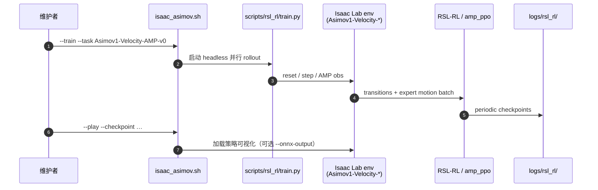

# isaac_asimov（Asimov 1 × Isaac Lab）

**isaac_asimov**（[menloresearch/isaac_asimov](https://github.com/menloresearch/isaac_asimov)）是 [Menlo Research](https://menlo.ai/) 发布的 **Asimov 1** 人形 **行走策略官方训练代码**：以 **Isaac Lab extension** 形式注册 velocity / AMP 任务，用 **RSL-RL** 在 Isaac Sim 里大规模并行训练，并支持 checkpoint 回放与 **ONNX** 导出。

## 一句话定义

Menlo 把 Asimov 1 的 **Isaac Sim 并行 RL + AMP baseline** 收成可 `quick_install` 的独立扩展，与 [`asimovinc/asimov-mjlab`](https://github.com/asimovinc/asimov-mjlab) 的 MuJoCo/mjlab 线并列，共同服务同一硬件平台的 Sim2Real 研究。

## 英文缩写速查

| 缩写 | 英文全称 | 简要说明 |
|------|----------|----------|
| AMP | Adversarial Motion Prior | 用判别器约束策略状态转移接近专家 motion 分布 |
| PPO | Proximal Policy Optimization | on-policy 策略梯度，本仓 plain velocity baseline |
| RL | Reinforcement Learning | 通过与环境交互最大化长期回报来学习策略 |
| RSL-RL | Robotic Systems Lab RL | ETH 系 PPO 实现，Isaac Lab 默认训练后端之一 |
| Sim2Real | Simulation to Real | 仿真策略部署到 Asimov 1 真机 |
| ONNX | Open Neural Network Exchange | `--onnx-output` 可选导出，便于下游部署链 |
| DoF | Degrees of Freedom | Asimov 1 行走任务聚焦腿足受控自由度 |
| GPU | Graphics Processing Unit | 4096 env 级训练依赖 NVIDIA GPU（README 列 A6000/4090 等） |

## 为什么重要

- **官方 Isaac 栈入口：** 在 [Isaac Lab](./isaac-lab.md) 生态内给出 **Menlo 维护** 的 Asimov 任务与 **AMP** 实现，避免研究者自行从 G1 模板改资产与奖励。
- **与 mjlab 线互补：** [`asimov-mjlab`](https://github.com/asimovinc/asimov-mjlab) 走 **MuJoCo Warp + gait imitation**；本仓走 **PhysX + AMP +  bundled reference motion**，选型时应 **显式标注仿真后端与 Git 提交**（见 [Asimov v1](./asimov-v1.md) 对照表）。
- **部署叙事清晰：** README 定位 **train in simulation and deploy them to the real robot**；社区 Discord 计划 **真机试跑贡献策略**，适合作为 **Isaac 侧复现 baseline** 的锚点。

## 流程总览

## 核心机制

| 任务 id | 算法 | README 角色 |
|---------|------|-------------|
| `Asimov1-Velocity-AMP-v0` | **AMP + PPO** | **推荐** baseline；仓内 `motions/*.npz` 供判别器 |
| `Asimov1-Velocity-v0` | 纯 PPO | 对照 ablation |
| `Asimov1-Velocity-AMP-Play-v0` | 推理 | 可视化与 checkpoint 选择 |

**规模与硬件：** baseline 用 **4096 `num_envs`**（A6000 / RTX PRO 6000）；OOM 时降 env 数可能牺牲收敛稳定性（README 明示）。已测 GPU 列表含 **3090 / 4090 / A6000 / RTX PRO 6000**。

**安装路径：** 新环境优先 `./quick_install.sh`（**uv** + sudo 装 `cmake`/`build-essential`）；已有 Isaac Lab  checkout 可走 [INSTALL.md](https://github.com/menloresearch/isaac_asimov/blob/main/INSTALL.md) 复用第三方 Lab 路径。

## 源码运行时序图

## 工程实践

| 实践 | 说明 |
|------|------|
| 冒烟 | `--num_envs 128 --max_iterations 100` 约 10 分钟级全链路自检 |
| 多卡 | `torch.distributed.run` + `train.py --distributed` |
| 版本 | 以 INSTALL 钉 **Isaac Sim 5.1.0**、**RSL-RL 5.0.1** 为准；自携 Lab 需 RSL-RL 5 兼容 |
| 资产 | `third_party/asimov-1` 与 [`asimov-v1`](./asimov-v1.md) 硬件仓应对齐 revision |

## 局限与风险

- **栈重量：** 相对 mjlab，需完整 **Isaac Sim + Omniverse** 依赖与磁盘；不适合仅 MuJoCo 的快速迭代机。
- **双官方训练线：** `asimovinc/asimov-mjlab` 与 `menloresearch/isaac_asimov` **观测/奖励/后端不同**，论文对比勿混称「官方唯一实现」。
- **部署细节：** README 强调可部署真机，但 **板载加载 ONNX / 与 asimov-v1 固件接口** 需对照主仓板载软件 revision 自行集成（本扩展仓侧重 **Isaac 训练与导出**）。

## 关联页面

- [Asimov v1](./asimov-v1.md) — 硬件、MuJoCo 主仓与三条训练线对照
- [Isaac Lab](./isaac-lab.md) — 底座框架
- [RSL-RL](./rsl-rl.md) — 训练算法运行时
- [mjlab](./mjlab.md) — MuJoCo 侧 Asimov fork 索引
- [AMP_mjlab](./amp-mjlab.md) — AMP 范式在 mjlab 上的对照实现
- [Locomotion](../tasks/locomotion.md)
- [Sim2Real](../concepts/sim2real.md)

## 推荐继续阅读

- 上游 README：<https://github.com/menloresearch/isaac_asimov>
- [asimovinc/asimov-mjlab](https://github.com/asimovinc/asimov-mjlab) — MuJoCo 并行 + imitation shaping 线
- [Teaching a Humanoid to Walk（Menlo）](https://menlo.ai/blog/teaching-a-humanoid-to-walk) — 观测合同与真机导向设计动机

## 参考来源

- [isaac-asimov.md](../../sources/repos/isaac-asimov.md)
- [menloresearch/isaac_asimov README（main）](https://github.com/menloresearch/isaac_asimov/blob/main/README.md)
