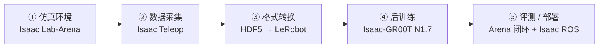

# Isaac GR00T（人形 VLA 开发平台）

**Isaac GR00T** 是 NVIDIA 面向通用人形机器人的 **开源开发平台**：以 [Isaac-GR00T](https://github.com/NVIDIA/Isaac-GR00T) 仓库为工程中枢，托管 **GR00T N1.7**（GA）VLA 的权重、参考实现、LeRobot 数据格式与后训练/部署工具，并与 **Isaac Lab-Arena**、**Isaac Teleop**、**Isaac ROS + Jetson Thor** 组成可模块化拆用的端到端流水线。

> **论文机制深读：** [GR00T N1](../entities/paper-hrl-stack-34-gr00t_n1.md) — N1 双系统架构、数据金字塔与 GR-1 评测以 arXiv:2503.14734 为准。  
> **全身低层控制：** [GR00T-WholeBodyControl](../entities/gr00t-wholebodycontrol.md) — G1 上 `UNITREE_G1_SONIC` latent → SONIC WBC 解码。

## 一句话定义

Isaac GR00T 把「采集 demonstration → LeRobot 格式 → GR00T N1.7 后训练 → 仿真/真机闭环评测 → LEAPP/TensorRT 部署」收敛到 **单一开源栈**，让开发者从预训练 3B VLA 出发适配新 embodiment，而不必从零训练通才策略。

## 英文缩写速查

| 缩写 | 英文全称 | 简要说明 |
|------|----------|----------|
| VLA | Vision-Language-Action | 视觉-语言-动作多模态策略 |
| VLM | Vision-Language Model | GR00T System 2 的多模态理解骨干 |
| DiT | Diffusion Transformer | flow-matching 动作头（连续动作去噪） |
| WBC | Whole-Body Control | 全身平衡与关节协调的低层控制器 |
| LEAPP | — | Isaac ROS 侧策略导出/部署 bundle 格式（GR00T 参考工作流） |
| GA | General Availability | N1.7 主分支的稳定正式发布状态 |
| EEF | End-Effector | 末端执行器；N1.7 默认相对 EEF delta 动作空间 |

## 为什么重要

- **填补「论文实体 ↔ 工程落地」缺口**：仓库已有 GR00T N1 论文页与 WBC 专仓，本页聚焦 **Isaac-GR00T 平台本身**——数据 schema、微调 CLI、Policy Server 与 benchmark 目录。
- **模块化端到端**：NVIDIA 技术博客强调可只用单组件（例如仅后训练脚本）或走完整五阶段栈，降低人形管线胶水成本。
- **LeRobot 生态对齐**：数据格式基于 LeRobot v2 + `modality.json`；HF LeRobot 亦提供 `groot` policy type，与本仓 reference 实现互补。
- **N1.7 GA 商用边界清晰**：代码 Apache 2.0；权重 NVIDIA Open Model License；Cosmos-Reason2-2B 为 gated HF 模型需单独申请访问。

## 平台五阶段（NVIDIA 栈）

| 阶段 | 典型产出 | 关键入口 |
|------|----------|----------|
| 仿真环境 | 场景 + 任务 + WBC 配置 | Isaac Lab-Arena asset registry |
| 数据采集 | HDF5 demonstrations | `record_demos.py`（OpenXR 等） |
| 格式转换 | `lerobot/` 目录（parquet + mp4 + meta） | `convert_hdf5_to_lerobot.py` + YAML 映射 |
| 后训练 | finetune checkpoint | `launch_finetune.py` + `--embodiment-tag` |
| 评测/部署 | success rate / LEAPP bundle | ZMQ Policy Server；Isaac ROS G1 教程 |

**工程提示：** 遥操作阶段选用的 **WBC**（如 AGILE WBC vs stand/walk 分解）会改变 joint-space 训练分布；应在采数前固定控制器，与目标部署栈一致。

## G1 仿真教程（Isaac Lab-Arena · 静态 pick-and-place）

NVIDIA 与 [具身智能研究室](https://mp.weixin.qq.com/s/Y2mlKtd-dGGdA33Sx_sDCw) 均以 **Unitree G1** 在货架前 **apple → plate** 任务示范完整链路（`galileo_g1_static_pick_and_place`）：

| 步骤 | 命令/产物 | 备注 |
|------|-----------|------|
| 搭环境 | Isaac Lab-Arena asset registry + `PickAndPlaceTask` | 静态任务用 **AGILE WBC**；完整代码见 [G1 仿真环境 GitLab Pages](https://unitree-g1-physical-ai-workflow-b42650.gitlab-master-pages.nvidia.com/simulation-workflow/sim-environment-code-review.html) |
| VR 采数 | `record_demos.py` + `--teleop_device openxr` | CloudXR + VR 头显；示例 400 条 HDF5（可多 session） |
| 转 LeRobot | `convert_hdf5_to_lerobot.py` + `g1_static_apple_config.yaml` | 映射 `robot_joint_pos` / `processed_actions` / `robot_head_cam_rgb` |
| 后训练 | `launch_finetune.py` + `g1_sim_wbc_data_gr00t_n_1_7_config.py` | `--embodiment-tag new_embodiment`；Arena 外单独 checkout Isaac-GR00T |
| 闭环评测 | `policy_runner.py` + 远端 GR00T server | ZMQ；冒烟 `--num_steps 600`；统计 `--num_episodes 100` + `--num_envs 5` |

真机 G1 部署见 [Isaac ROS GR00T Reference Workflow](https://nvidia-isaac-ros.github.io/reference_workflows/isaac_for_physical_ai/tutorials/tutorials.html)（MCAP → LeRobot → LEAPP）。

## GR00T N1.7（当前 GA 主线）

| 字段 | 内容 |
|------|------|
| 基座权重 | [`nvidia/GR00T-N1.7-3B`](https://huggingface.co/nvidia/GR00T-N1.7-3B)（约 3B 参数） |
| VLM 骨干 | [`nvidia/Cosmos-Reason2-2B`](https://huggingface.co/nvidia/Cosmos-Reason2-2B)（Qwen3-VL 架构） |
| 动作头 | flow-matching **DiT**；`action_horizon` 40；state/action 维 132 |
| 动作空间 | **相对 EEF delta**（跨人/机 embodiment 共享，利于 EgoScale 人类视频预训练） |
| 许可 | 代码 Apache 2.0；权重 NVIDIA Open Model License |
| 历史分支 | [N1.6](https://github.com/NVIDIA/Isaac-GR00T/tree/n1d6) · [N1.5](https://github.com/NVIDIA/Isaac-GR00T/tree/n1d5) |

相对 N1.6，N1.7 还强化：**多数据集 mixture 微调**、更广 benchmark 文档（RoboCasa、LIBERO、SimplerEnv、真机 G1）、**ONNX/TensorRT** 全链路导出，以及 server-client 推理硬化。

## 仓库内五步（Isaac-GR00T README）

1. **Prepare data** — GR00T LeRobot 格式；内置 `demo_data/*` 可零配置试跑  
2. **Run inference** — 基座或 finetuned checkpoint + `--embodiment-tag`  
3. **Fine-tune** — `launch_finetune.py`（可 `--no-tune-llm`，调 visual/projector/diffusion）  
4. **Evaluate** — open-loop MSE 可视化 + closed-loop sim/真机  
5. **Deploy** — `run_gr00t_server.py` + `PolicyClient`；可选 TensorRT  

### 全身 G1（VLA + WBC 分层）

对 `UNITREE_G1_SONIC` embodiment，VLA 输出 **紧凑 latent action token**，由 [GEAR-SONIC](../methods/sonic-motion-tracking.md) 全身控制器解码为腿/臂/手关节命令——单策略可端到端协调 **操作 +  locomotion**（详见 [GR00T-WholeBodyControl](../entities/gr00t-wholebodycontrol.md) 教程）。

## 常见误区

1. **Isaac GR00T ≠ 仅 GR00T N1 论文** — 论文页描述 N1 研究贡献；本仓随版本演进至 **N1.7 GA**，架构与数据接口以 GitHub `main` 为准。  
2. **Embodiment tag 不可省略** — 决定 state/action/video 键与归一化；错 tag 会导致 silent 维度错配。  
3. **LeRobot 与本仓分工** — HF LeRobot 适合 `groot` 原生训练/rollout；**模型内部、部署脚本、benchmark 细节**以 Isaac-GR00T 为 reference。  
4. **WBC 与 VLA 仍分层验证** — 桌面短视界任务可能只需 AGILE WBC；loco-manip 需 SONIC 栈与 latent 解码联调。

## 与其他页面的关系

- 论文 canonical：[paper-hrl-stack-34-gr00t_n1.md](../entities/paper-hrl-stack-34-gr00t_n1.md)  
- 低层 WBC / SONIC：[gr00t-wholebodycontrol.md](../entities/gr00t-wholebodycontrol.md)  
- 数据互操作：[lerobot.md](../entities/lerobot.md)  
- 仿真框架：[isaac-gym-isaac-lab.md](../entities/isaac-gym-isaac-lab.md)  
- 概念层：[foundation-policy.md](../concepts/foundation-policy.md)、[vla.md](../methods/vla.md)  
- 视觉 Sim2Real 姊妹仓：[gr00t-visual-sim2real.md](../entities/gr00t-visual-sim2real.md)

## 参考来源

- [isaac_gr00t.md](../../sources/repos/isaac_gr00t.md) — Isaac-GR00T 仓库 README 策展摘录  
- [nvidia_develop_humanoid_robot_policies_isaac_gr00t.md](../../sources/blogs/nvidia_develop_humanoid_robot_policies_isaac_gr00t.md) — NVIDIA Developer Blog 端到端平台介绍（2026-07-07）  
- [wechat_embodied_ai_lab_isaac_gr00t_n17_g1_e2e.md](../../sources/blogs/wechat_embodied_ai_lab_isaac_gr00t_n17_g1_e2e.md) — 具身智能研究室中文策展转载（G1 + VR/LeRobot 链路，2026-07-13）  
- [gr00t_n1_arxiv_2503_14734.md](../../sources/papers/gr00t_n1_arxiv_2503_14734.md) — GR00T N1 论文与白皮书  
- 代码：<https://github.com/NVIDIA/Isaac-GR00T>  
- 平台页：<https://developer.nvidia.com/isaac/gr00t>

## 推荐继续阅读

- [Develop Humanoid Robot Policies End-to-End with NVIDIA Isaac GR00T](https://developer.nvidia.com/blog/develop-humanoid-robot-policies-end-to-end-with-nvidia-isaac-gr00t/) — 官方端到端博客  
- [NVIDIA Learning：GR00T 端到端工作流](https://docs.nvidia.com/learning/physical-ai/gr00t-e2e-workflow/latest/index.html) — 官方动手教程  
- [Isaac Teleop + GR00T 1.7 LeRobot 集成（HF Blog）](https://huggingface.co/blog/nvidia/nvidia-isaac-teleop-and-gr00t17-in-lerobot)  
- [GR00T Reference Workflow for Unitree G1（Isaac ROS）](https://nvidia-isaac-ros.github.io/reference_workflows/isaac_for_physical_ai/tutorials/tutorials.html) — 真机 MCAP → LeRobot → LEAPP 部署  
- [LeRobot GR00T 文档](https://github.com/huggingface/lerobot/blob/main/docs/source/groot.mdx) — HF 侧 `groot` policy 工作流  
- [GR00T N1 论文阅读笔记（Humanoid_Robot_Learning_Paper_Notebooks）](https://imchong.github.io/Humanoid_Robot_Learning_Paper_Notebooks/papers/03_High_Impact_Selection/GR00T_N1_Humanoid_Foundation_Model/GR00T_N1_Humanoid_Foundation_Model.html)
