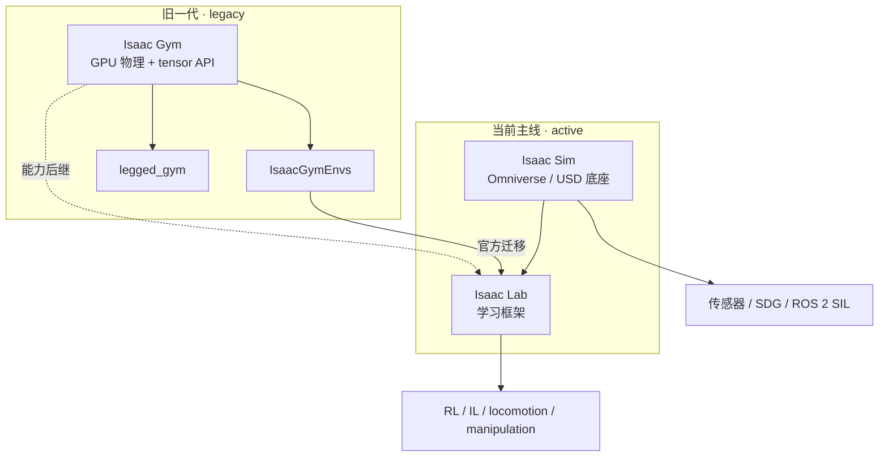
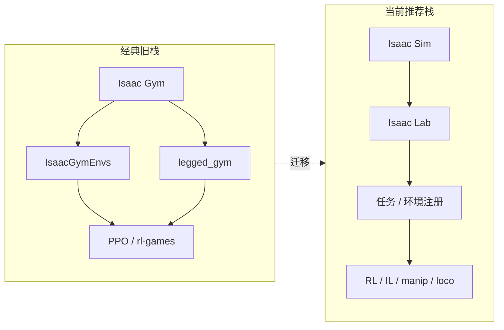

# Isaac Gym / Isaac Sim / Isaac Lab

**Isaac Gym**、**Isaac Sim** 与 **Isaac Lab** 是 NVIDIA 机器人仿真与学习生态里需要分开理解的三个产品节点。

## 一句话定义

- **[Isaac Gym](./isaac-gym.md)**：早期独立的 GPU 加速机器人 RL 仿真框架，主打大规模并行训练（已 deprecated）。
- **[Isaac Sim](./isaac-sim.md)**：基于 Omniverse / OpenUSD 的机器人仿真应用与底座（物理、传感器、SDG、ROS 2 SIL）。
- **[Isaac Lab](./isaac-lab.md)**：当前官方主推的 robot learning 框架，**跑在 Isaac Sim 之上**，用于 RL / IL、locomotion、manipulation 与 sim2real。

一句话说白了：

> 读 2021–2024 旧论文会不断遇到 Gym；做场景 / 传感器 / SIL 看 Sim；搭现在的训练栈优先 Lab。

> **本页是三代产品的总览 / 对比枢纽。** 各产品的运行时序图与核心类图在独立实体页：
> - [Isaac Gym](./isaac-gym.md) — legacy GPU RL 仿真
> - [Isaac Sim](./isaac-sim.md) — Omniverse 仿真底座
> - [Isaac Lab](./isaac-lab.md) — 当前学习框架

## 英文缩写速查

| 缩写 | 英文全称 | 简要说明 |
|------|----------|----------|
| Isaac Gym | NVIDIA Isaac Gym | GPU 并行刚体仿真（PhysX）训练环境（legacy） |
| Isaac Sim | NVIDIA Isaac Sim | Omniverse 机器人仿真应用 / 底座 |
| Isaac Lab | NVIDIA Isaac Lab | 基于 Isaac Sim 的机器人学习框架 |
| RL | Reinforcement Learning | 大规模并行 PPO 等训练的主场景 |
| USD | Universal Scene Description | Sim / Lab 共享场景与资产格式 |
| GPU | Graphics Processing Unit | 数千环境并行仿真的算力基础 |

## 先说结论

- **Isaac Gym** 已是 deprecated / legacy；官方建议迁移到 **Isaac Lab**。
- **Isaac Sim ≠ Isaac Lab**：Sim 是仿真底座，Lab 是学习框架。
- **Isaac Sim ≠ Isaac Gym 改名**：产品线与 API 都不同。

正确心态：

> **理解 Gym 的历史地位；用 Sim 做高保真仿真与栈联调；新实验训练优先 Lab。**

## 三代关系总图

### 不是简单的版本号关系

| 说法 | 是否成立 |
|------|----------|
| Isaac Gym 2.0 = Isaac Lab | 否 |
| Isaac Sim = Isaac Lab | 否 |
| Isaac Lab 依赖 Isaac Sim | 是 |
| Gym 与 Sim 是同一 API 的前后代 | 否 |

### 研究语境里的分工

- **2021–2024 baseline**：大量足式 / 人形 RL 仍写在 Isaac Gym / IsaacGymEnvs / legged_gym。
- **现在新项目**：训练环境优先 Isaac Lab；需要渲染、传感器、ROS 2 或资产工作台时显式使用 Isaac Sim。

## 各产品解决什么问题（速查）

| 产品 | 核心问题 | 独立页 |
|------|----------|--------|
| Isaac Gym | 单卡大规模并行 RL 采样（状态型为主） | [isaac-gym.md](./isaac-gym.md) |
| Isaac Sim | 高保真场景、传感、SDG、SIL | [isaac-sim.md](./isaac-sim.md) |
| Isaac Lab | 可维护的 RL/IL 环境与训练工作流 | [isaac-lab.md](./isaac-lab.md) |

细节（类图、源码运行时序图、迁移注意）请进入上表独立页，本页不重复展开实现级 API。

## 常见搭配

## 它和当前项目主线的关系

### 和 Reinforcement Learning 的关系

三者都是 RL 的「基础设施层」不同切片，不是算法本身。见：[Reinforcement Learning](../methods/reinforcement-learning.md)

### 和 Locomotion 的关系

人形 / 足式 locomotion 的训练环境与 benchmark 平台。见：[Locomotion](../tasks/locomotion.md)

### 和 Sim2Real 的关系

提供仿真训练与 domain randomization 工作台；成功还取决于状态估计、系统辨识、执行器建模等。见：[Sim2Real](../concepts/sim2real.md)

### 和 Domain Randomization 的关系

Gym 时代就强调大规模随机化；Lab / Sim 延续并扩展到视觉与传感器。见：[Domain Randomization](../concepts/domain-randomization.md)

## 常见误区

1. **以为 Isaac Gym 还是官方主线** — 否，legacy。
2. **以为 Isaac Sim 就是 Lab** — 否，底座 vs 学习框架。
3. **以为换成 Lab 旧经验全作废** — 否，reward / DR / 任务构造大量可迁移。
4. **以为选对仿真器 sim2real 就稳** — 否，还要状态估计、系统辨识、执行器与延迟。

## 推荐使用建议

| 你的目标 | 建议入口 |
|----------|----------|
| 初学 / 新项目 | 直接 [Isaac Lab](./isaac-lab.md)，需要时补 [Isaac Sim](./isaac-sim.md) |
| 复现 2021–2024 论文 | 读懂 [Isaac Gym](./isaac-gym.md) / legged_gym，并了解迁 Lab 路径 |
| 传感器 / ROS 2 / 合成数据 | 以 [Isaac Sim](./isaac-sim.md) 为主 |

## 继续深挖入口

- [Simulation](../../references/repos/simulation.md)
- [RL Frameworks](../../references/repos/rl-frameworks.md)
- [Robotic World Model（ETH RSL）](./robotic-world-model-eth-rsl.md)
- [Newton Physics](./newton-physics.md)

## 推荐继续阅读

- [机器人论文阅读笔记：Isaac Lab GPU Simulation](https://imchong.github.io/Humanoid_Robot_Learning_Paper_Notebooks/papers/03_High_Impact_Selection/Isaac_Lab_GPU_Simulation/Isaac_Lab_GPU_Simulation.html)
- NVIDIA Isaac Gym：<https://developer.nvidia.com/isaac-gym>
- Isaac Sim 文档：<https://docs.isaacsim.omniverse.nvidia.com/latest/index.html>
- Isaac Lab 文档：<https://isaac-sim.github.io/IsaacLab/v2.1.0/>
- Isaac Lab 迁移指南：<https://isaac-sim.github.io/IsaacLab/v1.0.0/source/migration/index.html>

## 参考来源

- Makoviychuk et al., *Isaac Gym* (2021)
- **ingest 档案：** [sources/repos/isaac_gym_isaac_lab.md](../../sources/repos/isaac_gym_isaac_lab.md)
- **ingest 档案：** [sources/repos/isaac_sim.md](../../sources/repos/isaac_sim.md)、[isaac_lab.md](../../sources/repos/isaac_lab.md)、[isaac_gym.md](../../sources/repos/isaac_gym.md)
- **ingest 档案：** [sources/courses/nvidia_sim_to_real_so101_isaac.md](../../sources/courses/nvidia_sim_to_real_so101_isaac.md)

## 关联页面

- [Isaac Gym](./isaac-gym.md)
- [Isaac Sim](./isaac-sim.md)
- [Isaac Lab](./isaac-lab.md)
- [NVIDIA Omniverse](./nvidia-omniverse.md)
- [NVIDIA SO-101 Sim2Real 实验 workflow](./nvidia-so101-sim2real-lab-workflow.md)
- [legged_gym](./legged-gym.md)
- [MuJoCo](./mujoco.md)
- [MuJoCo vs Isaac Sim](../comparisons/mujoco-vs-isaac-sim.md)
- [MuJoCo vs Isaac Lab](../comparisons/mujoco-vs-isaac-lab.md)
- [Newton Physics](./newton-physics.md)
- [Genesis](./genesis-sim.md)
- [UniLab](./unilab.md)
- [PyTorch](./pytorch.md)

## 一句话记忆

> Gym 是旧一代 GPU RL 仿真；Sim 是 Omniverse 仿真底座；Lab 是当前官方学习主线。读旧工作懂 Gym，做仿真与 SIL 用 Sim，做新训练优先 Lab。
