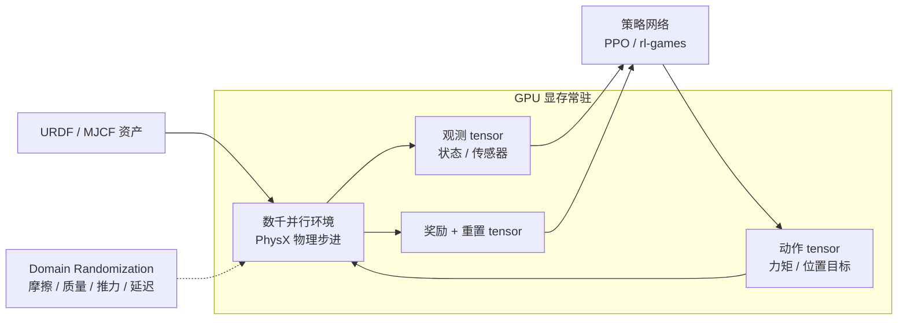
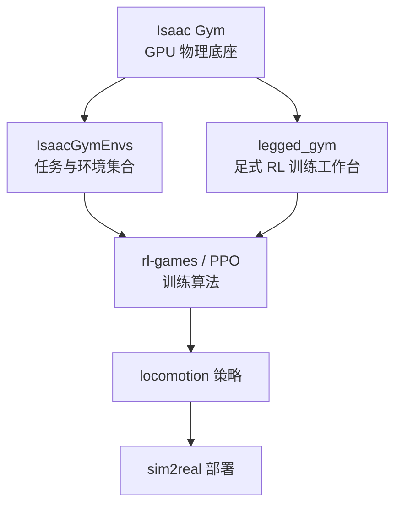

# Isaac Gym

**Isaac Gym** 是 NVIDIA 早期推出的 GPU 加速机器人强化学习仿真框架，主打「在单张 GPU 上同时跑几千到上万个环境」的大规模并行训练。

## 一句话定义

> Isaac Gym 是把 PhysX 物理仿真和 GPU tensor API 绑在一起的早期高性能 RL 仿真框架，让足式 / 人形机器人 RL 训练第一次在工程上变得「几小时出策略」可行。

## 英文缩写速查

| 缩写 | 英文全称 | 简要说明 |
|------|----------|----------|
| Sim2Real | Simulation to Real | 把仿真中学到的策略迁移落地真机的工程主线 |
| Isaac Gym | NVIDIA Isaac Gym | GPU 并行刚体仿真训练环境 |
| GPU | Graphics Processing Unit | 图形处理器，大规模并行仿真训练的算力基础 |
| API | Application Programming Interface | 应用程序编程接口 |
| RL | Reinforcement Learning | 通过与环境交互最大化长期回报来学习策略的范式 |
| Isaac Lab | NVIDIA Isaac Lab | 基于 Omniverse 的机器人学习训练框架 |
| CPU | Central Processing Unit | 中央处理器 |
| PPO | Proximal Policy Optimization | 人形/足式 locomotion 中最常用的 on-policy 策略梯度算法 |
| URDF | Unified Robot Description Format | 统一机器人描述格式 |
| MJCF | MuJoCo XML Format | MuJoCo 的模型与场景描述格式 |
| Locomotion | Robot Locomotion | 足式/人形等无轮移动能力的总称 |
| legged_gym | Legged Gym | 足式机器人 RL 训练的常用开源框架 |

## 先说结论

这是最容易把人带偏的地方：

- **Isaac Gym 现在已经是 deprecated / legacy software**
- **NVIDIA 官方建议迁移到 [Isaac Lab](./isaac-lab.md)**
- 但大量 2021–2024 的机器人 RL 项目、代码库、论文 baseline 仍然基于 Isaac Gym / IsaacGymEnvs

所以正确心态不是「Gym 已死不用看」，而是：

> **理解 Isaac Gym 的历史地位，新实验优先用 [Isaac Lab](./isaac-lab.md)。**

两代框架的整体定位与迁移路径，见综述页：[Isaac Gym / Isaac Lab 平台总览](./isaac-gym-isaac-lab.md)。

## 为什么它重要

在人形 / 足式机器人 RL 里，训练成本一直是大问题：CPU 仿真慢、机器人状态维度高、接触计算复杂，训练一个可用策略很耗时。

Isaac Gym 当年为什么火：

- PhysX 仿真 + GPU tensor API
- 大规模并行环境 rollout
- 很适合 PPO 这类 on-policy 训练
- 一下把「几千到几万个环境同时跑」这件事变得工程上可行

## 它解决什么问题

Isaac Gym 的核心价值在于：

- 快速并行仿真机器人环境
- 在 GPU 上直接处理观测、动作和物理状态，避免 CPU↔GPU 数据搬运瓶颈
- 让 RL 训练速度足够快，适合足式 / 人形机器人训练

这套框架在很多机器人 RL 工作里几乎是默认训练底座。

## 数据流与训练循环

Isaac Gym 的关键设计是「观测、动作、奖励、重置全部以 GPU tensor 形式留在显存里」，PPO 直接消费这些 tensor，不下放到 CPU：

## 它的典型特征

- GPU 加速物理仿真
- GPU tensor API
- 支持 URDF / MJCF 导入
- 支持位置、速度、力矩等传感器观测
- 支持 runtime domain randomization
- 和 `IsaacGymEnvs`、`legged_gym` 等代码库一起构成经典研究栈

## 经典研究栈

Isaac Gym 很少单独使用，它通常处在这样一条「旧经典栈」里：

## 它的问题

Isaac Gym 虽然强，但它现在有三个现实问题：

1. **官方已停止支持**（standalone preview 不再更新）
2. **文档和生态会越来越偏向迁移**
3. **新项目如果还把 Gym 当主线，后面维护成本会变高**

所以你现在看它，更像是在理解「旧主流基线」，而不是把它当长期主训练平台。

## 它和当前项目主线的关系

### 和 Reinforcement Learning 的关系

Isaac Gym 是 RL 训练的「基础设施层」，不是 RL 算法本身。

见：[Reinforcement Learning](../methods/reinforcement-learning.md)

### 和 Locomotion 的关系

在足式 / 人形 locomotion 研究里，它常常是 2021–2024 论文的训练环境和 baseline 平台。

见：[Locomotion](../tasks/locomotion.md)

### 和 Domain Randomization 的关系

Isaac Gym 当年就因为易于做大规模随机化而很受欢迎，这条能力路线被 Isaac Lab 继承了下来。

见：[Domain Randomization](../concepts/domain-randomization.md)

## 常见误区

### 1. 以为 Isaac Gym 还是官方主线

不是，它现在是 legacy，官方主线是 [Isaac Lab](./isaac-lab.md)。

### 2. 以为看老论文就没必要懂 Isaac Gym

错。2021–2024 大量足式 / 人形 RL baseline 都建立在 Isaac Gym 上，复现旧工作绕不开它。

### 3. 以为 Isaac Gym 就是物理引擎本身

更准确地说，物理来自 **PhysX**，Isaac Gym 是把 PhysX 包装成 GPU tensor RL 接口的框架层。

## 推荐使用建议

- **复现旧工作**：大概率还要会看 Isaac Gym / IsaacGymEnvs / legged_gym，但最好顺手了解迁移到 Isaac Lab 的思路。
- **做新项目**：直接优先 [Isaac Lab](./isaac-lab.md)，把 Gym 当成旧基线和历史语境。

## 推荐继续阅读

- NVIDIA Isaac Gym 页面：<https://developer.nvidia.com/isaac-gym>
- Makoviychuk et al., *Isaac Gym: High Performance GPU Based Physics Simulation For Robot Learning* (2021)：<https://arxiv.org/abs/2108.10470>

## 参考来源

- Makoviychuk et al., *Isaac Gym: High Performance GPU Based Physics Simulation For Robot Learning* (2021) — Isaac Gym 原论文
- **ingest 档案：** [sources/papers/simulation_tools.md](../../sources/papers/simulation_tools.md) — Isaac Gym 原论文摘录
- **ingest 档案：** [sources/repos/isaac_gym_isaac_lab.md](../../sources/repos/isaac_gym_isaac_lab.md) — Isaac Gym / Isaac Lab 仓库索引

## 关联页面

- [Isaac Gym / Isaac Lab 平台总览](./isaac-gym-isaac-lab.md) — 两代框架定位与迁移路径
- [Isaac Lab](./isaac-lab.md) — NVIDIA 当前主推的后继框架
- [legged_gym](./legged-gym.md) — 建立在 Isaac Gym 之上的经典足式 RL 训练栈
- [Reinforcement Learning](../methods/reinforcement-learning.md)
- [Locomotion](../tasks/locomotion.md)
- [Domain Randomization](../concepts/domain-randomization.md)

## 一句话记忆

> Isaac Gym 是 NVIDIA 旧一代高性能 GPU RL 仿真框架，现已 deprecated；读旧论文和复现旧 baseline 要懂它，新实验请优先 Isaac Lab。
