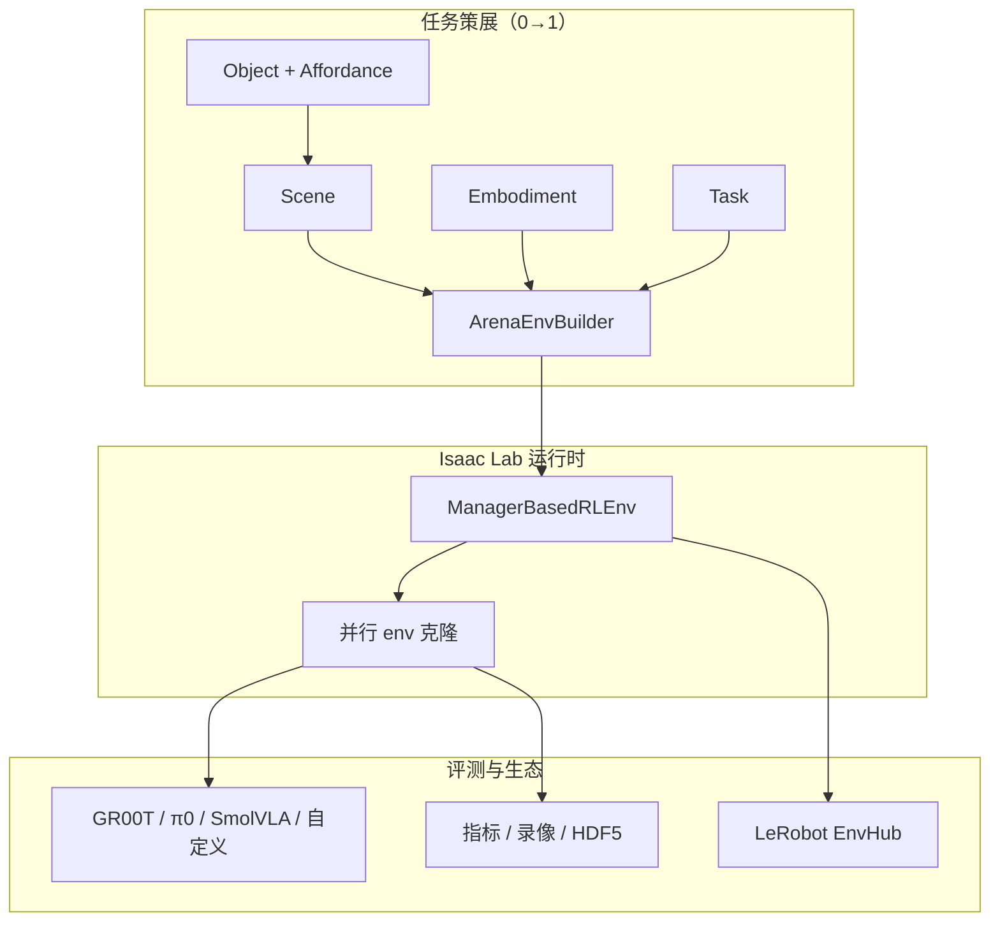
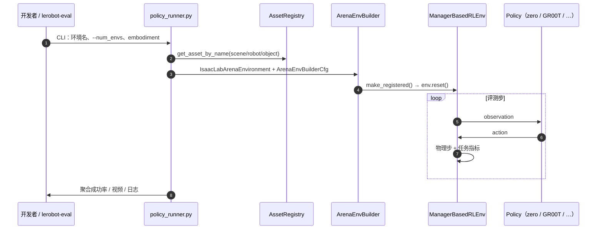

# Isaac Lab-Arena

**Isaac Lab-Arena** 是 NVIDIA 在 [Isaac Lab](./isaac-lab.md) 之上的 **开源 Alpha 扩展**，面向通才机器人策略的 **任务策展、多样化与大规模仿真评测**。它与 **Lightwheel** 联合设计评测与任务层，并与 RoboLab 作者合作；Apache 2.0 许可，但运行依赖 **Isaac Sim**（专有组件）。

## 一句话定义

把「场景 + 机器人 + 任务」拆成可复用积木，在运行时由 `ArenaEnvBuilder` 编译成标准 `ManagerBasedRLEnvCfg`，让你换物体、换具身、换背景时**不必复制整份环境配置**，并用 GPU 并行把 VLA 评测从「一整天」压到「一小时量级」。

## 英文缩写速查

| 缩写 | 英文全称 | 简要说明 |
|------|----------|----------|
| VLA | Vision-Language-Action | 视觉–语言–动作通才策略（GR00T N、π0、SmolVLA 等） |
| EnvHub | Environment Hub | LeRobot 在 Hugging Face 上发现/共享仿真环境的机制 |
| IL | Imitation Learning | 从演示学习；Arena 可接 Mimic 数据生成与后训 |
| GPU | Graphics Processing Unit | 大规模并行仿真评测的算力基础 |
| RL | Reinforcement Learning | Arena 环境可回接 Isaac Lab RL 训练管线 |
| Sim2Real | Simulation to Real | 仿真评测结论迁移真机前的验证环节 |
| PnP | Pick and Place | 抓取–放置类操作任务 |
| OSMO | NVIDIA OSMO | 云原生部署与 CI/CD 路径（仓内 `osmo/` 配置） |

## 先说结论

- **选型：** 若你要在 Isaac 栈上**批量评测通才策略**、共建可复用 benchmark，或把环境发布到 **LeRobot EnvHub**，应把 Arena 当作 Lab 之上的**评测与任务编排层**，而不是替代 Lab 本身。
- **成熟度：** `v0.2.x` 为 **Alpha / pre-alpha**；API 会变、功能未齐、**禁止生产**；`release/0.2.1` 相对 `main` 更稳。
- **版本钉扎：** 新主线对齐 **Lab 3.0 + Sim 6.0 + Python ≥3.12**；旧社区工程可能仍钉 **Arena 0.1.1 + Lab 2.3 + Sim 5.1**（见 [LW BENCHHUB TOUR](./lw-benchhub-tour.md)）。
- **开源：** GitHub 仓与文档 **已开源**；DexBench、GR00T Industrial 等官方 benchmark 在 README 仍标 **coming soon**——勿与「框架已可用」混为一谈。

## 为什么重要

通才策略（[GR00T](./isaac-gr00t.md)、π0、SmolVLA 等）要在**多任务、多具身、多场景**下可比评测。传统做法为每个「机器人 × 物体 × 场景」手写一份 Isaac Lab 配置，导致：

- 配置爆炸、维护困难
- 研究员时间耗在「改 cfg」而非跑实验
- 社区 benchmark 难以共享同一套指标与数据格式

Arena 把 **环境变化** 提升为一等公民：运行时组装、Affordance 跨物体泛化、并行聚合指标，并与 [LeRobot](./lerobot.md) **EnvHub**（[`nvidia/isaaclab-arena-envs`](https://huggingface.co/nvidia/isaaclab-arena-envs)）对接，形成「发布环境 → `lerobot-eval` → 视频与指标」闭环。

## 核心架构

### 三大原语 + Affordance

| 积木 | 职责 | 典型 API |
|------|------|----------|
| **Scene** | 物体、家具、背景布局 | `Scene(assets=[...])` |
| **Embodiment** | 机器人观测/动作/传感器/控制器 | `asset_registry.get_asset_by_name("gr1_pink")()` |
| **Task** | 目标、成功判据、终止、事件、指标 | `OpenDoorTask(microwave, ...)` |
| **Affordance** | 物体交互语义（Openable、Pressable） | 使 Task 可跨 Object 复用 |

`ArenaEnvBuilder` 将 `IsaacLabArenaEnvironment` 编译为 Isaac Lab 原生环境；CLI（如 `policy_runner.py`）把 `--num_envs`、`--seed` 等映射到 `ArenaEnvBuilderCfg`。

### 流程总览

### 源码运行时序图

> 关键复现路径：`python isaaclab_arena/evaluation/policy_runner.py --policy_type zero_action --num_steps 20 cube_goal_pose`（native）或 Docker 内 `/isaac-sim/python.sh` 等价调用；LeRobot 侧见 Hub 页 `lerobot-eval --env.type=isaaclab_arena`。

## 关键特性（v0.2.x）

| 能力 | 状态 | 说明 |
|------|------|------|
| 运行时乐高组装 | ✅ | 无 N×M×K 重复 cfg |
| Sequential Task Chaining | ✅ 新增 | Pick + Walk + Place 等串联 |
| 语义关系摆放 | ✅ 新增 | `On(table)` 等，减少手填位姿 |
| 同构大规模并行 | ✅ | 博客：4096 env × 10 任务 ≈ **0.76 h**（8×6000D），约 **40×** 于顺序 |
| 异构并行（每 env 不同物体） | 🔜 | README 标计划中 |
| Agentic 任务生成 / 敏感性分析 | 🔜 | Alpha 路线图 |
| RL / Mimic / Teleop 互通 | ✅ | 接 Lab 训练、[Isaac Teleop](./isaac-teleop.md)、Mimic 数据扩展 |
| 策略集成子包 | ✅ | `isaaclab_arena_gr00t`、`isaaclab_arena_openpi`、`isaaclab_arena_g1` 等 |

## 版本与安装要点

| Arena 分支 | Isaac Lab | Isaac Sim | Python |
|------------|-----------|-----------|--------|
| `main` / `release/0.2.1` | 3.0.0 | 6.0.0 | ≥ 3.12 |
| `release/0.1.1` | 2.3.0 | 5.0.0 | ≥ 3.10 |

- **平台：** Linux（Ubuntu 22.04+）、NVIDIA GPU；推荐 **uv** 原生安装或 `docker/run_docker.sh`（`-g` 含 GR00T 依赖）
- **EULA：** `export OMNI_KIT_ACCEPT_EULA=YES ACCEPT_EULA=Y`
- **非轻量栈：** 需完整 Isaac Sim；与「仅 pip 装 gym」不是同一量级

## 生态与 Benchmark

### 已列出 / 共建（README & 博客）

- **Lightwheel：** [RoboFinals](./lightwheel-robofinals.md) 工业级 100 任务 benchmark（商业平台）；[RoboCasa](./robocasa.md) / LIBERO 任务经 [LW-BenchHub](./lw-benchhub-tour.md) 与 Arena EnvHub 发布
- **RoboTwin 2.0：** [Arena 分支](https://github.com/RoboTwin-Platform/RoboTwin/tree/IsaacLab-Arena)
- **LeRobot EnvHub：** [`nvidia/isaaclab-arena-envs`](https://huggingface.co/nvidia/isaaclab-arena-envs)；示例策略 `nvidia/smolvla-arena-gr1-microwave`
- **医疗：** [Isaac for Healthcare RHEO](https://github.com/isaac-for-healthcare/i4h-workflows/tree/main/workflows/rheo)
- **社区实践：** [LW BENCHHUB TOUR](./lw-benchhub-tour.md)（SmolVLA + 双臂厨房 + EnvHub）

### Coming soon（勿误用为已上架）

README 单列：**NIST Board 1**、**NVIDIA Isaac GR00T Industrial**、**[DexBench](./dexbench.md)**、**NVIDIA RoboLab** 等。截至 2026-09-06，[DexBench](./dexbench.md) 规范页已开放但 **无官方实现仓**，Arena 仅预告。

## 工程实践

| 主题 | 建议 |
|------|------|
| 首次冒烟 | `zero_action` 跑 `cube_goal_pose` 20 步，确认 Sim + 子模块 |
| 通才策略评测 | 优先 `lerobot-eval` + EnvHub；注意 `trust_remote_code` 与相机 key 重命名 |
| 自定义 benchmark | 独立仓维护 Arena 分支（见 RoboTwin 范例）；README 可申请列入生态清单 |
| 版本升级 | 对照 README 兼容表；Lab 2.3 工程勿盲目升 `main`（Lab 3 / Sim 6） |
| 并行规模 | 先小 `--num_envs` 验证 OOM，再扩到千级；记录 GPU 型号与 headless 设置 |
| 数据回放 | `replay_demos.py` + HF 数据集 `nvidia/Arena-GR1-Manipulation-Task` 验证 teleop 轨迹 |

## 局限与风险

- **Alpha 软件：** API 无Deprecation 保证；`main` 可能未充分测试
- **许可栈：** Arena 为 Apache 2.0，但 **Isaac Sim 专有**；商业部署须单独审阅 Omniverse 许可
- **异构并行未齐：** 当前并行评测以**同构 env + 参数变化**为主；「每并行槽不同物体」仍在路线图中
- **硬件门槛：** 大规模评测需要多卡大显存；与 MuJoCo 轻量 benchmark 不是同一成本曲线
- **生态条目 ≠ 已实现：** README「coming soon」任务不能当作可注册环境

## 与其他页面的关系

- **[Isaac Lab](./isaac-lab.md)** — 底层训练与仿真框架；Arena 编译其 `ManagerBasedRLEnvCfg`
- **[LeRobot](./lerobot.md)** — `lerobot-eval` 与 [EnvHub](../concepts/lerobot-envhub.md) 是通才策略评测主入口之一
- **[Isaac GR00T](./isaac-gr00t.md)** — 博客与 `isaaclab_arena_gr00t` 子包的核心评测对象
- **[LW BENCHHUB TOUR](./lw-benchhub-tour.md)** — Arena 0.1.x + 光轮厨房 + SmolVLA 的工程样例
- **[DexBench](./dexbench.md)** — 工业灵巧规格；Arena 生态预告，尚未可跑
- **[Lightwheel RoboFinals](./lightwheel-robofinals.md)** — 前沿 VLA 工业评测平台；商业 Coming soon

## 推荐继续阅读

- 官方文档：<https://isaac-sim.github.io/IsaacLab-Arena/main/index.html>
- NVIDIA 产品页：<https://developer.nvidia.com/isaac/lab-arena>
- 技术博客（端到端 GR1 微波炉）：<https://developer.nvidia.com/blog/simplify-generalist-robot-policy-evaluation-in-simulation-with-nvidia-isaac-lab-arena/>
- LeRobot × Arena 集成：<https://huggingface.co/blog/nvidia/generalist-robotpolicy-eval-isaaclab-arena-lerobot>
- GitHub：<https://github.com/isaac-sim/IsaacLab-Arena>

## 参考来源

- [Isaac Lab-Arena 仓库归档](../../sources/repos/isaaclab_arena.md)
- [NVIDIA Isaac Lab-Arena 开发者页](../../sources/sites/isaac-lab-arena.md)
- [通才策略仿真评测技术博客](../../sources/blogs/nvidia_isaac_lab_arena_generalist_policy_eval.md)
- [Hugging Face EnvHub：nvidia/isaaclab-arena-envs](../../sources/sites/huggingface-isaaclab-arena-envs.md)

## 关联页面

- [Isaac Lab](./isaac-lab.md)
- [Isaac Sim](./isaac-sim.md)
- [LeRobot](./lerobot.md)
- [Isaac GR00T](./isaac-gr00t.md)
- [LW BENCHHUB TOUR](./lw-benchhub-tour.md)
- [DexBench](./dexbench.md)
- [Inspect Robots](./inspect-robots.md) — `inspect-robots-isaacsim` 真机优先框架的 Isaac Lab embodiment 路径
- [Isaac Teleop](./isaac-teleop.md)
- [VLA 方法](../methods/vla.md)
- [Manipulation 任务](../tasks/manipulation.md)

## 一句话记忆

> Isaac Lab-Arena = Lab 之上的「乐高式任务编排 + GPU 大规模评测层」；通才策略上 Hub、下 Lab，但记得它是 **Alpha**，且 Sim 许可与版本矩阵才是真门槛。
