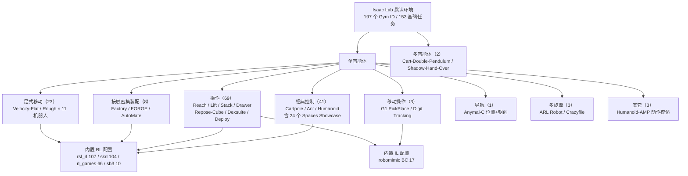

# Isaac Lab 默认环境

## 一句话定义

**Isaac Lab 默认环境**是 Isaac Lab 随框架一起注册进 Gymnasium 的**开箱即跑任务集**：截至 **v3.0.0**（`main` @ `2e44ddb`，2026-08-10）共 **197 个任务 ID**（**153 个基础任务** + **44 个 Play 推理变体**），覆盖经典控制、固定臂与灵巧手操作、接触密集装配、足式移动、移动操作、导航、多旋翼与多智能体，是复现 locomotion / manipulation 基线与验证自研算法的默认起点。

## 英文缩写速查

| 缩写 | 英文全称 | 简要说明 |
|------|----------|----------|
| RL | Reinforcement Learning | 强化学习；默认环境的主要训练范式 |
| IL | Imitation Learning | 模仿学习；`robomimic` BC 配置对应的路线 |
| BC | Behavior Cloning | 行为克隆；从示范直接监督学动作 |
| IK | Inverse Kinematics | 逆运动学；`IK-Abs` / `IK-Rel` 动作空间的控制方式 |
| OSC | Operational Space Control | 操作空间控制；`Isaac-Reach-Franka-OSC-v0` 使用的力/阻抗式动作空间 |
| MDP | Markov Decision Process | 马尔可夫决策过程；Manager-Based 工作流按 MDP 组件拆分配置 |
| PPO | Proximal Policy Optimization | 近端策略优化；绝大多数默认任务的内置算法 |
| AMP | Adversarial Motion Priors | 对抗式动作先验；`Isaac-Humanoid-AMP-*` 用它模仿人类动作片段 |
| IPPO | Independent PPO | 独立式多智能体 PPO；每个 agent 独立更新 |
| MAPPO | Multi-Agent PPO | 中心化 critic 的多智能体 PPO |
| SDG | Synthetic Data Generation | 合成数据生成；Mimic / Blueprint 类任务的用途 |
| DR | Domain Randomization | 域随机化；FORGE 等任务内置的动力学随机化 |
| VBD | Vertex Block Descent | 可变形体求解器；`Isaac-Lift-Soft-Franka-v0` 的 `newton_mjwarp_vbd` 后端 |

## 为什么重要

- **它是事实上的基线集。** 大量足式与人形论文直接报告 `Isaac-Velocity-Rough-<Robot>-v0` 系列上的结果；不了解默认任务的观测/奖励口径，就无法判断别人的曲线是否可比。
- **文档页只是子集。** 官方网页版 `environments.html` 列的是「代表性任务」，而 `gym.register` 里的实际条目多得多（`Deploy-*`、`Assemble-Trocar-*`、`Lift-Cloth/Soft-*`、Spaces Showcase 全家桶都不在网页表里）。选型时只看网页会漏掉现成能用的任务。
- **任务 ID 是生态索引。** 名字里编码了工作流、控制空间、地形、用途；读懂命名法，等于拿到 Isaac Lab 代码库的目录。
- **它决定你要不要自己写环境。** 新项目最常见的浪费，是把一个官方已经调好的 `Velocity-Rough` 或 `Factory-PegInsert` 重写一遍。先查表再动手。

## 核心原理

### 1. 任务 ID 命名法

默认任务 ID 遵循可拆解的语法，读名字即可判断它属于哪一族：

```
Isaac - <任务动词/家族> - <对象> - <机器人> - <控制/观测变体> - [Direct] - [Play] - v0
   │         │              │         │             │              │        │
   │     Velocity/Reach/  Cube/     Franka/      IK-Abs/IK-Rel/  Direct   推理用
   │     Lift/Stack/      Drawer/   G1/H1/       OSC/RmpFlow/    工作流   变体
   │     Repose/Factory   Peg/Gear  Anymal-C     Pink-IK/RGB     标记
   └── 固定前缀
```

关键槽位：

| 槽位 | 取值示例 | 含义 |
|------|----------|------|
| 地形 | `Flat` / `Rough` | 平地 vs 程序化崎岖地形（见 [程序化地形生成](../concepts/procedural-terrain-generation.md)） |
| 控制空间 | `（缺省=关节位置）` / `IK-Abs` / `IK-Rel` / `OSC` / `RmpFlow` / `Pink-IK` | 动作空间语义，同一任务常并列注册多种 |
| 观测模态 | `RGB` / `Depth` / `Albedo` / `Vision` / `Visuomotor` / `RGB-ResNet18` / `RGB-TheiaTiny` | 需配 `--enable_cameras`；后两者用冻结视觉编码器出特征 |
| 工作流 | `Direct` 后缀 | 有 `Direct` = 单类实现；无 = Manager-Based |
| 用途 | `Play` / `ROS-Inference` / `Mimic` / `Blueprint` / `Eval` / `Benchmark` | 推理、真机 ROS 推理、数据生成、蓝图 SDG、评测 |

### 2. 两套工作流的分布

| 工作流 | 任务数 | 心智模型 | 什么时候用 |
|--------|--------|----------|-----------|
| **Manager-Based** | **139** | MDP 拆成 Observation / Action / Reward / Termination / Event / Curriculum / Command 管理器，配置即拼装 | 需要复用地形、奖励项、DR 事件；locomotion 与多数 manipulation 走这条 |
| **Direct** | **58** | 单个 `DirectRLEnv` 子类里手写 `_get_observations/_get_rewards/_get_dones`，接近旧 IsaacGymEnvs | 需要极致吞吐、非 `Box` 空间（Dict/Tuple/Discrete）、或整块自定义物理逻辑 |

> 只有 Direct 工作流支持 `Box` 以外的 Gymnasium 空间——这正是 Spaces Showcase 那 24 个 Cartpole 变体存在的原因。

### 3. Play / ROS-Inference 变体

153 个基础任务里有 44 个配了同名 `-Play-v0`：**环境数更少、关闭训练期扰动与 DR、直接读 checkpoint**，是 `play.py` 与评测的正确入口。`Deploy-*` 家族另有 `-ROS-Inference-v0`，把策略挂到 ROS 话题上做真机推理（UR10e、Rizon4s 已完成实机部署）。

### 4. Preset 选择器（3.0 新增）

同一任务可切换后端而不改代码，通过 Hydra 风格的三类具名 preset：

| 选择器 | 取值示例 | 作用 |
|--------|----------|------|
| `physics=` | `physx`、`newton_mjwarp`、`newton_kamino`、`ovphysx`、`newton_mjwarp_vbd` | 物理后端（见 [Newton Physics](./newton-physics.md)） |
| `renderer=` | `isaacsim_rtx_renderer`、`newton_renderer`、`ovrtx_renderer` | 渲染后端 |
| `presets=` | `rgb`、`depth`、`albedo`、`semantic_segmentation`、`single_camera`、`duo_camera`、`state` | 环境自带的域内预设（多为观测模态） |

```bash
./isaaclab.sh -p scripts/environments/list_envs.py --show_presets   # 列出每个环境可用 preset
./isaaclab.sh -p scripts/reinforcement_learning/rsl_rl/train.py \
    --task=Isaac-Velocity-Rough-G1-v0 --help                        # 查单个任务的 preset
```

### 5. 分族总览



## 全量清单（v3.0.0，commit `2e44ddb`）

> 下表由 `source/isaaclab_tasks` 中的 `gym.register` 扫描生成，**Play 变体折叠进第二列**。
> 「RL 库」列写的是仓内**已提供超参配置**的库；标 `—` 表示该 ID 只作遥操作 / 数据生成 / 控制空间变体使用，没有自带训练配置。

### 经典控制

MuJoCo 风格的入门任务，直接承自 IsaacGymEnvs。`Isaac-Cartpole-v0` 是官方 Quickstart 教学任务（连续力矩 + 4096 并行环境 + 5 s episode），与 Gymnasium `CartPole-v1` 的离散版本不可直接对数（见 [Cartpole 问题](../concepts/cartpole.md)）。

#### Manager-Based（7）

| 任务 ID | Play/推理变体 | RL 库（内置配置） |
|---|---|---|
| `Isaac-Cartpole-v0` | — | rl_games、rsl_rl、rsl_rl(symmetry)、sb3、skrl |
| `Isaac-Cartpole-RGB-v0` | — | rl_games |
| `Isaac-Cartpole-Depth-v0` | — | rl_games |
| `Isaac-Cartpole-RGB-ResNet18-v0` | — | rl_games |
| `Isaac-Cartpole-RGB-TheiaTiny-v0` | — | rl_games |
| `Isaac-Ant-v0` | — | rl_games、rsl_rl、sb3、skrl |
| `Isaac-Humanoid-v0` | — | rl_games、rsl_rl、sb3、skrl |

#### Direct（10）

| 任务 ID | Play/推理变体 | RL 库（内置配置） |
|---|---|---|
| `Isaac-Cartpole-Direct-v0` | — | rl_games、rsl_rl、sb3、skrl |
| `Isaac-Cartpole-RGB-Camera-Direct-v0` | — | rl_games、skrl |
| `Isaac-Cartpole-Depth-Camera-Direct-v0` | — | rl_games、skrl |
| `Isaac-Cartpole-Albedo-Camera-Direct-v0` | — | rl_games、skrl |
| `Isaac-Cartpole-Camera-Presets-Direct-v0` | — | rl_games、skrl |
| `Isaac-Cartpole-SimpleShading-Constant-Camera-Direct-v0` | — | rl_games、skrl |
| `Isaac-Cartpole-SimpleShading-Diffuse-Camera-Direct-v0` | — | rl_games、skrl |
| `Isaac-Cartpole-SimpleShading-Full-Camera-Direct-v0` | — | rl_games、skrl |
| `Isaac-Ant-Direct-v0` | — | rl_games、rsl_rl、skrl |
| `Isaac-Humanoid-Direct-v0` | — | rl_games、rsl_rl、skrl |

Direct 版关键规格（读代码即得，可用于对齐自研环境）：

| 任务 | 观测维度 | 动作维度 | decimation | episode | 默认并行数 |
|------|---------|---------|-----------|---------|-----------|
| `Isaac-Cartpole-Direct-v0` | 4 | 1 | 2 | 5 s | 4096 |
| `Isaac-Ant-Direct-v0` | 36 | 8 | 2 | 15 s | 4096 |
| `Isaac-Humanoid-Direct-v0` | 75 | 21 | 2 | 15 s | 4096 |
| `Isaac-Franka-Cabinet-Direct-v0` | 23 | 9 | 2 | 8.33 s（500 步） | 4096 |
| `Isaac-Repose-Cube-Shadow-Direct-v0` | 157 | 20 | 2 | 10 s | 8192 |
| `Isaac-Repose-Cube-Shadow-OpenAI-*-Direct-v0` | 42（+187 非对称 state） | 20 | 3 | 8 s | 8192 |

#### Spaces Showcase（24）

一组**机械枚举**的 Cartpole 变体，专门演示 Direct 工作流支持的 Gymnasium 空间组合，不用于算法对比：

- `Isaac-Cartpole-Showcase-<OBS>-<ACT>-Direct-v0`：`OBS ∈ {Box, Discrete, MultiDiscrete, Dict, Tuple}` × `ACT ∈ {Box, Discrete, MultiDiscrete}` = **15** 个
- `Isaac-Cartpole-Camera-Showcase-<OBS>-<ACT>-Direct-v0`：`OBS ∈ {Box, Dict, Tuple}` × 同样 3 种动作空间 = **9** 个（须 `--enable_cameras`）

全部只提供 skrl (PPO) 配置。

### 操作（Manipulation）

#### Manager-Based（62）

| 任务 ID | Play/推理变体 | RL 库（内置配置） |
|---|---|---|
| `Isaac-Reach-Franka-v0` | `Isaac-Reach-Franka-Play-v0` | rl_games、rsl_rl、skrl |
| `Isaac-Reach-Franka-IK-Abs-v0` | — | — |
| `Isaac-Reach-Franka-IK-Rel-v0` | — | — |
| `Isaac-Reach-Franka-OSC-v0` | `Isaac-Reach-Franka-OSC-Play-v0` | rsl_rl |
| `Isaac-Reach-UR10-v0` | `Isaac-Reach-UR10-Play-v0` | rl_games、rsl_rl、skrl |
| `Isaac-Reach-OpenArm-v0` | `Isaac-Reach-OpenArm-Play-v0` | rl_games、rsl_rl、skrl |
| `Isaac-Reach-OpenArm-Bi-v0` | `Isaac-Reach-OpenArm-Bi-Play-v0` | rl_games、rsl_rl |
| `Isaac-Lift-Cube-Franka-v0` | `Isaac-Lift-Cube-Franka-Play-v0` | rl_games、rsl_rl、sb3、skrl |
| `Isaac-Lift-Cube-Franka-IK-Abs-v0` | — | — |
| `Isaac-Lift-Cube-Franka-IK-Rel-v0` | — | robomimic(BC) |
| `Isaac-Lift-Cube-OpenArm-v0` | `Isaac-Lift-Cube-OpenArm-Play-v0` | rl_games、rsl_rl |
| `Isaac-Lift-Teddy-Bear-Franka-IK-Abs-v0` | — | — |
| `Isaac-Lift-Soft-Franka-v0` | — | rsl_rl |
| `Isaac-Lift-Cloth-Franka-v0` | — | rsl_rl |
| `Isaac-Open-Drawer-Franka-v0` | `Isaac-Open-Drawer-Franka-Play-v0` | rl_games、rsl_rl、skrl |
| `Isaac-Open-Drawer-Franka-IK-Abs-v0` | — | — |
| `Isaac-Open-Drawer-Franka-IK-Rel-v0` | — | — |
| `Isaac-Open-Drawer-OpenArm-v0` | `Isaac-Open-Drawer-OpenArm-Play-v0` | rl_games、rsl_rl |
| `Isaac-Stack-Cube-Franka-v0` | — | — |
| `Isaac-Stack-Cube-Franka-IK-Abs-v0` | — | robomimic(BC) |
| `Isaac-Stack-Cube-Franka-IK-Rel-v0` | — | robomimic(BC) |
| `Isaac-Stack-Cube-Franka-IK-Rel-Blueprint-v0` | — | — |
| `Isaac-Stack-Cube-Franka-IK-Rel-Skillgen-v0` | — | robomimic(BC) |
| `Isaac-Stack-Cube-Franka-IK-Rel-Visuomotor-v0` | — | robomimic(BC) |
| `Isaac-Stack-Cube-Franka-IK-Rel-Visuomotor-Cosmos-v0` | — | robomimic(BC) |
| `Isaac-Stack-Cube-Bin-Franka-IK-Rel-Mimic-v0` | — | robomimic(BC) |
| `Isaac-Stack-Cube-BlueGreen-Franka-IK-Rel-v0` | — | robomimic(BC) |
| `Isaac-Stack-Cube-BlueGreenRed-Franka-IK-Rel-v0` | — | robomimic(BC) |
| `Isaac-Stack-Cube-RedGreen-Franka-IK-Rel-v0` | — | robomimic(BC) |
| `Isaac-Stack-Cube-RedGreenBlue-Franka-IK-Rel-v0` | — | robomimic(BC) |
| `Isaac-Stack-Cube-Instance-Randomize-Franka-v0` | — | — |
| `Isaac-Stack-Cube-Instance-Randomize-Franka-IK-Rel-v0` | — | — |
| `Isaac-Stack-Cube-UR10-Long-Suction-IK-Rel-v0` | — | — |
| `Isaac-Stack-Cube-UR10-Short-Suction-IK-Rel-v0` | — | — |
| `Isaac-Stack-Cube-Galbot-Left-Arm-Gripper-RmpFlow-v0` | — | — |
| `Isaac-Stack-Cube-Galbot-Right-Arm-Suction-RmpFlow-v0` | — | — |
| `Isaac-Stack-Cube-Galbot-Left-Arm-Gripper-Visuomotor-v0` | — | — |
| `Isaac-Stack-Cube-Galbot-Left-Arm-Gripper-Visuomotor-Joint-Position-Play-v0` | — | — |
| `Isaac-Stack-Cube-Galbot-Left-Arm-Gripper-Visuomotor-RmpFlow-Play-v0` | — | — |
| `Isaac-Place-Mug-Agibot-Left-Arm-RmpFlow-v0` | — | — |
| `Isaac-Place-Toy2Box-Agibot-Right-Arm-RmpFlow-v0` | — | — |
| `Isaac-PickPlace-GR1T2-Abs-v0` | — | robomimic(BC) |
| `Isaac-PickPlace-GR1T2-WaistEnabled-Abs-v0` | — | robomimic(BC) |
| `Isaac-PickPlace-G1-InspireFTP-Abs-v0` | — | robomimic(BC) |
| `Isaac-NutPour-GR1T2-Pink-IK-Abs-v0` | — | robomimic(BC) |
| `Isaac-ExhaustPipe-GR1T2-Pink-IK-Abs-v0` | — | robomimic(BC) |
| `Isaac-Assemble-Trocar-G129-Dex3-v0` | — | — |
| `Isaac-Assemble-Trocar-G129-Dex3-Eval-v0` | — | — |
| `Isaac-Repose-Cube-Allegro-v0` | `Isaac-Repose-Cube-Allegro-Play-v0` | rl_games、rsl_rl、skrl |
| `Isaac-Repose-Cube-Allegro-NoVelObs-v0` | `Isaac-Repose-Cube-Allegro-NoVelObs-Play-v0` | rl_games、rsl_rl、skrl |
| `Isaac-Dexsuite-Kuka-Allegro-Lift-v0` | `Isaac-Dexsuite-Kuka-Allegro-Lift-Play-v0` | rl_games、rsl_rl |
| `Isaac-Dexsuite-Kuka-Allegro-Reorient-v0` | `Isaac-Dexsuite-Kuka-Allegro-Reorient-Play-v0` | rl_games、rsl_rl |
| `Isaac-Deploy-Reach-UR10e-v0` | `Isaac-Deploy-Reach-UR10e-Play-v0` | rsl_rl |
| `Isaac-Deploy-Reach-UR10e-ROS-Inference-v0` | — | rsl_rl |
| `Isaac-Deploy-Reach-Rizon4s-v0` | `Isaac-Deploy-Reach-Rizon4s-Play-v0` | rsl_rl |
| `Isaac-Deploy-Reach-Rizon4s-ROS-Inference-v0` | — | rsl_rl |
| `Isaac-Deploy-GearAssembly-UR10e-2F85-v0` | `Isaac-Deploy-GearAssembly-UR10e-2F85-Play-v0` | rsl_rl |
| `Isaac-Deploy-GearAssembly-UR10e-2F85-ROS-Inference-v0` | — | rsl_rl |
| `Isaac-Deploy-GearAssembly-UR10e-2F140-v0` | `Isaac-Deploy-GearAssembly-UR10e-2F140-Play-v0` | rsl_rl |
| `Isaac-Deploy-GearAssembly-UR10e-2F140-ROS-Inference-v0` | — | rsl_rl |
| `Isaac-Deploy-GearAssembly-Rizon4s-Grav-v0` | `Isaac-Deploy-GearAssembly-Rizon4s-Grav-Play-v0` | rsl_rl |
| `Isaac-Deploy-GearAssembly-Rizon4s-Grav-ROS-Inference-v0` | — | rsl_rl |

族内要点：

- **Reach / Lift / Stack / Open-Drawer** 是四条主线，每条都并列注册「关节位置 / IK-Abs / IK-Rel（/ OSC）」多种动作空间——同一物理任务，不同控制抽象，适合做动作空间消融。
- **`Deploy-*`（3.0 新增）** 是唯一自带真机部署闭环的一族：训练（`-v0`）→ 推理（`-Play-v0`）→ ROS 上机（`-ROS-Inference-v0`）。
- **Stack-Cube 家族**是 IL 与合成数据的主力：`Mimic` 供 Isaac Lab Mimic 自动扩增示范，`Blueprint` 对接 GR00T 合成运动生成，`Visuomotor-Cosmos` 走 Cosmos 视觉增广，`Skillgen` 走技能拼装。它们大多不带 RL 配置，因为用途是**造数据而不是跑 PPO**。
- **人形上肢操作**（GR-1 T2、Unitree G1 + Inspire/Dex3、Galbot、Agibot A2D）几乎全部走 `robomimic` BC，配合遥操作采集（见 [Isaac Teleop](./isaac-teleop.md)）。
- **可变形体**：`Lift-Soft` / `Lift-Cloth` / `Lift-Teddy-Bear` 需要 PhysX 可变形体或 `newton_mjwarp_vbd` 后端。

#### Direct（7）

| 任务 ID | Play/推理变体 | RL 库（内置配置） |
|---|---|---|
| `Isaac-Franka-Cabinet-Direct-v0` | — | rl_games、rsl_rl、skrl |
| `Isaac-Repose-Cube-Allegro-Direct-v0` | — | rl_games、rsl_rl、skrl |
| `Isaac-Repose-Cube-Shadow-Direct-v0` | — | rl_games、rsl_rl、skrl |
| `Isaac-Repose-Cube-Shadow-OpenAI-FF-Direct-v0` | — | rl_games、rsl_rl、skrl |
| `Isaac-Repose-Cube-Shadow-OpenAI-LSTM-Direct-v0` | — | rl_games |
| `Isaac-Repose-Cube-Shadow-Vision-Direct-v0` | `Isaac-Repose-Cube-Shadow-Vision-Direct-Play-v0` | rl_games、rsl_rl |
| `Isaac-Repose-Cube-Shadow-Vision-Benchmark-Direct-v0` | — | rl_games、rsl_rl |

`OpenAI-FF` / `OpenAI-LSTM` 复刻 OpenAI 手内魔方那套非对称 actor-critic 设置（42 维策略观测 + 187 维 critic 状态），是研究**非对称信息**与**记忆网络**的现成对照组。

### 接触密集装配（8）

三族共享同一套 Franka 装配配置，逐层加码：

| 族 | 任务 ID | RL 库 | 相对上一族新增 |
|---|---|---|---|
| **Factory** | `Isaac-Factory-PegInsert-Direct-v0`、`Isaac-Factory-GearMesh-Direct-v0`、`Isaac-Factory-NutThread-Direct-v0` | rl_games | 基线：插销 / 齿轮啮合 / 螺母拧入；工业 UR10e 零样本叙事见 [UR10e 装配 Sim2Real 博客](./nvidia-isaac-lab-ur10e-industrial-assembly-sim2real.md) |
| **FORGE** | `Isaac-Forge-PegInsert-Direct-v0`、`Isaac-Forge-GearMesh-Direct-v0`、`Isaac-Forge-NutThread-Direct-v0` | rl_games | 力觉观测、过大接触力惩罚、动力学随机化、成功预测动作 |
| **AutoMate** | `Isaac-AutoMate-Assembly-Direct-v0`、`Isaac-AutoMate-Disassembly-Direct-v0` | rl_games（Disassembly 为脚本流程） | **100 种**零件几何的装配任务库，按 `--assembly_id` 切换 |

AutoMate 的 Disassembly 是**纯脚本**（把插头提出插座）用于生成反向示范，再由 Assembly 学装配——是「脚本拆解 → 逆过程学习」这一数据生成思路的官方实现。

### 足式移动（23）

统一由 `velocity_env_cfg.py` 派生：**速度指令跟踪**（线速度 x/y + 偏航角速度），默认 4096 并行环境、20 s episode，`Rough` 变体叠加程序化地形与地形课程。

#### Manager-Based（21）

| 机器人 | 平地 | 崎岖地形 | RL 库 |
|---|---|---|---|
| ANYmal B | `Isaac-Velocity-Flat-Anymal-B-v0` | `Isaac-Velocity-Rough-Anymal-B-v0` | rsl_rl、rsl_rl(symmetry)、skrl |
| ANYmal C | `Isaac-Velocity-Flat-Anymal-C-v0` | `Isaac-Velocity-Rough-Anymal-C-v0` | rl_games、rsl_rl、rsl_rl(symmetry)、skrl |
| ANYmal D | `Isaac-Velocity-Flat-Anymal-D-v0` | `Isaac-Velocity-Rough-Anymal-D-v0` | rsl_rl（含 RNN / 蒸馏 / 对称）、skrl |
| Unitree A1 | `Isaac-Velocity-Flat-Unitree-A1-v0` | `Isaac-Velocity-Rough-Unitree-A1-v0` | rsl_rl、sb3、skrl |
| Unitree Go1 | `Isaac-Velocity-Flat-Unitree-Go1-v0` | `Isaac-Velocity-Rough-Unitree-Go1-v0` | rsl_rl、skrl |
| Unitree Go2 | `Isaac-Velocity-Flat-Unitree-Go2-v0` | `Isaac-Velocity-Rough-Unitree-Go2-v0` | rsl_rl、skrl |
| Boston Dynamics Spot | `Isaac-Velocity-Flat-Spot-v0` | —（仅平地） | rsl_rl、skrl；真机部署教程见 [Spot locomotion Sim2Real](./nvidia-isaac-lab-spot-locomotion-sim2real.md) |
| Unitree H1 | `Isaac-Velocity-Flat-H1-v0` | `Isaac-Velocity-Rough-H1-v0` | rsl_rl、skrl |
| Unitree G1 | `Isaac-Velocity-Flat-G1-v0` | `Isaac-Velocity-Rough-G1-v0` | rsl_rl、skrl |
| Agility Digit | `Isaac-Velocity-Flat-Digit-v0` | `Isaac-Velocity-Rough-Digit-v0` | rsl_rl |
| Agility Cassie | `Isaac-Velocity-Flat-Cassie-v0` | `Isaac-Velocity-Rough-Cassie-v0` | rsl_rl、skrl |

上述 21 个基础任务**全部**带 `-Play-v0` 变体。ANYmal D 是配置最全的一个：同时给了 RNN、非对称蒸馏（teacher→student）和对称性增强的 rsl_rl 配置，适合当**方法消融模板**。

#### Direct（2）

| 任务 ID | RL 库 |
|---|---|
| `Isaac-Velocity-Flat-Anymal-C-Direct-v0` | rl_games、rsl_rl、skrl |
| `Isaac-Velocity-Rough-Anymal-C-Direct-v0` | rl_games、rsl_rl、skrl |

同一台 ANYmal C 同时有 Manager-Based 与 Direct 两版，是对比两套工作流开销与写法的**唯一现成对照**。

### 移动操作、导航与多旋翼

| 分族 | 任务 ID | Play 变体 | RL 库 | 说明 |
|---|---|---|---|---|
| 移动操作 | `Isaac-Tracking-LocoManip-Digit-v0` | ✅ | rsl_rl | Digit 同时跟踪根速度指令与手部位姿指令 |
| 移动操作 | `Isaac-PickPlace-Locomanipulation-G1-Abs-v0` | — | robomimic(BC) | G1 下肢原地平衡 + 上肢 IK 抓放 |
| 移动操作 | `Isaac-PickPlace-FixedBaseUpperBodyIK-G1-Abs-v0` | — | — | G1 底座固定的上肢 IK 版本（对照组） |
| 导航 | `Isaac-Navigation-Flat-Anymal-C-v0` | ✅ | rsl_rl、skrl | 分层：高层出速度指令，底层复用已训 locomotion 策略 |
| 多旋翼 | `Isaac-TrackPositionNoObstacles-ARL-Robot-1-v0` | ✅ | rl_games、rsl_rl、skrl | ARL 无人机定点位置控制 |
| 多旋翼 | `Isaac-Navigation-3DObstacles-ARL-Robot-1-v0` | ✅ | rl_games、rsl_rl、skrl | 深度相机感知下穿越三维障碍 |
| 其它 | `Isaac-Quadcopter-Direct-v0` | — | rl_games、rsl_rl、skrl | Crazyflie 悬停到目标点（推力控制） |

### 动作模仿（3）

| 任务 ID | RL 库 | 说明 |
|---|---|---|
| `Isaac-Humanoid-AMP-Walk-Direct-v0` | skrl(AMP) | 模仿走 |
| `Isaac-Humanoid-AMP-Run-Direct-v0` | skrl(AMP) | 模仿跑 |
| `Isaac-Humanoid-AMP-Dance-Direct-v0` | skrl(AMP) | 模仿舞蹈片段 |

**只有 skrl 内置 AMP**；用其他库跑这三个任务需要自己实现判别器与网络结构。启动方式：训练/评测脚本加 `--algorithm AMP`。

### 多智能体（2）

| 任务 ID | RL 库 | 说明 |
|---|---|---|
| `Isaac-Cart-Double-Pendulum-Direct-v0` | rl_games、skrl（含 IPPO / MAPPO） | 小车 + 二级摆，两个 agent 分控 |
| `Isaac-Shadow-Hand-Over-Direct-v0` | rl_games、skrl（含 IPPO / MAPPO） | 双 Shadow Hand 之间传递物体 |

真正的多智能体训练**只有 skrl 支持**（`--algorithm IPPO` / `MAPPO`）；用其他库运行会被自动摊平成单智能体环境——这一点在读别人的对比结果时要特别当心。

## 工程实践

### 列举与筛选

```bash
# 全量清单（需装好 Isaac Sim）
./isaaclab.sh -p scripts/environments/list_envs.py
./isaaclab.sh -p scripts/environments/list_envs.py --keyword G1
./isaaclab.sh -p scripts/environments/list_envs.py --show_presets

# 不装 Isaac Sim 时的等价核对：直接扫源码注册表
git clone --depth 1 --filter=blob:none --sparse https://github.com/isaac-sim/IsaacLab.git
cd IsaacLab && git sparse-checkout set source/isaaclab_tasks docs/source/overview
grep -rn "gym.register" source/isaaclab_tasks | wc -l
```

### 训练与回放

```bash
# 训练（按 RL 库选脚本目录）
./isaaclab.sh -p scripts/reinforcement_learning/rsl_rl/train.py \
    --task=Isaac-Velocity-Rough-G1-v0 --headless --num_envs=4096

# 推理：用 Play 变体，不要用训练 ID
./isaaclab.sh -p scripts/reinforcement_learning/rsl_rl/play.py \
    --task=Isaac-Velocity-Rough-G1-Play-v0 --num_envs=32

# 需要相机观测的任务必须显式开
./isaaclab.sh -p scripts/reinforcement_learning/skrl/train.py \
    --task=Isaac-Cartpole-RGB-Camera-Direct-v0 --enable_cameras --headless
```

可用脚本目录：`scripts/reinforcement_learning/{rsl_rl, rl_games, skrl, sb3, ray, rlinf, leapp}`、`scripts/imitation_learning/{isaaclab_mimic, robomimic, locomanipulation_sdg}`、`scripts/sim2sim_transfer/`。

### 挑任务的四条经验

1. **先按机器人查，再按任务查。** 手上有 Go2 就从 `Isaac-Velocity-*-Unitree-Go2-v0` 起步；官方超参已在该机器人上调过，比从别的机器人改配置省一轮。
2. **要跑 IL/VLA 就认 `robomimic(BC)` 那 17 个。** 它们自带数据集接口与 BC 配置；其余任务要自己接数据管线。
3. **要对比算法就挑配置最全的任务。** `Isaac-Velocity-Flat-Anymal-D-v0`（RNN / 蒸馏 / 对称）与 `Isaac-Cartpole-v0`（四种库全覆盖）是最省事的两个基准位。
4. **看到 `—`（无 RL 库）不要硬训。** 那多半是遥操作、数据生成或纯控制空间变体，缺的不是超参而是用途。

### 典型默认规模

| 任务族 | 默认并行数 | episode 长度 | 参考迭代数 |
|---|---|---|---|
| 经典控制（Cartpole/Ant/Humanoid） | 4096 | 5–15 s | 数百 |
| Velocity locomotion | 4096（`env_spacing=2.5`） | 20 s | G1 平地约 1500，崎岖约 3000（Newton 后端 5000） |
| Lift / Stack 操作 | 4096（`env_spacing=2.5`） | 5 s | 数千 |
| Shadow Hand 手内重定向 | 8192 | 8–10 s | 上万 |

## 局限与风险

- **清单会漂移。** 197 这个数字绑定 `main` @ `2e44ddb`（v3.0.0，2026-08-10）。Isaac Lab 迭代很快，新族（如 `Deploy-*`）会整批加入，网页文档滞后于源码。**以 `list_envs.py` 或 `gym.register` 扫描为准**，不要把本页数字当长期常量引用。
- **网页文档 ≠ 全量。** `environments.html` 的表是人工维护的代表性子集；仓内 `.rst` 底部才是自动生成的完整表。二者不一致时信源码。
- **默认任务不是「调好的最优解」。** 官方超参保证能收敛，不代表是该机器人的最佳策略；直接拿默认奖励权重去发论文对比容易被质疑基线偏弱。
- **物理后端不通用。** Digit 系列因闭链结构（achilles rod、脚趾推杆）在 `newton_mjwarp` 上不正确，必须用 `physx`；切后端前先查该任务的 preset 列表。
- **Sim2Real 差距不因用了官方任务而消失。** 默认 locomotion 任务用引擎内 PD（implicit）执行器，真机部署仍需处理执行器建模、观测延迟与状态估计，见 [Implicit / Explicit 执行器建模](../concepts/implicit-explicit-actuator-modeling.md) 与 [Sim2Real](../concepts/sim2real.md)。
- **多智能体与 AMP 有库锁定。** 只有 skrl 提供 IPPO/MAPPO/AMP；换库跑同名任务语义会变（多智能体被摊平成单智能体），跨库结果不可直接比较。

## 关联页面

- [Isaac Lab](./isaac-lab.md) — 框架主页：架构、两套工作流、迁移路径
- [Isaac Sim](./isaac-sim.md) — 仿真底座（USD / PhysX / 传感器）
- [Isaac Gym / Isaac Sim / Isaac Lab 总览](./isaac-gym-isaac-lab.md) — 三代产品定位
- [Cartpole 问题](../concepts/cartpole.md) — `Isaac-Cartpole-v0` 与 Gymnasium `CartPole-v1` 的口径差异
- [Locomotion](../tasks/locomotion.md) — Velocity 任务族对应的任务方向
- [Manipulation](../tasks/manipulation.md) — Reach / Lift / Stack 对应的任务方向
- [Loco-Manipulation](../tasks/loco-manipulation.md) — Digit Tracking 与 G1 PickPlace 的上位任务
- [Reinforcement Learning](../methods/reinforcement-learning.md) — 默认任务的主训练范式
- [程序化地形生成](../concepts/procedural-terrain-generation.md) — `Rough` 变体的地形来源
- [Domain Randomization](../concepts/domain-randomization.md) — FORGE 与事件系统中的随机化
- [rl-games](./rl-games.md) / [skrl](./skrl.md) / [robomimic](./robomimic.md) — 内置配置对应的训练库
- [Newton Physics](./newton-physics.md) — `physics=newton_mjwarp` 等 preset 背后的后端
- [legged_gym](./legged-gym.md) — Velocity 任务族的思想前身
- [Isaac Teleop](./isaac-teleop.md) — 人形操作任务的示范采集入口
- [具身评测基准选型闭环（枢纽）](../overview/hub-embodied-eval-benchmark.md) — 默认任务当基线时，如何摆放到评测选型链里
- [具身评测基准选型闭环（Query）](../queries/embodied-eval-benchmark-selection-loop.md) — 策略成功率评测与 sim↔real gap 校准的操作口径
- [ANYmal](./anymal.md) / [Unitree G1](./unitree-g1.md) — 清单中出现最多的两台机器人

## 参考来源

- **ingest 档案：** [sources/repos/isaac_lab_environments.md](../../sources/repos/isaac_lab_environments.md) — 本页全部数字的一手核对记录（扫描方式、版本、统计口径）
- **ingest 档案：** [sources/repos/isaac_lab.md](../../sources/repos/isaac_lab.md) — 框架档案
- **ingest 档案：** [sources/sites/isaac-lab-cartpole.md](../../sources/sites/isaac-lab-cartpole.md) — Cartpole 教学任务
- 官方环境清单：<https://isaac-sim.github.io/IsaacLab/main/source/overview/environments.html>
- 一手源码（任务注册表）：<https://github.com/isaac-sim/IsaacLab/tree/main/source/isaaclab_tasks/isaaclab_tasks>
- 一手文档源码：<https://github.com/isaac-sim/IsaacLab/blob/main/docs/source/overview/environments.rst>

## 推荐继续阅读

- Isaac Lab Task Design Workflows（Manager-Based vs Direct）：<https://isaac-sim.github.io/IsaacLab/main/source/overview/core-concepts/task_workflows.html>
- Isaac Lab Hydra / Preset 配置系统：<https://isaac-sim.github.io/IsaacLab/main/source/features/hydra.html>
- Isaac Lab Mimic（示范扩增与合成数据）：<https://isaac-sim.github.io/IsaacLab/main/source/overview/imitation-learning/index.html>

## 一句话记忆

> 动手写环境前先跑一遍 `list_envs.py`：Isaac Lab 3.0 已经注册了 197 个任务，你要的那个大概率就在里面——名字里已经写好了工作流、控制空间和用途。
