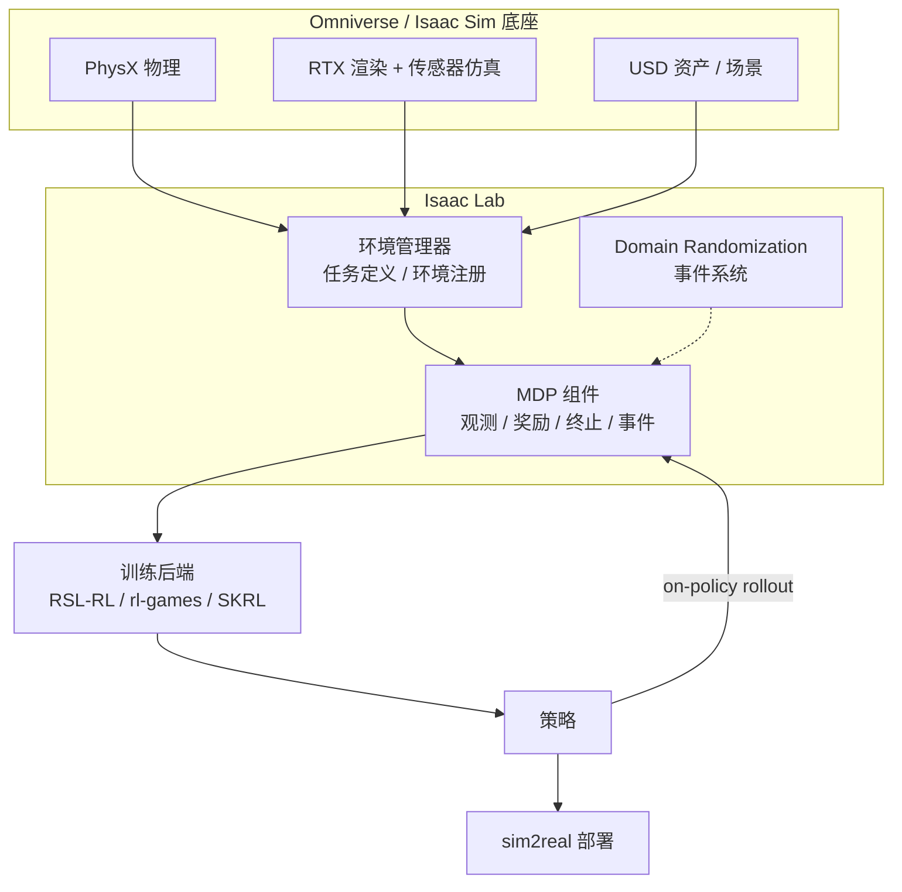
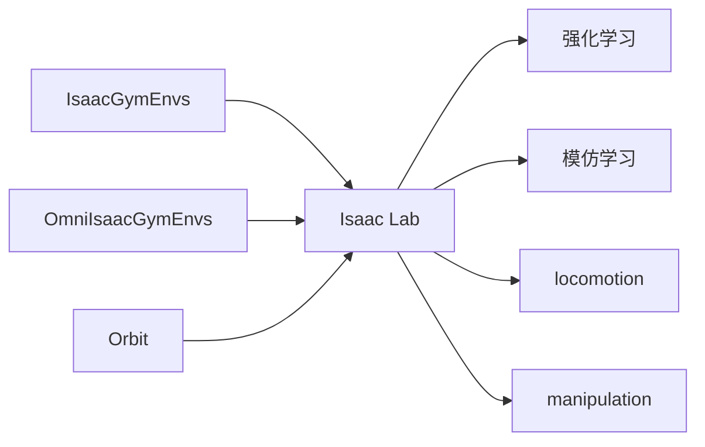

# Isaac Lab

**Isaac Lab** 是 NVIDIA 当前官方主推的机器人学习框架，建立在 **Isaac Sim** 之上，用于 robot learning、locomotion、manipulation 和 sim2real 研究。

## 一句话定义

> Isaac Lab 不是 [Isaac Gym](./isaac-gym.md) 的 API 换皮，而是 NVIDIA 当前 robot learning 的官方主线框架：它接住了 IsaacGymEnvs / OmniIsaacGymEnvs / Orbit 用户，跑在更完整的 Isaac Sim 生态上。

## 先说结论

- 如果你要搭**现在的新实验栈**，应该优先看 Isaac Lab。
- 它是 [Isaac Gym](./isaac-gym.md) 这条线的后继者，但**不是简单的版本号升级**。
- 它官方持续维护、文档更系统、迁移路径更明确。

两代框架的整体定位与迁移路径，见综述页：[Isaac Gym / Isaac Lab 平台总览](./isaac-gym-isaac-lab.md)。

## 为什么它重要

Isaac Lab 之所以是当前主线：

- 它接住了 [Isaac Gym](./isaac-gym.md) 这条 GPU 并行 RL 的能力路线
- 建立在更完整的 **Isaac Sim** 生态之上（渲染、传感器、USD 资产）
- 官方持续维护、文档更系统、迁移路径更明确
- 对 robot learning / manipulation / locomotion 的支持更现代
- **算法兼容性**：新一代算法如 **BRRL / BPO (2026)** 优先在 Isaac Lab 环境下完成了人形机器人行走等任务的验证，显示了它对现代 RL 研究的良好支撑

## 它解决什么问题

Isaac Lab 的目标是提供一套现代化、可维护的 robot learning workflow：

- 提供从旧框架（IsaacGymEnvs / OmniIsaacGymEnvs / Orbit）迁移的官方路径
- 支持训练、迁移、任务定义、环境注册、仿真管理
- 在同一套生态里覆盖 RL、IL、locomotion、manipulation

## 架构与工作流

Isaac Lab 的关键区别在于它**站在 Isaac Sim / Omniverse 之上**，因此除了物理还能给到高保真渲染与传感器仿真：

## 它的典型特征

- 建立在 **Isaac Sim** 上
- 支持强化学习、模仿学习、locomotion、manipulation
- 提供从旧框架迁移的官方文档
- 有更清晰的任务组织与环境注册方式（manager-based / direct workflow）
- 是 NVIDIA 现在推荐的主线
- 通过事件系统组织 domain randomization

## 从 Isaac Gym 迁移过来

Isaac Lab 收敛了之前几条分叉的 NVIDIA robot learning 栈：

迁移时**不会全部作废**：训练逻辑、任务构造、reward 设计、DR 思路很多是从 Isaac Gym 时代继承下来的，主要变化在环境注册方式和 API 组织。

## 什么时候优先用 Isaac Lab

如果你：

- 正在搭建新的人形 / 足式 RL 项目
- 想用 NVIDIA 官方当前支持的方案
- 想减少以后迁移成本

那就直接优先 Isaac Lab。

## 它和当前项目主线的关系

### 和 Reinforcement Learning 的关系

Isaac Lab 是 RL 训练的现代「基础设施层」，把环境、观测、奖励、随机化都组织成可注册的组件。

见：[Reinforcement Learning](../methods/reinforcement-learning.md)

### 和 Locomotion 的关系

在人形和足式 locomotion 研究里，它是当前主流的训练环境和 benchmark 平台。

见：[Locomotion](../tasks/locomotion.md)

### 和 Sim2Real 的关系

它提供仿真训练和 domain randomization 的主要工作台，但 sim2real 成功与否还取决于状态估计、系统辨识、执行器建模、观测延迟等。

见：[Sim2Real](../concepts/sim2real.md)

## 常见误区

### 1. 以为 Isaac Lab = Isaac Gym 2.0

不对。它们不是「Isaac Gym 2.0 = Isaac Lab」的版本号关系；Isaac Lab 是基于 Isaac Sim 的新主线框架，架构与生态都不同。详见 [Isaac Gym](./isaac-gym.md)。

### 2. 以为换成 Isaac Lab，旧经验都作废

也不对。训练逻辑、任务构造、reward 设计、DR 思路很多是继承下来的。

### 3. 以为仿真器选对了，sim2real 就稳了

远远不够。状态估计、系统辨识、执行器建模、观测延迟同样关键。

## 推荐继续阅读

- Isaac Lab 文档首页：<https://isaac-sim.github.io/IsaacLab/v2.1.0/>
- Isaac Lab 迁移指南：<https://isaac-sim.github.io/IsaacLab/v1.0.0/source/migration/index.html>

## 英文缩写速查

| 缩写 | 英文全称 | 简要说明 |
|------|----------|----------|
| Sim2Real | Simulation to Real | 把仿真中学到的策略迁移落地真机的工程主线 |
| Isaac Lab | NVIDIA Isaac Lab | 基于 Omniverse 的机器人学习训练框架 |
| Isaac Gym | NVIDIA Isaac Gym | GPU 并行刚体仿真训练环境 |
| API | Application Programming Interface | 应用程序编程接口 |
| GPU | Graphics Processing Unit | 图形处理器，大规模并行仿真训练的算力基础 |
| RL | Reinforcement Learning | 通过与环境交互最大化长期回报来学习策略的范式 |
| IL | Imitation Learning | 从专家演示学习策略，奖励难定义时的主路线 |
| DR | Domain Randomization | 训练时随机化仿真参数以提升跨域鲁棒迁移 |
| Locomotion | Robot Locomotion | 足式/人形等无轮移动能力的总称 |
| PPO | Proximal Policy Optimization | 人形/足式 locomotion 中最常用的 on-policy 策略梯度算法 |
| Teleop | Teleoperation | 人遥操作机器人采集演示数据 |
| legged_gym | Legged Gym | 足式机器人 RL 训练的常用开源框架 |

## 参考来源

- 官方文档：<https://isaac-sim.github.io/IsaacLab/v2.1.0/>
- Ao et al., *Bounded Ratio Reinforcement Learning* (2026) — 在 Isaac Lab 中验证新算法
- **ingest 档案：** [sources/papers/policy_optimization.md](../../sources/papers/policy_optimization.md) — PPO/BRRL 与 Isaac Lab 的结合应用
- **ingest 档案：** [sources/courses/nvidia_sim_to_real_so101_isaac.md](../../sources/courses/nvidia_sim_to_real_so101_isaac.md) — SO-101 课：仿真 DR 遥操作采数、策略评测与 sim2real 对照实验

## 关联页面

- [Isaac Gym / Isaac Lab 平台总览](./isaac-gym-isaac-lab.md) — 两代框架定位与迁移路径
- [Isaac Teleop](./isaac-teleop.md) — XR 遥操作与示范采集的统一框架（Lab 3.x 主线）
- [Isaac Gym](./isaac-gym.md) — 它的旧一代前身
- [Robotic World Model（ETH RSL，RWM / RWM-U）](./robotic-world-model-eth-rsl.md) — Isaac Lab 扩展的神经动力学与想象训练参考实现
- [Newton Physics](./newton-physics.md) — Isaac Lab 存在 `feature/newton` 物理后端集成探索
- [legged_gym](./legged-gym.md) — 旧一代足式 RL 训练栈，工程经验可迁移
- [Reinforcement Learning](../methods/reinforcement-learning.md)
- [Locomotion](../tasks/locomotion.md)
- [Sim2Real](../concepts/sim2real.md)

## 一句话记忆

> Isaac Lab 是 NVIDIA 当前官方主推、建立在 Isaac Sim 之上的 robot learning 框架，是 Isaac Gym 这条线的现代后继者：做新项目优先选它。
