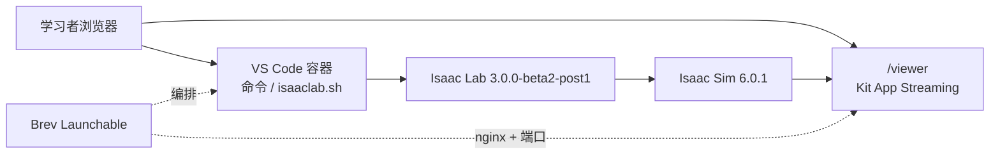
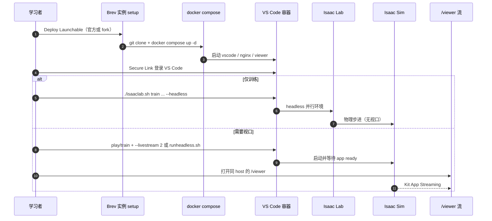

# Isaac Launchable

**Isaac Launchable**（[isaac-sim/isaac-launchable](https://github.com/isaac-sim/isaac-launchable)）把 **Isaac Lab + Isaac Sim** 打成 **[NVIDIA Brev](./nvidia-brev.md) Launchable**：一个浏览器 tab 跑 **VS Code** 终端与脚本，另一个 tab 通过 **Kit App Streaming** 在 **`/viewer`** 路径看仿真视口。官方 Deploy 按钮钉 **Lab 3.0.0-beta2-post1**、**Sim 6.0.1**；定位为 **学习用途**，非生产部署。

## 一句话定义

**点 Deploy → 浏览器里写 Isaac Lab 命令、在 `/viewer` 看 Isaac Sim——无需本机装 Omniverse 栈。**

## 英文缩写速查

| 缩写 | 英文全称 | 简要说明 |
|------|----------|----------|
| Launchable | Brev Launchable | 硬件+软件+代码的一键可分享云环境 |
| Kit | NVIDIA Omniverse Kit | Isaac Sim 底层应用框架 |
| UI | User Interface | 经 WebRTC 流式传输的 Sim 视口 |
| GPU | Graphics Processing Unit | 需 RT core 以支持 Kit App Streaming |
| ROS | Robot Operating System | 播放列表主题之一；Launchable 本身不预装完整 ROS 课栈 |

## 为什么重要

- **Physical AI 课的无 GPU 捷径：** [Physical AI Learning](./nvidia-physical-ai-learning.md) 与 [Getting Started With Isaac Lab](./nvidia-getting-started-isaac-lab.md) 在无工作站 GPU 时指向 Brev；Isaac Launchable 是 **官方维护的 Isaac 栈 Launchable 模板**，比自建镜像省配置。
- **双 tab 工作流可复用：** 训练在 VS Code 里 `--headless`；需要看行为时加 `--livestream 2` 并开 `/viewer`——与本地安装命令几乎相同，只多流式参数。
- **可 fork 定制：** 仓库开源可改 `docker-compose`、换算力规格或加课程依赖；与 [COMPASS](./compass.md) 等「自备 Docker」路径互补。

## 核心结构

| 组件 | 作用 |
|------|------|
| `isaac-lab-vscode` | 开发环境与 shell |
| `isaac-lab-viewer` | Omniverse Web Viewer 客户端 |
| `isaac-lab-nginx` | Secure Links / 路由到 VS Code 与 viewer |
| Docker Compose | 本地 `ENV=localhost` 或 Brev `ENV=brev` |

## 源码运行时序图

## 工程实践

| 目标 | 做法 |
|------|------|
| 官方一键环境 | README **Deploy Now** → `launchableID=env-35JP2ywERLgqtD0b0MIeK1HnF46` |
| Ant 快速演示 | `train --task Isaac-Ant-v0 --headless` → `play ... --livestream 2` |
| 看 UI | 控制台出现 `app ready` 或 `Simulation App Startup Complete` 后开 **`/viewer`** |
| 省费用 | Brev **按小时计费**；不用时 **stop** 实例 |
| 自定义算力 | Fork 仓库 → Brev Create Launchable → setup 脚本 `docker compose up -d`；开放端口 **1024、47998、49100** |
| 本地复现 | `nvidia-container-toolkit` + `ENV=localhost` + `docker compose up -d` |
| 排障 | `docker ps` 确认三容器；`docker compose down && up -d` 重启 |

## 局限与风险

- **仅学习：** README 明确 **not for production**；无 SLA、多用户协作或持久数据方案。
- **版本钉扎：** 当前 **Lab 3.0.0-beta2-post1 + Sim 6.0.1**；与课程录制版本或本地 main 可能不一致——先 `zero_agent` / 小 `--num_envs` 验证。
- **单 viewer：** 同时只开一个 `/viewer` tab，否则流媒体不稳定。
- **GPU 与云商：** 需 **RT core**；**Crusoe 不兼容**；驱动与 Isaac Sim 要求需在 Brev 选型时自行核对。
- **许可：** Deploy 即接受 Isaac Sim 附加许可；仓库 GitHub license 为 **Other**。
- **与 ROS 课分离：** [Robotics Fundamentals 播放列表](../../sources/sites/nvidia-robotics-fundamentals-playlist.md) 讲 ROS/仿真概念；完整 ROS 动手课走 [Physical AI — Isaac ROS](https://docs.nvidia.com/learning/physical-ai/) 路径。

## 关联页面

- [NVIDIA Brev](./nvidia-brev.md) — Launchable 平台与 CLI
- [NVIDIA Physical AI Learning](./nvidia-physical-ai-learning.md) — 课程门户
- [Getting Started With Isaac Lab](./nvidia-getting-started-isaac-lab.md) — 推荐跟做课
- [Isaac Lab](./isaac-lab.md)
- [Isaac Sim](./isaac-sim.md)
- [COMPASS](./compass.md) — 可自建 Docker 的另一条 Brev 用法

## 参考来源

- [isaac-launchable 仓库归档](../../sources/repos/isaac_launchable.md)
- [Robotics Fundamentals 播放列表归档](../../sources/sites/nvidia-robotics-fundamentals-playlist.md)
- [官方仓库 README](https://github.com/isaac-sim/isaac-launchable)

## 推荐继续阅读

- [Brev Launchable Deploy（官方）](https://brev.nvidia.com/launchable/deploy/now?launchableID=env-35JP2ywERLgqtD0b0MIeK1HnF46)
- [Isaac Lab Walkthrough](https://isaac-sim.github.io/IsaacLab/main/source/setup/walkthrough/index.html)
- [Physical AI Learning — Robotics](https://docs.nvidia.com/learning/physical-ai/robotics.html)
