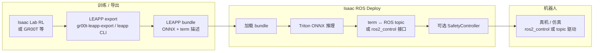
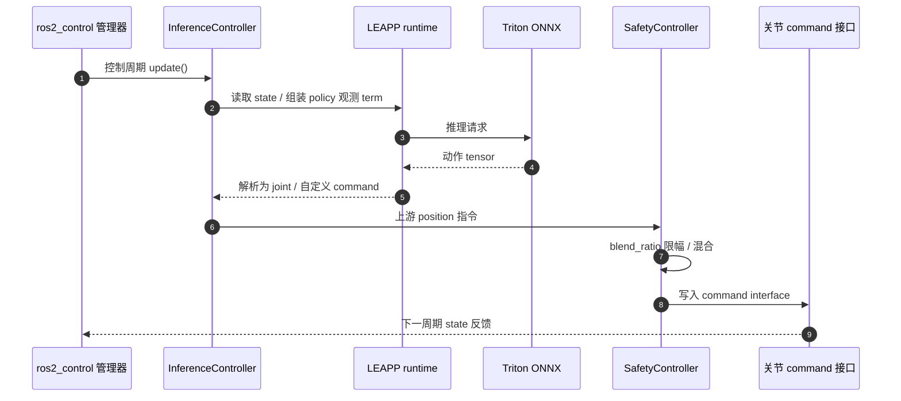

# Isaac ROS Deploy

**isaac_ros_deploy**（[NVIDIA-ISAAC-ROS/isaac_ros_deploy](https://github.com/NVIDIA-ISAAC-ROS/isaac_ros_deploy)）是 NVIDIA **Isaac ROS** 家族中的 **神经网络策略部署** 组件：凡能导出为 **[LEAPP](https://nvidia-isaac.github.io/leapp/) bundle** 的控制策略（含 [Isaac Lab](https://isaac-sim.github.io/IsaacLab/) 强化学习策略、经 [gr00t-leapp-export](https://github.com/nvidia-isaac/gr00t-leapp-export) 的 VLA 等），都可在 **ROS 2 节点图** 或 **`ros2_control` 控制环** 内闭环运行。

## 英文缩写速查

| 缩写 | 英文全称 | 简要说明 |
|------|----------|----------|
| LEAPP | — | NVIDIA 策略导出 bundle 格式（含 ONNX 与 term 元数据） |
| ONNX | Open Neural Network Exchange | Triton 侧常见模型交换格式 |
| ROS 2 | Robot Operating System 2 | 机器人中间件与通信框架 |
| RL | Reinforcement Learning | Isaac Lab 训出的低层控制策略可经 LEAPP 部署 |
| VLA | Vision-Language-Action | GR00T 等 VLA 经 LEAPP 导出后的部署对象 |
| TRT | TensorRT | NVIDIA GPU 推理优化；与 Triton/LEAPP 链路常并列出现 |

## 为什么重要

- **补齐「训练 Python ↔ 机载 C++/ROS」裂缝**：不再手写观测拼接与 action 反归一化胶水；bundle 内 **policy term** 与 ROS / `ros2_control` 接口由 Deploy 栈对齐。
- **与 GR00T / Isaac Lab 官方路径一致**：[Isaac GR00T](./isaac-gr00t.md) E2E 与 [G1 动手课](./nvidia-gr00t-e2e-g1-workflow.md) 的 **LEAPP → Isaac ROS** 段即本仓库职责；Isaac Lab `scripts/reinforcement_learning/leapp` 导出 RL 策略同理。
- **两种集成形态**：独立 **ROS 2 节点图**（感知/状态 topic 进出）或嵌入 **`ros2_control`**（`InferenceController` 在控制周期内推理），便于与现有驱动栈共存。
- **安全层可插拔**：`SafetyController` 可对上游关节位置指令做 blend/限幅后再写 command interface（2026-09 起支持调试 topic  introspection）。

## 流程总览

## 核心结构/机制

| 模块（仓库路径） | 作用 |
|------------------|------|
| `isaac_deploy_core` | LEAPP 运行时、推理编排 |
| `isaac_ros_deploy_bringup` | 组合 launch |
| `isaac_ros_deploy_converters` | ROS 消息与 model I/O 转换 |
| `isaac_ros_deploy_ros2_control` | **`InferenceController`**：在控制环内推理；**`SafetyController`**：门控/混合关节指令 |
| `isaac_ros_deploy_reference_applications` | 官方参考部署拓扑 |
| `isaac_ros_inverse_dynamics` | 逆动力学相关辅助（与 manipulation/loco 栈配合时见官方教程） |

**`ros2_control` 调试（可选）：** `InferenceController` 可发布 flattened 观测与选定输出 tensor（`publish_debug_topics`）；`SafetyController` 可发布 blend 后的 joint delta（`publish_scaled_joint_delta`），便于 Sim2Real 对齐与排障。

## 工程实践

| 场景 | 建议路径 |
|------|----------|
| 人形 VLA 真机 | [GR00T E2E G1 workflow](./nvidia-gr00t-e2e-g1-workflow.md) → LEAPP export → 本仓库 bringup + Jetson |
| 四足 / 臂 RL | Isaac Lab 训练 → LEAPP 导出 → Deploy + `ros2_control` 或 topic 环 |
| 与感知栈同机 | 与 [Isaac ROS Visual SLAM](./isaac-ros-visual-slam.md)、[Nvblox](./isaac-ros-nvblox.md) 等 **并列节点**；策略环频率与感知延迟需单独预算 |
| 推理加速 | bundle 内 ONNX 经 **Triton** 服务；训练侧另见 [TensorRT](./tensorrt.md) 导出文档 |

## 源码运行时序图（ros2_control 路径）

## 开源状态与局限

- **开源状态（2026-09-25）：** GitHub 仓库 **已开源**（Apache-2.0）；无独立 `*.github.io` 项目页，文档托管在 [Isaac ROS 文档站](https://nvidia-isaac-ros.github.io/repositories_and_packages/isaac_ros_deploy/index.html)。
- **局限：** README **Latest（2026-09-21）** 写明 **Isaac Sim 内部署支持尚未包含在本 release**；需真机或外部仿真 + ROS 2 桥接。
- **误区：** 把 Deploy 当成 **SLAM/规划** 组件 — 它是 ** learned policy 运行时**；导航仍用 Nav2 / cuMotion 等，见 [导航·SLAM 栈总览](../overview/navigation-slam-autonomy-stack.md)。
- **误区：** LEAPP 仅属 GR00T — 任何满足 LEAPP 规范的 Isaac Lab RL 导出均可接入。

## 参考来源

- [sources/repos/isaac_ros_deploy.md](../../sources/repos/isaac_ros_deploy.md)
- [NVIDIA-ISAAC-ROS/isaac_ros_deploy](https://github.com/NVIDIA-ISAAC-ROS/isaac_ros_deploy)

## 关联页面

- [Isaac GR00T](./isaac-gr00t.md) — LEAPP 导出与 G1 真机参考流上游
- [Isaac Lab](./isaac-lab.md) — RL 训练与 `leapp` 导出脚本目录
- [NVIDIA Physical AI 工具链技术地图](../overview/nvidia-physical-ai-toolchain-technology-map.md) — 第⑥段部署
- [TensorRT](./tensorrt.md) — GPU 推理编译与 Jetson 优化
- [Sim2Real](../concepts/sim2real.md) — 部署环在 Sim2Real 闭环中的位置

## 推荐继续阅读

- [Isaac ROS Deploy 官方文档](https://nvidia-isaac-ros.github.io/repositories_and_packages/isaac_ros_deploy/index.html)
- [LEAPP 文档](https://nvidia-isaac.github.io/leapp/)
- [GR00T Reference Workflow for Unitree G1（Isaac ROS）](https://docs.nvidia.com/learning/physical-ai/gr00t-e2e-workflow/latest/index.html)
- [Isaac Lab — RL existing scripts（含 LEAPP 导出入口说明）](https://isaac-sim.github.io/IsaacLab/main/source/overview/reinforcement-learning/rl_existing_scripts.html)
