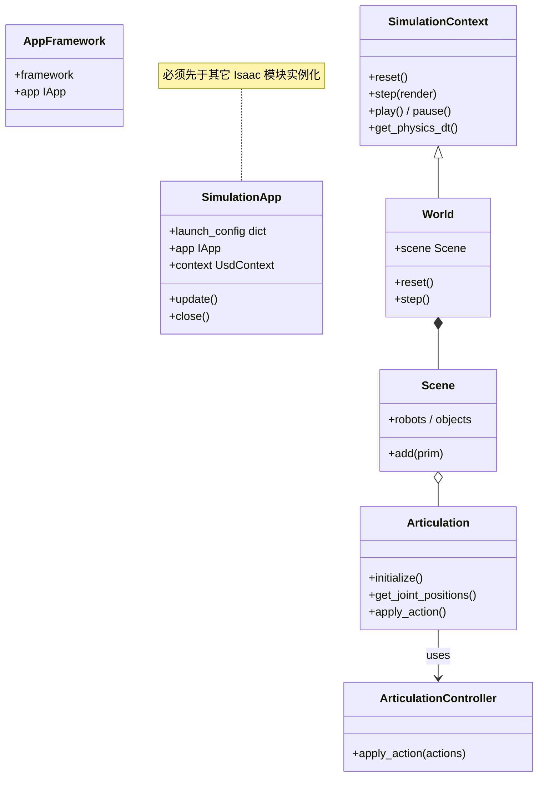
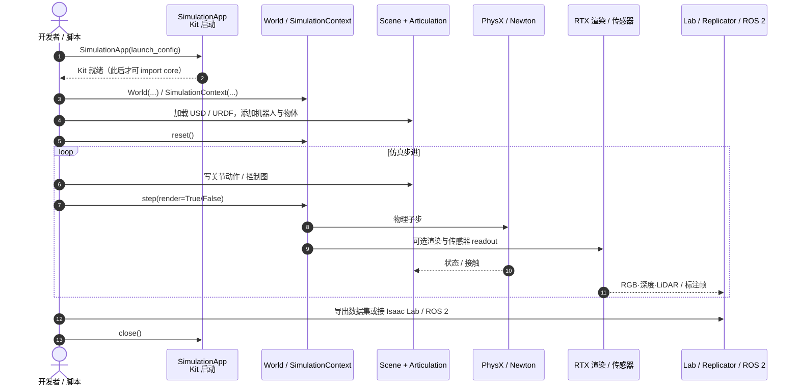
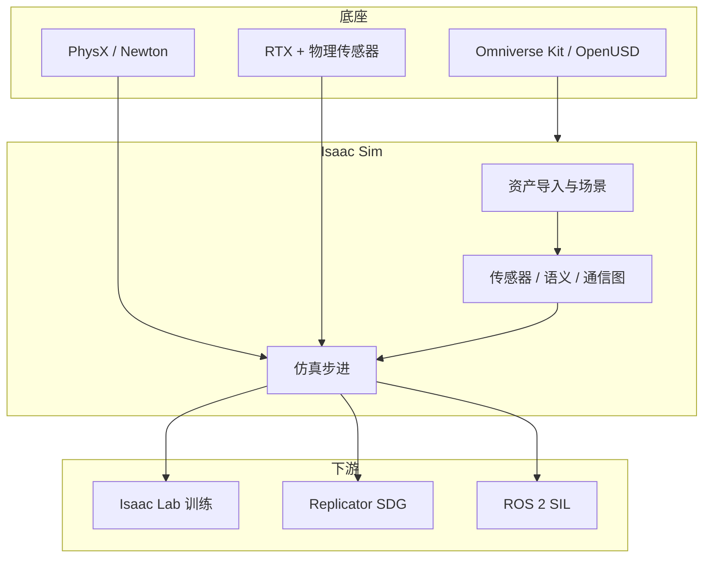

# Isaac Sim

**Isaac Sim** 是 NVIDIA 基于 **Omniverse / OpenUSD** 的机器人仿真应用：导入 URDF/MJCF/CAD/USD，用 PhysX（及 Newton）做物理，用 RTX 与物理传感器做感知仿真，并连接合成数据、ROS 2 SIL 与 [Isaac Lab](./isaac-lab.md) 训练栈。

## 一句话定义

> Isaac Sim 是机器人仿真**工作台与底座**（场景、物理、传感器、外部栈连接），不是 RL 算法库；当前官方学习主线 [Isaac Lab](./isaac-lab.md) 跑在它之上，而 [Isaac Gym](./isaac-gym.md) 是更早的独立 GPU RL 仿真产品线。

## 英文缩写速查

| 缩写 | 英文全称 | 简要说明 |
|------|----------|----------|
| USD / OpenUSD | Universal Scene Description | Omniverse 共享场景与资产描述格式 |
| PhysX | NVIDIA PhysX | Isaac Sim 默认刚体/接触物理后端 |
| RTX | NVIDIA RTX | 光追渲染与视觉传感器仿真路径 |
| SIL | Software-in-the-Loop | 在仿真中接外部机器人栈（如 ROS 2）做软硬件联调前验证 |
| SDG | Synthetic Data Generation | Replicator 等合成标注数据管线 |
| Kit | Omniverse Kit | Isaac Sim 所依赖的应用运行时框架 |
| RL | Reinforcement Learning | 策略学习；训练通常上移到 Isaac Lab |
| URDF | Unified Robot Description Format | 机器人模型导入常用描述 |
| ROS 2 | Robot Operating System 2 | 真机/中间件栈与仿真桥接 |

## 先说结论

- **新实验的仿真底座**：需要高保真渲染、传感器、USD 资产或 ROS 2 SIL 时，优先 Isaac Sim。
- **训练框架另页**：大规模 PPO / IL 环境编排看 [Isaac Lab](./isaac-lab.md)，不要把 Sim 当成「Gym 的下一版本号」。
- **与 Gym 的关系**：Gym 是独立 legacy GPU RL 产品；Sim + Lab 是 Omniverse 主线。总览见 [Isaac Gym / Isaac Sim / Isaac Lab](./isaac-gym-isaac-lab.md)。

## 为什么重要

- 把 **资产、物理、传感、外部栈** 放在同一 OpenUSD stage 上，避免「训练用一套、感知验证又一套」的断裂。
- 官方生态把它放在 **场景搭建 / SIL / SDG** 位置，把 **RL/IL 训练** 明确交给 Isaac Lab（见官方 Robotics Ecosystem 分工）。
- 对视觉域随机化、光追合成数据、LiDAR/深度噪声等，比纯状态型 Gym 时代栈更完整。

## 它解决什么问题

| 工作流 | Isaac Sim 的角色 |
|--------|------------------|
| 资产导入与场景配置 | URDF / MJCF / CAD / USD → 共享 stage |
| 物理与传感器仿真 | PhysX / Newton + RTX / 物理传感器 |
| 合成数据 | Replicator 标注与随机化写出 |
| Software-in-the-loop | ROS 2 / 外部控制栈预硬件验证 |
| 为学习准备场景 | 给 Isaac Lab 准备可训练机器人与环境 |

## 核心类图

对齐官方 Python API（`isaacsim.simulation_app` / `isaacsim.core.api`）。standalone 脚本必须先构造 `SimulationApp`，再导入依赖 Kit 扩展的模块：

## 源码运行时序图

以 standalone Python 脚本 + Core API 主循环为准（扩展模式勿再建 `SimulationApp` / 新 `World`，应复用已有 Kit timeline）。仓库入口：[isaac-sim/IsaacSim](https://github.com/isaac-sim/IsaacSim)，文档：[Isaac Sim Docs](https://docs.isaacsim.omniverse.nvidia.com/latest/index.html)。

- **关键路径：** 本地或容器按官方 Quick Install → `SimulationApp` → `World` 步进；训练并行环境再上移到 [Isaac Lab](./isaac-lab.md) 的 `ManagerBasedRLEnv` / `DirectRLEnv`。
- **开源状态（截至 2026-07-21）：** 官方仓 [isaac-sim/IsaacSim](https://github.com/isaac-sim/IsaacSim) 以 Apache 2.0 开源仿真栈；具体安装通道仍以文档 Workstation / Container / Python Environment 为准。

## 架构与生态位置

## 什么时候优先用 Isaac Sim

- 需要 **光追级视觉**、LiDAR / 深度噪声、合成数据
- 需要 **ROS 2 / 整机栈 SIL**
- 已确定用 **Isaac Lab** 训练，要在同一 USD 生态里准备资产

若不需要 Omniverse 渲染与传感器、只想轻量 GPU RL，可对照 [mjlab](./mjlab.md) / [MuJoCo](./mujoco.md) 选型（见 [仿真器选型指南](../queries/simulator-selection-guide.md)）。

## 常见误区

### 1. 以为 Isaac Sim = Isaac Lab

不对。Sim 是仿真应用/底座；Lab 是其上的 learning 框架。

### 2. 以为 Isaac Sim = Isaac Gym 改名

不对。Gym 是早期独立 GPU RL 仿真；Sim 走 Omniverse，承接的是完整机器人仿真工作台。

### 3. 在扩展里再 new 一个 SimulationApp / World

扩展模式下 Kit 已在跑；应使用已有 `SimulationContext` / timeline，否则易破坏物理视图。

## 推荐继续阅读

- Isaac Sim 文档首页：<https://docs.isaacsim.omniverse.nvidia.com/latest/index.html>
- 开源仓库：<https://github.com/isaac-sim/IsaacSim>
- Core API：<https://docs.isaacsim.omniverse.nvidia.com/latest/py/source/extensions/isaacsim.core.api/docs/index.html>

## 参考来源

- **ingest 档案：** [sources/repos/isaac_sim.md](../../sources/repos/isaac_sim.md)
- **ingest 档案：** [sources/repos/isaac_gym_isaac_lab.md](../../sources/repos/isaac_gym_isaac_lab.md)
- 官方文档：What Is Isaac Sim / Workflow Overview / Robotics Ecosystem
- **ingest 档案：** [sources/papers/simulation_tools.md](../../sources/papers/simulation_tools.md)

## 关联页面

- [Isaac Lab](./isaac-lab.md) — 跑在 Sim 上的官方 robot learning 框架
- [Isaac Gym](./isaac-gym.md) — 旧一代独立 GPU RL 仿真（legacy）
- [Isaac Gym / Isaac Sim / Isaac Lab 总览](./isaac-gym-isaac-lab.md) — 三代产品关系与迁移
- [NVIDIA Omniverse](./nvidia-omniverse.md) — Kit / USD / RTX 底座
- [MuJoCo vs Isaac Sim](../comparisons/mujoco-vs-isaac-sim.md)
- [Newton Physics](./newton-physics.md) — 可选物理后端方向
- [Isaac Teleop](./isaac-teleop.md) — XR 遥操作与示范采集
- [Sim2Real](../concepts/sim2real.md)
- [仿真器选型指南](../queries/simulator-selection-guide.md)

## 一句话记忆

> Isaac Sim 是 Omniverse 上的机器人仿真底座；Lab 在它上面做学习，Gym 是更早的另一条 GPU RL 产品线。
