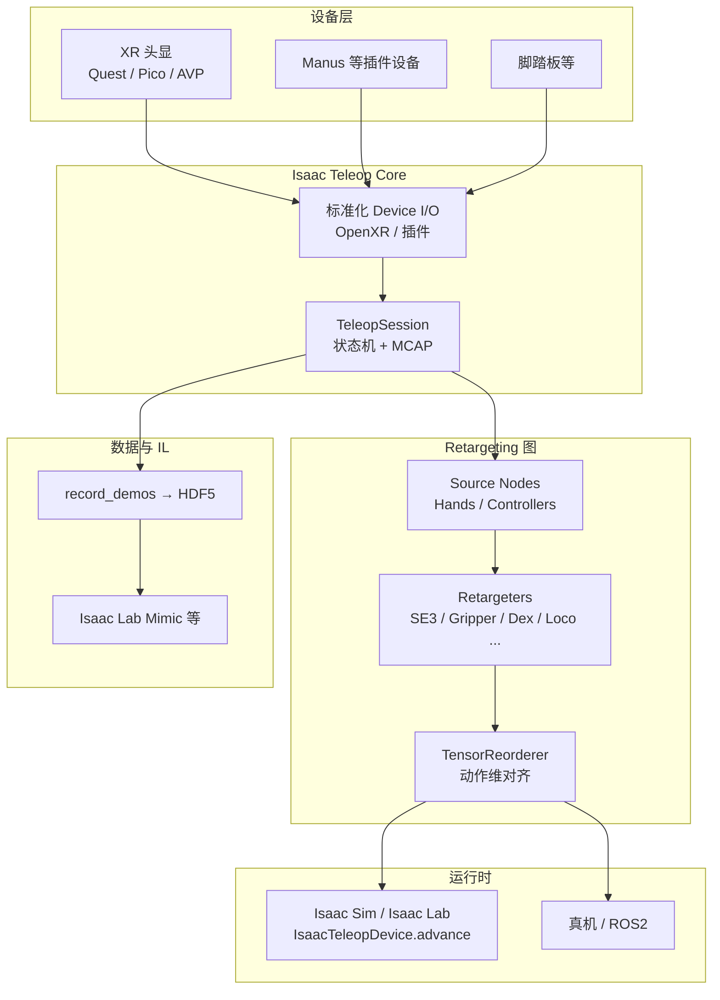

# Isaac Teleop

**Isaac Teleop** 是 NVIDIA 推出的**统一遥操作与数据采集框架**，面向 egocentric 视角下的高保真人机示范：同一套设备抽象与 retargeting 图既可用于 **Isaac Sim / Isaac Lab 仿真**，也可对接 **真机与 ROS2**，并衔接模仿学习示范导出。

## 一句话定义

> 把 XR 头显、手套与外设的跟踪数据，经可组合的 **Source → Retargeter → 动作张量** 管线映射到不同机器人 embodiment，并在 Isaac Lab 里通过 `IsaacTeleopDevice` 与示范录制脚本闭环到 IL 数据飞轮。

## 为什么重要

- **栈收敛**：Isaac Lab 侧 **取代** 旧 `isaaclab.devices.openxr` XR 路径，减少「仿真遥操作一套、Lab 集成又一套」的分叉（迁移见 Isaac Lab 3.0 文档）。
- **跨 embodiment**：Franka 单臂 8 维、G1 上身 28 维、全身 loco-manipulation 32 维、GR1T2 灵巧手 36+ 维等，靠 **换 pipeline_builder** 而非重写设备驱动。
- **数据飞轮入口**：与 `record_demos.py`、HDF5 导出及 **Isaac Lab Mimic** 等 IL 工具链对接，直接服务「遥操作 → 示范 → 策略」主线（见 [Teleoperation](../tasks/teleoperation.md)、[Imitation Learning](../methods/imitation-learning.md)）。

## 流程总览

## 核心模块

| 模块 | 作用 |
|------|------|
| **设备接口与插件** | Quest/Pico 经 **CloudXR**；AVP 经原生客户端；Manus 等走 C++ 插件向 OpenXR 推送 tensor |
| **Retargeting Engine** | 图式组合 `HandsSource` / `ControllersSource` 与 `Se3Abs`、`Gripper`、`DexBiManual`、`LocomotionRootCmd` 等 |
| **控制状态机** | 头显 JSON 命令（start/stop/reset）经 opaque channel；`poll_control_events()` 驱动环境 reset 与采数启停 |
| **MCAP** | 会话录制与回放，便于调试与离线分析 |
| **Isaac Lab 绑定** | `IsaacTeleopCfg` + `XrAnchorManager`；延迟创建 session 直至用户点击「Start XR」 |

## 设备与输入模式（摘要）

| 设备 | 典型输入 | 连接 |
|------|----------|------|
| Meta Quest 3 | 手柄 / 26 关节手追踪 | CloudXR.js（浏览器） |
| Pico 4 Ultra | 同上 | CloudXR.js（HTTPS，系统版本要求见文档） |
| Apple Vision Pro | 手追踪 + 空间控制器 | 自建 visionOS Sample Client |
| Manus 手套 | 手指高精度 | Teleop 插件；腕部位姿需外源 |

**选手柄还是手追踪？** 文档建议：pick-and-place 等操作优先 **手柄**（握姿 + 扳机夹爪）；复杂多指灵巧手优先 **手追踪或 Manus**（需完整 26 关节流）。

## 与 Isaac Lab 的集成要点

- 环境配置注册 `IsaacTeleopCfg(pipeline_builder=...)`；`pipeline_builder` **必须是函数**，返回带 `"action"` 键的 `OutputCombiner`。
- `TensorReorderer.output_order` 必须与环境 **action space 完全一致**，否则易出现静默控制错误。
- **键盘 / SpaceMouse** 遥操作仍用 `isaaclab.devices`，与 Isaac Teleop **并行存在**，选型时不要混为一谈。
- XR 性能：常见头显 **90 Hz**；宜匹配仿真步长，并考虑 `remove_camera_configs()` 降低 GPU 负载。

## 内置环境示例（XR）

| 场景 | 代表 Task ID | 输入 |
|------|----------------|------|
| Franka 堆叠 | `Isaac-Stack-Cube-Franka-IK-Abs-v0` | 右手柄 |
| GR1T2 灵巧放置 | `Isaac-PickPlace-GR1T2-Abs-v0` | 双手追踪 + Dex retarget |
| G1 固定基座上身 | `Isaac-PickPlace-FixedBaseUpperBodyIK-G1-Abs-v0` | 双手柄 + TriHand |
| G1 全身 loco-manip | `Isaac-PickPlace-Locomanipulation-G1-Abs-v0` | 双手柄 + 摇杆 locomotion |

## 常见误区

1. **以为 Isaac Teleop = 所有 Isaac Lab 遥操作** — 仅覆盖 **XR 管线**；键盘/SpaceMouse 仍是遗留设备 API。
2. **预构建 pipeline 对象放进 config** — `@configclass` 深拷贝会破坏图引用，应传 **callable**。
3. **忽略 anchor 与坐标系** — `world_T_anchor` 与 `target_offset_roll/pitch/yaw` 决定人体跟踪到机器人 EE 的映射，换设备模式常需重调。
4. **与「跨形态实时 I/O 框架」混淆** — [RIO](./robot-io-rio.md) 侧重真机 Node/中间件与 VLA 异步推理；Isaac Teleop 侧重 **NVIDIA 仿真生态 + XR retargeting**，二者可对照阅读而非互替。

## 关联页面

- [Isaac Lab](./isaac-lab.md) — XR 遥操作集成与示范录制的宿主框架
- [Isaac Gym / Isaac Lab 平台总览](./isaac-gym-isaac-lab.md) — 仿真与学习栈上下文
- [Teleoperation（遥操作）](../tasks/teleoperation.md) — 任务视角与多系统对照表
- [Imitation Learning](../methods/imitation-learning.md) — 示范数据下游学习
- [Unitree G1](./unitree-g1.md) — 文档中 G1 TriHand / loco-manip 遥操作范例平台
- [RIO（Robot I/O）](./robot-io-rio.md) — 另一套跨形态真机 I/O 抽象（对照）

## 英文缩写速查

| 缩写 | 英文全称 | 简要说明 |
|------|----------|----------|
| Teleop | Teleoperation | 人遥操作机器人采集演示数据 |
| Isaac Lab | NVIDIA Isaac Lab | 基于 Omniverse 的机器人学习训练框架 |
| ROS 2 | Robot Operating System 2 | 机器人系统集成与通信的常用中间件 |
| IL | Imitation Learning | 从专家演示学习策略，奖励难定义时的主路线 |
| G1 | Unitree G1 Humanoid | 宇树入门级教育科研人形平台 |
| Retargeting | Motion Retargeting | 将人体/动物动作映射到目标机器人骨架 |
| GPU | Graphics Processing Unit | 图形处理器，大规模并行仿真训练的算力基础 |
| API | Application Programming Interface | 应用程序编程接口 |
| VLA | Vision-Language-Action | 视觉-语言-动作多模态基础策略方向 |
| Isaac Gym | NVIDIA Isaac Gym | GPU 并行刚体仿真训练环境 |

## 参考来源

- [Isaac Teleop 仓库与文档归档](../../sources/repos/nvidia_isaac_teleop.md)
- [NVIDIA/IsaacTeleop（GitHub）](https://github.com/NVIDIA/IsaacTeleop)
- [Isaac Teleop 官方文档](https://nvidia.github.io/IsaacTeleop/main/index.html)
- [Isaac Lab — Isaac Teleop 功能说明](https://isaac-sim.github.io/IsaacLab/main/source/features/isaac_teleop.html)

## 推荐继续阅读

- Isaac Teleop Quick Start（官方文档 Getting Started）
- [Isaac Lab Mimic 与合成数据](https://isaac-sim.github.io/IsaacLab/main/source/overview/imitation-learning/index.html) — 示范录制之后的 IL 管线
- [Setting up Isaac Teleop with CloudXR](https://isaac-sim.github.io/IsaacLab/main/source/how-to/cloudxr_teleoperation.html) — 首次跑通 XR 环境
