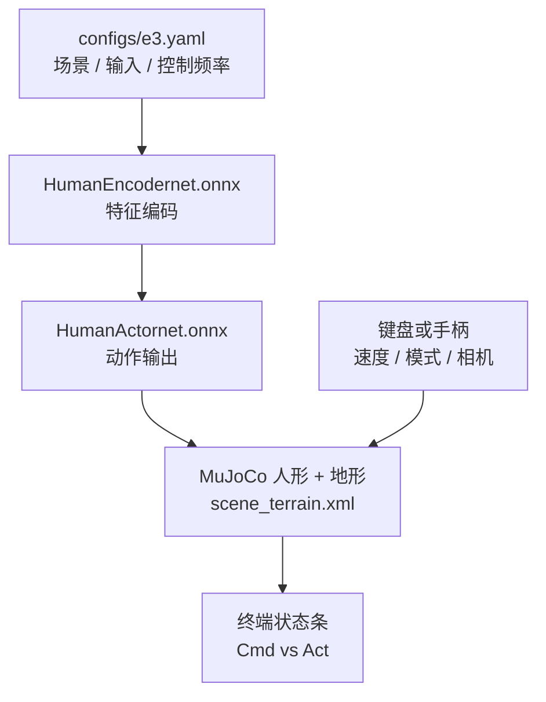

# FEAP MuJoCo 部署（E3 ONNX）

**定位**：README 声明本仓是论文 **FEAP** 的 **部署与验证框架**：把训练好的 **双 ONNX**（Encoder + Actor）放入 `policy/`，用 `scripts/feap_e3_mujoco_deploy.py` 加载 `configs/e3.yaml` 中的场景与输入设备配置，在 MuJoCo 中做 omnidirectional walking / high-speed running / 地形与扰动测试。

## 核心机制（工程切片）

- **策略形态**：显式区分 `HumanEncodernet.onnx` 与 `HumanActornet.onnx`，与「单文件 PyTorch `.pt`」演示仓形成对照。
- **输入设备**：`gamepad_enabled` 与 `keyboard_enabled` **互斥**；键盘分支在终端捕获 WASD 等键位，README 给出完整键表。
- **工程配套**：`setup_conda_env.sh` 创建默认 `feap_mujoco` 环境；`utils/display_utils.py` 等在终端打印速度跟踪误差、模式与相机参数。

## 流程总览

## 常见误区或局限

- **训练代码不在本仓**：README 定位为 deployment/validation；复现论文训练需回到论文主仓或官方补充材料。
- **ONNX Runtime 版本**：README troubleshooting 提到固定 `onnxruntime==1.19.2` 类提示，升级需重新验证算子支持。

## 与其他页面的关系

- **[FEAP Vision 部署](./jackhan-feapvision-mujoco-deployment.md)**：同作者的「深度 + TorchScript」变体，观测栈更厚。
- **[Locomotion](../tasks/locomotion.md)**：README 强调的多地形、多风格与扰动测试直接服务 locomotion 论文复现。

## 参考来源

- [Feap_Mujoco_deployment 仓库归档](../../sources/repos/jackhan-feap-mujoco-deployment.md)

## 关联页面

- [JackHan-Sdu WalkE3 / HumanoidE3 工具链生态](./jackhan-walke3-e3-ecosystem.md)
- [FEAP Vision MuJoCo 部署](./jackhan-feapvision-mujoco-deployment.md)
- [MuJoCo (物理引擎)](./mujoco.md)

## 推荐继续阅读

- 上游仓库 README：<https://github.com/JackHan-Sdu/Feap_Mujoco_deployment>
