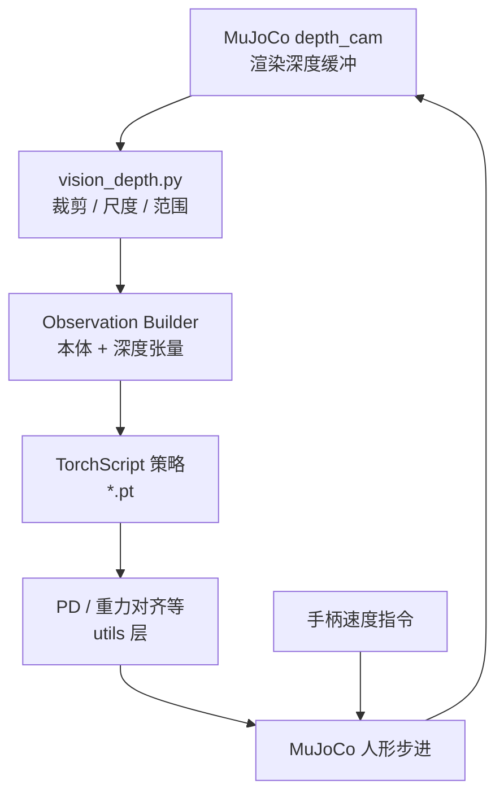

# FEAP Vision MuJoCo 部署（深度 + TorchScript）

本仓库在 MuJoCo 中渲染深度相机、拼接本体观测并加载 TorchScript 策略，经 PD 与手柄指令驱动 E3 类 21-DoF 人形。

**定位**：README 以中文描述「**本体观测 + 深度图 + 手柄速度指令**」的 **TorchScript** 部署：依赖 `mujoco`、`torch`、`opencv-python`、`pygame` 等；策略文件放在 `policy/`，配置中可用 `{DEPLOY_DIR}` / `{PACKAGE_ROOT}` 占位符展开路径。

## 核心机制（工程切片）

- **观测链**：深度相机 → 深度预处理模块 → `Observation Builder` → `VisionPolicyRunner`（TorchScript）→ PD 控制 → MuJoCo 步进（README 系统结构图）。
- **场景约束**：要求 MJCF 中存在名为 **`depth_cam`** 的相机；默认场景指向 `e3_21dof/scene_terrain.xml` 一类资源路径（以 README 为准）。
- **推理后端**：与 FEAP ONNX 线不同，本仓强调 **TorchScript `.pt`** 与可选 GPU 版 PyTorch 安装指引。

## 流程总览

## 常见误区或局限

- **README 声明**：仓库写明 **仅研究与学术用途**；与通用 OSS 许可不可混为一谈。
- **性能**：README 建议 NVIDIA GPU 以支撑高帧率深度渲染；CPU 路径需自行压测实时性。

## 与其他页面的关系

- **[FEAP MuJoCo 部署](./jackhan-feap-mujoco-deployment.md)**：同一作者的「纯本体 ONNX FEAP」对照组。
- **[Sim2Real](../concepts/sim2real.md)**：视觉策略在仿真渲染深度上闭环，对 sim2real 的感知域随机化提出更高要求。

## 参考来源

- [FeapVision_Mujoco_deployment 仓库归档](../../sources/repos/jackhan-feapvision-mujoco-deployment.md)

## 关联页面

- [JackHan-Sdu WalkE3 / HumanoidE3 工具链生态](./jackhan-walke3-e3-ecosystem.md)
- [FEAP MuJoCo 部署（E3 ONNX）](./jackhan-feap-mujoco-deployment.md)
- [Sim2Real](../concepts/sim2real.md)

## 推荐继续阅读

- 上游仓库 README：<https://github.com/JackHan-Sdu/FeapVision_Mujoco_deployment>
