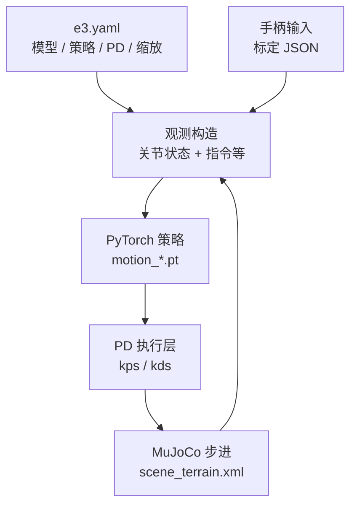

# Mujoco-WalkerE3-Simulation（Walker 泰山手柄仿真）

本仓库在 MuJoCo 中加载 E3 地形与预训练 PyTorch 策略，用手柄发送速度指令，支持行走、跑步与扰动测试模式。

**定位**：面向「可立即运行」的 MuJoCo 人形演示——仓库内置 **Walker 泰山** 预训练策略（`.pt`）、`e3.yaml` 与手柄标定脚本，强调速度指令跟踪、楼梯与扰动模式切换。

## 核心机制（工程切片）

- **控制回路**：配置中的 `simulation_dt`、`control_decimation` 与 PD `kps`/`kds` 共同决定仿真步长、控制频率与关节阻抗；观测/动作维度在 `e3.yaml` 中显式给出（README 示例为 72 维观测、21 维动作）。
- **输入层**：右摇杆平面速度、左摇杆偏航角速度；LB 循环模式；可选扰动模式下左摇杆映射到躯干外力。
- **可视化**：接触力向量、接触布尔、骨盆相机跟踪等开关与 README 中的按键表一一对应。

## 流程总览

## 常见误区或局限

- **README 已知问题**：楼梯首步可能穿模、长时间站立可能打滑——属于仿真接触与摩擦建模边界，不宜直接当作硬件结论。
- **手柄标定**：非罗技/北通品牌需运行 `calibrate_gamepad.py`，否则漂移会导致「策略正常但指令脏」的假阳性故障。

## 与其他页面的关系

- **[生态总览](./jackhan-walke3-e3-ecosystem.md)**：把本仓与数据集、控制器、FEAP 线放在同一张图里。
- **[WalkE3 控制器](./jackhan-walke3-controller.md)**：若要从「单机演示」升级到「仿真进程 + 控制进程」分离栈，可对照阅读。

## 参考来源

- [Mujoco-WalkerE3-Simulation 仓库归档](../../sources/repos/jackhan-mujoco-walke3-simulation.md)

## 关联页面

- [JackHan-Sdu WalkE3 / HumanoidE3 工具链生态](./jackhan-walke3-e3-ecosystem.md)
- [MuJoCo (物理引擎)](./mujoco.md)
- [Locomotion](../tasks/locomotion.md)

## 推荐继续阅读

- 上游仓库 README：<https://github.com/JackHan-Sdu/Mujoco-WalkerE3-Simulation>
