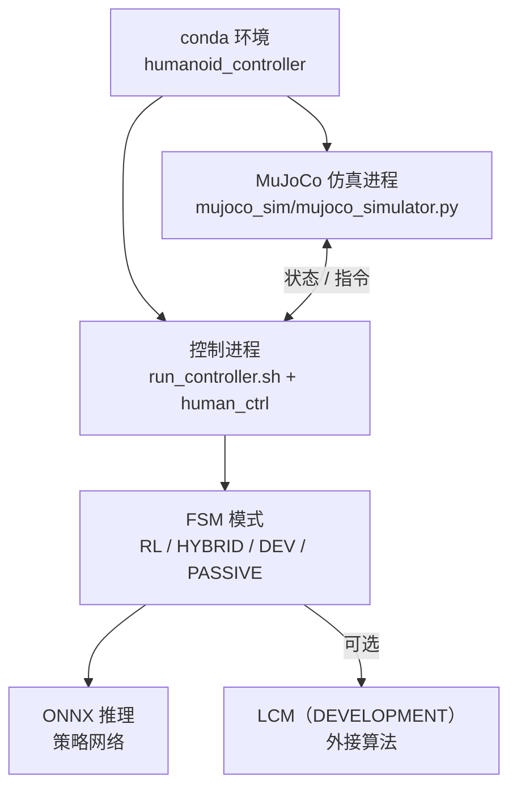

# WalkE3-Controller（人形 RL 部署与 FSM）

本仓库以双进程方式分离 MuJoCo 仿真与上层控制，支持 ONNX 策略、FSM 多模式与 Ubuntu 20.04 下的 conda 环境脚本。

**定位**：把「**仿真进程** + **控制进程**」拆开的 **人形通用部署框架**：README 强调 **Ubuntu 20.04**、conda 一键环境、MuJoCo 侧 `mujoco_simulator.py` 与 `run_controller.sh` 启动的算法侧可加载 **ONNX RL**，并用 **FSM** 组织 RL_HYBRID / RL_WALK / DEVELOPMENT / PASSIVE 等模式。

## 核心机制（工程切片）

- **双进程 IO**：仿真发布状态、控制端消费并回写指令——结构上接近「中间件 + 控制频率」拆分，便于替换算法实现。
- **DEVELOPMENT 模式**：README 指向 `Algorithm_Template_For_Developer`，用 LCM 通道在状态机外接二次开发算法。
- **安全叙事**：README 将「多层安全检查」作为硬件保护卖点；落地时仍需结合实验室急停与关节限幅策略复核。

## 流程总览

## 常见误区或局限

- **强绑定发行版**：README 写明 **Ubuntu 20.04**；其他版本需自行验证 `lcm`、动态库路径与实时性。
- **「通用框架」仍有机器人假设**：关节分组、模式切换手势与 ONNX 元数据需与具体 E3 控制栈版本对齐。

## 与其他页面的关系

- **[Yobotics E3 算法模板](./jackhan-yobotics-e3-algorithm-template.md)**：实现 DEVELOPMENT 外环时的直接配套。
- **[Sim2Real](../concepts/sim2real.md)**：同一套配置切换仿真/硬件是 Sim2Real 工程化的常见切片。

## 参考来源

- [WalkE3-Controller 仓库归档](../../sources/repos/jackhan-walke3-controller.md)

## 关联页面

- [JackHan-Sdu WalkE3 / HumanoidE3 工具链生态](./jackhan-walke3-e3-ecosystem.md)
- [Yobotics E3 算法模板](./jackhan-yobotics-e3-algorithm-template.md)
- [Sim2Real](../concepts/sim2real.md)

## 推荐继续阅读

- 上游仓库 README：<https://github.com/JackHan-Sdu/WalkE3-Controller>
