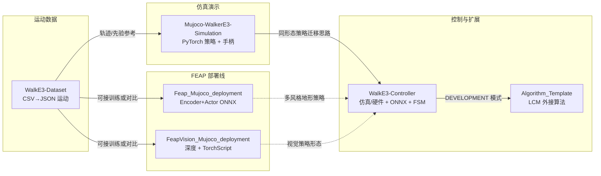

# JackHan-Sdu WalkE3 / HumanoidE3 工具链生态

将 JackHan-Sdu 维护的 WalkE3 数据、MuJoCo 手柄仿真、WalkE3 控制器、LCM 算法模板与两条 FEAP 部署仓组织成一条可读的人形工程工具链。

**本页**把同一作者维护的六条 GitHub 线串成「数据 → 仿真/训练侧载 → 控制栈 → 外接算法 → 论文级部署」的阅读地图；各子页只展开单仓职责与数据流。

## 为什么重要？

- **同一机器人形态（E3 / 21-DoF）** 在多个仓里复用 MJCF、策略形态（PyTorch / ONNX / TorchScript）与输入设备（手柄/键盘），适合对照「演示仿真」「数据管线」「真机控制栈」「研究论文部署」四类工程目标。
- **与 Locomotion / Sim2Real 主线对齐**：从 CSV 运动档案到 MuJoCo 回放，再到 ONNX 推理与状态机模式切换，覆盖了常见的人形落地切片。

## 流程总览（六仓关系）

## 各子页入口

| 子页 | 解决的问题 |
|------|------------|
| [Mujoco WalkerE3 手柄仿真](./jackhan-mujoco-walke3-simulation.md) | 开箱即玩：预置 `.pt` 策略 + `e3.yaml` + 手柄速度指令 |
| [WalkE3 数据集工具](./jackhan-walke3-dataset.md) | CSV 运动列格式、体坐标速度、MuJoCo JSON 回放 |
| [WalkE3 控制器框架](./jackhan-walke3-controller.md) | 双进程仿真/控制、ONNX、FSM 模式与安全层 |
| [Yobotics E3 算法模板](./jackhan-yobotics-e3-algorithm-template.md) | `AlgorithmBase` + LCM 的 50Hz/500Hz 外环模板 |
| [FEAP MuJoCo 部署](./jackhan-feap-mujoco-deployment.md) | FEAP 论文 ONNX 双网在 E3 场景的交互验证 |
| [FEAP Vision 部署](./jackhan-feapvision-mujoco-deployment.md) | 深度图 + 本体观测 + TorchScript |

## 常见误区或局限

- **许可证与商用**：各仓许可以仓库根目录为准；本知识页不构成使用授权建议。
- **环境假设**：控制器 README 写明 **Ubuntu 20.04**；FEAP / 视觉部署 README 强调 **Linux + Conda** 与特定 Python 版本，跨版本需自行验证依赖。
- **「同一作者」≠「单一产品」**：WalkE3 与 FEAP 论文线在目标读者上不同，合并选型时仍以你的论文/硬件约束为准。

## 与其他页面的关系

- **[MuJoCo](./mujoco.md)**：上述仓的物理与渲染底座。
- **[Locomotion](../tasks/locomotion.md)**：任务层视角，对照速度指令、地形与稳定性指标。
- **[Sim2Real](../concepts/sim2real.md)**：控制器仓显式支持仿真/硬件双模式，是典型 Sim2Real 工程切片的参考栈。

## 参考来源

- [Mujoco-WalkerE3-Simulation 仓库归档](../../sources/repos/jackhan-mujoco-walke3-simulation.md)
- [WalkE3-Dataset 仓库归档](../../sources/repos/jackhan-walke3-dataset.md)
- [WalkE3-Controller 仓库归档](../../sources/repos/jackhan-walke3-controller.md)
- [Algorithm_Template_For_Developer 仓库归档](../../sources/repos/jackhan-algorithm-template-for-developer.md)
- [Feap_Mujoco_deployment 仓库归档](../../sources/repos/jackhan-feap-mujoco-deployment.md)
- [FeapVision_Mujoco_deployment 仓库归档](../../sources/repos/jackhan-feapvision-mujoco-deployment.md)

## 关联页面

- [Mujoco WalkerE3 手柄仿真](./jackhan-mujoco-walke3-simulation.md)
- [WalkE3 数据集工具](./jackhan-walke3-dataset.md)
- [WalkE3 控制器框架](./jackhan-walke3-controller.md)
- [Yobotics E3 算法模板](./jackhan-yobotics-e3-algorithm-template.md)
- [FEAP MuJoCo 部署](./jackhan-feap-mujoco-deployment.md)
- [FEAP Vision MuJoCo 部署](./jackhan-feapvision-mujoco-deployment.md)

## 推荐继续阅读

- GitHub 组织入口：<https://github.com/JackHan-Sdu?tab=repositories>（以作者最新说明为准）
