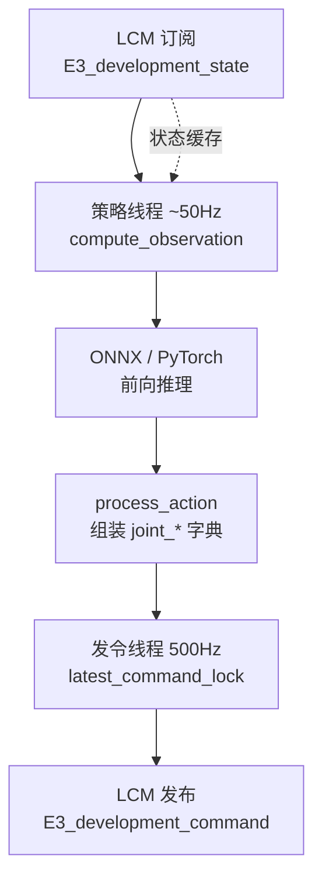

# Yobotics HumanoidE3 外接算法模板（LCM）

本模板用 LCM 与 WalkE3-Controller 的 DEVELOPMENT 模式对接，提供 AlgorithmBase 双线程（约 50Hz 推理与 500Hz 发令）与 ONNX/PyTorch 加载示例。

**定位**：把「**状态机内 RL**」与「**外接 Python 算法**」解耦：模板通过 **LCM** 订阅 `development_state_t`、发布 `development_command_t`，并在 `AlgorithmBase` 内固定 **50Hz 推理 + 500Hz 指令刷新** 的双线程节奏；示例 `dance_algorithm` 演示 ONNX + `.npz` 动作序列混合管线。

## 核心机制（工程切片）

- **观测/动作契约**：子类必须实现 `compute_observation(state)` 与 `process_action(state, action)`；`process_action` 内用 `latest_command_lock` 更新 `latest_command` 字典以适配下游关节分组。
- **模型元数据**：可选从 ONNX metadata 读取 `num_actions`、`default_joint_pos`、`joint_stiffness` 等，减少 YAML 重复配置。
- **RL 模式标志**：`rl_mode.is_rl_mode` 控制是否由状态机侧承担踝部扭矩等细分逻辑（README 语义摘要）。

## 流程总览

## 常见误区或局限

- **通道与 robot_id**：`config.yaml` 中 `state_channel` / `command_channel` / `robot_id` 必须与状态机一致，否则表现为「无状态」或指令被丢弃。
- **关节顺序**：README 给出 21 维标准顺序；若模型导出顺序不同，必须在观测与动作两侧同时做映射。

## 与其他页面的关系

- **[WalkE3 控制器](./jackhan-walke3-controller.md)**：模板所对接的宿主进程与模式切换语义。
- **[强化学习](../methods/reinforcement-learning.md)**：策略侧常见输出为关节目标或残差，本模板聚焦部署壳而非训练。

## 参考来源

- [Algorithm_Template_For_Developer 仓库归档](../../sources/repos/jackhan-algorithm-template-for-developer.md)

## 关联页面

- [WalkE3-Controller（人形 RL 部署与 FSM）](./jackhan-walke3-controller.md)
- [JackHan-Sdu WalkE3 / HumanoidE3 工具链生态](./jackhan-walke3-e3-ecosystem.md)
- [强化学习](../methods/reinforcement-learning.md)

## 推荐继续阅读

- 上游仓库 README：<https://github.com/JackHan-Sdu/Algorithm_Template_For_Developer>
