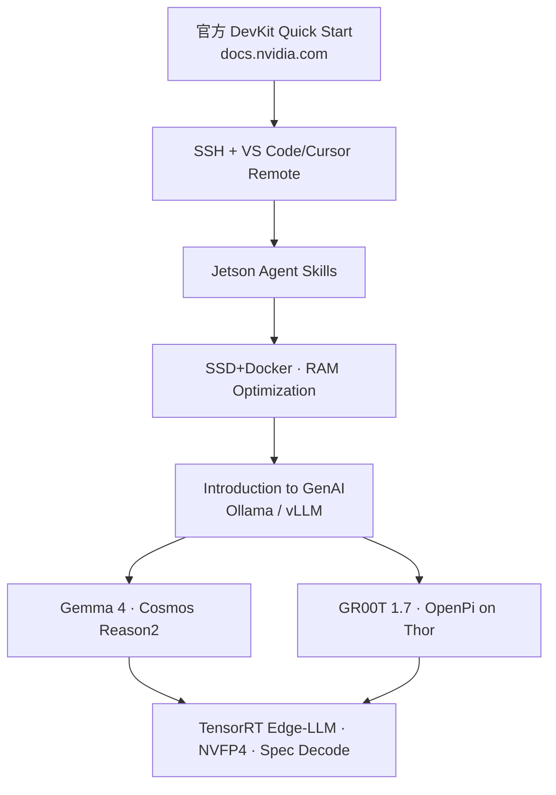

# Jetson AI Lab（边缘 AI 教程 hub）

**Jetson AI Lab**（[教程索引](https://www.jetson-ai-lab.com/tutorials/)，[Getting Started](https://www.jetson-ai-lab.com/tutorials/getting-started-with-jetson/)）是 NVIDIA 为 **Jetson Orin/Thor** 整理的 **2.0 版分步教程站**：从 DevKit 刷机与 **Remote-SSH（VS Code/Cursor）** 上手，到 **LLM/VLM/VLA** 机载部署、**TensorRT 量化** 与 **GTC workshop**。与 [JetPack](./nvidia-jetson.md) 文档分工：JetPack 定义 **BSP + SDK 组件**；AI Lab 教 **怎么在板上跑模型**。

## 一句话定义

**Jetson 机载 AI 的「配方站」——按 Getting Started → GenAI → VLM/VLA → 优化 顺序抄官方教程，把 GR00T、Cosmos Reason、Gemma 4 等跑到 Orin/Thor 上。**

## 英文缩写速查

| 缩写 | 英文全称 | 简要说明 |
|------|----------|----------|
| VLM | Vision-Language Model | Gemma 4、Cosmos Reason2 等视觉–语言教程分区 |
| VLA | Vision-Language-Action | GR00T 1.7、OpenPi π₀.₅ Thor 部署教程 |
| BSP | Board Support Package | Agent **BSP Skills** 覆盖刷机前 pinmux/PCIe 等 |
| OE4T | OpenEmbedded for Tegra | JetPack 7.2 **Yocto** 预构建镜像路径 |
| NVFP4 | NVIDIA FP4 量化格式 | Thor 上 GR00T/OpenPi/Model Optimizer 教程常用 |
| TRT | TensorRT | Edge-LLM、NanoOWL 等优化运行时 |

## 为什么重要

- **补 JetPack 文档与机器人栈之间的「第一步」：** [NVIDIA Jetson](./nvidia-jetson.md) 页讲硬件/栈；AI Lab 给出 **可复制的 SSH → Docker → vLLM** 路径（见 Getting Started）。
- **Physical AI 模型落地入口：** VLA 分区直接链 [Isaac GR00T 1.7 on Thor](https://www.jetson-ai-lab.com/tutorials/)；VLM 分区链 **Cosmos Reason2** — 与本库 [Cosmos](../entities/cosmos-3.md) 生态对齐。
- **Agentic 开发：** **Jetson Agent Skills**（Device + BSP）与 JetPack 7.2 **NemoClaw** 单命令安装同属官方 agentic 叙事；教程站是 skills 的使用说明入口。
- **Thor 新能力集中展示：** GTC 2026 workshop、TensorRT Edge-LLM、NVFP4 量化、Multi-Modal AI Studio 等 **优先 Thor** 教程集中在此。

## 核心原理

### 推荐学习路径

### 教程分区（2026-09-06 索引）

| 分区 | 教程数 | 机器人/Physical AI 相关 |
|------|--------|-------------------------|
| Getting Started | 6 | Introduction；Getting Started；**Agent Skills**；Yocto JP7.2；SSD+Docker；RAM |
| Fundamentals | 3 | GenAI intro；Benchmarking；Ollama |
| VLM | 2 | Gemma 4；**Cosmos Reason2** + Live VLM WebUI |
| **VLA** | 2 | **Isaac GR00T 1.7 Thor**；OpenPi π₀.₅ Thor |
| Applications | 6 | Multi-Modal AI Studio；NanoOWL；OpenClaw/NemoClaw；Reachy Mini |
| Model Optimization | 5 | Fine-tune；**TensorRT Edge-LLM**；Model Optimizer；Speculative Decoding |
| Workshops | 3 | **GTC 2026 Thor**；GTC DC 2025；Hackathon |

## 工程实践

| 步骤 | 做法 |
|------|------|
| **首连** | Orin DevKit USB-C 常可用 **`192.168.55.1`**；配 Wi-Fi/Ethernet 后 `hostname -I` 取局域网 IP |
| **IDE** | 安装 **Remote-SSH**（Cursor 内置）；`~/.ssh/config` 写 `Host jetson` 一键连 |
| **Agent** | 读 **Jetson Agent Skills** 教程 — Device 侧跑在板子；BSP 侧在 **刷机前主机** |
| **容器** | 站点 **Browse All Jetson Containers** 查 NGC/L4T 兼容镜像 |
| **大模型内存** | 先跟 **RAM Optimization**（关 GUI、swap）再跑 8B+ VLM |
| **Thor VLA** | 跟 VLA 分区 + [TensorRT](../entities/tensorrt.md) NVFP4 教程；核对 **SBSA/CUDA 13** 安装器 |

开源结论（2026-09-06）：教程聚合 **开源模型与示例仓库**；**JetPack/Jetson Linux** 仍为商业 SDK（见 [`nvidia-jetpack.md`](../../sources/sites/nvidia-jetpack.md)）。

## 局限与风险

- **硬件绑定：** 多数 VLA/大 VLM 教程面向 **Orin 8GB+ / Thor**；Orin Nano 4GB 需严格跟 RAM/量化教程。
- **JetPack 版本漂移：** Yocto Quick Start 写 **JetPack 7.2**；刷机与内核细节以 [r39.2 Developer Guide](https://docs.nvidia.com/jetson/archives/r39.2/DeveloperGuide/) 为准。
- **非 Isaac 训练课：** 不替代 [Isaac Lab](./isaac-lab.md) 仿真训练；专注 **边缘推理与部署**。
- **站点 2.0 归档：** 旧教程在 archive；链接可能变动，以 `/tutorials/` 索引为准。

## 关联页面

- [NVIDIA Jetson 平台](./nvidia-jetson.md) — 硬件谱系 + JetPack 7 栈
- [Jetson Orin NX](./jetson-orin-nx.md) — 四足/轻量机载常用模组
- [Isaac GR00T](./isaac-gr00t.md) — VLA 教程对应平台
- [TensorRT](./tensorrt.md) — Thor NVFP4 / Edge-LLM 教程后端
- [NVIDIA Physical AI Learning](./nvidia-physical-ai-learning.md) — 更广 Physical AI 课程门户
- [ORT vs MNN vs TensorRT](../comparisons/onnxruntime-vs-mnn-vs-tensorrt.md)
- [Hardware-in-the-Loop](../concepts/hardware-in-the-loop.md)
- [VLA](../methods/vla.md)

## 参考来源

- [Jetson AI Lab 教程站摘录](../../sources/sites/jetson-ai-lab.md)
- [NVIDIA JetPack 产品页摘录](../../sources/sites/nvidia-jetpack.md)
- [Jetson Linux r39.2 Developer Guide 摘录](../../sources/sites/jetson-linux-r392-developer-guide.md)
- [Jetson Embedded Systems 门户](../../sources/sites/nvidia-jetson-embedded-systems.md)

## 推荐继续阅读

- [Getting Started with Jetson](https://www.jetson-ai-lab.com/tutorials/getting-started-with-jetson/)
- [Jetson AI Lab Tutorials 索引](https://www.jetson-ai-lab.com/tutorials/)
- [NVIDIA JetPack](https://developer.nvidia.com/embedded/jetpack)
- [Jetson Linux Developer Guide r39.2](https://docs.nvidia.com/jetson/archives/r39.2/DeveloperGuide/)
