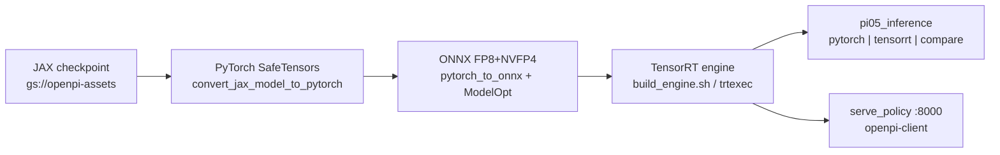
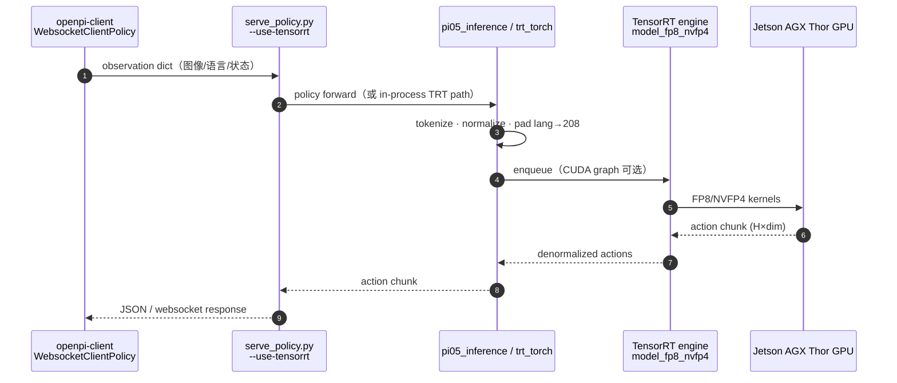

# OpenPi π₀.₅ on Jetson Thor（官方部署教程）

[Jetson AI Lab](https://www.jetson-ai-lab.com/tutorials/openpi_on_thor/) 教程 **OpenPi π₀.₅ on Jetson Thor** 给出在 **Jetson AGX Thor** 上部署 Physical Intelligence **[openpi](https://github.com/Physical-Intelligence/openpi)** **π₀.₅** 的 **逐步可复现** 配方：Docker 环境、checkpoint 转换、**NVIDIA ModelOpt** 量化导出与 **TensorRT** 编译，并支持 **OpenPI 兼容 WebSocket 策略服务**。

## 一句话定义

跟做 NVIDIA 官方 Thor 教程，把 π₀.₅ 从 JAX 权重压到 **TensorRT FP8+NVFP4** 引擎，在 `pi05_libero` 上拿到 **~49 ms** 级单步推理，并用 `openpi-client` 远程拉策略。

## 英文缩写速查

| 缩写 | 英文全称 | 简要说明 |
|------|----------|----------|
| VLA | Vision-Language-Action | π₀.₅ 所属多模态策略族 |
| TRT | TensorRT | Thor 上编译 ONNX 为低延迟 engine |
| NVFP4 | NVIDIA 4-bit FP 量化 | 教程 LLM 层加速路径（与 FP8  attention 组合） |
| QDQ | Quantize-Dequantize | ONNX 中 attention matmul 插入的量化节点 |
| GCS | Google Cloud Storage | OpenPI 公开 checkpoint 托管 |

## 为什么重要

- **官方 Thor VLA 基线：** 与 [Isaac GR00T on Thor](./isaac-gr00t.md) 并列 [Jetson AI Lab](./jetson-ai-lab.md) VLA 分区；团队若已选 **π 系 openpi** 而非 GR00T，这是 NVIDIA 背书的第一条完整机载链。
- **量化 + TRT 可抄：** 明确 **BF16 原生、禁 FP16 导出**、FP8/NVFP4 取舍与 **cosine ~0.99** 验收方式——比只看博客数字更易工程复现。
- **与 APXInf 形成选型对照：** [APXInf](./apxinf.md) 走 **Rust 专用引擎 + OpenPI serve**（Thor FP8 P50 **~26–41 ms**）；本教程走 **upstream openpi + ModelOpt + trtexec**（教程自报 **~49 ms** total）。二者 **协议兼容**，权重与 norm 仍来自 OpenPI。
- **生产形态清晰：** Step 13 扩展 `serve_policy.py` 的 TensorRT 路径，机器人侧仍用 **`WebsocketClientPolicy`**。

## 流程总览

## 工程实践

| 主题 | 要点 |
|------|------|
| **环境** | JetPack **7.2**、CUDA **13+**、Docker **28+**；镜像 `openpi-pi0.5:l4t-jp7.2` |
| **Pin commit** | openpi **`15a9616`**；Thor 脚本经 **`download.sh`** 注入（**非 upstream 默认树**） |
| **配置** | `pi05_libero` / `pi05_droid` / `pi05_aloha`；engine 构建时 **language seq len 208**（运行时 pad/truncate） |
| **性能模式** | `nvpmodel -m 0` + `jetson_clocks`；缓存挂载 `~/.cache/openpi` 避免重复转换 |
| **Transformers** | 必须复制 `transformers_replace`（含 Gemma ONNX/TRT 维度修复） |
| **权重** | **~6 GB+**；建议 NVMe |

### 延迟对照（教程自测，`pi05_libero`，H=10）

| 后端 | Total latency | 备注 |
|------|---------------|------|
| PyTorch BF16 + `torch.compile` | ~132 ms | 基线 |
| TensorRT FP8 | ~54 ms | cosine 更稳 |
| TensorRT FP8 + NVFP4 | ~49 ms | 教程推荐最快路径 |

### 源码运行时序图

对齐教程 **TensorRT 推理 + 可选 WebSocket serve**（Thor 部署脚本在 pin commit + `download.sh` 之后）：

## 局限与风险

- **Thor + JP 7.2 绑定：** 教程在 **AGX Thor DevKit** 验证；Orin 需另查容器与算力是否满足 **~6 GB** 权重与 TRT 编译内存。
- **补丁维护：** Thor 脚本不在 **Physical-Intelligence/openpi** 主分支；upstream 漂移时需重新 pin 或自行合并 `download.sh` 补丁。
- **固定 language 长度：** 超长 prompt（常规 >208 token）会被截断；极长指令需改 engine 构建参数。
- **非训练课：** 只覆盖 **推理与 serve**；微调仍走 openpi 官方文档与 [π₀ 方法页](../methods/π0-policy.md)。

## 关联页面

- [Jetson AI Lab](./jetson-ai-lab.md) — 教程 hub 与 VLA 分区索引
- [NVIDIA Jetson](./nvidia-jetson.md) — Thor 硬件与 JetPack
- [TensorRT](./tensorrt.md) — NVFP4 / trtexec 背景
- [APXInf](./apxinf.md) — 第三方低延迟 OpenPI-compatible 引擎
- [π₀ (Pi-zero) 策略](../methods/π0-policy.md) — openpi 方法入口
- [VLA](../methods/vla.md) — 通才 VLA 脉络
- [VLA 真机部署指南](../queries/vla-deployment-guide.md)

## 参考来源

- [Jetson OpenPi π₀.₅ on Thor 教程归档](../../sources/courses/jetson_openpi_pi05_on_thor.md)
- [openpi 仓库归档](../../sources/repos/openpi.md)
- [Jetson AI Lab 站点摘录](../../sources/sites/jetson-ai-lab.md)

## 推荐继续阅读

- [OpenPi π₀.₅ on Jetson Thor（官方教程）](https://www.jetson-ai-lab.com/tutorials/openpi_on_thor/)
- [Physical Intelligence openpi](https://github.com/Physical-Intelligence/openpi)
- [NVIDIA ModelOpt 文档](https://docs.nvidia.com/tensorrt-model-optimizer/)
