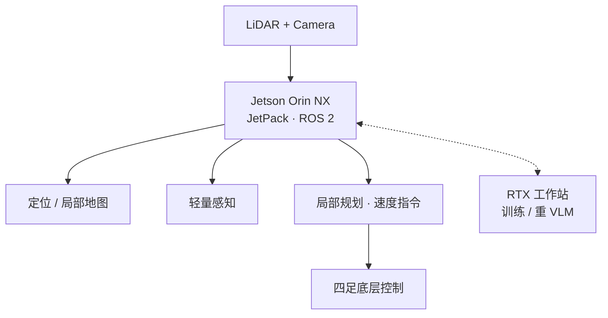

# NVIDIA Jetson Orin NX

**Jetson Orin NX** 是 NVIDIA **Jetson Orin** 产品线中的边缘 AI 模组形态，面向移动机器人机载推理：在功耗与体积约束下运行 CUDA/TensorRT 加速的感知、定位与轻量策略模块。

## 一句话定义

**装在机器人身上的 NVIDIA GPU 计算机——负责实时感知与中低算力推理，把重训练和大模型核验留给工作站或云。**

## 英文缩写速查

| 缩写 | 英文全称 | 简要说明 |
|------|----------|----------|
| Orin NX | Jetson Orin NX | 本页机载模组 |
| JetPack | NVIDIA JetPack SDK | 驱动、CUDA、TensorRT、Ubuntu 根文件系统捆绑 |
| TensorRT | TensorRT | NVIDIA 推理优化运行时 |
| CUDA | Compute Unified Device Architecture | GPU 通用计算平台 |
| TOPS | Tera Operations Per Second | INT8 等算力标称单位 |
| ROS 2 | Robot Operating System 2 | 常用机器人中间件 |

## 为什么重要

- **课程硬件标配：** 四足×VLN 实战营每组四足配备 **LiDAR + 相机 + Orin NX**，并配对 **RTX 4070** 工作站——需要独立节点说明机载职责边界。
- **部署现实：** 多数四足语义建图、Isaac ROS、ONNX 策略回放都假设 Jetson 级算力（参见 [FindAnything](./findanything.md) 的 Orin NX 演示叙述）。
- **选型锚点：** 决定哪些模块必须 TensorRT 化、哪些 VLM 必须离板。

## 核心结构/机制

| 角色 | 典型跑在 Orin NX | 典型跑在 RTX 工作站 |
|------|------------------|---------------------|
| 传感 | 相机/LiDAR 驱动、同步、压缩 | 数据集回放与标定工具 |
| 定位建图 | LIO / VIO / 局部代价地图 | 大场景离线建图优化 |
| 语义 | 轻量检测/分割、跟踪 | SAM3/BLIP-2/大 VLM 核验 |
| 导航 | 局部规划、cmd_vel 桥 | 全局仿真评测（Habitat） |
| 学习 | ONNX/TensorRT 策略推理 | RL/VLA 训练与蒸馏 |

## 工程实践

| 项 | 建议 |
|----|------|
| 软件基线 | 使用匹配模组的 **JetPack**；ROS 2 Humble/Jazzy 与厂商镜像对齐 |
| 推理栈 | 优先 [TensorRT](../comparisons/onnxruntime-vs-mnn-vs-tensorrt.md)；其次 ONNX Runtime GPU |
| 热设计 | 持续推理注意外壳/风扇与节流；记录 GPU 频率与延迟 |
| 与四足集成 | 以太网/USB 接传感器；控制口走厂商 SDK 或 ROS bridge；急停独立于 GPU 进程 |
| Isaac 生态 | [Isaac ROS Visual SLAM](./isaac-ros-visual-slam.md) 等组件以 Jetson 为一级目标平台 |

## 局限与风险

- **不是训练卡：** 大模型 SFT/RL 仍应在桌面 GPU/集群；Orin 超载会导致导航掉帧。
- **型号差异：** Orin Nano / NX / AGX 算力与接口不同，迁移时重测延迟预算。
- **供电：** 峰值推理 + 传感器同时工作时需核对机器人电源分配。

## 关联页面

- [NVIDIA Jetson 平台家族](./nvidia-jetson.md) — Orin NX 所属产品线总览与跨代选型
- [Jetson AI Lab](./jetson-ai-lab.md) — Orin 机载 LLM/VLM 部署教程与 jetson-containers
- [边缘–云机器人](../concepts/edge-cloud-robotics.md)
- [LiDAR 传感](../concepts/lidar-sensing.md)
- [四足机器人](./quadruped-robot.md)
- [四足×VLN 实战营总览](../overview/quadruped-vln-embodied-workshop.md)
- [RoamFlow](./paper-roamflow.md) — Go2 + Orin NX 16GB 机载 image-goal 导航（~37 ms 推理）
- [ONNX Runtime vs MNN vs TensorRT](../comparisons/onnxruntime-vs-mnn-vs-tensorrt.md)

## 参考来源

- [NVIDIA Jetson Embedded Systems 门户归档](../../sources/sites/nvidia-jetson-embedded-systems.md)
- [NVIDIA Jetson Orin 产品页归档](../../sources/sites/nvidia-jetson-orin-nx.md)
- [四足×VLN 实战营课程大纲](../../sources/courses/quadruped_vln_embodied_workshop_2day.md)

## 推荐继续阅读

- NVIDIA 嵌入式 Orin 入口：<https://developer.nvidia.com/embedded/jetson-orin>
