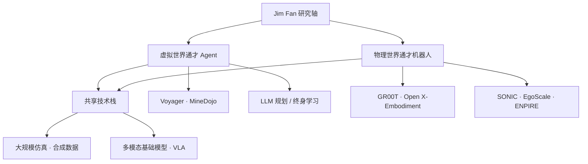

# Linxi "Jim" Fan（范林熹）

## 一句话定义

**Linxi "Jim" Fan** 是 **NVIDIA 具身智能与通才 agent** 方向的 **PI 级研究科学家**：与 [Yuke Zhu](https://yukezhu.me/) 共同领导 [NVIDIA GEAR Lab](./nvidia-gear-lab.md)，把 **游戏/仿真中的 Foundation Agents（Voyager、MineDojo）** 与 **通用人形基础模型（GR00T、SONIC、EgoScale 等）** 放在同一「虚拟与真实多世界通才」叙事下；Stanford Vision Lab 博士（导师 Fei-Fei Li），职业轨迹横跨 **OpenAI 首位实习生（World of Bits）→ 视觉 agent 规模化 RL → NVIDIA 具身基础模型**。

## 英文缩写速查

| 缩写 | 英文全称 | 简要说明 |
|------|----------|----------|
| GEAR | Generalist Embodied Agent Research | NVIDIA 具身通才智能体研究组，Fan 与 Zhu 共同领导 |
| VLA | Vision-Language-Action | 视觉-语言-动作多模态基础策略，GR00T 等方向的核心范式 |
| LLM | Large Language Model | 大语言模型，Voyager/Eureka 等 agent 与奖励设计的关键组件 |
| RL | Reinforcement Learning | 通过与环境交互学习策略，贯穿 SURREAL、SECANT 与机器人训练栈 |
| Sim2Real | Simulation to Real | 把仿真策略迁移真机，GEAR 人形管线（SONIC、ASAP 等）的常见工程目标 |

## 为什么重要

- **GEAR 组的「人物锚点」**：本库多条 **人形 VLA、WBC、真机 autoresearch、人视频 scaling** 页面（如 [GR00T N1](./paper-hrl-stack-34-gr00t_n1.md)、[SONIC](../methods/sonic-motion-tracking.md)、[EgoScale](../methods/egoscale.md)、[ENPIRE](../methods/enpire.md)）共享 GEAR 署名网络；理解 Fan 的公开议程有助于判断 **哪些工作是同一研究组长期主线、哪些是合作外延**。
- **「通才 agent」叙事的一致提出者**：个人站与 GEAR 门户均强调 *generally capable agents in many worlds, virtual and real*——把 **Minecraft agent、LLM 奖励设计、多模态 manipulation、人形 foundation model** 视为同一问题族的不同实例，而非孤立项目。
- **社区高引用论文集群的作者节点**：Google Scholar 上 Voyager、Open X-Embodiment、Eureka、MineDojo、GR00T N1 等条目引用量处于领域前列，是后续单篇论文 ingest 与 [Foundation Policy](../concepts/foundation-policy.md) 讨论的自然索引。

## 核心信息

| 字段 | 内容 |
|------|------|
| 机构 | 英伟达（NVIDIA）Research；Lead of AI Agents Initiative |
| 研究组 | [NVIDIA GEAR Lab](./nvidia-gear-lab.md)（与 Yuke Zhu 共同领导） |
| 教育 | Stanford Ph.D. in CS（Fei-Fei Li）；Columbia B.A.（2016 Valedictorian） |
| 公开使命 | 在物理世界（机器人）与虚拟世界（游戏、仿真）构建通才具身智能体 |

## 职业与研究脉络（归纳）

1. **早期（Columbia → Baidu → OpenAI → MILA）**：语音（DeepSpeech 2）、半监督学习（Ladder Network）、**OpenAI 首位实习生** 时期共同设计 **World of Bits**（像素级 web agent，ICML 2017）——早于 OpenAI 后期 LLM 主线，但预示 **「环境即接口」的 agent 范式**。
2. **Stanford 博士（2016–2021）**：在 Fei-Fei Li 组推进 **视觉 agent 规模化训练与部署**；博士论文 *Training and Deploying Visual Agents at Scale*；产出 SURREAL（分布式 RL）、SECANT（零样本视觉策略泛化）、iGibson 等 **仿真 infra + policy learning** 组合。
3. **NVIDIA Research（2021–至今）**：领导 **MineDojo**（NeurIPS 2022 Outstanding Paper）、**Voyager**、**Eureka**、**VIMA** 等 **Foundation Agents / 多模态 manipulation** 标志性工作；与 GEAR 团队推进 **GR00T N1、SONIC、EgoScale、ENPIRE、ASPIRE** 等 **通用人形与真机闭环** 系统论文。

## 代表性工作轴（技术向）

| 轴线 | 代表工作 | 本库入口 |
|------|----------|----------|
| **Foundation Agents（游戏/仿真）** | Voyager、MineDojo | [NVIDIA GEAR Lab](./nvidia-gear-lab.md) Featured；单篇待深读 ingest |
| **LLM × RL / 奖励** | Eureka | [Reward Design](../concepts/reward-design.md) |
| **多模态 manipulation** | VIMA、Open X-Embodiment | [VLA](../methods/vla.md) |
| **人形通才基础模型** | GR00T N1、SONIC | [GR00T N1](./paper-hrl-stack-34-gr00t_n1.md)、[SONIC](../methods/sonic-motion-tracking.md) |
| **真机策略开发闭环** | ENPIRE、ASPIRE | [ENPIRE](../methods/enpire.md)、[ASPIRE](../methods/aspire.md) |
| **人视频 scaling** | EgoScale | [EgoScale](../methods/egoscale.md) |

## GEAR 合作者网络（本库已索引）

Fan 领导的 GEAR 与 CMU / 产业界人形研究网络高度重叠，本库已有人物节点包括 [Zhengyi Luo](./zhengyi-luo.md)、[Tairan He](./tairan-he.md) 等；阅读 GEAR 系论文时宜同时对照 **作者页职业阶段**（如 He 已转 OpenAI）与 **论文署名机构**。

## 常见误区或局限

- **个人站职位表述 vs 机构档案**：个人站写 *Lead of AI Agents Initiative*，NVIDIA 档案写 *Senior AI Research Scientist*；**以论文与 GEAR 门户为准**理解其当前研究组角色，不必过度解读职级称谓差异。
- **高引用 ≠ 机器人主线**：Scholar 最高引用含 **DeepSpeech 2** 等语音工作，属于早期实习经历；**具身智能相关应以 2018 年后视觉 agent / GEAR 论文为主**。
- **Featured 列表不完整**：个人站与 GEAR 首页只展示子集；SONIC、EgoScale、ENPIRE 等可能 **滞后出现在 Featured**，策展应以 arXiv / 项目页为准。

## 关联页面

- [NVIDIA GEAR Lab](./nvidia-gear-lab.md)
- [GR00T N1 论文实体](./paper-hrl-stack-34-gr00t_n1.md)
- [GR00T-WholeBodyControl](./gr00t-wholebodycontrol.md)
- [SONIC（规模化运动跟踪）](../methods/sonic-motion-tracking.md)
- [EgoScale](../methods/egoscale.md)
- [ENPIRE](../methods/enpire.md)
- [ASPIRE](../methods/aspire.md)
- [VLA](../methods/vla.md)
- [Foundation Policy](../concepts/foundation-policy.md)
- [Reward Design](../concepts/reward-design.md)
- [Zhengyi Luo（罗正宜）](./zhengyi-luo.md)
- [Tairan He（何泰然）](./tairan-he.md)

## 参考来源

- [Jim Fan 个人主页与机构档案原始资料](../../sources/sites/jim-fan.md)

## 推荐继续阅读

- [GEAR 研究组门户](https://research.nvidia.com/labs/gear/)
- [个人主页](https://jimfan.me/)
- [Google Scholar](https://scholar.google.com/citations?user=sljtWIUAAAAJ&hl=en)
- [Voyager 项目页](https://voyager.minedojo.org/)
- [MineDojo 项目页](https://minedojo.org/)
