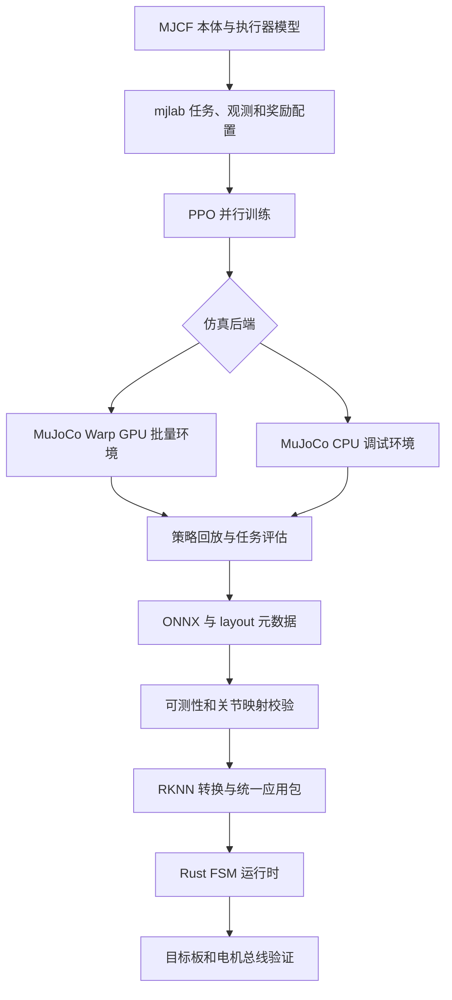

# Jumper 六足机器人与训练部署栈

**Jumper** 是 KingKongRobotics 发布的仿蟹式六足机器人和配套训练工程。其主要价值是把机器人模型、并行仿真、任务奖励、策略训练、导出契约和控制器打包放进可检查的开源工作流，而不只是给出动作演示。

## 一句话定义

**Jumper 是一套从 MuJoCo/mjlab 训练到多模式控制包的六足机器人项目，可用于研究速度跟踪、参考动作残差和编舞策略如何共享仿真与部署接口。**

## 英文缩写速查

| 缩写 | 英文全称 | 简要说明 |
|------|----------|----------|
| RL | Reinforcement Learning | 用奖励驱动策略优化 |
| PPO | Proximal Policy Optimization | Jumper 使用的 on-policy 优化算法 |
| MJCF | MuJoCo XML Format | 机器人、关节、接触和场景的模型描述 |
| MJWarp | MuJoCo Warp | MuJoCo 的 Warp/GPU 批量仿真后端 |
| ONNX | Open Neural Network Exchange | 策略导出格式，供后续部署转换 |
| RKNN | Rockchip Neural Network | Rockchip NPU 模型转换/推理工具链 |

## 为什么重要

- **端到端工程链路可审计。** 可以沿源码追踪任务配置、并行仿真、PPO rollout/update、策略评估、ONNX/layout 与 bundle；部署观测、关节映射和参考轨迹契约都有对应实现。
- **双仿真后端共享任务层。** GPU MuJoCo Warp 用于批量环境，native MuJoCo CPU 路径便于调试。两者复用任务、奖励和 PPO 配置，但物理数值/solver 细节不应假设完全一致。
- **不止一种运动目标。** tripod、jump、dance 暴露速度跟踪、参考动作残差、特定编舞复现三种不同控制问题。
- **体现硬件约束如何进入策略接口。** 22 个线束关节、20/22 维策略、执行器曲线、传感器观测和 wire joint 映射贯穿模型到部署。

## 平台与训练栈

| 层 | Jumper 实现 | 关键判断 |
|---|---|---|
| 本体 | 约 400×400×200 mm 仿蟹六足平台；22 个舵机/线束关节；RK3576 机载计算 | 规格来自仓库硬件文档；重量因工程原型版本不同 |
| 模型 | MuJoCo MJCF、URDF、执行器曲线和传感器配置 | 动力学可信度取决于质量、接触、关节限制和执行器模型是否匹配实物 |
| 环境 | mjlab manager env、奖励、观测、终止和随机化配置 | 任务层定义学习目标，并非仿真器自动提供 |
| 学习 | RSL-RL PPO，多环境 rollout 与策略更新 | 是 on-policy 训练流程，不是通用 RL 算法套件 |
| 运行时 | Rust FSM + policy bundle；包含模式策略、控制映射和关联参考动作 | 统一包将模型和运行模式绑定，缺少伴随资产应被校验拒绝 |
| 目标部署 | ONNX 转 RKNN，目标为 RK3576 NPU | 有脚本/格式路径；项目指南仍未确认板端推理闭环 |

## 流程总览

图中最后一步是验证目标，不代表硬件闭环已经完成。源码导出与打包检查不能替代实际板端控制表现。

## 三类策略为何分开训练

| 任务 | 学习信号 | 策略含义 | 不能混淆的点 |
|---|---|---|---|
| jumper.tripod | 目标线速度/转向速度跟踪奖励 | 学习 tripod 风格六足移动 | 速度跟踪不代表跳跃或舞蹈能力 |
| jumper.jump | 参考跳跃轨迹 + residual policy | 围绕参考动作学习偏差修正 | 参考动作是策略契约的一部分，不是无条件从零学跳 |
| jumper.dance | 对已记录编舞轨迹评分 | 复现一段特定动作序列 | 单条轨迹表现不代表泛化的动作理解能力 |

各任务有独立配置、奖励和 checkpoint；部署 bundle 应携带模式策略与必要参考轨迹。教程中的训练命令以当前任务 ID 和脚本参数为准。

## 训练与部署接口

1. **任务配置**选择 robot asset、动作维度、观测项、奖励权重、episode 终止条件和随机化分布。
2. **仿真**把 manager 层批量张量接口连接到 MuJoCo Warp 或 native MuJoCo；上层任务可复用，接触求解和积分差异仍需单独考虑。
3. **PPO rollout/update**采集动作、奖励、done 和 value，再迭代 actor/critic；训练规模由显存、环境数和仿真吞吐共同约束。
4. **导出**生成 ONNX actor 与 layout.json。布局描述策略观测/动作和关节信息；导出逻辑会检查策略是否依赖硬件当前无法测量的观测。
5. **部署打包**把多个模式策略、FSM、控制映射和需要的参考轨迹绑定进应用包。运行时按关节名称匹配，再转成 wire joint 顺序，不要把 tensor 下标当稳定语义。

## 工程实践

- **先单环境回放，再扩展并行度。** 用 scripts/play.py 检查模型姿态、脚接触、动作尺度和 episode 终止，避免错误模型被高并行度放大。
- **用 CPU/GPU 路径交叉定位。** 小规模 native MuJoCo 易调试；MuJoCo Warp 用于吞吐。遇到轨迹差异时核对 solver、接触和积分配置。
- **部署前读 layout，而非猜观测。** 只有机载传感器或状态估计器能提供的量才适合进入 actor；导出检查本身不验证传感器/状态估计。
- **联合核查关节名和维度。** 线束有 22 个关节，locomotion/jump 用 20 个，dance 可用 22 个；映射依具体 policy contract，而不是固定序号。
- **把参考轨迹当作模型资产。** jump/dance 轨迹和策略版本需要一起管理，避免模型可加载而语义输入缺失。
- **仿真考虑执行器限制。** 仓库提供电机动力学资料；理想位置控制可能高估实际加速度和冲击能力，应对照对应硬件版本的扭矩—转速与热约束。

## 局限与风险

- **规格不是验证。** 仓库列出 RK3576、IMU、相机和 dToF 等配置；项目指南明确 RKNN 机载推理尚未验证，1 kHz 控制 loop 也还没有驱动现场电机总线。部署应表述为已实现的转换/打包路径。
- **仿真后端不保证物理完全一致。** Warp 与 CPU 后端存在数值/能力差异；比较结果要记录 backend、solver 与版本。
- **地图和皮肤不是任意训练资产。** 外观/场景工具属于独立 jumper-design 仓库；map/skin 的导入、训练和 replay 各有边界，不能默认任意地图可训练或 mesh 自动对齐。
- **泛化证据有限。** 仓库提供一台机器人及若干任务，没有独立论文式跨本体基准、消融或普适策略泛化证据；不要从 demo 推广普适结论。
- **许可证需拆开看。** 主仓 Apache-2.0 不自动覆盖第三方代码、模型或素材，需查 NOTICE 和上游许可。
- **真机安全需另行验证。** 仿真回放和 bundle 校验不涵盖急停、通信丢失、电流/温升、碰撞区或人员安全。

## 关联页面

- [Locomotion](../tasks/locomotion.md) — 开源六足策略训练实例
- [mjlab](./mjlab.md) — manager 环境和并行训练层
- [MuJoCo Warp](./mujoco-warp.md) — GPU 仿真后端及 CPU 对照
- [RSL-RL](./rsl-rl.md) — PPO rollout/update 框架
- [PPO](../methods/ppo.md) — on-policy 优化机制
- [Sim2Real](../concepts/sim2real.md) — 仿真模型、执行器与真机验证边界

## 参考来源

- [Jumper 仓库归档](../../sources/repos/kingkong_jumper.md)
- [Jumper 官方产品页归档](../../sources/sites/kingkong_jumper.md)

## 推荐继续阅读

- [KingKongRobotics/jumper README](https://github.com/KingKongRobotics/jumper)
- [项目指南](https://github.com/KingKongRobotics/jumper/blob/main/docs/PROJECT_GUIDE.zh.md)
- [训练教程](https://github.com/KingKongRobotics/jumper/blob/main/docs/TUTORIAL.zh.md)
- [仿真设计说明](https://github.com/KingKongRobotics/jumper/blob/main/docs/DESIGN.md)
- [部署文档](https://github.com/KingKongRobotics/jumper/blob/main/deploy/README.zh.md)
- [硬件规格](https://github.com/KingKongRobotics/jumper/blob/main/docs/HARDWARE.zh.md)
- [King Kong Tech 产品页](https://kingkong.tech/en/jumper)
