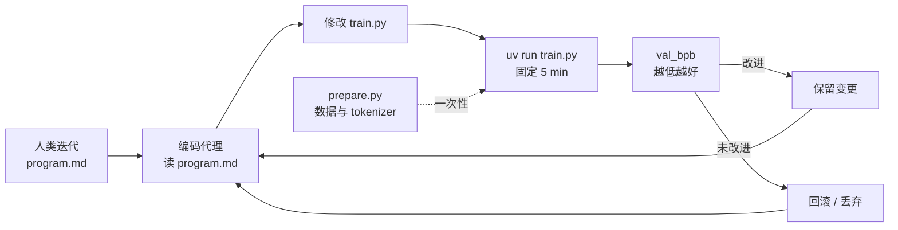

# autoresearch（karpathy/autoresearch）

**autoresearch** 是 [Andrej Karpathy](https://github.com/karpathy) 的 [GitHub 仓库](https://github.com/karpathy/autoresearch)：在 [nanochat](https://github.com/karpathy/nanochat) 的 **单 GPU 简化栈** 上，让 **编码代理** 通宵自主做 LLM 训练实验 — 改代码、跑固定时长训练、看验证指标、保留或丢弃、重复。README 的隐喻是：未来研究由天空中的代理群完成，而本仓记录 **一切如何开始**。

## 一句话定义

用 **极小三文件边界**（固定 `prepare.py`、可编辑 `train.py`、人类编写的 `program.md`）把 **ML 实验搜索** 委托给代理，以 **固定墙钟预算 + 单一可比指标（val_bpb）** 约束自主迭代，而非让人类直接改训练代码。

## 英文缩写速查

| 缩写 | 英文全称 | 简要说明 |
|------|----------|----------|
| BPB | Bits Per Byte | 验证集每字节比特数；本仓主指标，越低越好 |
| GPT | Generative Pre-trained Transformer | `train.py` 内训练的解码器语言模型族 |
| LLM | Large Language Model | 训练对象；代理通过改 `train.py` 优化其验证损失 |
| GPU | Graphics Processing Unit | 当前实现要求单张 NVIDIA GPU（README 在 H100 验证） |

## 为什么重要（对本知识库读者）

- **S3 可触摸样本：** [AI Auto-Research](../concepts/ai-auto-research.md) 综述强调「研究代码弱于 SWE、验证慢于生成」；autoresearch 用 **单文件编辑面 + 固定 5 分钟 eval** 把风险框在可审 diff 与可比实验内，是 **Coding & Experimentation** 阶段的教科书级最小实现。
- **人机分工清晰：** 人类不写 `train.py`，而迭代 **`program.md`** — 与 [LLM Wiki（Karpathy）](../references/llm-wiki-karpathy.md) 的「把组织知识写成 markdown 契约」、[Superpowers](./superpowers-obra.md) 的 `SKILL.md` 同构，但目标域是 **超参/架构搜索** 而非软件交付 TDD。
- **与机器人 ML 的间接关系：** 本仓训练 LLM，但 **固定预算实验环、单一验证指标、代理改训练脚本** 的结构可迁移到 sim 中策略训练、小模型 ablation 或 benchmark 复现 — 前提是环境能提供 **自动 reset + 可比 metric**（参见 [ENPIRE](../methods/enpire.md) 的真机 autoresearch 叙事）。
- **Skill 域映射：** [Darwin Skill](./darwin-skill.md) 将同一 **keep/revert 棘轮** 映射到 `SKILL.md` 优化（9 维评分 + 独立评委 + 人在回路），与 [Nuwa](./nuwa-skill.md) / [Cangjie](./cangjie-skill.md) 的「造 skill」形成闭环。

## 核心结构

| 文件 | 角色 | 修改者 |
|------|------|--------|
| `prepare.py` | 常量、数据下载、BPE tokenizer、 dataloader / eval 工具 | **固定**（代理不改） |
| `train.py` | GPT 模型、Muon+AdamW 优化器、训练环 | **代理**（唯一 Python 编辑面） |
| `program.md` | 单代理实验指令与组织逻辑 | **人类**（README 称「研究组织代码」） |

### 实验契约

- **时间预算：** 每次训练 **恰好 5 分钟墙钟**（不含启动/编译），使不同架构/ batch 改动仍可比；约 12 runs/h，过夜 ~100 runs。
- **主指标：** **val_bpb** — validation bits per byte；与 `vocab_size` 无关，便于架构间公平比较。
- **范围：** 单 GPU、无分布式、依赖极简（PyTorch + 少量包）；非 H100 可参考 README 的 TinyStories / 降 `DEPTH` 等 fork 指南。

### 流程总览

## 与相关范式的对照

| 维度 | autoresearch | LLM Wiki（本库） | Superpowers | Darwin Skill |
|------|--------------|------------------|-------------|--------------|
| 人类编写 | `program.md` | `schema/`、`AGENTS.md`、ingest 规范 | `SKILL.md` 技能库 | checkpoint 确认 |
| 代理修改 | `train.py`（训练代码） | `wiki/`、`sources/` 映射 | 应用代码 + 测试 | 待优化 `SKILL.md` |
| 验证 | val_bpb + 固定时长 | `make ci-preflight`、lint | TDD、code review | 9 维分 + test-prompts |
| 目标 | 更优 LLM 训练配置 | 知识编译与交叉引用 | 可交付软件质量 | 更优 skill rubric |

## 常见误区

- **误区 1：stars 多 = 已解决科研自动化。** 仓库刻意极小；成功依赖 **GPU、数据准备、代理权限与 `program.md` 质量**，并非开箱端到端发论文。
- **误区 2：应直接改 `prepare.py` 扩平台。** README 明确 `prepare.py` 不在代理编辑面内；跨平台应 fork 或参考完整 nanochat，而非破坏可比契约。
- **误区 3：val_bpb 低即「更好模型」可泛化。** 固定 5 分钟预算优化的是 **该平台上的短时训练配置**；跨硬件/数据集的排行榜意义有限。
- **误区 4：`program.md` 只是 README 附录。** 它是 **可版本化的研究组织程序** — 迭代它等价于迭代「自主研究部门」的行为，而非润色提示词。

## 与其他页面的关系

- [AI Auto-Research](../concepts/ai-auto-research.md) — 生命周期框架；本仓落 **S3** 与 **Explore→Execute→Verify** 分层。
- [Andrej Karpathy](./andrej-karpathy.md) — 作者；nanochat / Zero to Hero 教育栈的实验自动化延伸。
- [LLM Wiki（Karpathy 模式）](../references/llm-wiki-karpathy.md) — markdown 契约驱动的人机协作。
- [Superpowers（obra）](./superpowers-obra.md) — 另一类 agent 技能与交付纪律。
- [Hermes Agent](./hermes-agent.md) — 常驻代理运行时；可与 autoresearch 组合为「长驻代理 + 夜间实验环」。
- [ENPIRE](../methods/enpire.md) — 机器人领域的物理 autoresearch 对照（真机 reset + 策略改进）。
- [Darwin Skill](./darwin-skill.md) — autoresearch 机制在 Agent Skill 优化域的映射。
- [Nuwa Skill](./nuwa-skill.md) / [Cangjie Skill](./cangjie-skill.md) — 造 skill 上游，与达尔文「进化」闭合。

## 参考来源

- [sources/repos/karpathy-autoresearch.md](../../sources/repos/karpathy-autoresearch.md)

## 关联页面

- [AI Auto-Research](../concepts/ai-auto-research.md)
- [Andrej Karpathy](./andrej-karpathy.md)
- [LLM Wiki（Karpathy 模式）](../references/llm-wiki-karpathy.md)
- [Superpowers（obra）](./superpowers-obra.md)
- [Hermes Agent](./hermes-agent.md)
- [ENPIRE](../methods/enpire.md)
- [Darwin Skill](./darwin-skill.md)
- [Nuwa Skill](./nuwa-skill.md)
- [Cangjie Skill](./cangjie-skill.md)

## 推荐继续阅读

- [karpathy/autoresearch](https://github.com/karpathy/autoresearch) — 仓库 README 与 `program.md` 基线
- [karpathy/nanochat](https://github.com/karpathy/nanochat) — 完整训练栈与多平台参考
- Karpathy 项目说明推文 — [post 1](https://x.com/karpathy/status/2029701092347630069) · [post 2](https://x.com/karpathy/status/2031135152349524125)
- Kong et al., *AI for Auto-Research* — [arXiv:2605.18661](https://arxiv.org/abs/2605.18661)
