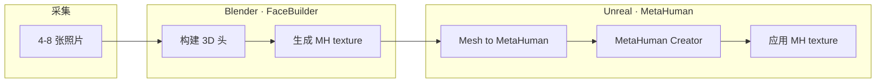

# KeenTools FaceBuilder for Blender

**KeenTools FaceBuilder for Blender** 是 **KeenTools** 的 **Blender 插件**：从 **少量照片**（或非中性表情图像）在 DCC 内构建 **写实 3D 头部**，提供自动对齐、实时雕刻预览、多视角纹理融合与 LOD 导出；并可输出 **MetaHuman 兼容 MH texture**、**ARKit FACS blendshape** 与 **FaceTracker** 面部表演。在机器人研究与工程中，它更常出现在 **人类化身外观、遥操作界面、演示级数字孪生** 链路上，而非替代 [MuJoCo](./mujoco.md) / [Isaac Lab](./isaac-gym-isaac-lab.md) 等控制级仿真后端。

## 英文缩写速查

| 缩写 | 英文全称 | 简要说明 |
|------|----------|----------|
| DCC | Digital Content Creation | 数字内容创作软件；FaceBuilder 宿主为 Blender |
| FACS | Facial Action Coding System | 面部动作编码；插件内置 51 个 ARKit 兼容 blendshape |
| MH | MetaHuman | Epic UE 生态高保真数字人平台 |
| LOD | Level of Detail | 高/中/低多边形级别，雕刻或导出时切换 |
| MoCap | Motion Capture | 动作捕捉；FaceTracker 用参考视频驱动匹配头部几何 |
| ARKit | Apple ARKit | Apple 面部跟踪标准；Live Link Face 等工具兼容 |

## 为什么对机器人栈重要

1. **低成本人类外观入口**：遥操作、人机协作演示、具身 AI 宣传片中常需 **可信 operator / 人类参考外观**；FaceBuilder 用 **4–8 张手机照片** 即可在 [Blender](./blender.md) 内得到写实头部，比完整身体扫描或手工雕刻快一个数量级。
2. **Blender → MetaHuman 官方捷径**：通过 **MH texture** + **Mesh to MetaHuman**，把面部身份与皮肤细节（痣、疤痕等）迁入 [MetaHuman](./metahuman.md) 拓扑，再进入 UE 渲染与 Animator 表演管线——适合 **引擎内高保真人类化身**，但仍与机器人 **URDF/MJCF** 关节空间分离。
3. **面部表演与 Live Link 生态**：内置 **51 FACS blendshape** 与 **Live Link Face** 支持，可与 MetaHuman Capture 等 **面部 MoCap** 工具类比；输出服务 **视觉可信度**，不宜直接当作辨识级真机参考。
4. **DCC 枢纽定位**：与 [Mixamo](./mixamo.md)（在线角色库）、[Generative Motion Rig](./generative-motion-rig.md)（Blender 生成式动画插件）并列，FaceBuilder 专注 **头部 photogrammetry 式重建**；三者可在同一 Blender 场景中串联，但许可与开源边界各不相同。

## 核心结构 / 机制

### 1）双层软件架构

| 层级 | 内容 | 开放程度 |
|------|------|----------|
| **Blender add-on** | UI、安装器、与 Blender API 集成 | **GPLv3 开源** — [KeenTools/keentools-blender](https://github.com/KeenTools/keentools-blender) |
| **KeenTools Core Library** | 网格对齐、重建、跟踪等核心算法 | **闭源**，订阅/试用；联网可自动安装 |

> 审计 add-on 源码 **不能** 复现 Core 内算法；科研复现或二次开发需按 **Cloud API** 或商业许可单独洽谈。

### 2）FaceBuilder 主工作流

1. 导入 **4–8 张**（或单张）参考照片。
2. **Auto align** — AI 辅助将默认头模与照片对齐。
3. 拖拽 **参考点**，实时查看 3D 雕刻结果。
4. **One-click texturing** — 多视角融合纹理。
5. 按需切换 **高/中/低模** 并导出至 FBX 等格式，或进入下游集成。

### 3）FaceBuilder × MetaHuman（官方五步法）

| 步骤 | 工具 | 要点 |
|------|------|------|
| 1–2 | FaceBuilder | 构建头部 + **MH texture**（MetaHuman UV 布局） |
| 3 | Mesh to MetaHuman | 将网格对齐 MetaHuman 拓扑（FaceBuilder **2022.2+** 支持 MH UV） |
| 4–5 | MetaHuman Creator | 定制发型/服装等，并应用 FaceBuilder 纹理 |

详见 [集成页归档](../../sources/sites/keentools-fbb-metahuman.md) 与 [MetaHuman 实体](./metahuman.md) 的 **Mesh to MetaHuman** 小节。

### 4）同生态扩展（产品页摘要）

| 模块 | 作用 |
|------|------|
| **FaceTracker for Blender** | 参考视频 + 匹配几何捕捉面部表演 |
| **GeoTracker for Blender** | 实拍镜头 CGI 跟踪合成 |
| **Character Creator 4** | 一键导出 Reallusion CC4 |
| **FACS blendshape** | 51 个 ARKit 兼容形变，可接 Live Link Face |

## 工程实践

| 项目 | 建议 |
|------|------|
| **Blender 来源** | 必须从 [blender.org](https://www.blender.org/) 安装 **官方 64 位** 构建；Linux 发行版打包版常因 Python 版本不兼容而失败 |
| **GPU** | 需能运行 Blender 3D 视口；否则照片视图可能黑屏 |
| **试用与订阅** | 首次启动 **15 天** Core Library 全功能试用；之后按 node-locked 订阅（2026-09 产品页约 **$15.99/月** 或 **$699/年** 单 FaceBuilder 档） |
| **离线环境** | 须手动下载并安装 Core Library ZIP |
| **MetaHuman 路径** | 确认 FaceBuilder ≥ 2022.2；MetaHuman 侧按 Epic 文档启用 Mesh to MetaHuman 与 Creator |
| **机器人下游** | 头部 mesh/纹理仅作 **视觉层**；若需 WBT/IL，必须经 [Motion Retargeting](../concepts/motion-retargeting.md) 与机器人本体模型单独处理 |

## 局限与风险

- **部分开源**：add-on 可审，**Core 闭源** — 论文复现或算法级改进不可仅依赖 GitHub 仓库。
- **订阅锁定编辑**：取消订阅后仍可 **打开工程并导出**，但 **无法继续调整** FaceBuilder 模型。
- **平台许可独立**：Nuke / After Effects / Houdini 的 FaceBuilder 许可 **不包含** Blender 版。
- **非全身/非机器人骨架**：默认头模拓扑固定（FAQ：暂不支持完全自定义基础 mesh）；全身与关节级控制需 MetaHuman、CC4 或其它管线补足。
- **自定义 mesh 限制**：FAQ 称暂不能用任意自定义 3D 头替代默认模板；变通方案是用 FaceBuilder 网格 **再包裹** 目标拓扑。

## 关联页面

- [Blender（开源 DCC 枢纽）](./blender.md)
- [MetaHuman（Epic 数字人平台）](./metahuman.md)
- [Mixamo（Adobe 在线角色与动画）](./mixamo.md)
- [Generative Motion Rig（Disney Blender 插件）](./generative-motion-rig.md)
- [Motion Retargeting](../concepts/motion-retargeting.md)
- [Character Animation vs Robotics](../concepts/character-animation-vs-robotics.md)

## 参考来源

- [FaceBuilder for Blender 产品页归档](../../sources/sites/keentools-facebuilder-blender.md)
- [FaceBuilder × MetaHuman 集成页归档](../../sources/sites/keentools-fbb-metahuman.md)
- [KeenTools Blender add-on 仓库归档](../../sources/repos/keentools-blender.md)
- FaceBuilder 产品页：<https://keentools.io/products/facebuilder-for-blender>
- FaceBuilder × MetaHuman：<https://keentools.io/integrations/fbb-mh>
- GitHub add-on：<https://github.com/KeenTools/keentools-blender>

## 推荐继续阅读

- [MetaHuman Creator 文档 — Mesh to MetaHuman](https://dev.epicgames.com/documentation/metahuman/metahuman-creator)
- [KeenTools Core Library 下载与 FAQ](https://keentools.io/download/core) — 理解闭源 Core 与 add-on 分工
- [Blender add-on 安装视频/指南](https://keentools.io/products/facebuilder-for-blender)（产品页 FAQ 链出）
- [MetaHuman 实体](./metahuman.md) — Animator、Live Link Face 与 OpenRigLogic 对照
