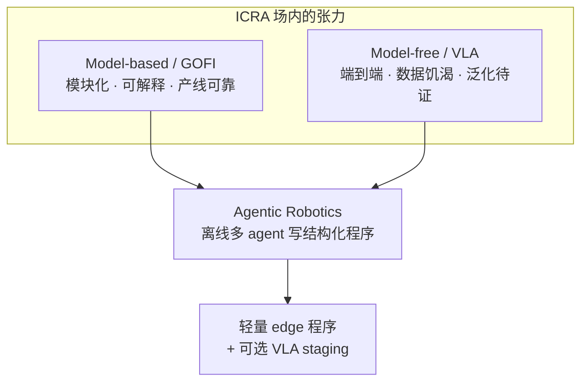
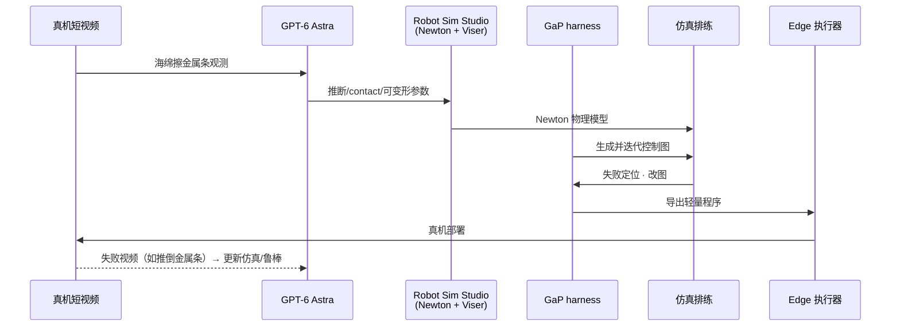

# Ken Goldberg：Agentic Robotics 范式位移（Goosebumps）

**Ken Goldberg**（UC Berkeley，Ambi / Jacobi Robotics 联创）2026-09-18 在 X 发布 [Goosebumps: a Paradigm Shift is Occurring in Robotics](https://x.com/i/article/2100968281100451840)，浓缩其 **ICRA 2026 plenary**（[*A Tale of Two Cultures*](https://bit.ly/Agentic-Robotics-plenary-by-Ken-Goldberg)，2026-06-02，Vienna）与 Berkeley–NVIDIA 组近九个月进展：**Agentic Robotics（AR）** 如何把 **model-based 工程**、**VLA** 与 **world model / 仿真** 用 **多 agent 离线编程** 接成可量产路径。

## 一句话定义

**AR 把「写机器人系统」本身变成 agent 任务：离线用 LLM/VLM 组合模块化 skills（含 VLA）为有向计算图，在仿真里自学习改图，导出轻量可执行程序上真机——不是取代 VLA 或 world model，而是用 agentic coding 把二者与传统 GOFI 模块一起装进可维护的产线栈。**

## 英文缩写速查

| 缩写 | 英文全称 | 简要说明 |
|------|----------|----------|
| AR | Agentic Robotics | 本页核心：多 agent 离线编写/测试/迭代结构化机器人程序 |
| GOFI | Good Old-Fashioned Engineering | 模块化 model-based 栈（滤波、PID、TAMP、ROS 等） |
| VLA | Vision-Language-Action | 端到端视觉-语言-动作策略；AR 中可作 skill 节点或 staging 末端 |
| WM | World Model | 生成式/视频世界模型；与 VLA 互补，非 AR 所否定的路线 |
| VA | Variational Automation | 有界几何/位姿变化的持久自动化；GaP 主靶任务类 |
| GaP | Graph-as-Policy | Berkeley/NVIDIA 图结构 AR harness（arXiv:2607.05369） |
| Real2Sim | Real-to-Simulation | 从真机观测建仿真；AR 主张逆物理可由 agent 加速 |

## 为什么重要

- **整合叙事节点：** 社区常把 debate 框成 **VLA vs world model** 或 **learning vs control**；Goldberg 明确 **三者都要**，且 **集成机制是 agentic coding**——与 [VLA](../methods/vla.md)、[Generative World Models](../methods/generative-world-models.md) 单页读法互补。
- **第三条路定位：** [ASPIRE](../methods/aspire.md) 优化 **Python 程序 + 技能库**；[GaP](./paper-gap-graph-as-policy.md) 优化 **ROS 式计算图 + 仿真排练**；本文给出 **AR 总框架**（离线 agent、运行期无 frontier LLM、失败视频回流仿真）。
- **产线证据链：** DexNet → Ambi 1 亿包裹 → **数据雪崩** → GaP 工业部署（2026-09-17 Jeff Mahler 公告）把 **research narrative** 接到 **paid useful work**——校准 [变体自动化（VA）](../concepts/variational-automation.md) 与通才融资热度落差。
- **Real2Sim 拐点叙事：** Astra + Newton **RSS** 海绵擦条 **<1h 逆物理** → GaP 自学习 → 真机可跑，与 [Walter Zhu Astra 解读](./walterzhu-astra-and-beyond.md) 的 **逆图形/逆物理** 分层可对照（本文偏 **Goldberg 组实验链**，非第三方评测）。

## 核心论点

### 1. 两种文化 → 需要对话而非站队

| 维度 | GOFI / model-based | VLA / model-free | AR（Goldberg 主张） |
|------|-------------------|------------------|---------------------|
| **开发成本** | 每任务大量人工集成 | 需海量 robot data | **离线 agent** 写/测/改模块 |
| **运行期** | 确定性模块 | 大模型推理 | **已编译图/代码**，无 inner-loop LLM |
| **可解释性** | 高 | 低 | **图/代码可 inspect** |
| **与 WM 关系** | 仿真模块传统人工建 | 部分 WM 作生成数据 | **逆物理 + agent 调仿真** |

**Plenary / 推文核心句：** 量产不是 **VLA vs World Model**，而是 **VLA + WM + model-based**，由 **agentic coding** 集成。

### 2. Robot Data Gap 与「数据是否够用」

- 相对 LLM token，机器人 demonstration 数据约 **5 个数量级** 差距（Science Robotics 2025 社论 *100,000 Year Robot Data Gap*）。
- **反例：** Tesla 里程 >> Waymo，但 Waymo 表现可更好——因 **模块化 GOFI** 与数据同等重要。
- **产线出路：** [Data Flywheel](../concepts/data-flywheel.md) 的强化版 **数据雪崩**——Ambi **1 亿+** pick 日志、deformable bag **22 人年等价** 数据训生成模型，优于纯 DexNet 刚性先验。

### 3. GaP 与 VLA staging（已论文化）

AR 在 [GaP](./paper-gap-graph-as-policy.md) 中落地为 **Graph-as-Policy**：

- 多 agent 分段 → **MORSL** 技能 → **类型检查计算图** → Isaac **自学习排练** → edge 解释器。
- VA benchmark：GaP **~97%** vs π₀.₅ **~20%**；**π₀.₅ w/ GaP** 用图把相机/夹爪 **送进 VLA 分布** 后成功率 **≈2–3×**。
- **结论句（与论文一致）：** VLA 与 GOFI **互补**——图负责 **可靠 staging + 可解释骨架**，VLA 负责 **分布内精细动作**。

### 4. Real2Sim2Real 与 Goosebumps 实验链

- **逆物理** ≠ 纯 Real2Sim/SysID：需从观测恢复 **摩擦、质量、阻尼、可变形** 等使 **操纵相关行为** 对齐。
- **RSS** 原为人调参工具；Astra 接入后 **agent 化**——Goldberg 称此为 **unexpected** 且触发 **goosebumps**。
- **失败闭环：** 真机失败 → 新证据 → agent 改仿真或策略 → 再部署（AR 与纯 one-shot demo 收集的分野）。

### 5. Specialist、VA 与 timeline 判断

- **Generalist 融资 vs 有用工作量：** 引 industry 观察——140+ 公司、数十亿美元估值，但 **paid useful work** 仍极小。
- **VA 刻度：** 咖啡、分拣、洗箱、插线等 **variational automation** 是 AR/GaP 的 **现实靶场**（见 [VA 概念页](../concepts/variational-automation.md)）。
- **作者态度：** 长期 cautious，现认为 **real robots timeline 显著提前**；**不等于** 通才/人形已解（脚注 6 仍开放）。

## 工程实践读法

| 若你的目标是… | Goldberg 链路的启示 |
|--------------|---------------------|
| **产线 pick-place / 物流** | 优先 **VA 假设 + 图/模块 + 产线日志飞轮**，VLA 作 **staging 或 skill 节点** |
| **仿真闭环** | 投资 **inverse physics 工具链**（Newton/RSS 类）+ agent 调参，而非只堆 randomization |
| **Agent 选型** | **离线** 多 agent 分工写图；**禁止** 把 frontier LLM 放进 **毫秒级 inner loop** |
| **评测** | 用大位姿/几何变化列测 VLA；用 **VA benchmark** 测 AR；两者不可混读 |
| **开源复现** | GaP 代码已 Beta 开源；RSS/Astra 链为 **组内进展**，复现前核对 [GaP 项目页](../../sources/sites/gap-graph-robots-project.md) |

## 局限与风险

- **叙事 vs 论文：** 本文是 **策展 + 演讲 + 组内进展**，定量表以 [GaP 论文](./paper-gap-graph-as-policy.md) 为准；Astra 海绵实验 **无独立第三方复现** 写入本页事实句。
- **逆物理泛化：** 单任务 `<1h` 成功 **不保证** 跨物体/跨机构可迁移；金属条质量不可视觉辨识类失败说明 **感知–物理 identifiability** 仍硬。
- **AR 速度：** Coding agent **慢**，仅适合 **离线 policy 工程**；实时适应、开放家庭通才 **未证**。
- **安全关键：** 文中承认需更强 **verification & validation**；agent 生成代码/图 **不能** 替代安全评审。
- **Ambi 部署细节：** 2026-09-17 工业公告 **未** 在 X Article 展开 API/成功率/周期时间——勿过度 extrapolate 到全行业。

## 关联页面

- [GaP（Graph-as-Policy）](./paper-gap-graph-as-policy.md) — AR 的图结构实现与 VA benchmark 数字
- [变体自动化（VA）](../concepts/variational-automation.md) — FA / VA / GR 任务谱
- [VLA](../methods/vla.md) — model-free 基线与 staging 角色
- [Generative World Models](../methods/generative-world-models.md) — WM 路线（非 AR 所否定）
- [Data Flywheel](../concepts/data-flywheel.md) — 产线数据雪崩对照
- [Sim2Real](../concepts/sim2real.md) — Real2Sim / inverse physics 语境
- [ASPIRE](../methods/aspire.md) — 姊妹 code-as-policy 路线
- [Walter Zhu：Astra and Beyond](./walterzhu-astra-and-beyond.md) — 第三方 Astra/具身框架解读

## 推荐继续阅读

- Goldberg, *Goosebumps: a Paradigm Shift is Occurring in Robotics*, X Article, 2026-09-18. <https://x.com/i/article/2100968281100451840>
- ICRA 2026 plenary: *A Tale of Two Cultures: Can Agentic Coding Close the Gap?* <https://bit.ly/Agentic-Robotics-plenary-by-Ken-Goldberg>
- Chen et al., *GaP: A Graph-as-Policy Multi-Agent Self-Learning Harness For Variational Automation Tasks*, arXiv:2607.05369. <https://graph-robots.github.io/gap/>

## 参考来源

- [Ken Goldberg Agentic Robotics X Article 归档](../../sources/blogs/ken_goldberg_agentic_robotics_goosebumps_2026-09-18.md)
- [GaP 论文归档](../../sources/papers/gap_arxiv_2607_05369.md)
- [GaP 项目页归档](../../sources/sites/gap-graph-robots-project.md)
