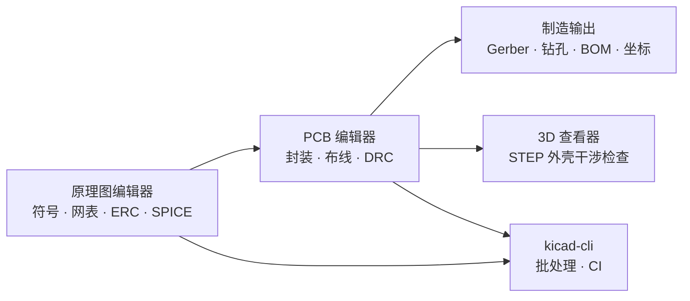
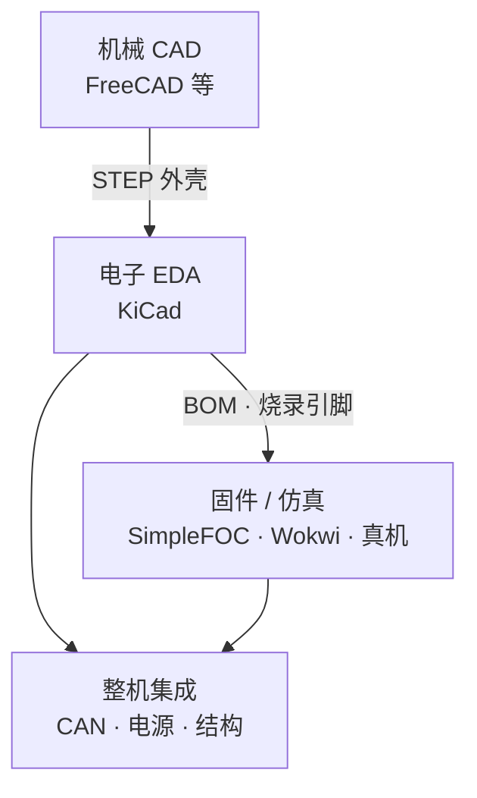

# KiCad（开源 PCB 与原理图 EDA）

**KiCad**（[kicad.org](https://www.kicad.org/)）是面向 **原理图 → PCB → 制造文件** 的 **免费开源电子设计自动化（EDA）套件**：跨 Windows / macOS / Linux，覆盖层次化原理图、交互式布线、电气/设计规则检查、集成 SPICE、3D 机械预览与 **kicad-cli** 批处理。在机器人研究与工程中，它处于 **机械 CAD（[FreeCAD](./freecad.md)）与固件 bring-up（[Wokwi](./wokwi.md)）之间**——把关节驱动、BMS、主控与传感转接等 **PCB 设计真值** 落到可打样的 Gerber 与 BOM。

## 英文缩写速查

| 缩写 | 英文全称 | 简要说明 |
|------|----------|----------|
| EDA | Electronic Design Automation | 电子设计自动化，原理图与 PCB 工具总称 |
| PCB | Printed Circuit Board | 印刷电路板 |
| ERC | Electrical Rules Check | 原理图电气规则检查（开路、驱动冲突等） |
| DRC | Design Rules Check | PCB 设计规则检查（间距、线宽、过孔等） |
| SPICE | Simulation Program with Integrated Circuit Emphasis | 电路仿真语言；KiCad 原理图可挂接仿真 |
| Gerber | Gerber RS-274X | PCB 制造常用 CAM 图形格式 |
| BOM | Bill of Materials | 物料清单 |
| MCU | Microcontroller Unit | 微控制器；PCB 上跑 FOC/通信固件的芯片 |
| CLI | Command Line Interface | 命令行界面；`kicad-cli` 用于无头导出与 CI |

## 为什么重要

- **力矩执行器的硬件底座**：[FOC](../concepts/field-oriented-control.md) 电流环最终落在 **三相逆变、电流采样、栅极驱动与 MCU** 的 PCB 上；[力矩电机设计纵深 Stage 4](../../roadmap/depth-torque-motor-design.md) 明确要求走完 **原理图 → layout → 打样 → bring-up**，KiCad 是零许可成本的常用工具链。
- **整机能源与计算电子**：[Humanoid Hardware 101 · 05](../overview/humanoid-hardware-101-power-compute-electronics.md) 将 **驱动板、控制板、通信与电源管理 PCB** 列为移动人形 BOM 与 DFM 的关键；KiCad 支撑面板化打样前的设计迭代。
- **开源硬件生态对齐**：[EN02-OP](./en02-op.md)、[Asimov V1](./asimov-v1.md)、[SimpleFOC](./simplefoc.md) 参考板等路径都涉及 **可复现的原理图/Gerber**；KiCad 便于 fork、改版与社区 PR 审查（工程文件可进 Git）。
- **与底软总线设计同屏**：画驱动板时需同时定 **CAN/EtherCAT 收发器、隔离、终端与调试 UART**——见 [电机底软通信协议总览](../overview/motor-drive-firmware-bus-protocols.md)。

## 核心结构/机制

### 套件模块与数据流

| 组件 | 机器人相关用法 |
|------|----------------|
| **原理图** | 电机驱动三相桥、相电流采样、编码器接口、CAN 收发器、BMS 监测 |
| **PCB** | 功率环路最小化、采样电阻开尔文走线、散热铜皮、高压低压分区 |
| **PCB 计算器** | 走线载流、过孔、阻抗粗算（打样前自检） |
| **Gerber 查看器** | 发板前 CAM 检视，避免层序/光圈错误 |
| **3D 查看器** | 检查板卡与关节壳体/散热器的机械间隙 |
| **kicad-cli** | 仓库内自动化导出制造数据与 DRC 报告 |

### 源码与协作模型

- **开发真源**：[GitLab `kicad/code/kicad`](https://gitlab.com/kicad/code/kicad)（GPLv3；贡献走 GitLab MR）。
- **GitHub 镜像**：[KiCad/kicad-source-mirror](https://github.com/KiCad/kicad-source-mirror) 为只读同步，**不接受 Pull Request**——选型与 issue 浏览可用 GitHub，改代码须看 GitLab。
- **文档**：[10.0 简体中文手册](https://docs.kicad.org/10.0/zh/) 覆盖入门、原理图、PCB、CLI 等（见 [文档归档](../../sources/courses/kicad_docs_10_zh.md)）。

### 在机器人硬件栈中的位置

## 工程实践

1. **库与版本锁定**：团队统一 KiCad **次版本**（如 10.0.x）与符号/封装库提交策略，避免「我用 9 你开 10」网表不兼容。
2. **驱动板 checklist**（对齐 Stage 4）：功率器件与栅极驱动选型 → 采样链路 ERC → 布局功率环 → DRC → 3D 干涉 → Gerber 复检 → 低压限流上电。
3. **与固件对齐表**：维护 **MCU 引脚 ↔ 相电流 ADC ↔ PWM 定时器 ↔ CAN** 对照表，原理图变更时同步 [SimpleFOC](./simplefoc.md) / 自研固件仓库。
4. **CI**：`kicad-cli` 在 merge 前导出 Gerber 并跑 DRC，开源硬件 PR 可附制造差异摘要。
5. **制造**：导出 Gerber + 钻孔 + BOM → JLCPCB / 嘉立创等；面板化与 DFM 技巧见 [开源人形硬件](./open-source-humanoid-hardware.md) 与 Hardware 101 供应链叙事。

## 局限与风险

- **不是机械 CAD**：机加工件、公差与装配仍用 [FreeCAD](./freecad.md) 等；KiCad 3D 主要用于 **板级** 干涉。
- **不是固件仿真器**：SPICE 适合模拟前端与电源粗仿，**不能** 替代 [Wokwi](./wokwi.md) 的 MCU 外设行为或 kHz 级 CAN 抖动验证。
- **高功率/高电压经验门槛**：kV 级隔离爬电、EMI 与安规认证仍需资深硬件评审；工具不自动保证可量产。
- **生态分裂**：部分创客板（如部分 SimpleFOC 参考设计）历史使用 EasyEDA；迁移到 KiCad 需重导符号/封装并复测。
- **GitHub 镜像误用**：向 GitHub 镜像提 PR **不会被合并**；贡献须遵循 GitLab 流程。

## 关联页面

- [执行器驱动链选型闭环知识链](../queries/actuator-drive-chain-selection-loop.md) — 本页处于驱动链 **①层 EDA 电路设计**（开源 KiCad vs 商用 Altium、自研驱动板 vs 商用一体化关节）
- [Humanoid Hardware 101 · 05：能源与计算电子](../overview/humanoid-hardware-101-power-compute-electronics.md)
- [电机驱动器底软通信协议总览](../overview/motor-drive-firmware-bus-protocols.md)
- [力矩电机设计纵深（Stage 4 PCB）](../../roadmap/depth-torque-motor-design.md)
- [FreeCAD（机械 CAD）](./freecad.md)
- [SimpleFOC](./simplefoc.md)
- [Wokwi](./wokwi.md)
- [EN02-OP](./en02-op.md)
- [开源人形机器人硬件方案对比](./open-source-humanoid-hardware.md)
- [磁场定向控制（FOC）](../concepts/field-oriented-control.md)

## 参考来源

- [KiCad 官网归档](../../sources/sites/kicad-org.md)
- [KiCad 10.0 简体中文文档归档](../../sources/courses/kicad_docs_10_zh.md)
- [KiCad 官方源码仓库归档](../../sources/repos/kicad.md)

## 推荐继续阅读

- [KiCad 文档 10.0 简体中文](https://docs.kicad.org/10.0/zh/)
- [KiCad GitLab 主仓库](https://gitlab.com/kicad/code/kicad)
- [KiCad 开发者文档](https://dev-docs.kicad.org/)
- [KiCad Forum](https://forum.kicad.info/)
