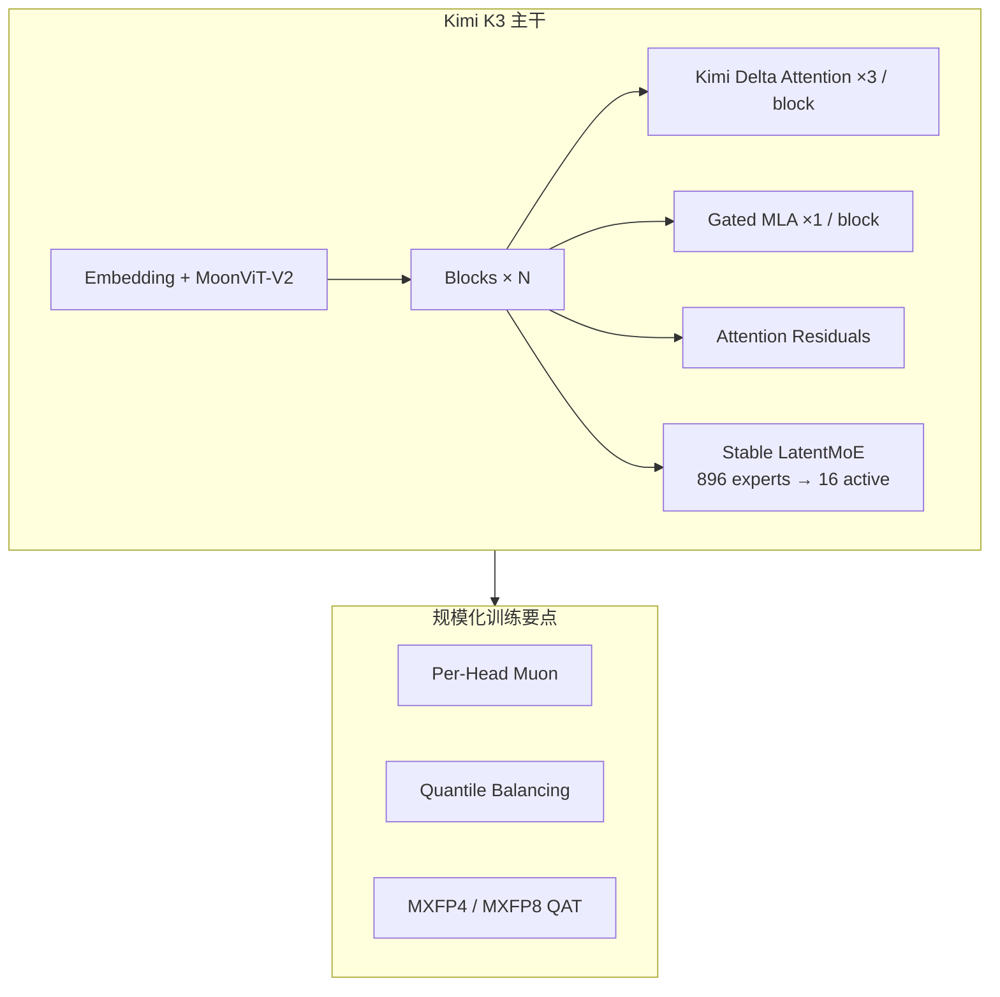
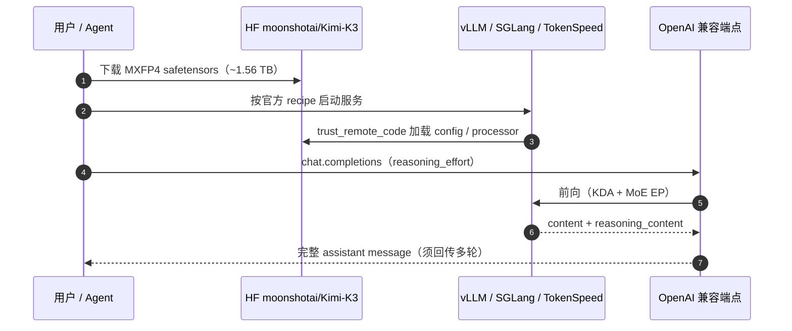

# Kimi K3

**Kimi K3** 是 [月之暗面（Moonshot AI）](https://www.kimi.com/) 2026 年发布的旗舰大模型：**2.8 万亿参数** MoE（**104B** 激活）、**100 万 token** 上下文、**原生视觉**（图 / 视频），架构基于 **Kimi Delta Attention（KDA）** 与 **Attention Residuals（AttnRes）**。它是首个达到 **3T-class** 的**开放权重**模型，定位 **long-horizon coding**、**agentic knowledge work** 与 **reasoning**；对本知识库读者，其价值主要在 **研究型 coding agent**（仿真 / 训练脚本 / benchmark 复现）与 **Muon 训练栈** 的规模化验证，而非直接输出机器人电机指令。

## 一句话定义

以 **KDA + AttnRes + Stable LatentMoE** 支撑 **1M 多模态上下文** 的 **2.8T（104B 激活）旗舰模型**；经 **Kimi API / Kimi Code / Kimi Work** 与 **开放 MXFP4 权重** 提供长程编码与知识工作 agent 能力。

## 英文缩写速查

| 缩写 | 英文全称 | 简要说明 |
|------|----------|----------|
| KDA | Kimi Delta Attention | 混合线性注意力机制，利于长上下文与大规模训练 |
| AttnRes | Attention Residuals | 跨深度选择性检索表示，而非均匀累积 |
| MoE | Mixture of Experts | 稀疏专家路由；K3 为 896 routed experts、激活 16 |
| MLA | Multi-head Latent Attention | 与 Gated MLA 等组件配合的注意力变体 |
| QAT | Quantization-Aware Training | SFT 阶段起的量化感知训练（MXFP4/MXFP8） |
| API | Application Programming Interface | OpenAI 兼容端点 `https://api.moonshot.ai/v1` |
| HF | Hugging Face | 主权重托管：`moonshotai/Kimi-K3` |

## 为什么重要

- **开源规模前沿：** 首个 **3T-class** 开放权重；**2026-07-27** 起可自托管 / 微调（硬件门槛极高：约 **1.56 TB** MXFP4 权重）。
- **长程 coding agent：** 博客与技术报告案例覆盖 **GPU kernel 优化**、**从零编译器（MiniTriton）**、**CAD / 前端 vision-in-the-loop**、**科研代码复现**——与机器人研究中「agent 写训练 / 仿真 / 评测脚本」高度同构（参见 [真机策略 autoresearch 闭环](../queries/real-robot-policy-autoresearch-harness.md)）。
- **训练方法交叉：** K3 使用 **[Per-Head Muon](../methods/muon.md)**、Quantile Balancing、Stable LatentMoE 等，是 Moonshot 在 [Muon 规模化 LLM 训练](../entities/paper-muon-scalable-llm-training.md) 之后的工程延续。
- **评测语境：** [ENPIRE](../methods/enpire.md) 的 AutoEnvBench 已跟踪 **Kimi Code** 系列 coding agent；K3 是同一产品线的旗舰推理后端。

## 核心结构

### 架构主干

```mermaid
flowchart TB
  subgraph arch [Kimi K3 主干]
    E[Embedding + MoonViT-V2]
    B[Blocks × N]
    KDA[Kimi Delta Attention ×3 / block]
    MLA[Gated MLA ×1 / block]
    AR[Attention Residuals]
    MoE[Stable LatentMoE<br/>896 experts → 16 active]
    E --> B
    B --> KDA
    B --> MLA
    B --> AR
    B --> MoE
  end
  subgraph train [规模化训练要点]
    PHM[Per-Head Muon]
    QB[Quantile Balancing]
    QAT[MXFP4 / MXFP8 QAT]
  end
  arch --> train
```

| 组件 | 作用 |
|------|------|
| **KDA + Gated MLA** | 每 block **3× KDA + 1× Gated MLA**（全文 **69 KDA + 24 Gated MLA**）；利于超长上下文 |
| **AttnRes** | 跨层选择性检索，缓解深层信息稀释 |
| **Stable LatentMoE** | 极高稀疏度下稳定路由；相对 Kimi K2 约 **2.5× scaling efficiency**；激活 **104B** |
| **MoonViT-V2** | 原生视觉编码器（**401M**） |
| **Per-Head Muon** | 注意力头独立 Muon 优化，见 [Muon](../methods/muon.md) |
| **量化** | SFT 起 QAT，MXFP4 权重 + MXFP8 激活 |

### 能力分区（产品视角）

| 场景 | 要点 |
|------|------|
| **Coding** | 长时程仓库级工程、终端工具、截图反馈闭环（游戏 / 前端 / CAD） |
| **Knowledge work** | Kimi Work：多轮研究、交互可视化、Widgets / Dashboard |
| **Multimodal** | 文本 + 图像 + 视频统一输入；motion design / 视频剪辑案例 |

## 推理部署时序（开放权重）

官方推荐经 **vLLM / SGLang / TokenSpeed** 加载 HF 权重；GitHub 仓本身**无可运行训练脚本**。自托管最小路径：

```mermaid
sequenceDiagram
  autonumber
  participant User as 用户 / Agent
  participant Hub as HF moonshotai/Kimi-K3
  participant Eng as vLLM / SGLang / TokenSpeed
  participant API as OpenAI 兼容端点
  User->>Hub: 下载 MXFP4 safetensors（~1.56 TB）
  User->>Eng: 按官方 recipe 启动服务
  Eng->>Hub: trust_remote_code 加载 config / processor
  User->>API: chat.completions（reasoning_effort）
  API->>Eng: 前向（KDA + MoE EP）
  Eng-->>API: content + reasoning_content
  API-->>User: 完整 assistant message（须回传多轮）
```

关键复现路径：接受 **Kimi K3 License** → 拉取 HF / ModelScope 权重 → 按 [vLLM recipes](https://recipes.vllm.ai/moonshotai/Kimi-K3) 或 [SGLang cookbook](https://docs.sglang.io/cookbook/autoregressive/Moonshotai/Kimi-K3) 起服务；coding agent 优先接 [Kimi Code CLI](https://www.kimi.com/code)。

## 工程实践

### API 接入（OpenAI 兼容）

- **模型 ID：** `kimi-k3`
- **Endpoint：** `https://api.moonshot.ai/v1`，密钥 `MOONSHOT_API_KEY`
- **Thinking：** **始终开启**；使用顶层 `reasoning_effort`（**`low` / `high` / `max`**，默认 **`max`**），**勿**使用 K2.x 的 `thinking` 参数
- **多轮 / 工具：** 必须把 API 返回的 **完整 assistant message**（含 `reasoning_content`、tool_calls）原样追加到下一轮
- **视觉：** `content` 为对象数组；图像 **base64** 或 `ms://<file_id>`；**不支持公网 image URL**
- **缓存：** 长 system / 知识库前缀 **自动 context caching**；coding 场景官方称 cache hit **>90%**

### 与机器人研究 harness 的衔接

| 需求 | 建议 |
|------|------|
| **仿真 / 训练脚本 autoresearch** | 优先 **Kimi Code** 或自建 harness，确保 **thinking history 完整回传**（官方局限 #1） |
| **长仓库 + 工具环** | API `tool_choice`、dynamic tool loading；参考 [karpathy/autoresearch](./karpathy-autoresearch.md) 的固定 eval 契约 |
| **真机策略 agent** | 先满足 ENPIRE 式 **reset + verify**；再选 coding backend（见 [ENPIRE](../methods/enpire.md)） |
| **行为边界** | K3 可能 **过度主动**；在 system prompt / `AGENTS.md` 写明禁止擅自改实验假设或跳过验证 |

### 自托管部署

- 权重体积约 **1.56 TB**（96 分片 MXFP4）；博客建议 **≥64 加速器 supernode** 部署。
- 推理引擎：官方 README 链至 **vLLM**、**SGLang**、**TokenSpeed** recipe（2026-07-27 起可用）。
- 商用前必读 **Kimi K3 License**（MaaS 营收门槛与大产品署名）。

## 局限与风险

| 局限 | 说明 |
|------|------|
| **开放权重 ≠ 完整开源** | 权重 + 技术报告 + License 已公开；**训练数据 / 训练代码未随 GitHub 仓发布** |
| **硬件门槛** | ~1.56 TB 权重 + 大规模 EP；个人 / 小实验室通常走 **API** 而非自托管 |
| **Thinking history 敏感** | 中途换模型或 harness 丢 thinking 会导致质量崩溃；勿在长跑 session 中无验证切换 backend |
| **相对闭源 UX gap** | 官方承认仍落后于 Claude Fable 5、GPT 5.6 Sol 的体验 |
| **License 附加条款** | 非标准 MIT：高营收 MaaS / 超大产品有额外义务 |
| **非具身动作模型** | K3 不直接输出机器人关节 / 航点；物理任务需接 VLA / 控制栈或专用具身模型 |

## 开源状态

| 项目 | 状态（2026-07-27） |
|------|-------------------|
| **API / Kimi Code / Kimi Work** | 已上线 |
| **完整模型权重** | **已开源** — [HF `moonshotai/Kimi-K3`](https://huggingface.co/moonshotai/Kimi-K3) + [ModelScope](https://www.modelscope.cn/models/moonshotai/Kimi-K3) |
| **技术报告** | **已发布** — [`k3_tech_report.pdf`](https://github.com/MoonshotAI/Kimi-K3/blob/main/k3_tech_report.pdf)（47 页；无 arXiv） |
| **GitHub 入口仓** | [MoonshotAI/Kimi-K3](https://github.com/MoonshotAI/Kimi-K3)（README / License / PDF；无训练脚本） |
| **vLLM / SGLang / TokenSpeed** | 官方 recipe 已链出 |
| **训练代码 / 数据** | **未开源** |
| **License** | **Kimi K3 License** |

## 参考来源

- [Kimi K3 技术博客归档](../../sources/blogs/kimi_k3_tech_blog.md)
- [Kimi K3 API Quickstart 归档](../../sources/courses/kimi_k3_api_quickstart.md)
- [GitHub MoonshotAI/Kimi-K3 归档](../../sources/repos/kimi-k3.md)
- [HF moonshotai/Kimi-K3 归档](../../sources/sites/huggingface-moonshotai-kimi-k3.md)
- [ModelScope moonshotai/Kimi-K3 归档](../../sources/sites/modelscope-moonshotai-kimi-k3.md)
- [Kimi K3 技术报告归档](../../sources/papers/kimi_k3_tech_report.md)
- [Kimi K3 官方技术博客](https://www.kimi.com/blog/kimi-k3)
- [HF 权重](https://huggingface.co/moonshotai/Kimi-K3)
- [技术报告 PDF](https://github.com/MoonshotAI/Kimi-K3/blob/main/k3_tech_report.pdf)

## 关联页面

- [Muon](../methods/muon.md) — K3 训练使用 Per-Head Muon
- [Muon is Scalable for LLM Training](./paper-muon-scalable-llm-training.md) — Moonshot Muon 规模化论文
- [真机策略 autoresearch 闭环搭建指南](../queries/real-robot-policy-autoresearch-harness.md) — coding agent 选型与 harness 前提
- [ENPIRE](../methods/enpire.md) — AutoEnvBench 与 Kimi Code 评测语境
- [autoresearch（karpathy/autoresearch）](./karpathy-autoresearch.md) — 固定预算 LLM 实验环结构可迁移
- [AI Auto-Research](../concepts/ai-auto-research.md) — 研究自动化阶段论
- [LLaDA2.2-flash](./llada2-2-flash.md) — 开放权重 dLLM / 高吞吐 agent 后端对照（Apache-2.0）
- [DeepSeek Harness](./deepseek-harness.md) — DeepSeek 官方 coding agent 宿主（可挂自定义 OpenAI-compatible 端点）

## 推荐继续阅读

- [Kimi K3 Pricing（官方）](https://platform.kimi.ai/docs/guide/kimi-k3-pricing)
- [Kimi API Platform 文档索引](https://platform.kimi.ai/docs/llms.txt)
- [vLLM Kimi-K3 recipe](https://recipes.vllm.ai/moonshotai/Kimi-K3)
- [SGLang Kimi-K3 cookbook](https://docs.sglang.io/cookbook/autoregressive/Moonshotai/Kimi-K3)
- [Moonshot Muon 规模化论文（arXiv:2502.16982）](https://arxiv.org/abs/2502.16982)
