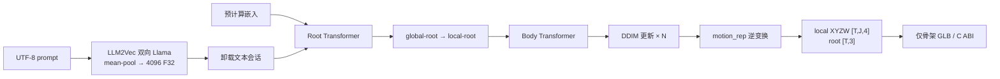
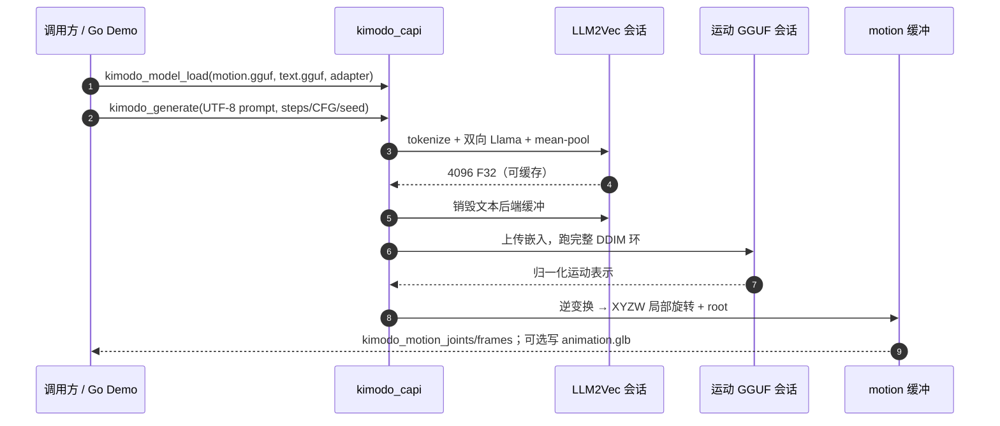

# kimodo.cpp（C++/GGML 本地运动扩散运行时）

**kimodo.cpp**（[localai-org/kimodo.cpp](https://github.com/localai-org/kimodo.cpp)）是 NVIDIA [Kimodo](./kimodo.md) 的 **独立 C++ 推理引擎**：运行时 **不依赖 Python/PyTorch**，用 pinned [GGML](https://github.com/ggml-org/ggml) 在 **CPU 或 Vulkan** 上把自然语言（或预计算 LLM2Vec 嵌入）变成骨架局部旋转与 root 平移。

## 一句话定义

**Kimodo 的本地运行时**：GGUF 运动去噪器 + 双向 Llama 文本编码器，串行加载以压峰值显存，输出仅骨架运动学，不是控制策略。

## 英文缩写速查

| 缩写 | 英文全称 | 简要说明 |
|------|----------|----------|
| GGML | Georgi Gerganov Machine Learning | 本仓推理后端；以 git submodule 钉死，不整棵引入 llama.cpp |
| GGUF | GGML Unified Format | 可 mmap 的权重容器；运动去噪器与文本编码器分文件 |
| DDIM | Denoising Diffusion Implicit Models | Kimodo 默认采样器；本移植做 CPU/Vulkan 对等测试 |
| LLM2Vec | LLM-to-Vector embedding | Llama-3-8B + PEFT，双向注意力 + mean pooling 得到 4096-d 条件 |
| CFG | Classifier-Free Guidance | 生成选项里文本/约束分权重；约束输入本身尚未移植 |
| SOMA | Standardized Open Motion Avatar | NVIDIA 人体骨架；原生 API 返回模型实际预测的 **30** 关节，不是官方 Python 的 77 关节展示骨架 |
| G1 | Unitree G1 Humanoid | 34 关节机器人变体；输出仍是运动学，不是扭矩指令 |
| VRAM | Video Random Access Memory | 官方 Python 全 GPU ~17GB 主要在 8B 文本塔；本仓可把文本层分块并卸载后再加载去噪器 |

## 为什么重要

- **把研究栈拆成可嵌入运行时**：官方 `kimodo_gen` / Gradio Demo 绑定 Python、CUDA 与约 **17 GB** 文本编码器；现场、CI、无 Python 进程或核显/CPU 盒子需要 **C ABI + GGUF**。
- **许可与分发边界写清楚**：代码 Apache-2.0；SOMA/G1 走 NVIDIA Open Model License 且已有 [LocalAI-io](https://huggingface.co/LocalAI-io) GGUF；SMPL-X 检查点是 **Internal R&D**，安装器故意不打包。
- **与 llama.cpp 同族但不是封装**：LLM2Vec 改了因果掩码，直接调普通 llama.cpp embedding **对不齐** Kimodo 条件向量；本仓自写 `llama_bi` + Llama-3 byte-BPE。

## 核心原理

官方图是「prompt → 4096-d 文本嵌入 → 两阶段 root/body 去噪（默认 100 步 DDIM）→ 运动表示逆变换」。移植把 **文本会话与运动会话拆开**，避免 8B 编码器与去噪器同时占后端缓冲：

| 模块 | 源码入口 | 作用 |
|------|----------|------|
| 文本 | `src/text_encoder` + `llama_bi` | 非因果 Llama、合并后的 PEFT、mean pooling |
| 去噪 | `src/denoiser` | root / body `TransformerEncoder` 图 |
| 采样 | `src/diffusion` | schedule、CFG、DDIM |
| 表示 | `src/motion_rep` + `src/skeleton` | 归一化逆变换、SMPL-X / SOMA / G1 元数据与 FK |
| ABI | `include/kimodo/kimodo_capi.h` | 异常防火墙；`kimodo_generate` / `kimodo_generate_embedding` |

NVIDIA Python API 会把 SOMA 的 **30 个预测关节展开成 77 关节松弛手展示骨架**；当前原生 API **只返回模型实际预测的关节数**，调用方不要按 77 写死。

## 源码运行时序图

最短复现：`scripts/download_gguf_weights.sh --model soma-rp-v1.1` → `cmake --preset debug` 构建 → `ctest --preset debug`（套件不自行下载权重）→ `go run ./demo -addr 0.0.0.0:8094`。只要运动去噪、自备 4096-d 嵌入时用 `kimodo_generate_embedding` 或 `--motion-only`。

## 工程实践

| 项 | 做法 |
|----|------|
| 构建 | C++23、CMake 3.25+、Ninja；Vulkan loader/headers 可选；`release` / `asan-ubsan` / `fuzz` preset |
| 可重复环境 | `nix develop path:. --command cmake --preset debug` |
| 设备 | `KIMODO_DEVICE_CPU` / `VULKAN` / `AUTO`；`KIMODO_TEXT_LAYER_CHUNK=1..32` 调文本塔显存 |
| 输出 | C 缓冲是借用指针，`kimodo_motion_free` 前有效；Demo 另写无网格骨架 GLB，方便拷进 Three.js |
| 权重校验 | 安装器核 `MANIFEST.json` 与 SHA-256；运动 GGUF 元数据含骨架、schedule、归一化统计 |
| 下游 | 运动学轨迹仍要进 [ProtoMotions](./protomotions.md) / [SONIC](../methods/sonic-motion-tracking.md) / [CoRe](./core-retarget.md)；**不要**把 GLB/旋转缓冲当真机指令。CoRe 当前契约吃的是官方 Kimodo **SOMA77 `.npz`**，本仓 30 关节缓冲不能直接喂 |

## 局限与风险

- **不是官方 NVIDIA 仓**：社区移植；数值靠 fixture / CPU–Vulkan parity，上游 `config.yaml` 或权重 revision 漂移要自己回归。
- **能力子集**：README 明示 **通用约束输入、77 关节 SOMA 展开、蒙皮 GLB、量化模型尚未实现**。要导演式关键帧 / 2D 路径仍走官方 Python [Kimodo](./kimodo.md)。
- **SOMA 关节数易踩坑**：对照官方 somaskel77 或 [CoRe](./core-retarget.md) 时，先确认走的是 30 还是 77。
- **SMPL-X 再分发违法风险**：Internal R&D 许可禁止衍生权重分发；把自行转换的 SMPL-X GGUF 传到公开盘等于踩上游条款，与「骨架名字是 SMPL-X 形状」无关。
- **文本塔条款独立**：`Llama-3-Kimodo-GGML` 含 Meta Llama 3 材料，下载前读模型卡。
- **泄漏检测**：ASan 默认关 leak detect（Vulkan loader 全局分配）；不要据此判断「没有泄漏」。

## 关联页面

- [Kimodo](./kimodo.md) — 上游两阶段运动学扩散、约束编辑与 Benchmark
- [Diffusion-based Motion Generation](../methods/diffusion-motion-generation.md) — 扩散运动生成范式；本页是部署侧对照
- [HY-Motion vs GENMO vs Kimodo](../comparisons/hy-motion-vs-genmo-vs-kimodo.md) — 三条生成骨干选型；本地 GGML 是 Kimodo 的推理档
- [SAM3DBody-cpp](./sam3dbody-cpp.md) — 另一条「官方 Python → 社区 C++/ggml」人体感知运行时
- [ProtoMotions](./protomotions.md) / [Unitree G1](./unitree-g1.md) — 生成轨迹下游
- [ARDY](./ardy.md) — 同生态交互实时档；本页是离线扩散的本地化，不是流式编辑

## 参考来源

- [kimodo.cpp 仓库归档](../../sources/repos/kimodo-cpp.md)
- [Kimodo 官方仓](../../sources/repos/kimodo.md)
- [Kimodo 项目页](../../sources/sites/kimodo-project.md)
- [Kimodo 论文摘录](../../sources/papers/kimodo_arxiv_2603_15546.md)

## 推荐继续阅读

- 仓库 README / 移植计划：<https://github.com/localai-org/kimodo.cpp>
- 实现笔记：<https://github.com/localai-org/kimodo.cpp/blob/main/docs/IMPLEMENTATION.md>
- SOMA RP GGUF：<https://huggingface.co/LocalAI-io/Kimodo-SOMA-RP-v1.1-GGML>
- 官方 Kimodo 文档：<https://research.nvidia.com/labs/sil/projects/kimodo/docs>
