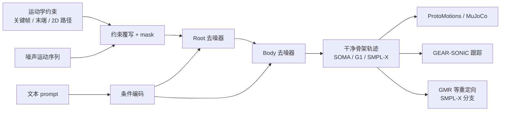

# Kimodo（可控人体与人形运动扩散）

**Kimodo**（**Ki**nematic **Mo**tion **D**iffusi**o**n）在 **运动学空间** 对骨架姿态序列做 **显式扩散去噪**：在约 **700 小时** [Bones Rigplay 1](https://bones.studio/datasets#rp01) 光学动捕上训练，输出可落在 **SOMA（somaskel77）、Unitree G1、SMPL-X** 等骨架；除自然语言外，支持全身关键帧、稀疏关节位姿、末端手/脚约束、2D 路点与稠密地面路径。

## 英文缩写速查

| 缩写 | 英文全称 | 简要说明 |
|------|----------|----------|
| G1 | Unitree G1 Humanoid | 宇树入门级教育科研人形平台 |
| SMPL | Skinned Multi-Person Linear Model | 常见人体参数化模型与重定向源 |
| MuJoCo | Multi-Joint dynamics with Contact | 接触丰富的刚体物理仿真引擎 |
| AMASS | Archive of Motion Capture as Surface Shapes | 大规模统一人体动捕数据集 |
| GMR | General Motion Retargeting | 把人体/视频动作重定向为机器人可执行参考 |
| GPU | Graphics Processing Unit | 图形处理器，大规模并行仿真训练的算力基础 |
| RL | Reinforcement Learning | 通过与环境交互最大化长期回报来学习策略的范式 |

## 为什么重要？

- **规模 + 可控**：公开 mocap 偏小长期限制文生运动的质量与约束精度；Kimodo 用大规模工作室数据支撑 **scaling 实验**，并把「导演式」关键帧编辑与扩散采样结合。
- **机器人演示数据上游**：G1 变体可 **快于遥操作** 生成人形参考轨迹，经 NPZ/CSV 导入 [ProtoMotions](./protomotions.md) 训练物理策略，或在 [GEAR-SONIC Demo](https://nvlabs.github.io/GEAR-SONIC/demo.html) 中与 [SONIC](../methods/sonic-motion-tracking.md) 跟踪策略闭环演示。
- **可复现评测**：[Kimodo Motion Generation Benchmark](https://huggingface.co/datasets/nvidia/Kimodo-Motion-Gen-Benchmark) 覆盖文本与多类约束测试用例；SEED 训练变体便于与仅使用 [BONES-SEED](https://huggingface.co/datasets/bones-studio/seed) 的其他方法公平对比。

## 核心结构 / 机制

### 运动表示

- **平滑 root**：贴近动画工具中画路径的 root 表示，利于 2D 路点/稠密路径跟随且保持自然骨盆运动。
- **全局关节旋转与位置**：便于稀疏 **全身关键帧** 与 **末端约束** 直接覆写。
- **约束条件化**：约束与噪声运动 **同表示**；对受约束维度 **覆写** 并拼接 **constraint mask**，再与文本嵌入一并输入去噪器。

### 两阶段去噪器

1. **Root denoiser**：先预测全局 root 运动。
2. **Body denoiser**：将 root 结果变换为局部表示，再预测身体关节；最终输出为两阶段拼接的「干净」运动。

设计目标：分解 root/body 预测以 **减轻漂浮、脚滑** 等常见扩散运动伪影，同时保留灵活的多约束条件化。

### 流程总览

## 模型变体与选型

| 场景 | 推荐变体 |
|------|----------|
| 最强生成能力 / 生产向 | **Kimodo-SOMA-RP-v1.1**（Rigplay 700h） |
| 与 BONES-SEED 文献公平对比 | **Kimodo-SOMA-SEED-v1.1**（288h 公开数据） |
| Unitree G1 演示与 MuJoCo | **Kimodo-G1-RP-v1** |
| 重定向到其他机器人 | **Kimodo-SMPLX-RP-v1** → AMASS npz → GMR |

权重托管 Hugging Face，CLI/Demo 首次运行自动下载；详见 [sources/repos/kimodo.md](../../sources/repos/kimodo.md)。

## 工程要点（速览）

- **推理**：`kimodo_gen`；CFG 支持 `regular` / `separated`（文本 vs 约束分权重）；可选 `--no-postprocess` 关闭脚滑/约束后处理。
- **Demo**：`kimodo_demo` 时间线编辑多 prompt、多轨约束、多样本对比与导出。
- **显存**：全 GPU 约 **17GB**；`TEXT_ENCODER_DEVICE=cpu` 可换 <3GB VRAM。
- **导出**：NPZ 含 `smooth_root_pos`、`foot_contacts` 等；G1 → MuJoCo qpos CSV；SMPL-X → `*_amass.npz`。

## 常见误区或局限

- **勿与 GEM/GENMO 混为一谈**：[GENMO](../methods/genmo.md) 侧重 **单目视频 → SMPL 估计/生成**；Kimodo 侧重 **文本 + 运动学约束 → 骨架轨迹合成**，二者在 NVIDIA 栈中互补（项目页将 GEM 列为相邻工作）。
- **SEED 变体能力弱于 Rigplay 全量**：仅 288h 公开数据的 SEED 模型主要用于 **基准对比**，不等同于 RP 全量模型的上限。
- **运动学轨迹 ≠ 物理可行**：导入 ProtoMotions / SONIC 前仍需接触、平衡与跟踪策略；勿把生成 NPZ 直接当真机指令。

## 关联页面

- [Diffusion-based Motion Generation](../methods/diffusion-motion-generation.md) — 扩散式全身轨迹生成范式
- [MotionBricks](../methods/motionbricks.md) — 同生态实时潜空间生成式运动
- [GENMO / GEM](../methods/genmo.md) — 视频/多模态人体运动估计与生成
- [ProtoMotions](./protomotions.md) — 生成轨迹 → GPU 仿真 + RL
- [SONIC](../methods/sonic-motion-tracking.md) — GEAR-SONIC 规模化运动跟踪
- [GR00T WholeBodyControl](./gr00t-wholebodycontrol.md) — SONIC 训练与推理代码仓
- [Unitree G1](./unitree-g1.md) — Kimodo-G1 目标平台
- [HY-Motion vs GENMO vs Kimodo](../comparisons/hy-motion-vs-genmo-vs-kimodo.md) — 三条「文本/多模态 → 人体运动」生成式骨干选型对比

## 参考来源

- [sources/repos/kimodo.md](../../sources/repos/kimodo.md)
- [sources/sites/kimodo-project.md](../../sources/sites/kimodo-project.md)
- [sources/papers/kimodo_arxiv_2603_15546.md](../../sources/papers/kimodo_arxiv_2603_15546.md)

## 推荐继续阅读

- [Kimodo 技术报告 PDF](https://research.nvidia.com/labs/sil/projects/kimodo/assets/kimodo_tech_report.pdf)
- [Kimodo 官方文档](https://research.nvidia.com/labs/sil/projects/kimodo/docs)
- [arXiv:2603.15546](https://arxiv.org/abs/2603.15546) — *Kimodo: Scaling Controllable Human Motion Generation*
- [ProtoMotions × Kimodo 数据准备](https://protomotions.github.io/getting_started/kimodo_preparation.html)
