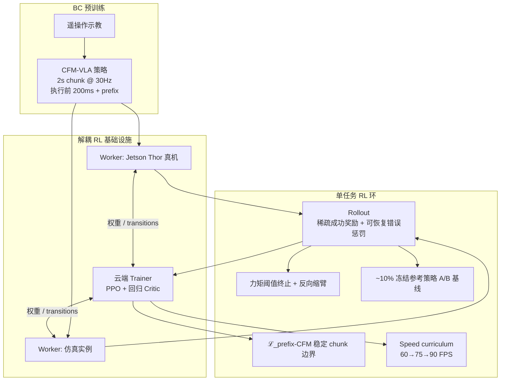

# KinetIQ Ascend（Humanoid · 真机 VLA 强化学习后训练）

**KinetIQ Ascend** 是 **Humanoid**（[thehumanoid.ai](https://thehumanoid.ai/)）在 **KinetIQ** AI 框架上发布的 **操作层（System 1）真机强化学习** 扩展：在 **条件流匹配（CFM）** 预训练的 **端到端视觉 VLA** 之上，用 **PPO** 在 **产线真实任务** 上 24/7 练习，把策略从「模仿示教」推进到 **99.9% 级工业可靠性** 与 **超人类速度** 的可预测缩放曲线。

## 一句话定义

**以 BC 预训练的 CFM-VLA 为起点，在解耦的真机 rollout 基础设施上用 PPO + 前缀 CFM 正则做稀疏奖励 RL，使双臂人形在数天 robot-time 内突破示教速度与可靠性天花板。**

## 英文缩写速查

| 缩写 | 英文全称 | 简要说明 |
|------|----------|----------|
| VLA | Vision-Language-Action | 视觉–语言–动作端到端操作策略，Humanoid System 1 核心 |
| CFM | Conditional Flow Matching | 条件流匹配动作头；π₀、GR00T 等同类生成式动作建模 |
| BC | Behavior Cloning | 遥操作示教监督预训练，RL 前的行为模态覆盖 |
| RL | Reinforcement Learning | 真机 trial-and-error 优化稀疏任务奖励 |
| PPO | Proximal Policy Optimization | 采用的 on-policy 策略梯度算法（类 Flow-SDE） |
| GAE | Generalized Advantage Estimation | PPO 优势估计，配合回归式 critic |
| FPS | Frames Per Second | 动作块回放频率；sport mode 提速课程的单位 |
| SDE | Stochastic Differential Equation | ODE 采样转 SDE 以得 tractable action log-prob |

## 为什么重要

- **直面工业部署 KPI：** 把操作机器人从「demo 级 BC」推到 **数千次/日重复、人类或更快节拍、近零失败** 的产线叙事，与纯学术 benchmark 拉开距离。
- **真机 RL 工程栈公开度高：** 解耦 **Jetson Thor 边缘采样 / 云端训练**、**sampler-trainer 数值 gap 修正**、**非平稳环境在线 A/B 基线**、**探索期力矩安全反射** 等细节，补全 [VLA 部署后训练](../methods/vla.md) 文献中偏仿真或臂部平台的空白。
- **CFM-VLA × PPO 可落地配方：** 在 Flow-GRPO、ReinFlow 等路线样本效率不足时，收敛到 **PPO + ODE→SDE 单步加噪 + prefix-CFM 损失**——对 **flow matching 动作头** 如何做 RL 微调有直接参考价值。
- **训练经济学洞见：** **仅 RL 瓶颈子阶段**、**单物体训练仍泛化**、**速度分步课程（sport mode + RL 恢复）** 降低 robot-time 成本，影响 BC→RL 管线设计。
- **与姊妹产业路线对照：** [Curr-0](./current-robotics-curr0.md) 强调三系统单策略与世界模型环；KinetIQ Ascend 强调 **已部署 VLA 的真机 RL 缩放** 与 **车队持续学习**——代表 2026 人形操作 **后训练工业化** 的另一极。

## 流程总览

## 核心结构

### KinetIQ 栈分层（博客语境）

| 层级 | 角色 | KinetIQ Ascend 关系 |
|------|------|---------------------|
| **System 0** | 全身控制（已有 RL） | 下层已成熟 |
| **System 1** | 操作 **VLA**（CFM 动作头） | **Ascend 主战场：真机视觉 RL** |
| **（未详述 System 2）** | 推理/语言层 | 博客聚焦 manipulation VLA |

硬件平台：**Alpha 双臂人形**；机载推理：**NVIDIA Jetson Thor**。

### 为何 BC 不够、RL 补什么

| BC 局限 | RL 机制 |
|---------|---------|
| 速度/质量 ≤ 示教者 | 在真实接触动力学下优化奖励，**sport mode + 分步提速课程** |
| 不见失败代价 | 稀疏成功/错误惩罚 + 安全终止 → 学「避免施力过大」 |
| 因果混淆 | 虚假相关导致任务失败 → RL 抑制长尾 |

### PPO on CFM：算法要点

- **Log-prob：** CFM 采样 ODE → 训练时转 **SDE 注入噪声**；**单随机积分步** 加噪、**末步无噪** 减抖动（近 Flow-SDE / π RL 路线）。
- **Critic：** 与 policy **权重分离**，同 BC 初始化；操纵任务 value 易学。
- **Prefix loss：** 异步 chunk 的 **prefix conditioning** 在 RL 下失稳 → 目标加 **ℒ_prefix-CFM**（masked 回归 prefix 槽位）。
- **Sampler-trainer gap：** 边缘 **bfloat16** 采样 vs 云端训练 → trainer **重算 log-prob** 修正 PPO ratio。

### 奖励与安全（通用、可扩展）

- **奖励：** \( \mathcal{R} = r_{\text{task\_success}} + \alpha \, r_{\text{recoverable\_error}} \)；**无任务专属 dense shaping**；折扣提供时间压力。
- **安全：** 主动柔顺 + **腕部力矩超限终止** + 命令反向回放；终止即负反馈。
- **非平稳：** 光照/换班/磨损 → **并发 A/B** 对比冻结参考策略，避免把环境漂移误读为 RL 增益。

### 三项产线任务（作者报告）

| 任务 | RL 范围 | Robot-time | 吞吐 | 成功率 |
|------|---------|------------|------|--------|
| **Machine feeding**（轴承环→传送带） | 仅拣选 | ~5 d | +42%（291→412/h） | pick 0.60→0.67 |
| **Picking & handover**（杂乱 tote→人） | 仅水瓶 | ~3 d | +85% | 80%→98% |
| **Bimanual tote lift** | 全任务同配方 | ~4 d | >2×（122→279/h） | 77.6%→98.9% |

**泛化发现：** 只训拣选阶段 → **传送阶段未练仍提速**；只训水瓶 → **罐/袋未见物体仍有增益**；**左/右臂条件** 未练仍遵守。

### 训练管线哲学（博客）

1. **BC 只覆盖行为模态**，部署质量由 RL 打磨。
2. **车队 = rollout worker**；监督介入即奖励信号。
3. **RL rollout → 下一代预训练数据**（零 embodiment gap）。
4. **24/7 真机 RL** 作为部署前压力测试。

## 常见误区或局限

- **不是论文：** 除上表外缺独立第三方复现；「首次端到端视觉 RL on production VLA」为 **作者自评**。
- **不等于消灭仿真：** 仿真仍用于方法迭代与数字孪生；真机 RL 是为 **部署后持续学习** 与 **零 gap** 优化。
- **稀疏奖励不是银弹：** 博客依赖 **可自动判定的成功/可恢复错误** 与成熟 BC 起点；极难重置或难检测失败的任务未讨论。
- **硬件栈未完全开源：** Alpha、Thor 栈细节与代码未随文发布。
- **与分层 WBC 路线不同：** 此处为 **端到端 VLA RL**，非「慢 VLA + 快 tracking」拼接（对照 [SONIC](../methods/sonic-motion-tracking.md) 等）。

## 关联页面

- [VLA](../methods/vla.md) — 方法抽象与部署后训练谱系
- [Behavior Cloning](../methods/behavior-cloning.md) — BC 天花板与 warm start 角色
- [Manipulation](../tasks/manipulation.md) — 操作任务与挑战
- [Bimanual Manipulation](../tasks/bimanual-manipulation.md) — 双手 tote 任务语境
- [Action Chunking](../methods/action-chunking.md) — 2s chunk、200ms 执行与 prefix 异步推理
- [Sim2Real](../concepts/sim2real.md) — 真机 RL 与 [Deployment-Ready RL](https://thehumanoid.ai/deployment-ready-rl-pitfalls-lessons-and-best-practices/) 工程实践
- [RL vs IL](../comparisons/rl-vs-il.md) — 模仿与强化选型
- [Curr-0](./current-robotics-curr0.md) — 另一套 2026 人形 loco-dex 全栈产业叙事
- [Green-VLA](./paper-greenvla-staged-vla-humanoid.md) — flow-VLA 保守 RL（IQL/噪声 actor）对照
- [ROVE](./paper-rove-humanoid-vla-intervention.md) — 人形 VLA 干预轨迹 RL 对照

## 推荐继续阅读

- Humanoid 官方：<https://thehumanoid.ai/technology/kinetiq-ascend/>
- [Deployment-Ready RL: Pitfalls, Lessons, and Best Practices](https://thehumanoid.ai/deployment-ready-rl-pitfalls-lessons-and-best-practices/) — 同公司真机 RL 工程教训
- Chen et al., *π RL: Online RL Fine-tuning for Flow-based Vision-Language-Action Models* — Flow-SDE 系 PPO 微调参考

## 参考来源

- [thehumanoid_kinetiq_ascend.md](../../sources/blogs/thehumanoid_kinetiq_ascend.md)
