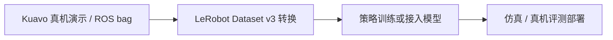

# KUAVO-VLA-1.0

**KUAVO-VLA-1.0** 是乐聚面向 Kuavo 人形机器人与工业操作场景发布的垂域视觉-语言-动作模型，目标是把任务指令、视觉观察和机器人动作策略连接起来。

## 英文缩写速查

| 缩写 | 英文全称 | 简要说明 |
|------|----------|----------|
| VLA | Vision-Language-Action | 将视觉、语言指令映射到机器人动作的策略模型 |
| LeRobot | — | 机器人数据格式与策略训练生态 |
| GPL | GNU General Public License | LeTools-Learning 代码仓声明的 GPL-3.0 许可证 |
| HF | Hugging Face | 项目模型与数据集发布的平台之一 |

## 项目定位

乐聚将该模型定位为面向 **Kuavo 本体与工业场景** 的垂域模型。官方代码仓 LeTools-Learning 提供从 ROS bag 数据转换到 LeRobot Dataset v3、策略训练、仿真与真机评测的工具链；项目资源卡则单独承载模型权重、配置和配套数据。

这里要区分 **模型本身** 与 **训练/部署框架**：LeTools-Learning 是 GPL-3.0 代码仓，公开代码可检查和运行；模型卡与数据卡虽公开可见，但当前都要求申请审核才能访问文件。代码开源不代表权重或数据自动获得相同的许可证与开放程度。

## 已公开信息与发布口径

| 项目 | 当前可核对的信息 |
|------|------------------|
| 本体与场景 | 官方仓库将模型描述为基于 Kuavo 本体与工业场景的垂域模型 |
| 工具链 | LeTools-Learning 支持 ROS bag → LeRobot Dataset v3 → 训练 → 仿真/真机部署评测 |
| 权重与配置 | Hugging Face 模型卡称仓库包含 checkpoint、tokenizer、配置与预处理文件；访问需审核 |
| 数据 | OpenLET 将配套模型与数据开放申请；HF 数据卡列出 Apache-2.0 元数据，同时要求访问审核 |
| 截图中的指标 | 600+ 小时、约 100 项工业任务、25 项任务成功率 48.27%、过程分 74.51%、成本下降 50%+ 均为发布截图所载厂商数字 |

截图中的 Benchmark 数字没有同时给出可复核的任务定义、基线版本、分母、重复次数与置信区间。比较时应先拿到完整测试协议，区分“过程得分”和最终任务成功率，并确认测试本体、夹爪配置和任务分布一致。

## 工程路径与复现边界

LeTools-Learning README 给出的通用路径是：

- 数据转换、策略训练与部署代码可以从 [LeTools-Learning](https://github.com/LejuRobotics/LeTools-Learning) 检查；仓库许可证为 GPL-3.0。
- KUAVO-VLA-1.0 模型卡独立发布权重与配置，Hugging Face 当前要求提交联系信息并通过访问审核。
- 配套数据集在 OpenLET 采用申请审核；下载和使用前应查看获批仓库中的许可、署名与再分发条件。
- 模型权重许可在当前公开可见页面中没有充分核实；不要把代码仓的 GPL-3.0 或数据卡元数据直接推断为模型权重的使用许可。
- Kuavo 关节映射、末端执行器和 ROS 接口属于本体适配的一部分；迁移至其他机器人仍需重新核对状态/动作定义、归一化和部署接口。

## 如何读发布数字

截图报告 48.27% 综合成功率与 74.51% 过程得分，二者不是同一个指标。前者通常表示最终完成任务的比例；过程得分还可能奖励中间步骤，但实际定义要以项目方 Benchmark 协议为准。截图并未提供逐项任务分数或评测代码，因此这些结果可作为后续索取技术细节的线索，不能单独证明跨场景泛化或量产稳定性。

## 局限与风险

- **访问门槛：** 关键模型与配套数据需要申请审核，当前不能视作无需限制的开放下载。
- **许可范围未完全确定：** LeTools-Learning GPL-3.0 仅说明该代码仓许可证；模型权重应以模型卡批准后的权利条款为准。
- **评测细节不足：** 截图未给出 25 项任务的完整清单、成功判据、基线配置和统计区间。
- **本体绑定：** 训练与数据围绕 Kuavo 的传感器布局、关节与末端配置；迁移到其他人形前需要适配和重新评测。
- **性能主张的来源：** 600+ 小时、成本降低 50%+ 等数字目前来自发布截图，公开 README/卡片未附可复核数据表。

## 关联页面

- [LeTools](./letools.md) — 乐聚的训练与技能软件层
- [乐聚机器人](./leju-robotics.md) — 硬件与运营方
- [OpenLET](./openlet.md) — Kuavo 真机数据社区及申请入口
- [LET-Base-Dataset](./let-base-dataset.md) — 已发布的 Kuavo 真机操作数据集
- [VLA](../methods/vla.md) — 视觉、语言到机器人动作的模型范式
- [Imitation Learning](../methods/imitation-learning.md) — 演示数据学习策略的常见路径
- [LingBot-VLA](./lingbot-vla.md) 与 [unitree_lerobot](./unitree-lerobot.md) — 可作 VLA/厂商 LeRobot 工具链对照

## 参考来源

- [KUAVO-VLA-1.0 项目页与资源归档](../../sources/sites/kuavo-vla-1.md)
- [LeTools-Learning 仓库归档](../../sources/repos/letools-learning.md)
- [LeTools-Learning GitHub README](https://github.com/LejuRobotics/LeTools-Learning)
- [Hugging Face 模型卡](https://huggingface.co/LejuRobotics/LET-KUAVO-VLA-1.0-models)
- [Hugging Face 数据集卡](https://huggingface.co/datasets/LejuRobotics/LET-KUAVO-VLA-1.0-Dataset)
- [OpenLET 社区入口](https://openlet.openatom.tech/)

## 推荐继续阅读

- [VLA 纵深路线](../../roadmap/depth-vla.md)
- [具身数据纵深路线](../../roadmap/depth-embodied-data.md)
- [LeTools-Learning](https://github.com/LejuRobotics/LeTools-Learning)
- [KUAVO-VLA-1.0 模型权重](https://huggingface.co/LejuRobotics/LET-KUAVO-VLA-1.0-models)
- [KUAVO-VLA-1.0 配套数据集](https://huggingface.co/datasets/LejuRobotics/LET-KUAVO-VLA-1.0-Dataset)
