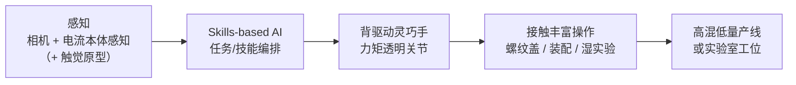

# Kyber Labs

## 一句话定义

**Kyber Labs** 是一家 Brooklyn（Newlab）初创公司，自 **2022** 年起公开叙事为 **「为 AI 控制而设计的机器人操作平台」**：核心是 **双臂 + 仿人灵巧手**，强调 **全背驱动（backdrivable）、力矩透明、机械柔顺与数百美元级成本目标**；软件侧以 **skills-based AI** 支撑实验室与工业 **高混低量** 任务，并明确 **不做人形整机**——价值在「手能做什么」，底座可为工位、导轨或轮式平台。

## 英文缩写速查

| 缩写 | 英文全称 | 简要说明 |
|------|----------|----------|
| AI | Artificial Intelligence | 人工智能 |
| BLDC | Brushless DC Motor | 无刷直流电机，常见于直驱关节 |
| DoF | Degrees of Freedom | 自由度，灵巧手关节/驱动维度 |
| Embodied AI | Embodied Artificial Intelligence | 具身智能：感知–行动闭环中的学习与部署 |
| Manipulation | Robot Manipulation | 抓取、移动、操作物体的任务总称 |
| Proprioception | Proprioceptive Sensing | 本体感知，此处常指通过电机电流/力矩估计接触与负载 |

## 为什么重要

- **灵巧手 × 具身 AI 的产业样本**：与科研常用 [Allegro Hand](./allegro-hand.md)、国内 [舞肌 Wuji Hand](./wuji-robotics.md) 等形成对照——Kyber 把 **背驱动、电流接触感知、低成本数据采集** 写进产品 thesis，而非仅堆 DoF 或触觉密度。
- **「反人形」定位可检索**：FAQ 直言人形价值在 **手与真实任务**；对读 [人形机器人](./humanoid-robot.md) 整机叙事与 [Manipulation](../tasks/manipulation.md) 落地路径有锚点。
- **湿实验 / 装配 demo 可复现讨论**：官网公开 **无遥操作一镜到底** 的病理实验室流程、**螺纹盖/vial** 与 **fastener 装配**，适合与 [灵巧手运动学](../concepts/dexterous-kinematics.md)、[触觉感知](../concepts/tactile-sensing.md) 及 [执行器柔顺与感知地图](../overview/humanoid-actuator-102-compliance-sensing.md) 交叉。

## 核心信息

| 维度 | 公开表述（归纳） | 备注 |
|------|------------------|------|
| **机构** | Kyber Labs | 总部 Brooklyn, NY（Newlab Studio 204） |
| **官网** | [kyberlabs.ai](https://kyberlabs.ai/) | Home / Demos / FAQ / Contact |
| **产品形态** | **双臂 + 仿人灵巧手** 操作平台 | 可接 COTS 机械臂、相机与计算单元（访谈中归纳） |
| **硬件哲学** | **背驱动、力矩透明、机械柔顺、低成本** | 目标 **数百美元** 级而非数千美元（FAQ） |
| **感知** | 驱动电流接触感知 + **自研低成本触觉原型**（demo 未启用） | Demos 页 |
| **软件** | **Skills-based AI** | 强调泛化与工业工作流可靠性 |
| **目标场景** | 装配、机床上下料、湿实验室等高混低量任务 | FAQ + Demos |
| **人形立场** | **不做整机人形** | 「价值在手能做什么」 |
| **团队** | Tyler Habowski（Cofounder, ex-SpaceX）、Yonatan Robbins（Cofounder, 工业设计/Tarform）、Julian Viereck（Robotics RS, NYU PhD） | 首页 |
| **联系** | hello@kyberlabs.ai · @KyberLabsRobots | — |

## 流程总览

官网 demo 将 **硬件柔顺** 与 **技能层 AI** 串成可部署闭环（非遥操作、一镜到底为公开验收口径）：

## 公开 Demo 要点（归纳）

| 类别 | 能力展示 | 设计论点 |
|------|----------|----------|
| **湿实验** | 固体转移、100 次随机 vial 开盖旋紧 | 真实实验室工作流；螺纹为高难度接触任务 |
| **工业装配** | SpaceX 风格零件序列：插入、螺母旋紧、手内操作 | 低产量无需专用线；通用硬件可快速改线 |
| **柔顺交互** | 高速螺母顺应、羽毛停指、软浆果抓取 | 硬件承担变异性，简化控制栈与学习信号 |

## 常见误区或局限

- **「数百美元」≠ 已公开 SKU 与 datasheet**：FAQ 说的是设计优先级，**尚无完整规格表与量产交付时间表**；引用扭矩、DoF、重量应等官方披露。
- **Demo 视频 ≠ 可复现论文级基准**：一镜到底与无遥操作是强有力的产品叙事，但 **缺少公开 SDK/URDF/基准任务定义** 时不宜与 Allegro/Wuji 等科研平台直接等同。
- **二手报道中的 20 DoF / 40 腱等数字**：播客与媒体可能超前于官网；**以 kyberlabs.ai 正文为准**，细节见 [原始资料](../../sources/sites/kyberlabs-ai.md) 二手索引。
- **「不做人形」≠ 不做双足**：FAQ 允许未来 **腿式底座**；当前公开重点是 **手 + 双臂 + 固定/移动底座**。

## 关联页面

- [Manipulation 任务](../tasks/manipulation.md)
- [灵巧手运动学](../concepts/dexterous-kinematics.md)
- [触觉感知](../concepts/tactile-sensing.md)
- [Humanoid 执行器 102 · 柔顺与感知](../overview/humanoid-actuator-102-compliance-sensing.md)
- [市面知名机器人平台纵览](../overview/notable-commercial-robot-platforms.md)
- [舞肌科技 / Wuji Hand](./wuji-robotics.md) — 同为 **20 主动 DoF 级** 五指灵巧手产业对照
- [Allegro Hand](./allegro-hand.md) — 科研灵巧操作主流硬件参照
- [人形机器人](./humanoid-robot.md) — 整机语境下的末端与「反人形」定位对照

## 参考来源

- [Kyber Labs 官网原始资料汇编](../../sources/sites/kyberlabs-ai.md)

## 推荐继续阅读

- [Kyber Labs 官网 Demos](https://kyberlabs.ai/demos)
- [Kyber Labs FAQ](https://kyberlabs.ai/faq)
- [Humanoids Daily · Kyber Labs 背驱动灵巧手报道](https://www.humanoidsdaily.com/news/kyber-labs-emerges-with-a-high-speed-backdrivable-robotic-hand)（二手策展索引）
