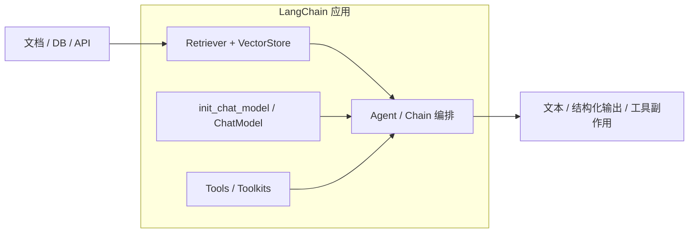
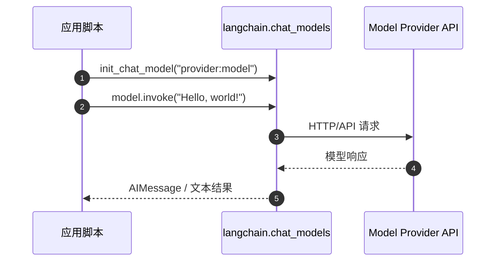

# LangChain

**LangChain**（[GitHub: langchain-ai/langchain](https://github.com/langchain-ai/langchain)，[langchain.com](https://www.langchain.com/)）是 **agent 与 LLM 应用** 的组件化框架：把聊天模型、embedding、向量库、检索器、工具调用等收成 **可互换接口**，便于 **RAG、agent 工具环、多模型实验**。官方自述为 *The agent engineering platform*。同公司栈内：**[LangGraph](./langgraph.md)**（有状态编排）、**[Deep Agents](./deep-agents.md)**（开箱 harness）、**[LangSmith](./langsmith.md)**（商业 eval/trace/部署）；组织索引见 **[langchain-ai](./langchain-ai.md)**。

## 一句话定义

**用标准组件把「检索 → 拼上下文 → 调模型 → 调工具」串成可维护的 LLM/agent 管线，并借集成目录快速接第三方模型与数据面。**

## 英文缩写速查

| 缩写 | 英文全称 | 简要说明 |
|------|----------|----------|
| LC | LangChain | 本页框架与 PyPI 包族 |
| RAG | Retrieval-Augmented Generation | 检索增强生成；LangChain 常见编排场景 |
| LLM | Large Language Model | 框架核心调用对象 |
| MCP | Model Context Protocol | 工具/上下文协议；可与 agent 工具生态并列选型 |
| OSS | Open Source Software | 核心框架 MIT 开源 |

## 为什么重要（对本知识库读者）

- **RAG 与 agent 的默认「工业胶水」之一：** [RAG 概念页](../concepts/retrieval-augmented-generation.md) 中的 retriever、document loader、chain 抽象，LangChain 提供 **现成模块 + 集成目录**，适合 **企业知识库、日志 grounding、仿真文档问答** 等 **非运动学** 层。
- **与具身控制栈正交：** 四足/人形 **cmd_vel、策略网络、sim 物理** 仍由 RL/VLA/ROS 栈负责；LangChain 多出现在 **自然语言任务接口、安全模板检索、运维 runbook agent**（例：SafeHumanoid 式 FAISS 模板库在概念上接近 RAG，实现未必用 LC）。
- **对照自研 agent 环：** [OpenClaw](./openclaw.md)、[ScienceDiscovery](./sciencediscovery.md) 文档明确 **不用 LangChain/LangGraph**——选型时需分清 **「集成广度」** vs **「单一运行时可控性」**。
- **Physical AI 清单锚点：** 亦收录于 awesome-physical-ai **#125**（[painode-125-langchain](./painode-125-langchain.md) 保留清单元数据）。

## 核心结构

### 生态分层（官方文档）

| 产品 | 角色 | 知识库实体 |
|------|------|------------|
| **LangChain（本仓）** | 组件、模型初始化、集成、快速原型 | 本页 |
| **LangGraph** | 低层 **可控** agent 工作流 | [LangGraph](./langgraph.md) |
| **Deep Agents** | 规划、子 agent、文件系统等 **高层 harness** | [Deep Agents](./deep-agents.md) |
| **LangSmith** | Evals、tracing、调试与部署（商业） | [LangSmith](./langsmith.md) |

### Monorepo（`libs/`）

| 路径 | 说明 |
|------|------|
| `libs/core` | 核心抽象 |
| `libs/langchain_v1` | 当前主线 `langchain` 包 |
| `libs/langchain` | classic 线 |
| `libs/partners` | 团队直维护的部分 provider 包；**多数集成已外迁** |
| `libs/text-splitters` | 分块工具 |

### 流程总览（RAG + tool agent）

## 工程实践

| 场景 | 做法 |
|------|------|
| **最小聊天** | `uv add langchain`；`init_chat_model("provider:model")`（见官方 README） |
| **Naive RAG** | Document loader → text splitter → embedding → vector store → retriever → prompt 拼接 → model |
| **可控长任务 agent** | 评估是否 **升格 LangGraph**（循环、检查点、人工审批）而非单层 chain |
| **集成选型** | 以 [Integrations 文档](https://docs.langchain.com/oss/python/integrations/providers/overview) 为准；外迁包版本 **独立于 monorepo** |
| **生产** | latency、retrieval hit rate、faithfulness；LangSmith 或自建 tracing |
| **机器人项目** | 把 LC 放在 **语义/运维/agent 层**；真机安全闸门仍在 **Gateway / 运动 SDK**（对照 [Philia](./philia.md) 叙事） |

### 源码运行时序图（最小 invoke）

图对应 README Quickstart；RAG/agent 路径在 retriever 与 tool 节点扩展，详见 [`sources/repos/langchain.md`](../../sources/repos/langchain.md)。

## 局限与风险

- **抽象层厚度：** 快速原型友好，深度定制需读清 **v1 vs classic** 与 **外迁集成** 版本，避免教程与 import 路径不一致。
- **LangSmith 叙事：** 文档强关联商业观测产品；**离线/自托管** 需自备 eval 与 trace。
- **≠ 具身运动栈：** 清单摘要 *Building agents with tools* 易被误读为「机器人整机框架」；本库仍将其标为 **Frameworks & Libraries** 层的 **LLM agent 编排**。
- **非唯一 agent 运行时：** 与 [Hermes Agent](./hermes-agent.md)、OpenClaw 等 **并行存在**；ScienceDiscovery 类项目 **刻意避开** LangChain 依赖。

## 关联页面

- [LangGraph](./langgraph.md)
- [Deep Agents](./deep-agents.md)
- [LangSmith](./langsmith.md)
- [langchain-ai 组织](./langchain-ai.md)
- [Retrieval-Augmented Generation（RAG）](../concepts/retrieval-augmented-generation.md)
- [OpenClaw](./openclaw.md)
- [Hermes Agent](./hermes-agent.md)
- [ScienceDiscovery](./sciencediscovery.md)
- [Easy-Vibe](./easy-vibe.md)
- [awesome-physical-ai #125（清单节点）](./painode-125-langchain.md)

## 参考来源

- [`sources/sites/langchain-com-ecosystem.md`](../../sources/sites/langchain-com-ecosystem.md) — 产品页与生态入口
- [`sources/repos/langchain.md`](../../sources/repos/langchain.md) — 主仓结构与开源核查
- [`sources/sites/langchain-docs.md`](../../sources/sites/langchain-docs.md) — 官方文档入口
- [`sources/repos/pai_awesome_resource_125_langchain.md`](../../sources/repos/pai_awesome_resource_125_langchain.md) — Physical AI 清单摘录

## 推荐继续阅读

- [LangGraph 实体页](./langgraph.md)
- [Deep Agents 实体页](./deep-agents.md)
- [LangSmith 实体页](./langsmith.md)
- [LangChain Python 文档](https://docs.langchain.com/oss/python/langchain/overview)
- [原文 / GitHub 主仓](https://github.com/langchain-ai/langchain)
