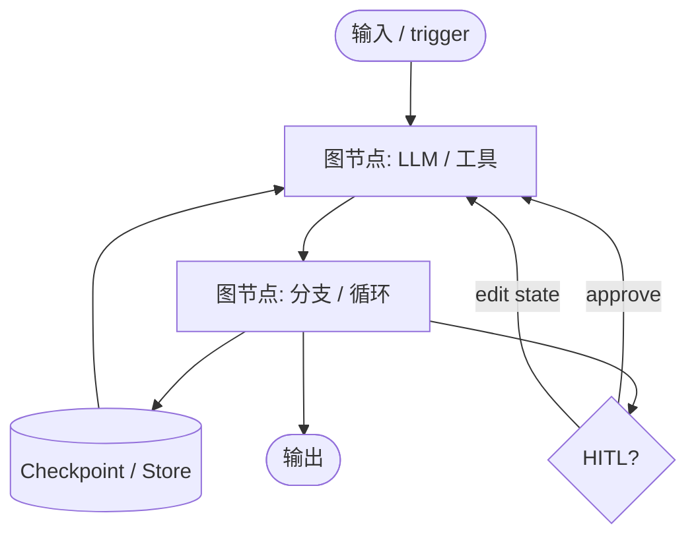
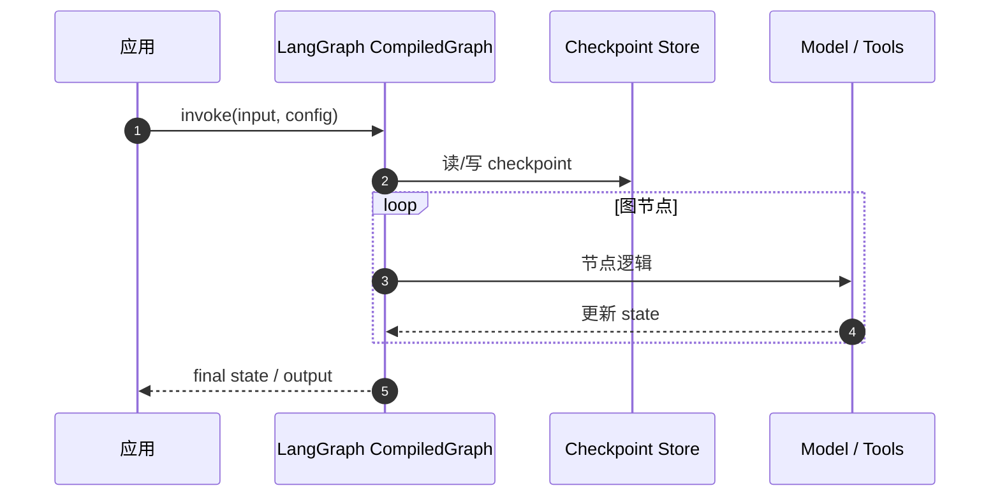

# LangGraph

**LangGraph**（[GitHub: langchain-ai/langgraph](https://github.com/langchain-ai/langgraph)）是 **低层编排框架**，用于构建 **长时、有状态** 的 agent 与 workflow：支持 **失败恢复（durable execution）**、**human-in-the-loop**、**短期/长期记忆**，并与 [LangSmith](./langsmith.md) 的 trace/deployment 叙事衔接。

## 一句话定义

**把 agent 写成显式状态图（节点 + 边 + checkpoint），而不是单层 chain——以便循环、分支、暂停与人审。**

## 英文缩写速查

| 缩写 | 英文全称 | 简要说明 |
|------|----------|----------|
| LG | LangGraph | 本页编排框架 |
| HITL | Human-in-the-Loop | 执行中暂停/改状态/审批 |
| LC | LangChain | 上层组件库，常与 LangGraph 组合 |
| OSS | Open Source Software | MIT 开源 |

## 为什么重要

- **RAG / tool agent 的「升格路径」：** [LangChain](./langchain.md) 适合原型；当需要 **多步循环、持久会话、审批** 时，文档与社区默认 **迁到 LangGraph**。
- **Deep Agents 的运行时：** [Deep Agents](./deep-agents.md) 开箱 harness **构建在 LangGraph 之上**（streaming、persistence、checkpointing）。
- **机器人侧读法：** 可用于 **运维 runbook agent、多阶段诊断、长时任务规划**；不替代运动控制环。CAD/多 agent 示例见 [Multi-Agent CAD](./multi-agent-cad.md)（仓库 topic 含 `langgraph`）。

## 核心结构

| 能力 | 文档主题（归纳） |
|------|------------------|
| Durable execution | 故障后从 checkpoint 恢复 |
| Human-in-the-loop | interrupts / 状态 inspect & patch |
| Memory | 工作记忆 + 跨会话持久化 |
| Observability | 与 LangSmith trace 联动 |
| Deployment | LangSmith Deployment（商业托管） |

## 工程实践

| 场景 | 做法 |
|------|------|
| **安装** | `pip install -U langgraph` |
| **从 LangChain 升级** | 把 chain 拆成 **StateGraph** 节点；显式定义 state schema |
| **JS/TS** | [langgraphjs](https://github.com/langchain-ai/langgraphjs) + [JS 文档](https://docs.langchain.com/oss/javascript/langgraph/overview) |
| **学习实现** | [deep-agents-from-scratch](https://github.com/langchain-ai/deep-agents-from-scratch) 教程仓 |
| **生产 trace** | LangSmith 或自建 OpenTelemetry |

### 源码运行时序图（概念级 invoke）

## 局限与风险

- **复杂度：** 图式编排比 chain 更重；简单 RAG 问答不必上图。
- **LangSmith 绑定叙事：** 调试/部署文档常指向 **商业** LangSmith；可离线开发但生产观测需替代方案。
- **版本与 API：** Python / JS 双线维护，集成版本需与 LangChain 包对齐。

## 关联页面

- [LangChain](./langchain.md)
- [Deep Agents](./deep-agents.md)
- [LangSmith](./langsmith.md)
- [langchain-ai 组织](./langchain-ai.md)
- [Easy-Vibe](./easy-vibe.md)（Stage 3 LangGraph 高级 RAG）

## 参考来源

- [`sources/repos/langgraph.md`](../../sources/repos/langgraph.md)
- [`sources/sites/langchain-com-ecosystem.md`](../../sources/sites/langchain-com-ecosystem.md)

## 推荐继续阅读

- [LangGraph 文档](https://docs.langchain.com/oss/python/langgraph/overview)
- [产品页](https://www.langchain.com/langgraph)
- [GitHub 主仓](https://github.com/langchain-ai/langgraph)
