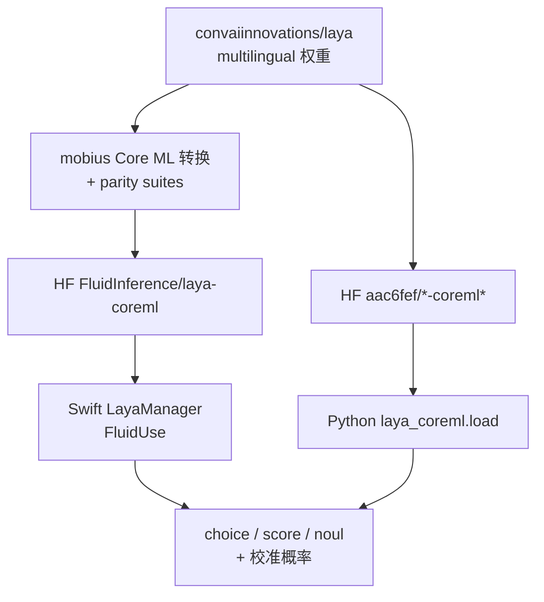
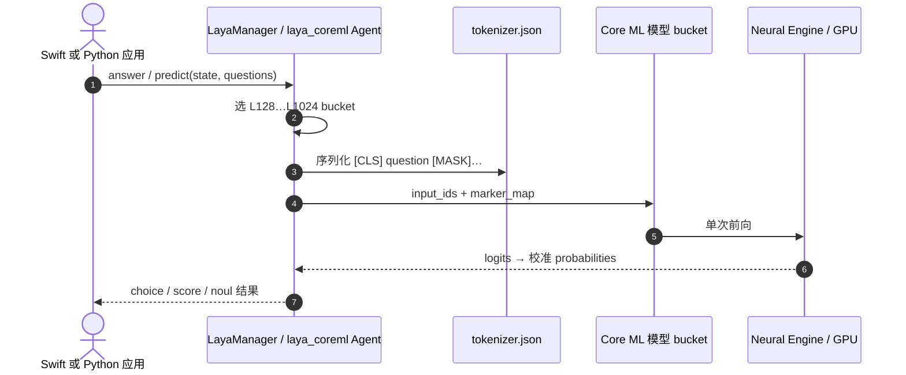

# Laya-CoreML（Apple Neural Engine 运行时）

**Laya-CoreML** 指把 [Laya](./laya.md) **322M multilingual**（及英文/typed 变体）转到 **Apple Core ML** 后在设备上跑 **choice / score / noul** 的两条 **已发布** 路径：

1. **Swift / FluidInference** — [HF `FluidInference/laya-coreml`](https://huggingface.co/FluidInference/laya-coreml) + [FluidUse](./fluiduse.md) 的 `LayaManager`（多 token bucket、mobius 转换与 parity suite）。
2. **Python / 社区** — [PyPI `laya-coreml`](https://pypi.org/project/laya-coreml/)（[mizorewww/laya-coreml](https://github.com/mizorewww/laya-coreml)），[Made with Laya 收据页](https://www.madewithlaya.com/builds/laya-coreml) 主推 **ANE L96** Snake 与能耗 benchmark。

二者均 **Apache-2.0**、**非 Convai 官方**，权重 lineage 来自 [convaiinnovations/laya](https://huggingface.co/convaiinnovations/laya)。

## 一句话定义

**同一 Laya typed-decision 语义，在 Apple Silicon 上用 Core ML（尤其 Neural Engine）换 PyTorch/MLX 运行时——毫秒级、零生成 token、可离线。**

## 英文缩写速查

| 缩写 | 英文全称 | 简要说明 |
|------|----------|----------|
| Core ML | Apple Core ML | iOS/macOS 统一模型运行时 |
| ANE | Apple Neural Engine | 低功耗矩阵加速；短序列 bucket 常用 |
| S1 | System One | 单次前向 structured decision |
| HF | Hugging Face | FluidInference 与 aac6fef 等权重托管 |
| FP16 / e8 | 16-bit float / 8-bit embedding table | FluidInference 提供 e8 体积优化变体 |
| MLX | Apple MLX | [Laya-MLX](./laya-mlx.md) 推理后端；Core ML 收据常与之对比能耗 |

## 为什么重要

- **延迟与能耗：** M5 Pro 上 L128 **~3.6 ms**（CPU+ANE）；M3 Max Python ANE 路径 **4.98 ms P50**，相对 compiled MLX 约 **2.78×** 更低系统能耗/决策（见 ANE benchmark）。
- **与 [Laya-MLX](./laya-mlx.md) 分工：** MLX 适合 **Python agent 栈** 与 **75+ moves/s Snake**；Core ML 适合 **Swift 原生 App、FluidUse harness、系统级 ANE 调度**。
- **校准保留：** FluidInference 桶在 **3899 问** 公开 suite 上与 PyTorch reference **逐套准确率对齐**；Python 端口在 fixture 级 **189/189**（通用 FP16）与 **59/59**（ANE L96）通过漂移门限。
- **System 1 选型：** 与 [Jev](./typesafe-jev.md) 闭源 API 对照时，Core ML 路径提供 **可审计的本地概率输出**，适合 guardrail、triage、游戏策略 ablation（Tetris clean-placement `noul`）。

## 核心信息

| 栈 | 消费方 | 权重入口 | 典型延迟（公开数字） |
|----|--------|----------|----------------------|
| **FluidInference** | `LayaManager` / `FluidUseLaya` CLI | [FluidInference/laya-coreml](https://huggingface.co/FluidInference/laya-coreml) | L128 **3.6 ms**（M5 Pro，CPU+ANE） |
| **Python mizorewww** | `import laya_coreml` / `laya-coreml-snake` | e.g. [aac6fef/laya-multilingual-coreml-ane](https://huggingface.co/aac6fef/laya-multilingual-coreml-ane) | **4.98 ms P50**（M3 Max，ANE FP16 单问） |

| 项 | 内容 |
|----|------|
| **上游** | [NandhaKishorM/laya](https://github.com/NandhaKishorM/laya) · multilingual @ `1c5edc17…` |
| **转换** | [mobius …/laya/coreml](https://github.com/FluidInference/mobius/tree/main/models/computer-use/laya/coreml)（Swift）；Python 仓内 `laya-coreml convert` |
| **开源** | **已开源**（双栈均已发布代码 + HF 权重） |

### FluidInference bucket（Swift）

| 文件模式 | Token 上限 | 算力提示 |
|----------|------------|----------|
| `laya_multilingual_fp16_L128_options32` | 128 | 短 prompt；**CPU + ANE** |
| L256 / L512 / L1024 | 256–1024 | 长 state；GPU 常优于纯 ANE（L512 **9.0 ms** all units） |
| `laya_multilingual_e8_L*` | 同左 | int8 embedding table；~30% 体积，精度 -0.5 pt 内 |

### Python bundle（节选）

| HF bundle | 引擎 | 容量 | 用途 |
|-----------|------|------|------|
| Multilingual ANE | CPU + ANE | B1 / **L96** | 短决策；超 cap 报错 |
| Multilingual 1024 | CPU + GPU | 1024 | 通用长上下文 |
| Snake GPU | CPU + GPU | B3 / L64 | 三问 batch 游戏环 |

## 流程总览

## 工程实践

| 主题 | 建议 |
|------|------|
| **Swift 集成** | `try await LayaManager.load()`；按 prompt 长度自动选 **最小可用 bucket**；长 state **右截断** 同 upstream `max_len` |
| **Python 快速试** | `pip install laya-coreml`；短句用 ANE bundle，**96 token 总预算**（含 question+options+state） |
| **Demo** | Swift：`FluidUseLaya tetris` / `LayaTetrisDemo`；Python：`pip install 'laya-coreml[demo]'` + `laya-coreml-snake` |
| **勿混权重** | Swift 只认 **FluidInference** `.mlmodelc` 布局；Python wheel 认 **aac6fef** 等打包结构 |
| **对比 MLX** | 需要 Python agent 且已用 [Laya-MLX](./laya-mlx.md) 时，Core ML 是 **原生 App / 能耗敏感** 备选，不是 drop-in 替换 |

## 局限与风险

- **平台：** 仅 Apple Silicon macOS（Python 另要求 macOS 15+ for 部分 ANE 路径）；无 Linux 机器人机载官方包。
- **上下文分裂：** ANE 短 cap（96/128）与 1024 bucket **延迟差一个数量级**（L1024 ~80 ms ANE-only）；勿用短句 benchmark 外推长上下文。
- **量化边界：** 6/4-bit palette 未过 parity gate **未发布**；e8 仅 embedding table，encoder 仍 FP16 计算。
- **非官方端口：** 训练与 RLCD 仍回 [Laya](./laya.md) PyTorch；Core ML 层变更需跟 mobius / Python 仓 release notes。

## 源码运行时序图

## 关联页面

- [FluidUse（计算机使用 harness）](./fluiduse.md)
- [Laya（上游 System 1）](./laya.md)
- [Laya-MLX（MLX 端口）](./laya-mlx.md)
- [Jev（TypeSafe System One）](./typesafe-jev.md)

## 参考来源

- [laya-coreml-fluidinference.md](../../sources/repos/laya-coreml-fluidinference.md)
- [laya-coreml-python.md](../../sources/repos/laya-coreml-python.md)
- [madewithlaya-laya-coreml.md](../../sources/sites/madewithlaya-laya-coreml.md)

## 推荐继续阅读

- [FluidUse Benchmarks.md](https://github.com/FluidInference/FluidUse/blob/main/Benchmarks.md)
- [Python ANE_BENCHMARKS.md](https://github.com/mizorewww/laya-coreml/blob/main/docs/ANE_BENCHMARKS.md)
- [HF FluidInference/laya-coreml](https://huggingface.co/FluidInference/laya-coreml)
- [Made with Laya — Laya-CoreML 收据](https://www.madewithlaya.com/builds/laya-coreml)
