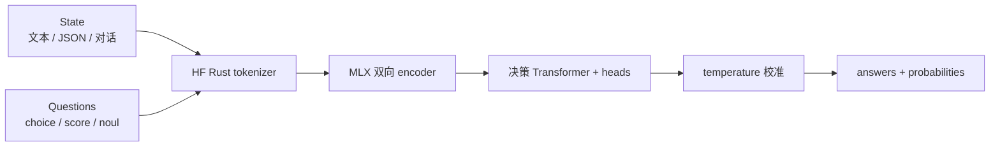
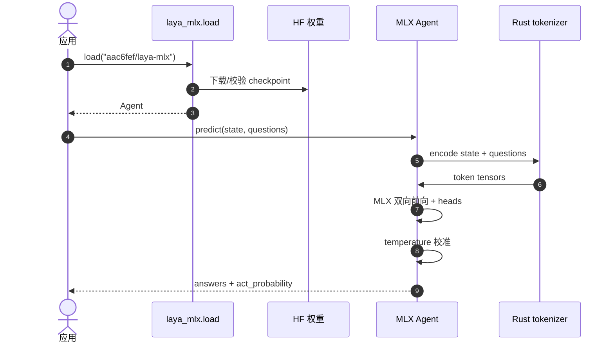

# Laya-MLX（Apple Silicon MLX 运行时）

**Laya-MLX**（[GitHub](https://github.com/mizorewww/laya-mlx)，[PyPI](https://pypi.org/project/laya-mlx/)）是 [Laya](./laya.md) typed decision 模型的 **社区独立 MLX 端口**：在 Apple Silicon 上 **本地、无 PyTorch/Transformers 运行时、无云 API** 跑 `choice` / `score` / `noul` 决策。预转换 FP16 权重托管于 [aac6fef/laya-mlx](https://huggingface.co/aac6fef/laya-mlx) 等三仓；**非 Convai Innovations 官方发布**。

## 一句话定义

**把 Laya 的「单次前向 typed 决策」搬到 MLX 上——Apple Silicon 毫秒级本地推理，保留上游 schema 与校准，训练仍回上游 PyTorch 栈。**

## 英文缩写速查

| 缩写 | 英文全称 | 简要说明 |
|------|----------|----------|
| MLX | Apple MLX | Apple 机器学习框架；本运行时推理后端 |
| S1 | System One | 与 Chat LLM 对标的快速结构化决策层 |
| FP16 | 16-bit Floating Point | 默认推理精度；P50 延迟基准 |
| HF | Hugging Face | 预转换 MLX 权重托管 |
| CLI | Command Line Interface | `laya-mlx predict` / `laya-snake` |

## 为什么重要

- **Apple Silicon 本地部署：** MacBook / Mac Studio 上 agent 路由、guardrail、triage 可 **<15 ms** 单问，无需 GPU 云或 PyTorch 栈；适合与 [VLA](../methods/vla.md) 或 [行为树编排](../concepts/behavior-tree-vla-orchestration.md) 并行的 **边缘 System 1**。
- **与上游 [Laya](./laya.md) 分工：** 上游提供 RLCD 训练、PyPI `laya`、Convai 官方权重；本端口专注 **MLX 推理 + 权重转换 + Snake 等可复现实验**。
- **与 [Jev](./typesafe-jev.md) 对照：** Jev 为闭源 API；Laya-MLX 走 **开权重 + 全本地**，延迟数字在 M3 Max 上可自证（见仓内 `BENCHMARKS.md`）。
- **与 [Laya-CoreML](./laya-coreml.md) 对照：** 同作者生态的 **Core ML / ANE** 路径在短问上常 **更快且更省电**（见 Made with Laya 收据）；MLX 仍适合纯 Python agent 与 `laya-snake` 高吞吐实验。

## 核心信息

| 项 | 内容 |
|----|------|
| **维护者** | mizorewww（社区端口） |
| **上游** | [NandhaKishorM/laya](https://github.com/NandhaKishorM/laya)（Convai Innovations） |
| **代码** | [mizorewww/laya-mlx](https://github.com/mizorewww/laya-mlx) |
| **安装** | `pip install laya-mlx` |
| **HF 权重** | [laya-mlx](https://huggingface.co/aac6fef/laya-mlx)、[laya-multilingual-mlx](https://huggingface.co/aac6fef/laya-multilingual-mlx)、[laya-typed-decisions-mlx](https://huggingface.co/aac6fef/laya-typed-decisions-mlx) |
| **许可** | Apache-2.0 |
| **平台** | Apple Silicon，macOS 14+，Python 3.11+ |
| **开源** | **已开源**（代码 + 预转换权重 + PyPI）；**非官方 Convai 发行** |

### M3 Max 性能（FP16，仓内 benchmark）

| Checkpoint | 参数量 | 单问 P50 | 50 问吞吐 |
|------------|--------|----------|-----------|
| 英文 421M | 421M | **13.42 ms** | 146.8 q/s |
| 多语言 322M | 322M | **7.39 ms** | 395.0 q/s |

测量含 prompt 准备、tokenize、同步推理、校准与格式化；不含模型加载。环境与完整样本见上游 README `BENCHMARKS.md`。

## 流程总览

## 工程实践

| 主题 | 建议 |
|------|------|
| **快速上手** | `pip install laya-mlx` → `laya.load("aac6fef/laya-mlx")` → `agent.predict(state, questions)` |
| **多语言** | 非拉丁脚本用 `aac6fef/laya-multilingual-mlx` 或 `Router`；勿用英文 checkpoint 替代 |
| **精度** | 默认 FP16；需更贴近上游数值时用 `dtype="float32"` |
| **吞吐** | 多问场景增大 `batch_size`（默认 16）；内存允许可试 64 |
| **重复负载** | `compile=True`、`cache_prompts=True`、`pad_to_multiple=16` 在 Snake demo 上约 **+6.5%** moves/s |
| **离线 demo** | `pip install 'laya-mlx[demo]'` + `hf download aac6fef/laya-multilingual-mlx` → `laya-snake` |
| **自转换权重** | `laya-mlx convert --model convaiinnovations/laya --dtype float16 --output models/...` |

## 局限与风险

- **平台锁定：** 仅 Apple Silicon + MLX；Linux/CUDA 部署仍用上游 [Laya](./laya.md) PyTorch 栈。
- **非官方端口：** Bug、版本滞后、与 Convai 路线图无绑定；生产前跑仓内 `benchmarks.validate` 与 fixture 对照。
- **保真范围：** 378/378 为 **固定验证集** 标签一致；概率在 FP16 下可有微小偏差，选型看 **选中标签 + 门控阈值** 是否稳定。
- **训练不在本仓：** 微调与 RLCD 仍在上游；本仓只做推理与 FP16 导出。

## 源码运行时序图

## 关联页面

- [Laya（System 1 决策引擎）](./laya.md)
- [Laya-CoreML（Neural Engine 运行时）](./laya-coreml.md)
- [Jev（TypeSafe System One）](./typesafe-jev.md)
- [LLM 机器人控制接口](../concepts/llm-robotics-control-interfaces.md)
- [行为树 × VLA 编排](../concepts/behavior-tree-vla-orchestration.md)

## 参考来源

- [laya-mlx.md](../../sources/repos/laya-mlx.md)
- [laya.md](../../sources/repos/laya.md)

## 推荐继续阅读

- [GitHub README](https://github.com/mizorewww/laya-mlx)
- [BENCHMARKS.md](https://github.com/mizorewww/laya-mlx/blob/main/BENCHMARKS.md)
- [Snake demo 文档](https://github.com/mizorewww/laya-mlx/blob/main/docs/SNAKE_DEMO.md)
