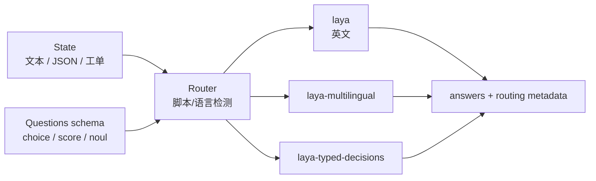
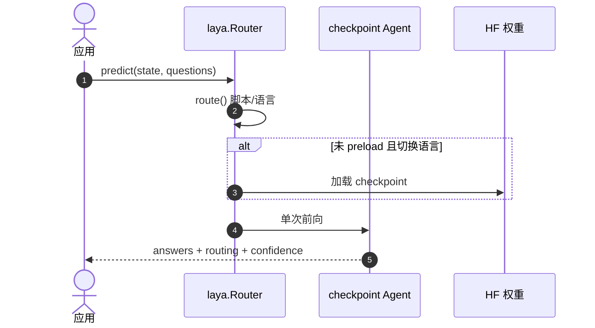

# Laya（System 1 决策引擎）

**Laya**（[GitHub](https://github.com/NandhaKishorM/laya)，[PyPI](https://pypi.org/project/laya/)，[HF 权重](https://huggingface.co/convaiinnovations/laya)）由 **Convai Innovations** 发布：**多语言、非自回归** 的 **System 1 决策引擎**——对任意结构化 state 在**一次前向**回答预定义 typed questions，不生成待解析的自由文本。

## 一句话定义

**把「LLM 吐 JSON 再校验」换成「单次前向、schema 固定的概率决策函数」——毫秒级路由、门控与分类，权重可自托管。**

## 英文缩写速查

| 缩写 | 英文全称 | 简要说明 |
|------|----------|----------|
| S1 | System One | 与 Chat LLM 对标的快速结构化决策层 |
| RLCD | Reinforcement Learning for Calibrated Decisions | 严格 proper scoring rule 的 RL 训练目标 |
| ECE | Expected Calibration Error | 置信度校准误差；越低越可当作门控阈值 |
| HF | Hugging Face | 权重与 Demo Space 托管 |
| API | Application Programming Interface | `laya.load` / `Router.predict` Python 接口 |

## 为什么重要

- **与 [Jev](./typesafe-jev.md) / [Valen](./valen.md) 同谱对照：** 三者都是 System 1 typed decision；Jev 为 **闭源 API + 开源 SDK**，Laya 为 **Apache 2.0 文本权重 + 自托管**，Valen 为 **Apache 2.0 多模态（Qwen3.5 + 决策头）+ 游戏/General 数据开源**。
- **机器人/agent 编排：** 适合 ticket triage、guardrail、模型路由等 **<50 ms** 分支，与 [VLA](../methods/vla.md) chunk 或 [行为树编排](../concepts/behavior-tree-vla-orchestration.md) **异步** 并存。
- **Apple Silicon 本地栈：** 社区 [Laya-MLX](./laya-mlx.md) 端口在 M3 Max 上单问约 **7–14 ms**（无 PyTorch）；[Laya-CoreML](./laya-coreml.md) 在 Neural Engine 上可达 **~3.6–5 ms**（Swift [FluidUse](./fluiduse.md) 或 Python `laya-coreml`），适合 Mac 边缘 agent 门控。
- **多语言部署：** `Router` 在英文 ModernBERT 与 mmBERT 多语言 checkpoint 间切换，避免英文模型在非拉丁脚本上「高置信全错」（如 Khmer 0.000 acc @ 0.952 conf）。

## 核心信息

| 项 | 内容 |
|----|------|
| **机构** | 康维创新（Convai Innovations）；作者 Nandha Kishor M |
| **代码** | [NandhaKishorM/laya](https://github.com/NandhaKishorM/laya) |
| **权重** | [convaiinnovations/laya](https://huggingface.co/convaiinnovations/laya)（`multilingual`、`typed-decisions` 子目录） |
| **安装** | `pip install laya` |
| **许可** | Apache-2.0 |
| **开源** | **已开源**（代码 + 权重 + PyPI） |

### 三 checkpoint

| Checkpoint | 编码器 | 参数量 | 上下文 | 适用 |
|------------|--------|--------|--------|------|
| `laya` | ModernBERT-large | 421M | 512 | 英文 |
| `laya-multilingual` | mmBERT-base | 322M | 1024 | 100+ 语言 |
| `laya-typed-decisions` | ModernBERT-large | 421M | 1024 | 工作流微调（triage/router/guard 等） |

### 决策原语

| 类型 | 输出 | 典型用途 |
|------|------|----------|
| `choice` | 标签 + 各选项概率 + confidence | 意图/部门路由 |
| `score` | 有序 rubric 期望等级 + 分布 |  urgency / 情绪 |
| `noul` | P(true) 0–1 | 越狱/流失/退款等二值检测 |

## 流程总览

## 工程实践

| 主题 | 建议 |
|------|------|
| **生产延迟** | `Router(preload=True)` 避免语言切换时 7–10 s 冷加载 |
| **置信度门控** | RLCD 概率可设阈值（如 conf≥0.85 自动路由）；需 domain temperature 拟合（README 给出 ECE 改善） |
| **微调** | base 在 typed-decisions **零样本 ~0.36**；领域微调可达 **~0.766**（见 Kaggle 2×T4 notebook） |
| **高基数 choice** | >50 选项时增大 `head_max_len` 或分层 coarse-to-fine |
| **Apple Silicon** | MLX：[Laya-MLX](./laya-mlx.md)；Core ML：[Laya-CoreML](./laya-coreml.md) + [FluidUse](./fluiduse.md) Swift harness |

## 局限与风险

- **非零样本万能决策器：** base checkpoint 在复杂 typed 工作流上接近随机；价值在 **微调** 与 **Router 语言选择**。
- **高基数 label：** Banking77 类任务默认 token budget 不足，需调参或拆分 choice。
- **与 Jev 对照：** Jev 在 >20 选项与 soft distribution matching 上仍有优势；Laya 强项是 **开源权重、延迟、自托管成本**。

## 源码运行时序图

## 关联页面

- [Laya-MLX（Apple Silicon MLX 运行时）](./laya-mlx.md)
- [Laya-CoreML（Neural Engine 运行时）](./laya-coreml.md)
- [FluidUse（macOS 本地 computer-use）](./fluiduse.md)
- [Jev（TypeSafe System One）](./typesafe-jev.md)
- [Valen（万澜 · 多模态 System One）](./valen.md)
- [行为树 × VLA 编排](../concepts/behavior-tree-vla-orchestration.md)
- [LLM 机器人控制接口](../concepts/llm-robotics-control-interfaces.md)
- [VLA 方法页](../methods/vla.md)

## 参考来源

- [laya.md](../../sources/repos/laya.md)

## 推荐继续阅读

- [GitHub README](https://github.com/NandhaKishorM/laya)
- [HF Demo Space](https://huggingface.co/spaces/convaiinnovations/laya-demo)
- [Dev.to 工程长文](https://dev.to/nandakishor_m_6cc0adfde9f/i-built-non-autoregressive-decision-models-a-year-ago-then-a-frontier-lab-called-it-a-18me)
