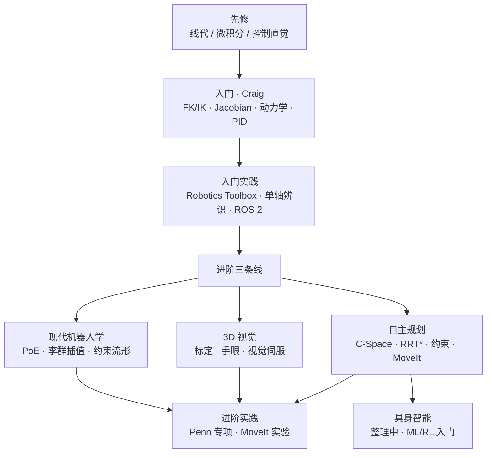

# 开源机器人学学习指南（qqfly）

**一句话：** [learn-robotics.qqfly.net](https://learn-robotics.qqfly.net/) 是 qqfly 维护的 **CC BY 4.0 中文自学手册**，面向大陆「非科班出身」工程师与研究生：用 **Craig 工业臂** 打底，再经 **Modern Robotics 李群语言**、**3D 视觉** 与 **构形空间运动规划** 三条线走向自主规控；每章配可执行的 Matlab/Python/ROS 练习。具身智能部分仍在整理。

## 英文缩写速查

| 缩写 | 英文全称 | 简要说明 |
|------|----------|----------|
| DH | Denavit–Hartenberg | 连杆坐标系与四参数建模，工业臂正运动学常用 |
| IK | Inverse Kinematics | 给定末端位姿反求关节角 |
| PoE | Product of Exponentials | 旋量/指数积正运动学，Modern Robotics 主语言 |
| C-Space | Configuration Space | 关节角构成的构形空间，运动规划的理论底座 |
| SE(3) | Special Euclidean Group in 3D | 三维刚体位姿群；视觉外参与手眼标定 |
| TOPP | Time-Optimal Path Parameterization | 沿几何路径求时间最优速度曲线 |
| MPC | Model Predictive Control | 滚动时域约束优化控制，规划与控制边界交汇处 |
| ROS 2 | Robot Operating System 2 | 去中心化机器人中间件；本书推荐直接学 ROS 2 |
| RL | Reinforcement Learning | 数据驱动策略学习；具身智能章暂作入门 |

## 为什么重要

1. **补「系统教育」空白**：前言指出国内不少机器人方向学生只做过项目、缺少逆解/规划/控制闭环训练；本书把 **自学顺序 + 必做练习** 写在一起，比散点论文/视频更易执行。
2. **工业臂传统栈 → 自主规控**：入门走 Craig（DH、雅可比数值 IK、PID + 前馈、标定辨识）；进阶用 Lynch-Park 填 **姿态/角速度** 坑，再接到 Choset/LaValle 的 C-Space 与 MoveIt——与本库 [Modern Robotics](./modern-robotics-book.md) 数学语言、[PythonRobotics](./python-robotics.md) 算法动画形成 **中文叙述 + 英文经典 + 代码验证** 三角。
3. **与本库 [运动控制路线](../../roadmap/motion-control.md) 分工**：本库 L0–L7 以 **人形 / 浮基 / WBC–RL–Sim2Real** 为主轴；本书偏 **固定基机械臂 + 工业示教 → 感知规划**，适合 L−1–L3 读者并行建立规控全景，再切入人形专题。
4. **开源可维护**：源码 [github.com/qqfly/how-to-learn-robotics](https://github.com/qqfly/how-to-learn-robotics)，MkDocs 站点与 PR 流程清晰；2026-07 已有英文 mirror。

## 流程总览（推荐阅读顺序）

| 阶段 | 站点章节 | 关键产出 | 本库延伸阅读 |
|------|---------|---------|-------------|
| 先修 | prerequisite | Strang 线代、Brian Douglas 控制、Linux/C 基础 | [线性代数策展](./linear-algebra-curriculum.md) |
| 入门 | getting-started | 六轴 DH 正逆解、雅可比 IK、三轴动力学、前馈 PID | [Modern Robotics](./modern-robotics-book.md) Ch 4–8 对照 |
| 实践 | dirty-your-hands | Corke 工具箱对答案、ROS 2 官方教程 | [ROS 2 基础](../concepts/ros2-basics.md)、[PythonRobotics](./python-robotics.md) |
| 现代机器人学 | modern-robotics | 群插值、姿态 Bezier、R(3)⊕SO(3) 约束构造 | [李群与刚体运动](../formalizations/lie-group-rigid-body-motions.md) |
| 3D 视觉 | 3d-vision | OpenCV 标定、AX=XB 手眼、视觉伺服闭环 | [state-estimation](../concepts/state-estimation.md) |
| 自主规划 | motion-planning | C-Space、采样/优化规划、零空间、TOPP | [trajectory-optimization](../methods/trajectory-optimization.md)、[MoveIt 2](../entities/moveit2.md) |
| 具身智能 | embodied-ai | Sutton RL、ML 工具链（章节重构中） | [reinforcement-learning](../methods/reinforcement-learning.md) |
| 进阶实践 | advanced-practice | Penn Robotics 专项、MoveIt 十次规划对比实验 | [motion-control](../../roadmap/motion-control.md) L4+ |

## 核心结构/机制

**叙事立场：** 从「祖传代码只发关节点、PID 在哪」的困惑出发，强调 **大陆项目制自学** 与 **港台/海外系统课程** 的差距，用开源手册把路径固定下来。

**入门轴（Craig）：** Modified DH → 正解链式乘 → 解析/数值逆解 → 雅可比力/速度对偶 → 牛顿-欧拉（先三轴再扩展）→ PID + T/S 轨迹 → 运动学/动力学标定与协作臂碰撞检测。

**进阶轴（三条线）：**
- **数学：** PoE 与 ⊕/⊖ 统一插值，解释 Gimbal lock、平均旋转、姿态过渡 Bezier；
- **感知：** 针孔模型 + 手眼标定环，位姿估计从模板到 ICP，视觉伺服消累积误差；
- **决策：** C-Space 与维度诅咒，图搜索/优化/采样/学习四类算法地图，约束流形与零空间，工业 semi-structured 环境的经验路图。

**实践清单（摘录）：** 自写 FK/Jacobian/数值 IK 与工具箱对照；Slerp vs 李群 Bezier 角速度曲线；OpenCV + `calibrateHandEye`；MoveIt 同一任务连规划十次感受随机性。

## 常见误区或局限

- **误区：读完本书 = 会人形 WBC/RL** — 具身智能章仍在整理；全书主线是 **固定基机械臂 + 规控**，进人形需接本库 [motion-control](../../roadmap/motion-control.md) L4 以后。
- **误区：Craig 与 Modern Robotics 二选一** — 作者明确 **先 DH/工业直觉，再 PoE/李群**；与本库「L0 线代 → MR Ch 2–3」可并行，不必冲突。
- **局限：深度不及专著** — 动力学、SLAM、MPC 等多为路线图 + 关键词，细节仍要回 Craig/Khalil/Choset/LaValle 与本库方法页。
- **局限：英文版为 AI 辅助翻译** — 技术审阅以中文站与 GitHub 为准。

## 参考来源

- [sources/courses/learn_robotics_qqfly_guide.md](../../sources/courses/learn_robotics_qqfly_guide.md)
- [开源机器人学学习指南（中文站）](https://learn-robotics.qqfly.net/)
- [Open Source Robotics Learning Guide（English）](https://en.learn-robotics.qqfly.net/)
- [github.com/qqfly/how-to-learn-robotics](https://github.com/qqfly/how-to-learn-robotics)

## 关联页面

- [Modern Robotics（Lynch-Park 教材）](./modern-robotics-book.md) — 进阶「现代机器人学」章的主教材
- [PythonRobotics](./python-robotics.md) — 移动机器人算法动画与入门实验
- [线性代数学习策展](./linear-algebra-curriculum.md) — L0 数学打底，与先修章 Strang 路线对齐
- [Trajectory Optimization](../methods/trajectory-optimization.md) — 自主规划章 TOPP 与轨迹优化接口
- [MoveIt 2](../entities/moveit2.md) — 进阶实践 MoveIt 实验对应栈
- [运动控制成长路线](../../roadmap/motion-control.md) — 人形/双足主路线，与本指南互补

## 推荐继续阅读

- [Introduction to Robotics（Craig）](https://learn-robotics.qqfly.net/references.html) — 入门主教材
- [Coursera Modern Robotics 专项](https://www.coursera.org/specializations/modernrobotics) — PoE 视频课
- [Penn Robotics 专项（Coursera）](https://www.coursera.org/specializations/robotics) — 进阶实践章推荐的系统公开课
