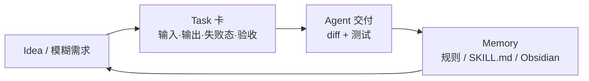

# LearnPrompt

**LearnPrompt** 是 [LearnPrompt/LearnPrompt](https://github.com/LearnPrompt/LearnPrompt) 组织下的 **中文 AI native 实战教程** 与 **Skill 工坊生态** 总称：官网 [learnprompt.pro](https://www.learnprompt.pro) 以 **真实项目交付**（任务卡 → diff → 测试 → 记忆沉淀）组织学习路径，GitHub 侧索引 **班门家族** skills、Carl Skills 与 AI News Radar 等子项目。

## 一句话定义

用 **8 条可按任务切入的中文路径 + Showcase 验收**，把 Claude Code / Codex / Agent Harness / Skills / Loop / Obsidian / OpenClaw 放进同一 **「做完还能留下规则与 Skill」** 的工作流叙事里，而不是工具发布会式目录。

## 英文缩写速查

| 缩写 | 英文全称 | 简要说明 |
|------|----------|----------|
| AIGC | AI Generated Content | 生成式 AI 内容；LearnPrompt 早期课程主线 |
| LLM | Large Language Model | 大语言模型；教程中 Agent 与 Coding 的核心 |
| MVP | Minimum Viable Product | 可运行最小产品；AI 编程路径的第一交付物 |
| Harness | Agent Harness | Agent 运行时脚手架（指令、约束、记忆、反馈、编排） |
| Skill | Agent Skill | 可装载的重复流程规约（`SKILL.md` + 触发/验收） |

## 为什么重要（对本知识库读者）

- **维护本库的「中文说明书」：** Robotics_Notebooks 采用 [Karpathy LLM Wiki](../references/llm-wiki-karpathy.md) + [ingest/query/lint](../../schema/ingest-workflow.md)；LearnPrompt 的 **Obsidian AI** 与 **Agent Skills** 路径讲的就是 **Markdown 作 Agent 记忆、重复 ingest 流程写成 Skill** — 与本站 `AGENTS.md`、Cloud Agent、`make ci-preflight` 文化同向。
- **Coding Agent 选型前的中文热身：** [Agentic Coding 软件工程基础](../concepts/agentic-coding-software-fundamentals.md) 讲 **取舍语言**；LearnPrompt **AI 编程 / Claude Code / Codex** 路径讲 **第一轮任务卡与审查** — 宜先建立交付习惯再读本站 [mattpocock/skills](mattpocock-skills.md)、[Superpowers](superpowers-obra.md) 等英文 skills 生态。
- **OpenClaw / Hermes 文档侧链：** 本站 [OpenClaw](openclaw.md)、[Hermes Agent](hermes-agent.md) 偏 **运行时角色与机器人交叉**；LearnPrompt [OpenClaw 架构导读](https://www.learnprompt.pro/agent-frameworks/openclaw-architecture-guide/) 补 **Gateway / Node / Channel 消息流** 中文 walkthrough。
- **Skill 生态对照：** **鲁班**（skill 公共化打磨）vs [Nuwa Skill](nuwa-skill.md)（人物认知蒸馏）vs [Addy Osmani Agent Skills](agent-skills-addyosmani.md)（工程技能目录）；[andrej-karpathy-skills](https://github.com/LearnPrompt/andrej-karpathy-skills) 与 [Andrej Karpathy](andrej-karpathy.md) 实体页 **分层**：wiki 编译事实，skills 编译工作方法。

## 核心结构

| 层次 | 内容 |
|------|------|
| **教程站** | [learnprompt.pro](https://www.learnprompt.pro) — 47 篇教程、8 路径、Showcase + 独立审稿；旧版 AIGC 课保留于 [v1.learnprompt.pro](https://v1.learnprompt.pro/) |
| **主仓** | [LearnPrompt/LearnPrompt](https://github.com/LearnPrompt/LearnPrompt) — Profile README + 新版 wiki 项目说明与生态索引 |
| **路径 01–03** | AI 编程、Claude Code、Codex — **任务卡、执行面、审查** |
| **路径 04–06** | Agent 工程、Agent Skills、Loop — **Harness 五组件、第一个 SKILL.md、Loop 五动作** |
| **路径 07–08** | Obsidian AI、Hermes/OpenClaw — **Markdown 记忆、长驻 Agent 架构** |
| **Skill 工坊** | `/skills/` + GitHub：`luban-skill`、`paoding-skill`、`cailun-skill`、`afu-llm-todo`、`loop-engineering`、`partner-skill`、`cc-harness-skills` 等 |
| **工作流仓** | [carl-skills](https://github.com/LearnPrompt/carl-skills) — 内容生产、资料整理、Obsidian/飞书协作等实测流程 |

### 学习闭环（站点叙事）

## 工程实践

| 场景 | 建议入口 |
|------|----------|
| 第一次用 AI 写代码 | [从自然语言到 MVP](https://www.learnprompt.pro/ai-coding/natural-language-to-mvp/) → 本站 `make ci-preflight` 作验收参照 |
| 维护本类 markdown wiki | [Markdown 何时才算 Agent 记忆](https://www.learnprompt.pro/obsidian-ai/markdown-as-agent-memory/) + [第一个 SKILL.md](https://www.learnprompt.pro/agent-skills/first-skill-md/) |
| 选用 Codex / Cloud Agent | [Codex 四执行面](https://www.learnprompt.pro/codex/codex-form-factors/) |
| 部署 OpenClaw | [OpenClaw 架构导读](https://www.learnprompt.pro/agent-frameworks/openclaw-architecture-guide/) → 对照 [OpenClaw 实体页](openclaw.md) |
| Skill 从私有到可安装 | 上游 [luban-skill](https://github.com/LearnPrompt/luban-skill)（skills.sh）；对照 [mattpocock/skills](mattpocock-skills.md) |

## 局限与风险

- **领域重心非机器人：** 主体是 **通用 AI 工作台**；具身/控制需回到本站 `wiki/tasks/`、`wiki/methods/` — LearnPrompt 提供 **Agent 维护与文档工作流**，不替代 Sim2Real 或运动栈知识。
- **版本漂移：** 教程标注官方核验日期，但 Claude Code / Codex / OpenClaw API 变化快 — 以 **官方文档 + Showcase 是否仍绿** 为准，勿把单篇当永久真理。
- **生态子仓未全量 ingest：** 班门家族、Carl Skills 等仅索引于主 README；深度维护宜 **按需单仓 ingest**，避免一次吞整个组织。
- **旧版内容：** v1 站点 AIGC 工具课部分已过时；新版首页明确保留旧版入口作归档，新读者应优先 **2026 AI Practice Wiki** 路径。

## 关联页面

- [LLM Wiki（Karpathy 模式）](../references/llm-wiki-karpathy.md) — 知识编译范式
- [OpenClaw](openclaw.md) — 长驻助手运行时
- [Hermes Agent](hermes-agent.md) — 对照 agent OS
- [Skills For Real Engineers（mattpocock）](mattpocock-skills.md) — 轻量工程 skills
- [Nuwa Skill](nuwa-skill.md) — 人物认知 skill 蒸馏
- [Superpowers（obra）](superpowers-obra.md) — 重流程交付 skills
- [Agent Skills（Addy Osmani）](agent-skills-addyosmani.md) — 工程技能目录
- [Andrej Karpathy](andrej-karpathy.md) — andrej-karpathy-skills 人物源
- [Agentic Coding 软件工程基础](../concepts/agentic-coding-software-fundamentals.md) — 取舍语言框架
- [Ingest Workflow](../../schema/ingest-workflow.md) — 本仓库维护规范

## 参考来源

- [LearnPrompt 仓库源归档（本站）](../../sources/repos/learnprompt.md)
- [learnprompt.pro 站点源归档（本站）](../../sources/sites/learnprompt-pro.md)
- [LearnPrompt/LearnPrompt（GitHub）](https://github.com/LearnPrompt/LearnPrompt)
- [learnprompt.pro 首页](https://www.learnprompt.pro/)

## 推荐继续阅读

- [开始学习 · AI Practice Map](https://www.learnprompt.pro/start-here/ai-practice-map/) — 官方路径总图
- [learnprompt.pro/skills 工坊](https://learnprompt.pro/skills/) — 班门家族与 CC Harness 索引
- [Learn Prompting（英文 prompt 基础）](https://learnprompting.org/zh-Hans/) — README 致谢的上游 prompt 课程
