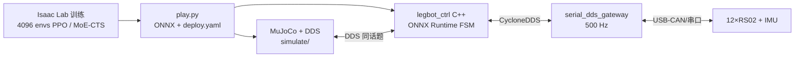
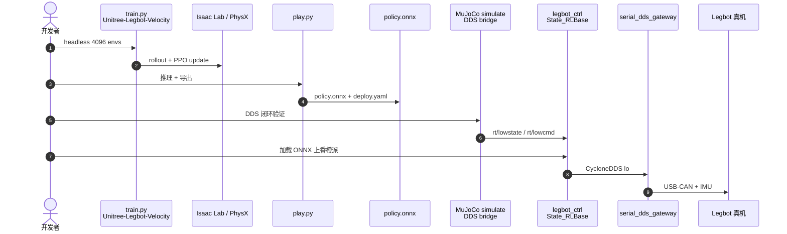

# Legbot Lab（四足 Isaac Lab RL 与 Sim2Real 部署）

**Legbot Lab**（[Robot-Nav/legbot_lab](https://github.com/Robot-Nav/legbot_lab)，Apache-2.0）是面向自研 **Legbot** 四足（12 DoF、~14 kg、RobStride RS02）的 **NVIDIA Isaac Lab** 强化学习训练与 **Sim2Real** 部署框架。默认分支 **`PPO`** 提供文档完备的速度跟踪基线（非对称 Actor–Critic、10 帧历史、4096 并行）；扩展分支 **`PPO-CTS-MOE`** 实现 **MoE-CTS**（并发 Teacher–Student + 8 专家 MoE 学生编码器），与 [CTS 论文](./paper-cts-concurrent-teacher-student-locomotion.md) 及 [go2_rl_gym](https://github.com/wty-yy/go2_rl_gym) 工程线对齐。

## 一句话定义

**从 Isaac Lab GPU 训练到 MuJoCo DDS 仿真再到香橙派 ONNX 真机控制的完整四足 RL 管线，同一套 C++ 控制器经 CycloneDDS 与串口网关对接硬件。**

## 英文缩写速查

| 缩写 | 英文全称 | 简要说明 |
|------|----------|----------|
| PPO | Proximal Policy Optimization | 默认分支 RL 算法（RSL-RL） |
| CTS | Concurrent Teacher–Student | 并发特权教师与可部署学生联合 PPO |
| MoE | Mixture of Experts | `PPO-CTS-MOE` 中学生编码器的多专家 gating |
| AC | Actor–Critic | 策略–价值网络；critic 用特权观测 |
| ONNX | Open Neural Network Exchange | C++ 部署推理格式 |
| DDS | Data Distribution Service | CycloneDDS 中间件，仿真/真机共用话题 |
| FSM | Finite State Machine | 1 kHz 部署状态机（FixStand / Passive / RL） |
| sim2real | Simulation to Reality | Isaac Lab → MuJoCo → 真机闭环 |

## 为什么重要

- **Robot-Nav 双栈对照：** 与 [legbot-MPC-WBC](./legbot-mpc-wbc.md)（Convex MPC + WBC）并列，覆盖 **学习控制 vs 模型控制** 两条复现路径。
- **Sim2Real 工程完整：** 不仅训练脚本，还包含 MuJoCo DDS 仿真器、ONNX Runtime C++ 控制器、串口–DDS 网关与安全 FSM——适合作为 Isaac Lab 四足部署模板。
- **算法可切换：** `PPO` 基线 vs `PPO-CTS-MOE` 扩展在同一仓库，便于对比 **纯 PPO** 与 **并发 TS + MoE** 的收益。

## 核心信息

| 项 | 内容 |
|----|------|
| **机构** | 机器人导航开源社区（Robot-Nav）；自研 Legbot 四足 RL 训练与部署 |
| **平台** | Legbot 四足（Go2 同构 12 关节）；Isaac Sim 5.0 / Isaac Lab 2.2 |
| **分支** | `PPO`（默认）、`PPO-CTS-MOE`、`WF-CTS-MOE` |
| **开源** | **已开源**（Apache-2.0）；训练 + 部署 + 网关 |
| **板载** | Orange Pi 6；1 kHz 控制 / 500 Hz 网关 |

## 流程总览

## 源码运行时序图

对齐 [sources/repos/legbot_lab.md](../../sources/repos/legbot_lab.md) 与 `PPO` 分支 README：

- **`PPO-CTS-MOE`：** 训练环节替换为 MoE-CTS（75% teacher / 25% student env + latent 蒸馏）；部署仍只走 student 分支 ONNX。

## 工程实践

| 项 | 内容 |
|----|------|
| 训练入口 | `legbot_rl_lab/scripts/rsl_rl/train.py --task Unitree-Legbot-Velocity --headless` |
| 观测 | Actor 45 维×10 帧=450；Critic 263 维（线速度、高度扫描、力矩等） |
| 导出 | `play.py` → `exported/policy.onnx` |
| 部署编译 | `legbot_rl_lab/deploy/robots/legbot/`；FSM：FixStand → RLBase |
| sim2sim | `simulate/` MuJoCo 与控制器共用 DDS 话题 |
| MoE-CTS | 分支 `PPO-CTS-MOE`；8 experts；latent L2Norm + load-balance α=0.01 |
| 安全 | 力矩/温度/姿态超限 → Passive 阻尼；通信超时切 Passive |

## 局限与风险

- **Legbot 硬件专属：** URDF/网关协议针对自研机；迁移到其他四足需改 `deploy.yaml` 与网关。
- **Isaac 版本钉定：** README 写 Isaac Sim 5.0 / Lab 2.2；升级需自行验证 API 差异。
- **MoE-CTS 与 CTS 原文：** MoE 与 env 比例划分是 **仓库扩展**，非 arXiv:2405.10830 原文全部细节；理论对照见 [CTS 论文页](./paper-cts-concurrent-teacher-student-locomotion.md)。
- **RoboGauge 评测：** [RoboGauge](https://robogauge.github.io/) 为 XJTU 相邻 MoE 评测线，**非本仓库内置**。

## 与其他页面的关系

- [legbot-mpc-wbc.md](./legbot-mpc-wbc.md) — 同团队 MPC–WBC 四足参考
- [paper-cts-concurrent-teacher-student-locomotion.md](./paper-cts-concurrent-teacher-student-locomotion.md) — MoE-CTS 理论来源
- [teacher-student-dagger-training.md](../methods/teacher-student-dagger-training.md) — 两阶段 TS 通用范式对照
- [ppo.md](../methods/ppo.md) — PPO 方法页

## 参考来源

- [legbot_lab.md](../../sources/repos/legbot_lab.md)
- [legbot_cts_arxiv_2405_10830.md](../../sources/papers/legbot_cts_arxiv_2405_10830.md)

## 推荐继续阅读

- [GitHub: Robot-Nav/legbot_lab](https://github.com/Robot-Nav/legbot_lab)
- [CTS 项目页](https://clearlab-sustech.github.io/concurrentTS)
- [Isaac Lab 安装文档](https://isaac-sim.github.io/IsaacLab/main/source/setup/installation/index.html)
