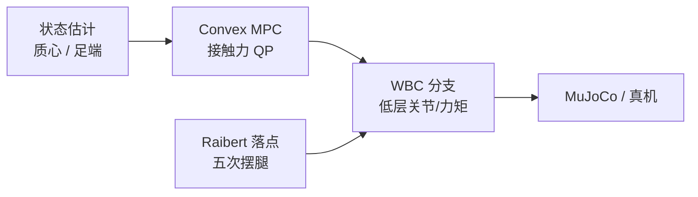
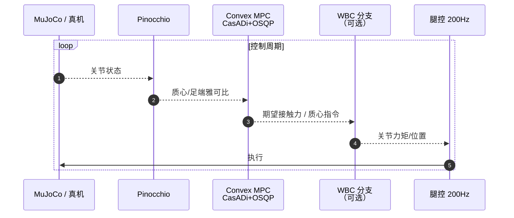

# legbot-MPC-WBC（四足 Convex MPC + WBC 参考实现）

**legbot-MPC-WBC**（[Robot-Nav/legbot-MPC-WBC](https://github.com/Robot-Nav/legbot-MPC-WBC)，MIT）是面向 **Unitree Go2 / LegBot 四足** 的 **Convex MPC** 控制栈：`main` 分支实现 MIT Cheetah 3 式 **接触力凸优化**；`WBC` 分支扩展 **改进 MPC–WBC** 分层。虽非人形，但是作为 **MPC 规划 + 低层全身/腿足执行** 的开源参考，与 [hub-wbc](../overview/hub-wbc.md) 中 **MPC–WBC 集成** 知识链交叉。

## 一句话定义

**用 Pinocchio 算质心/足端动力学，CasADi+OSQP 解凸 MPC 接触力，MuJoCo 仿真并 sim2real 到 LegBot 四足；WBC 分支叠加低层全身/腿足执行修正。**

## 英文缩写速查

| 缩写 | 英文全称 | 简要说明 |
|------|----------|----------|
| MPC | Model Predictive Control | 滚动优化未来接触力/状态 |
| WBC | Whole-Body Control | 低层多关节/多足协调执行（本仓库 WBC 分支） |
| QP | Quadratic Programming | 凸 MPC 将接触力优化化为 QP |
| SRBD | Single Rigid Body Dynamics | 质心简化模型，MPC 常用 |
| sim2real | Simulation to Reality | MuJoCo 策略迁移真机 |

## 为什么重要

- **Robot-Nav 生态：** 同团队 [Legbot Lab](./legbot-lab.md) 提供 **RL/PPO–CTS** 线，与本仓 **MPC–WBC** 模型控制线互补。
- **用户指定开源参考：** 与经典人形 WBC 论文互补，展示 **MPC→执行层** 在同一仓库的可复现分层。
- **算法出处清晰：** 基于 Kim et al. MIT Cheetah 3 convex MPC；README 含 sim2real 频率工程笔记（15 Hz→30–40 Hz）。
- **双分支对照：** `main`（纯 Convex MPC）vs `WBC`（MPC-WBC）便于理解何时需要低层 WBC。

## 核心信息

| 项 | 内容 |
|----|------|
| **机构** | 算法参考麻省理工学院（MIT）Cheetah 3；仓库维护 **Robot-Nav** 社区 |
| **平台** | Go2（仿真）/ LegBot（sim2real） |
| **栈** | MuJoCo + Pinocchio + CasADi + OSQP |
| **开源** | **已开源**（MIT License） |
| **与人形 WBC 关系** | **四足参考**；人形理论线见 [IJHR 2004](./paper-khatib-sentis-ijhr-2004-whole-body-dynamic-behavior.md) |

## 流程总览

## 源码运行时序图

- **`main` 分支：** MPC 输出可直接驱动腿控；**`WBC` 分支** 在 MPC 之上增加低层全身/腿足协调。

## 工程实践

| 项 | 内容 |
|----|------|
| 分支 | `main`：Convex MPC；`WBC`：MPC-WBC |
| 频率 | 仿真 1 kHz 物理 / 200 Hz 腿控 / 30–50 Hz MPC |
| sim2real | README 记录通信与求解延迟对实时性的影响 |

## 局限与风险

- **四足 ≠ 人形：** 浮基维度、接触模式与冗余结构不同，勿把人形 WBC 公式直接套用。
- **维护规模小：** GitHub ~8 stars；工程适配需自行验证。
- **非 Sentis–Khatib 操作空间栈：** 与 [ControlIt!](./controlit.md) 理论线互补而非替代。

## 结论

**legbot-MPC-WBC 是 MPC–WBC 分层的四足开源样本：上层凸 MPC 规划接触力，低层（WBC 分支）负责执行；读人形 WBC 经典论文时可用它理解「规划/执行」接口。**

1. **先分清分支** — `main` 看纯 MPC；`WBC` 看分层执行。
2. **Pinocchio+MuJoCo 是身体/世界分工** — 与 README 一句话总结一致。
3. **实时性读 README 工程笔记** — MPC 2.7 ms 与整机 60 ms 环路的差距要单独预算。
4. **与人形经典线交叉而非合并** — IJHR 2004/ICRA 2006 讲任务优先级；本仓讲凸 MPC 接触力。
5. **迁移到人形看** [mpc-wbc-integration](../concepts/mpc-wbc-integration.md) **与** [srbd-convex-mpc-wbc](../concepts/srbd-convex-mpc-wbc.md)。

## 与其他页面的关系

- [qm-control.md](./qm-control.md) — 四足**机械臂** OCS2 MPC+WBC（Gazebo）
- [mpc-wbc-integration.md](../concepts/mpc-wbc-integration.md)、[srbd-convex-mpc-wbc.md](../concepts/srbd-convex-mpc-wbc.md)
- 人形 WBC 经典：[hub-wbc.md](../overview/hub-wbc.md)
- [controlit.md](./controlit.md) — 人形 WBOSC 软件对照

## 参考来源

- [legbot_mpc_wbc.md](../../sources/repos/legbot_mpc_wbc.md)

## 推荐继续阅读

- [GitHub: Robot-Nav/legbot-MPC-WBC](https://github.com/Robot-Nav/legbot-MPC-WBC)
- MIT Cheetah 3 Convex MPC 论文（仓库 README 链接）
- [Centroidal NMPC + WBC 栈](../methods/centroidal-nmpc-wbc-stack.md) — 人形高保真分层对照
