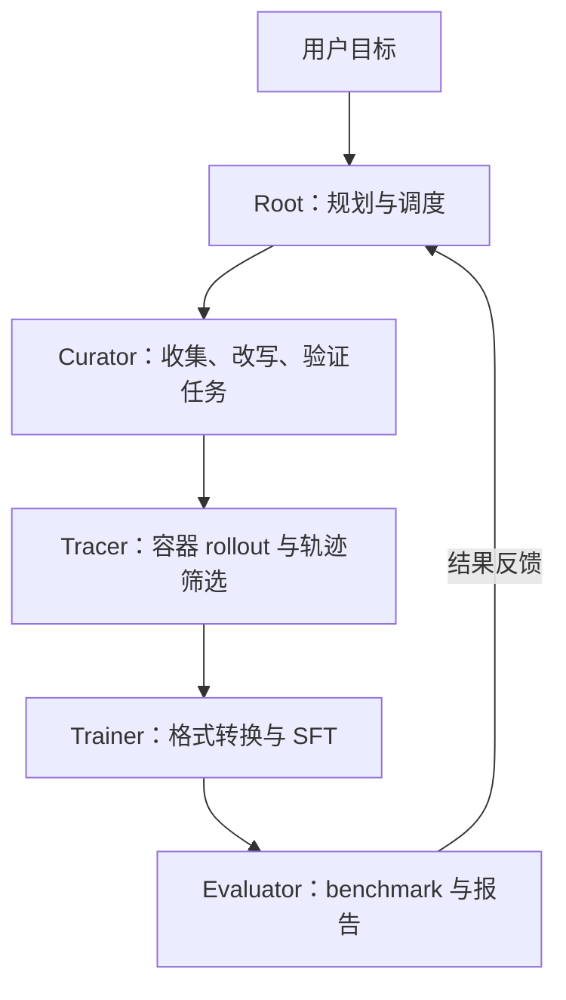

# LegoFlow：Coding-Agent 数据工程流水线

**LegoFlow** 是一套用于构建和迭代软件工程 agent 数据的开源工作流：Root 协调 Curator、Tracer、Trainer 与 Evaluator，把 GitHub PR 转成可验证任务、执行轨迹、训练样本和评测反馈；代码与 LegoFlow-SWE 数据集共享本实体节点。

## 英文缩写速查

| 缩写 | 英文全称 | 简要说明 |
|------|----------|----------|
| SWE | Software Engineering | 本项目的任务域，聚焦软件工程修复任务 |
| PR | Pull Request | Curator 发现候选 issue/patch/test 的入口之一 |
| SFT | Supervised Fine-Tuning | Trainer 用经筛选的 agent 轨迹做监督微调 |
| LLM | Large Language Model | 驱动 Curator 判断、coding agent 以及评测的模型 |
| RL | Reinforcement Learning | 官方称正在接入 Trainer 的训练方式，并非博客中已完成的核心结果 |

## 为什么重要

Coding agent 的训练数据不只是 prompt 和答案。要能训练、评估并复现，task 还需要可运行的软件环境、明确的验收测试、bug 状态与参考修复；trajectory 要保留 agent 与工具的多轮交互；最后还需在固定 scaffold 和 benchmark 条件下评测。LegoFlow 的贡献是把这些环节包装成可调用、可检查的 block workflow，并将数据筛选和模型训练连成反馈闭环。

从仓库的机器人研究视角看，LegoFlow 和 [RLE-Bench](../entities/rle-bench.md) 都使用 Harbor / coding-agent 工程，但目标不同：LegoFlow 主要构建通用软件工程任务与训练轨迹；RLE-Bench 则考察 agent 能否完成机器人学习工程闭环并交付 artifact。

## 核心原理

### Root 与四个工作块

每个 block 都有自己的 agent skill、依赖、脚本、配置和输出 artifacts。Root 按用户目标调度 block，并汇总评测反馈。

| Block | 输入与作用 | 输出 |
|------|-------------|------|
| **Curator** | GitHub 仓库、PR、issue、commit、测试证据 | Harbor task manifest；要求 bug baseline 测试失败、参考修复测试通过 |
| **Tracer** | 已验证任务、coding-agent scaffold、模型 endpoint | agent messages/tool interactions、reward、候选训练轨迹 |
| **Trainer** | 筛选/转换后的轨迹 | SFT 训练与模型 checkpoint；官方 README 示范 LLaMA-Factory 格式 |
| **Evaluator** | checkpoint、Harbor benchmark 与防泄漏设置 | 指标与 dashboard 报告，供下一轮调整 |

### 数据筛选与执行验证

Curator 先发现有合并 PR 的活跃仓库，再收集 issue/patch/commit/test 证据、改写成清晰且减少答案泄漏的任务，构造 Harbor 隔离环境，最后验证 bug 版本失败而参考修复通过。执行验证比“看起来合理的 issue”文本筛选更强，但最终质量仍受测试覆盖度、容器复现性与筛选规则影响。

Tracer 在 Harbor 容器中调用 OpenHands、OpenCode 等 scaffold，经 verifier 检查 rollout，再把轨迹转换为训练格式并按规则/模型评分。Evaluator 的模型比较依赖固定训练配方、scaffold 和 benchmark 设置；换其中任一项都可能改变成绩。

### LegoFlow-SWE 发布集

Hugging Face 发布集包含 **5,000 个任务**，来自超过 **12M PR 候选**，覆盖 8 种编程语言和 20 类任务 tags。数据另含 GLM-5.2 在 OpenHands 与 OpenCode 上产生的共 **9,767 条轨迹**，其中 verifier reward 为 1 的有 1,350 + 1,430 条。

两套任务目录不是两份独立任务：tasks-anti-hack/ 复用相同 task IDs 和 task files，只给提示追加 anti-hack 指令。轨迹数据保留失败/成功 rollout；reward=0 也包括 verifier reward 缺失，读取时不能把它全部等同于明确测试失败。

## 流程总览

下图归纳官方工作流，不表示所有 block 的执行都必须固定成单次线性链：

## 官方报告结果

官方在统一的约 1K 轨迹 SFT 配方下报告：

| 基准 | LegoFlow-SWE | Qwen3.5 Instruct 对照 | 差值 |
|------|-------------:|----------------------:|-----:|
| SWE-bench Verified | 70.2% | 63.4% | +6.8 pp |
| SWE-bench Pro | 48.8% | 38.2% | +10.6 pp |
| SWE-bench Multilingual | 57.0% | 51.7% | +5.3 pp |

报告设置是 Qwen3.5-35B-A3B-Base 从头按 source 分别微调，在 OpenHands SDK 下使用 no-hack / 200-turn / 256k 配置，测试集分别为 500、731 和 300 题。数值来自项目方公开的博客与 HF 数据卡，不是独立复现。另一项递归改进实验从 7.6% 起步，先达到 56.1%，再通过轨迹深度筛选和工具调用规范化，在 512 条筛后轨迹上报告 64.4%；这组迭代结果应与发布集训练结果分开理解。

## 工程实践

- **将 task 当可执行规格：** 同时保存任务描述、bug baseline、reference fix、运行依赖与测试，而不是只保存 issue 文本。
- **在训练前过滤轨迹：** 检查 verifier reward、轨迹深度、工具调用格式和重复样本；终态 pass 不能代替过程质量筛查。
- **固定评测协议再比较来源：** 明确模型初始化、轨迹样本量、agent scaffold、上下文/轮数预算、测试集快照及网络隔离。
- **独立实现 no-hack runner：** anti-hack 提示版本只改变 instruction；Git 历史清理和网络限制必须由执行环境落实。
- **部署成本提前核算：** Curator/Tracer/Evaluator 依赖模型服务与容器；自训练需大显存 GPU。仓库 README 报告单节点 8×H800 验证，且多节点训练尚未接通。

## 开源状态与局限

- **代码：已开源。** [LegoX/LegoFlow](https://github.com/LegoX/LegoFlow) 默认分支为 master，GitHub 标注 Apache-2.0。
- **任务与轨迹：已公开。** [LegoFlow-SWE](https://huggingface.co/datasets/Lego-X/LegoFlow-SWE) 页面列出 5,000 tasks 和 9,767 rollouts，约 9.96 GB。
- **数据许可需单独核实。** 本次可见的 HF dataset card 未明确显示独立许可证；代码的 Apache-2.0 不能自动延伸到数据集及其源代码。
- 训练与 benchmark 成绩均由项目方报告；数据集筛选依赖 issue 证据、自动 judge 和测试，仍可能包含任务歧义、执行环境差异和 source-selection bias。
- LegoFlow-SWE 的“verified”指公开流程所用验证条件通过，并不等价于人工证明任务完全无泄漏或轨迹推理完全正确。

## 关联页面

- [AI Agent 评测](../concepts/ai-agent-evaluation.md) — task、harness、grader 和 benchmark 协议。
- [Agentic Coding 软件工程基础](../concepts/agentic-coding-software-fundamentals.md) — coding agent 的系统设计与工程取舍。
- [Agent Lightning](./agent-lightning.md) — coding-agent rollout 与 agentic RL 训练基础设施。
- [RLE-Bench](./rle-bench.md) — Harbor 上评测机器人学习工程 agent 的互补基准。
- [Data Flywheel](../concepts/data-flywheel.md) — 数据回流如何形成迭代闭环。

## 参考来源

- [LegoFlow 官方博客（2026-09-18）](../../sources/blogs/legoflow_2026-09-18.md)
- [LegoFlow 官方项目页与文档](../../sources/sites/legoflow-project.md)
- [LegoFlow 代码仓库归档](../../sources/repos/legox-legoflow.md)
- [LegoFlow-SWE 数据集归档](../../sources/datasets/legoflow-swe.md)

## 推荐继续阅读

- [LegoFlow 文档：Running the Full Pipeline](https://legoflow-docs.legox.net/docs/running-blocks/full-pipeline) — 安装 block plugins 并运行端到端流程。
- [Lessons Learned from LegoFlow-SWE](https://legox.net/blog/legoflow-experiments/) — 数据筛选和实验设计的补充讨论。
