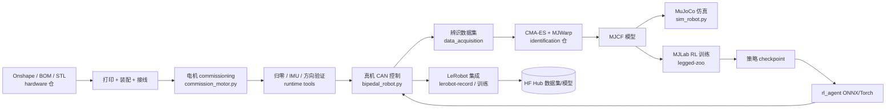
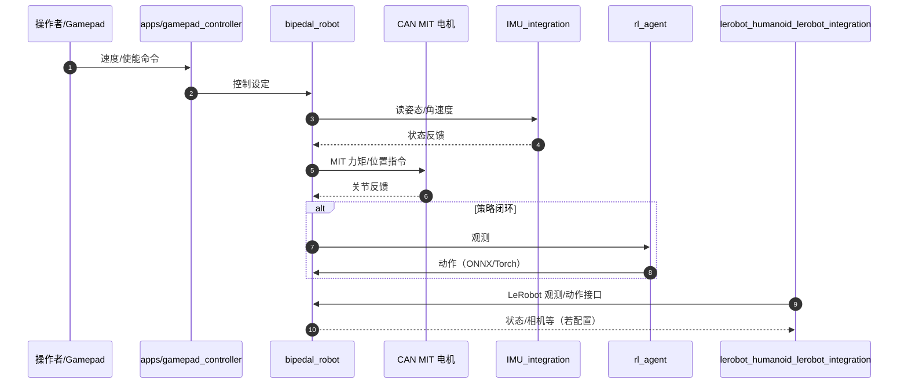

# LeRobot Humanoid

## 一句话定义

Hugging Face **LeRobot** 系开源 **12-DoF 双足** 整机：从 Onshape/BOM/3D 打印到 CAN 真机控制、MJLab 行走 RL、动力学辨识与 LeRobot 集成，按 **四 Git 仓** 分工维护。

## 英文缩写速查

| 缩写 | 英文全称 | 简要说明 |
|------|----------|----------|
| DoF | Degrees of Freedom | 当前运行时栈面向 **12-DoF 双足、无臂** |
| BOM | Bill of Materials | `lerobot-humanoid-hardware` 中采购与制造清单 |
| CAN | Controller Area Network | 真机 RobStride 等电机总线；MIT 协议控制 |
| MJCF | MuJoCo XML Format | 仿真模型；训练仓与辨识 submodule 共用 |
| CMA-ES | Covariance Matrix Adaptation Evolution Strategy | 关节级动力学参数搜索 |
| Sim2Real | Simulation to Real | 训练（MJLab）→ 辨识 → 真机/ LeRobot 部署闭环 |

## 为什么重要

面向「能自己造出来、训起来、跑起来」的 **低成本研究型双足**：硬件与 CAD 在 Hugging Face 组织仓公开，控制栈与 [LeRobot](./lerobot.md) 数据集格式对齐，训练侧走 **MJLab**，sim–real 缝隙用 **MJWarp + CMA-ES 辨识** 补一层。

- **与 LeRobot 主栈同品牌**：运行时仓含 `lerobot_humanoid_lerobot_integration`，可把真机接入 `lerobot-record` / 训练管线，而不是另起一套数据格式。
- **制造路径完整**：BOM → 打印 → **先 commissioning 电机再总装** 的流程写在 hardware README，降低「装完才发现 CAN ID 不对」的返工。
- **研究闭环清晰**：`lerobot-legged-zoo` 提供平地/崎岖速度跟踪任务；`lerobot-humanoid-identification` 专门做 sim 参数对齐；runtime 提供采集与校准工具。
- **对标 Berkeley / Open Duck 等 DIY 双足**：更强调 **Hub 生态 + LeRobot** 与 **RobStride CAN** 执行器链，适合已有 LeRobot 经验、想做人形步态的团队。

## 四仓分工

| 仓 | GitHub | 职责 |
|----|--------|------|
| **Hardware** | [huggingface/lerobot-humanoid-hardware](https://github.com/huggingface/lerobot-humanoid-hardware) | 装配文档、BOM、STL（按腿/躯干子装配）、接线映射、`commission_motor.py` |
| **Runtime** | [huggingface/lerobot-humanoid-runtime](https://github.com/huggingface/lerobot-humanoid-runtime) | MuJoCo 仿真、真机 CAN MIT + 安全、策略 ONNX/Torch、IMU、LeRobot Robot 类、校准/诊断 CLI |
| **Training** | [Virgileboat/lerobot-legged-zoo](https://github.com/Virgileboat/lerobot-legged-zoo) | MJCF + **MJLab**；`Mjlab-Velocity-{Flat,Rough}-LeRobot-Humanoid(-full)`；**无官方预训练权重** |
| **Identification** | [Virgileboat/lerobot-humanoid-identification](https://github.com/Virgileboat/lerobot-humanoid-identification) | MJWarp 批量回放 + CMA-ES 关节参数辨识 |



## 流程总览（推荐工程顺序）

1. **采购与打印**：`hardware/bom/bom_buy.csv` + [printing_guide](https://github.com/huggingface/lerobot-humanoid-hardware/blob/main/docs/manufacturing/printing_guide.md)。
2. **电机 commissioning（先于总装）**：`python hardware/config/commission_motor.py wizard --channel can0`；详见 hardware 仓 electronics 文档。
3. **机械装配与首次上电**：assembly / wiring / first_power_on 指南。
4. **运行时校准**：`scan_motors`、`interactive_zeroing`、`imu_calibration_tool`、`joint_nudge_tester`（runtime 仓）。
5. **仿真冒烟**：`uv sync --extra sim` 后跑 MuJoCo  smoke test（README）。
6. **RL 训练（GPU）**：在 legged-zoo 用 `uv run train Mjlab-Velocity-Flat-LeRobot-Humanoid` 等任务自训策略。
7. **（可选）动力学辨识**：真机或控制器日志 → identification 仓 CMA-ES，更新 MJCF/仿真参数。
8. **LeRobot 数据与策略**：经 `lerobot_humanoid_lerobot_integration` 进入 [LeRobotDataset v3](../concepts/lerobot-dataset-v3.md) 与主仓 CLI。

## 源码运行时序图（真机 + 策略）

以下对齐 [lerobot-humanoid-runtime](https://github.com/huggingface/lerobot-humanoid-runtime) README 入口；部署前须完成校准并遵守仓内 **Safety First** 条款。



## 核心信息

| 项 | 说明 |
|----|------|
| 机构 | Hugging Face（硬件/运行时组织仓）；训练与辨识仓维护者 Virgileboat（与 hardware README 支持邮箱一致） |
| 自由度 | **12-DoF 双足**，当前栈 **不含双臂**；hardware 迭代 scope 为 biped platform（上身 CAD 在 Onshape 但本迭代未纳入仓） |
| 执行器 | **RobStride** CAN 电机（见 [官网](https://www.robstride.com) 与 BOM） |
| 机载计算 | README 面向 **Raspberry Pi 5 + Ubuntu**；Python **3.13**，**uv** 管理依赖 |
| CAD | [Onshape 公开文档](https://cad.onshape.com/documents/fb645318a27646d1d8840be6/w/d1cae8805fb652b4d1614997/e/804a1da43f242001a05129b4) |
| 开源状态 | 四仓均已公开；**legged-zoo 不提供预训练行走策略**，需自训或社区权重 |

## 工程实践

```bash
# 硬件仓：克隆后按 Start Sequence 走 BOM → 打印 → commissioning
git clone https://github.com/huggingface/lerobot-humanoid-hardware.git

# 运行时：子模块 + uv 额外组件
git clone https://github.com/huggingface/lerobot-humanoid-runtime.git
cd lerobot-humanoid-runtime && git submodule update --init --recursive && uv sync --extra full

# 训练（需 CUDA）
git clone https://github.com/Virgileboat/lerobot-legged-zoo.git
cd lerobot-legged-zoo && uv sync
uv run train Mjlab-Velocity-Flat-LeRobot-Humanoid
```

LeRobot 主仓安装与硬件集成见 [官方文档](https://huggingface.co/docs/lerobot/integrate_hardware)；NVIDIA 侧与 LeRobot 的 GR00T / Teleop 叙事见 [Isaac GR00T](./isaac-gr00t.md)、[Isaac Teleop](./isaac-teleop.md) 与 [NVIDIA 博客](https://blogs.nvidia.com/blog/hugging-face-lerobot-models-frameworks-open-robotics/)。

## 局限与风险

- **无臂、迭代 scope 仅双足**： manipulation / 全身 loco-manipulation 需等其他 CAD 迭代或自改模型。
- **安全**：真机 MIT 控制有伤人/自损风险；须 `state_only` 预检、急停与 E-STOP 流程，勿关安全检查。
- **训练算力**：MJLab 训练依赖 **CUDA GPU**；与 Pi 5 机载推理/控制的算力预算需分开规划。
- **仓库分散**：hardware 组织为 `huggingface/*`，训练/辨识为 `Virgileboat/*`；README 内偶有旧 URL 别名，以 **huggingface/lerobot-humanoid-*** 组织页为准（2026-09-28 API 复核）。
- **预训练策略**：legged-zoo 明确 **no pretrained policies**；复现行走需自训或跟踪社区发布。
- **辨识范围**：identification 仓 **不含** 真机延迟/采集全套工具，需与 runtime `data_acquisition` 等配合。

## 关联页面

- [LeRobot (Hugging Face)](./lerobot.md) — 主框架、Hub 与 CLI
- [人形机器人 (Humanoid Robot)](./humanoid-robot.md)
- [开源人形机器人硬件方案对比](./open-source-humanoid-hardware.md)
- [LeRobotDataset v3.0](../concepts/lerobot-dataset-v3.md)
- [Locomotion](../tasks/locomotion.md)
- [Open Duck Mini](./open-duck-mini.md) — 另一条迷你双足 DIY + MJ 训练参考

## 参考来源

- [微信公众号策展归档：LeRobot Humanoid 开源栈](../../sources/blogs/wechat_lerobot_humanoid_open_stack_2026-09-28.md)
- [lerobot-humanoid-hardware 归档](../../sources/repos/lerobot_humanoid_hardware.md)
- [lerobot-humanoid-runtime 归档](../../sources/repos/lerobot_humanoid_runtime.md)
- [lerobot-legged-zoo 归档](../../sources/repos/lerobot_legged_zoo.md)
- [lerobot-humanoid-identification 归档](../../sources/repos/lerobot_humanoid_identification.md)
- [LeRobot 主仓归档](../../sources/repos/lerobot.md)

## 推荐继续阅读

- [LeRobot 安装文档](https://huggingface.co/docs/lerobot/installation)
- [LeRobot Discord 社区](https://discord.gg/s3KuuzsPFb)
- Hardware 仓 [assembly_guide](https://github.com/huggingface/lerobot-humanoid-hardware/tree/main/docs/assembly)
