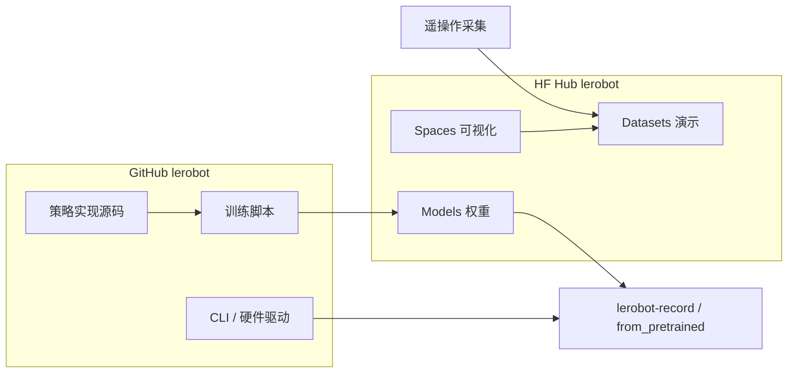

---

type: entity
title: LeRobot (Hugging Face)
tags: [framework, robot-learning, open-source, dataset, huggingface]
summary: "LeRobot 是 Hugging Face 开发的具身智能全栈框架，旨在将 Transformers 生态迁移到机器人领域，支持高效数据采集与策略训练。"
updated: 2026-07-23
related:
  - ./paper-evo1-lightweight-vla.md
  - ./openvla.md
  - ./lingbot-vla-v2.md
  - ./lingbot-vla.md
  - ./openlet.md
  - ./rebot-devarm.md
  - ../overview/navigation-slam-autonomy-stack.md
  - ../methods/vla.md
---

# LeRobot (Hugging Face)

**LeRobot** 是由 Hugging Face 开发并维护的一个**具身智能全栈框架**。它旨在将自然语言处理（NLP）领域的成熟生态（如 `transformers` 库和模型 Hub）迁移到机器人领域，提供从数据采集、策略训练到实物部署的一站式工具。

## 英文缩写速查

| 缩写 | 英文全称 | 简要说明 |
|------|----------|----------|
| ACT | Action Chunking Transformer | 预测动作块的序列模型架构，常与 ALOHA 配套 |
| VLA | Vision-Language-Action | 视觉–语言–动作统一策略模型族 |
| HF Hub | Hugging Face Hub | 模型 / 数据集 / Spaces 托管与分发平台 |
| Sim2Real | Simulation to Real | 把仿真中学到的策略迁移落地真机的工程主线 |
| SLAM | Simultaneous Localization and Mapping | 同步定位与建图 |

## 为什么重要？

在具身智能的爆发期，LeRobot 扮演了“机器人届的 Transformers”角色：
- **生态对齐**：通过与 Hugging Face 模型库和数据集库打通，极大降低了开发者共享和复用机器人策略（如 [diffusion-policy](../methods/diffusion-policy.md)）的门槛。
- **开源硬件支持**：原生支持低成本开源硬件（如 Koch 机械臂、SO100/SO101），推动了“人人皆可机器人”的普及；社区与厂商侧亦有 [reBot-DevArm](./rebot-devarm.md)（Seeed B601）等更高负载桌面臂的官方 LeRobot 教程对接。
- **标准化数据格式**：定义了一套高效、可扩展的具身智能数据存储标准（LeRobot v2.0+），方便不同团队之间的数据交换与 Hub 上传。

## 核心组件

- **Dataset Library**：支持加载和上传大规模机器人演示数据集。
- **Policy Library**：内置了多种主流算法（如 ACT、Diffusion Policy、TD-MPC2、π₀/π₀.₅、SmolVLA 等）。
- **Hardware Interface**：提供了一套简洁的 Python 接口，用于连接电机、传感器和真实机器人。

## GitHub 代码仓 vs Hugging Face Hub

LeRobot 的工程闭环常拆成 **两处入口**：

| 入口 | 链接 | 主要职责 |
|------|------|----------|
| **代码仓** | [github.com/huggingface/lerobot](https://github.com/huggingface/lerobot) | Python 包、CLI（`lerobot-record` / `lerobot-train`）、硬件驱动、策略实现源码 |
| **Hub 组织页** | [huggingface.co/lerobot](https://huggingface.co/lerobot) | 预训练 **Models**、社区 **Datasets**、**Spaces** 可视化与教程、**Collections** 打包 |

2026-07 快照规模：Hub 上约 **56** 个模型、**187** 个数据集、**11** 个 Collections、**9** 个 Spaces；另含 `lerobot/robot-urdfs` 资产 bucket。

**典型工作流：** 用 GitHub 侧工具采集或训练 → 上传 / 拉取 Hub 权重 → `lerobot-record --policy.path=lerobot/<checkpoint>` 或 `PreTrainedPolicy.from_pretrained` 部署。

### Hub 上值得先看的资产

| 类别 | 示例 | 说明 |
|------|------|------|
| **VLA 预训练** | `lerobot/pi0_base`、`lerobot/pi05_base` | π 系基础权重，下载量高 |
| **世界–动作** | `lerobot/fastwam_base`、VLA-JEPA 系列 | Collections 打包；仿真 / 真机迁移研究 |
| **平台化 checkpoint** | `lerobot/MolmoAct2-SO100_101-LeRobot` | SO100/101 等低成本臂 |
| **社区后训练** | `lerobot/lingbot_va_*` | 与 [LingBot-VLA 2.0](./lingbot-vla-v2.md) 生态交叉 |
| **任务示范** | `lerobot/folding_latest` | 叠衣等端到端策略 |
| **Spaces** | LeLab、Visualize Dataset v2.0+ | 无本地环境时快速浏览数据与交互 |

组织页还索引教程论文 **Robot Learning: A Tutorial**，适合与 [imitation-learning](../methods/imitation-learning.md) 主线对照阅读。

## 与其他系统的关系

- **上层应用**：[xbotics-embodied-guide](../../sources/repos/xbotics-embodied-guide.md) 将 LeRobot 推荐为实现开源实物部署的核心框架。
- **对比**：相比传统的 [ros2-basics](../concepts/ros2-basics.md)，LeRobot 更侧重于“数据驱动型”的端到端学习，而非复杂的分布式中间件逻辑。
- **互补 I/O 栈**：[RIO（Robot I/O）](./robot-io-rio.md) 侧重 **本机实时闭环** 与可切换中间件上的 **异步策略推理**；官方文档叙述可 **导出到 LeRobot / DROID 等格式** 再进入常见训练管线，二者常在「采集/部署」与「数据集/训练」两侧分工。
- **NVIDIA 官方课：** [SO-101 Sim2Real 实验 workflow](./nvidia-so101-sim2real-lab-workflow.md) 用 `lerobot-record`（`so101_follower` / `so101_leader`）采集真机少量演示，并与 Isaac Lab 仿真演示做 Co-training。
- **整机项目协作：** [Tnkr](./tnkr.md) 侧重把 CAD、线束、代码版本与部署/运行数据收进同一开源项目仓库；训练侧仍常导出到 LeRobot 等数据集格式，二者分工不同。
- **ROBOTIS 全栈集成：** [Cyclo Intelligence](./cyclo-intelligence.md) 以子模块钉版本集成 LeRobot，在 Docker 策略容器内提供 ACT/SmolVLA/π₀ 等推理后端，并由行为树编排 `LOAD/RESUME/STOP` 生命周期。
- **轻量 VLA 官方集成：** [Evo-1](./paper-evo1-lightweight-vla.md)（MINT-SJTU，CVPR 2026）已并入 **官方 LeRobot 主仓**；SO100/SO101 可用 `lerobot-record --policy.path=<Evo-1 checkpoint>` 闭环，训练侧数据格式为 **LeRobot v2.1**。
- **部署/Agent OS 对照：** [DimOS（Dimensional）](./dimensionalos-dimos.md) 侧重 **现场 Module 编排、SLAM 导航、空间记忆与 MCP 自然语言控制**；与 LeRobot 的 **数据集 Hub + 策略训练** 正交，常在「训练用 LeRobot、集成用 DimOS/ROS」分层共存。
- **无机器人双臂采集：** [HandUMI](./handumi.md) 用可穿戴手持接口 **脱离目标机器人** 采集示范，导出 **LeRobot v3 兼容** 同步数据，再重定向到 PiPER、OpenArm、TRLC-DK1、YAM 等平行夹爪双臂——降低「每台臂一套遥操作」的规模化成本。
- **Unitree G1 官方改版：** [unitreerobotics/unitree_lerobot](https://github.com/unitreerobotics/unitree_lerobot) 在 LeRobot 上适配 G1 双臂灵巧手采数/训练/测试，常与 `xr_teleoperate`、`unitree_sim_isaaclab` 组成官方 IL 闭环；组织级导航见 [Unitree](./unitree.md)。
- **Seeed reBot 桌面臂：** [reBot-DevArm](./rebot-devarm.md)（B601-DM / B601-RS）提供官方 Wiki 的 LeRobot 入门教程（采数 / 训练路径以 Seeed 文档为准），适合需要 **>1 kg 负载** 且仍走 LeRobot 格式的桌面操作实验。
- **竞赛全链路对照：** [Learning to Fold / LeHome](./paper-lehome-learning-to-fold.md)（ICRA 2026）在 **SO-ARM101** 上开源采集–训练–推理，并发布仿真/真机 HF 权重；数据侧兼容 LeRobot 格式与 Hub 总线。

## 常见误区

- **只盯 GitHub、忽略 Hub：** 许多可部署 checkpoint 仅在 `huggingface.co/lerobot` 发布；复现论文或官方 demo 时应先查 Hub Models / Collections。
- **把 Hub 当训练框架：** Spaces 适合质检与演示；正式训练仍依赖 GitHub 仓 CLI 与本地 / 集群算力。
- **数据格式混用：** v2.0+ 与旧版字段不同；上传前可用 **Visualize Dataset** Space 确认相机键、动作维与 fps。

与其他「带视觉、可开训」开源入口的对照见 [可直接开训的开源视觉项目选型](../queries/open-source-vision-trainable-projects.md)。

## 参考来源
- [LeRobot Hugging Face 组织页归档](../../sources/sites/lerobot-huggingface-org.md) — Hub 模型 / 数据集 / Spaces / Collections 分发层（本次 ingest）
- [LeRobot 仓库归档](../../sources/repos/lerobot.md) — 官方 GitHub 代码仓 source
- [NVIDIA SO-101 Sim2Real 课程](../../sources/courses/nvidia_sim_to_real_so101_isaac.md) — `lerobot-record` 采集 so101_follower/leader 真机与仿真演示
- [Xbotics-Embodied-Guide](../../sources/repos/xbotics-embodied-guide.md)
- [RIO 仓库与论文归档](../../sources/repos/robot-io-rio.md) — 与 LeRobot 数据导出衔接的跨形态实时 I/O 框架（对照阅读）
- [LeRobot GitHub Repository](https://github.com/huggingface/lerobot)
- [LeRobot on Hugging Face Hub](https://huggingface.co/lerobot)
- [Cyclo Intelligence 仓库归档](../../sources/repos/cyclo_intelligence.md) — LeRobot 作为 Cyclo 推理后端之一
- [Evo-1 论文与仓库归档](../../sources/papers/evo1_arxiv_2511_04555.md) — 官方 LeRobot 内置轻量 VLA 策略（SO100/SO101）
- [reBot-DevArm 仓库归档](../../sources/repos/rebot-devarm.md) — Seeed 开源桌面臂官方 LeRobot 教程对接
- [LeHome / Learning to Fold](../../sources/repos/lehome_solution.md) — SO-ARM101 竞赛全链路与 `lehome_sim` / `lehome_real` 权重
