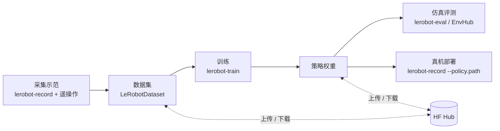

---

type: entity
title: LeRobot (Hugging Face)
tags: [framework, robot-learning, open-source, dataset, huggingface]
summary: "LeRobot 是 Hugging Face 的开源机器人学习框架（PyTorch，Apache 2.0）：GitHub 仓提供采集、训练、评测、部署的库与 CLI，Hugging Face Hub 分发策略权重、演示数据集和仿真环境；原生支持 SO-100/101 等低成本机械臂。"
updated: 2026-09-24
related:
  - ./flux-3-action.md
  - ../overview/robot-opensource-algorithms-compendium-wechat.md
  - ../concepts/lerobot-envhub.md
  - ../concepts/lerobot-dataset-v3.md
  - ../comparisons/hdf5-mcap-lerobot-data-formats.md
  - ../concepts/hdf5-file-format.md
  - ../entities/mcap-log-format.md
  - ./paper-imitator-game.md
  - ./paper-evo1-lightweight-vla.md
  - ./openvla.md
  - ./lingbot-vla-v2.md
  - ./lingbot-vla.md
  - ./openlet.md
  - ./letools.md
  - ./lw-benchhub-tour.md
  - ./isaac-lab-arena.md
  - ./paper-ros2smolvla.md
  - ./perceptron-isaac-05.md
  - ./rebot-devarm.md
  - ../overview/navigation-slam-autonomy-stack.md
  - ../methods/vla.md
  - ../concepts/model-hardware-standard.md
  - ../concepts/llm-robotics-control-interfaces.md
  - ./isaac-teleop.md
sources:
  - ../../sources/repos/lerobot.md
  - ../../sources/sites/lerobot-envhub-docs.md
  - ../../sources/sites/lerobot-dataset-v3-docs.md
  - ../../sources/sites/lerobot-huggingface-org.md
---

# LeRobot (Hugging Face)

**LeRobot** 是 Hugging Face 维护的开源机器人学习框架（PyTorch，Apache 2.0）：用一套库和命令行走完 **采集示范 → 训练策略 → 仿真评测 → 真机部署**，训练好的权重、数据集和仿真环境都放在 Hugging Face Hub 上共享复用。官方定位侧重 **模仿学习与强化学习**。

## 英文缩写速查

| 缩写 | 英文全称 | 简要说明 |
|------|----------|----------|
| IL / RL | Imitation Learning / Reinforcement Learning | LeRobot 官方定位的两条主线 |
| ACT | Action Chunking Transformer | 一次预测一段动作的序列策略，常与 ALOHA 配套 |
| VLA | Vision-Language-Action | 视觉–语言–动作统一策略模型族，如 π0、SmolVLA |
| HF Hub | Hugging Face Hub | 模型、数据集、仿真环境与 Spaces 的托管分发平台 |
| EnvHub | Environment Hub | 从 Hub 仓里的 `env.py` 动态加载仿真环境，见 [LeRobot EnvHub](../concepts/lerobot-envhub.md) |
| Sim2Real | Simulation to Real | 把仿真里训练 / 评测的策略迁移到真机 |

## 为什么重要

- **一个库走完全流程：** 不用自己拼采集脚本、训练代码和部署胶水；同一个 `lerobot-record` 既能录示范，也能加载策略在真机上跑。
- **权重和数据可以直接复用：** 别人上传到 Hub 的 checkpoint 一行 `--policy.path` 就能拉下来微调或部署，常被称作「机器人领域的 Transformers」。
- **入门成本低：** 原生支持 SO-100/101、Koch 等低成本开源机械臂，个人也能复现从采数到部署的完整闭环。
- **格式成了事实标准：** 越来越多的 VLA、数据集和仿真基准直接发布 LeRobot 格式或 LeRobot 集成（见下文「生态」一节），学会它等于拿到了读这些项目的通用接口。

## 由哪几部分组成

- **数据集（LeRobotDataset）**：存储和加载机器人演示数据。**v3.0** 为 Parquet shard + 分相机 MP4 + 关系型 `meta/`（多 episode  per 文件、Hub 流式、`finalize()` 推送）；详见 [LeRobotDataset v3.0](../concepts/lerobot-dataset-v3.md)。`LeRobotDataset("lerobot/...")` 从 Hub 缓存或流式读取
- **策略库**：内置主流策略实现。模仿学习：ACT、[Diffusion Policy](../methods/diffusion-policy.md)、VQ-BeT；强化学习：HIL-SERL、TDMPC；VLA：π0 / π0.5、GR00T N1.7、SmolVLA、XVLA、Evo-1；世界模型：VLA-JEPA、FastWAM
- **硬件接口**：统一的 `Robot` 类连接电机、相机和真机。原生：SO-100/101、LeKiwi、Koch、HopeJR、Reachy2、OpenARM、Unitree G1、reBot B601 等；第三方包按 `lerobot_robot_*` / `lerobot_teleoperator_*` / `lerobot_camera_*` 命名即可被自动发现
- **仿真评测**：`lerobot-eval` 跑闭环评测。内置 LIBERO、Meta-World 等 `--env.type`；也可从 Hub 拉取第三方环境（EnvHub），见 [LeRobot EnvHub](../concepts/lerobot-envhub.md)

## 代码在 GitHub，权重和数据在 Hub

- [github.com/huggingface/lerobot](https://github.com/huggingface/lerobot)：Python 包、CLI（`lerobot-record` / `lerobot-train` / `lerobot-eval`）、硬件驱动、策略源码。适合：安装、训练、改代码
- [huggingface.co/lerobot](https://huggingface.co/lerobot)：预训练权重、演示数据集、EnvHub 环境仓、Spaces 可视化。适合：找 checkpoint、下数据、在线看数据
- [官方文档](https://huggingface.co/docs/lerobot/index)：安装、硬件接线、各 CLI 参数。适合：照着跑具体命令


```mermaid
flowchart LR
  rec["采集示范<br/>lerobot-record + 遥操作"] --> ds["数据集<br/>LeRobotDataset"]
  ds --> train["训练<br/>lerobot-train"]
  train --> ckpt["策略权重"]
  ckpt --> eval["仿真评测<br/>lerobot-eval / EnvHub"]
  ckpt --> deploy["真机部署<br/>lerobot-record --policy.path"]
  ds <-.上传 / 下载.-> hub[("HF Hub")]
  ckpt <-.上传 / 下载.-> hub
```

## 典型上手路径

下面四步对应上图，参数只写出关键项，完整用法以 [官方文档](https://huggingface.co/docs/lerobot/index) 为准：

```bash
# 1. 遥操作录示范（SO-101 主从臂为例）
lerobot-record --robot.type=so101_follower --teleop.type=so101_leader ...

# 2. 从 Hub 上的预训练权重微调
lerobot-train --policy.path=lerobot/smolvla_base ...

# 3. 在内置仿真基准上评测
lerobot-eval --policy.path=lerobot/pi0_libero_finetuned \
  --env.type=libero --env.task=libero_object --eval.n_episodes=10

# 4. 真机跑策略：还是 record 命令，换成加载策略
lerobot-record --robot.type=so100_follower --policy.path=<checkpoint> ...
```

没有真机时，可以只做 2、3 两步：下载 Hub 上的数据集和权重，在 LIBERO 等仿真基准上训练和评测。

## Hub 上先看什么

组织页 [huggingface.co/lerobot](https://huggingface.co/lerobot) 规模约 56 个模型、187 个数据集、11 个 Collections、9 个 Spaces（2026-07 数据），另有 `lerobot/robot-urdfs` 机器人 URDF 资产。

| 类别 | 示例 | 说明 |
|------|------|------|
| **VLA 预训练** | `lerobot/pi0_base`、`lerobot/pi05_base` | π 系基础权重，微调起点 |
| **世界–动作模型** | `lerobot/fastwam_base`、VLA-JEPA 系列 | 以 Collections 打包，偏研究；社区另有 [LaWAM](./paper-lawam.md) |
| **低成本臂 checkpoint** | `lerobot/MolmoAct2-SO100_101-LeRobot` | SO-100/101 可直接部署 |
| **社区后训练** | `lerobot/lingbot_va_*` | 与 [LingBot-VLA 2.0](./lingbot-vla-v2.md) 同源 |
| **任务示范** | `lerobot/folding_latest` | 叠衣等端到端真机策略 |
| **Spaces** | LeLab、Visualize Dataset (v2.0+) | 不装环境也能在浏览器里看数据 |

组织页还收录了教程论文 **Robot Learning: A Tutorial**，适合配合 [模仿学习](../methods/imitation-learning.md) 主线阅读。

## 生态：谁在用 LeRobot

LeRobot 的很多价值在于别人接进来的东西。下面按「你想做什么」分组。

### 换一台机器人

- [unitree_lerobot](./unitree-lerobot.md)：Unitree 官方改版，适配 G1 双臂灵巧手采数 / 训练 / 测试；常与 [xr_teleoperate](./xr-teleoperate.md)、[unitree_sim_isaaclab](./unitree-sim-isaaclab.md) 组成官方模仿学习闭环（组织导航见 [Unitree](./unitree.md)）
- [LeTools](./letools.md)：乐聚 Kuavo 官方改版，rosbag 转 LeRobot Dataset v3，统一训 ACT / π / GR00T / LingbotVLA；数据对接 [LET-Base](./let-base-dataset.md) 与 [REAL-I](./icra-2026-real-i.md)
- [reBot-DevArm](./rebot-devarm.md)：Seeed B601 桌面臂，官方 Wiki 有 LeRobot 入门教程；适合要 >1 kg 负载又想沿用 LeRobot 格式
- [ROS2SmolVLA](./paper-ros2smolvla.md)：用 Docker 把 `lerobot-record` / `lerobot-train` 接到 ROS 2 Jazzy + UR10e 工业臂；权重与 349 条 episode 数据已开源
- [ROBOTIS](./robotis.md)：[Cyclo Intelligence](./cyclo-intelligence.md) 把 LeRobot 作为 Docker 策略容器里的推理后端（ACT / SmolVLA / π₀），由行为树管理加载与停止；[`lerobot_robot_ros2_zenoh`](https://github.com/ROBOTIS-GIT/lerobot_robot_ros2_zenoh) 插件可在本机不装 ROS 2 的情况下经 Zenoh 接关节话题

### 采集或转换数据

- [HandUMI](./handumi.md)：可穿戴手持接口，不需要目标机器人就能采双臂示范，导出 LeRobot v3 兼容数据后再重定向到 PiPER、OpenArm 等夹爪臂
- [Isaac Teleop](./isaac-teleop.md)：NVIDIA 遥操作框架，数据接口与 LeRobot 互操作；Isaac Lab XR 采数经 HDF5 转 LeRobot，是 [Isaac GR00T](./isaac-gr00t.md) 后训练的官方入口之一
- [RIO](./robot-io-rio.md)：专注本机实时 I/O 与异步推理，可导出 LeRobot / DROID 格式进入训练；二者分管「采集部署」与「数据训练」
- [Imitator Game / IG-10K](./paper-imitator-game.md)：人视频模仿基准，以 LeRobot 0.5.0 格式发布 2 万余组人–机配对，附 `h5_to_lerobot` 转换脚本
- [RoboFlywheel](./roboflywheel.md)：阿里的开放数据基础设施，把多源数据统一到 LeRobot v2.1
- [Tnkr](./tnkr.md)：管理整机项目的 CAD、线束与代码版本；训练数据常导出为 LeRobot 格式

### 用新的策略模型

- [Evo-1](./paper-evo1-lightweight-vla.md)：0.77B 轻量 VLA，已并入官方主仓；SO-100/101 可直接 `lerobot-record --policy.path` 部署
- [FLUX 3 Action](./flux-3-action.md)：Black Forest Labs 的世界–动作模型，SO-101 任务 LoRA 走 LeRobot 集成
- [Perceptron Isaac 0.5](./perceptron-isaac-05.md)：以 LeRobot 子模块提供 `policy.type=perceptron_isaac`；代码已开源，但截至 2026-09 Hub 权重仍标 COMING SOON。注意不是 NVIDIA 的 [Isaac GR00T](./isaac-gr00t.md)
- [GR00T Drifting](./paper-groot-drifting-action-head.md)：社区 fork（`RealManShao/lerobot@feat/drif-ov`），把 GR00T N1.7 动作头换成单步版本，换来更快推理但成功率下降

### 在仿真里评测

- [LW BENCHHUB TOUR](./lw-benchhub-tour.md)：光轮厨房双臂任务，用 `lerobot-eval` + EnvHub（`LightwheelAI/lw_benchhub_env`）评测 SmolVLA
- [Isaac Lab-Arena](./isaac-lab-arena.md)：NVIDIA GPU 仿真任务经 `nvidia/isaaclab-arena-envs` 发布到 EnvHub

### 加速训练或换硬件部署

- [OpenVINO](./openvino.md)：Intel 运行时官方支持导出 LeRobot 模型，在 Intel CPU / GPU / NPU 上跑控制环
- [LoongForge](./cn-os-loongforge.md)：百度百舸的训练加速框架，直接读 LeRobot 数据集微调 Pi0.5、GR00T、xVLA 等，官方称吞吐最高约 4.38×；训完仍可回到 Hub + `lerobot-record` 部署

### 跟着课程或竞赛练手

- [NVIDIA SO-101 Sim2Real 实验](./nvidia-so101-sim2real-lab-workflow.md)：用 `lerobot-record` 采少量真机示范，与 Isaac Lab 仿真示范混合训练
- [Learning to Fold / LeHome](./paper-lehome-learning-to-fold.md)：ICRA 2026 竞赛方案，在 SO-ARM101 上开源采集–训练–推理全链路与仿真 / 真机权重
- [Xbotics 具身指南](../../sources/repos/xbotics-embodied-guide.md)：Xbotics 社区的具身智能学习路线，把 LeRobot 列为开源真机部署的核心框架

## 与相邻工具怎么分工

- **ROS 2：** [ROS 2](../concepts/ros2-basics.md) 是分布式中间件，LeRobot 是数据驱动的端到端学习框架；两者可以并用（如上文 ROS2SmolVLA、ROBOTIS 的做法）：ROS 2 管通信，LeRobot 管数据与策略。
- **DimOS：** [DimOS](./dimensionalos-dimos.md) 负责现场模块编排、SLAM 导航和自然语言控制，与 LeRobot 的「数据集 + 策略训练」正交，常见分层是「训练用 LeRobot、集成用 DimOS / ROS」。
- **Model Hardware Standard（MHS）：** Anthropic 的 [MHS](../concepts/model-hardware-standard.md) 让 agent 发现并操作真实设备，Hugging Face 称会加进 LeRobot；截至 2026-09 仍是研究预览、规范与 SDK 未开源，暂不能当依赖。

## 常见误区

- **只看 GitHub、不看 Hub：** 很多可部署 checkpoint 只发布在 `huggingface.co/lerobot`，复现论文或官方 demo 先查 Hub 的 Models / Collections。
- **把 Hub 当训练平台：** Spaces 适合看数据和演示，正式训练仍在本地或集群上用 GitHub 仓的 CLI。
- **随手加载 Hub 环境：** EnvHub 环境需要 `trust_remote_code=True`，等于执行别人的代码；先读 `env.py` 并钉住 commit，见 [LeRobot EnvHub](../concepts/lerobot-envhub.md)。
- **混用数据格式版本：** 生态里 v2.1 与 v3 并存（如 Evo-1、RoboFlywheel 用 v2.1，LeTools、HandUMI 用 v3），字段与 shard 布局不同；应用官方 `convert_dataset_v21_to_v30` 或阅读 [v3 格式页](../concepts/lerobot-dataset-v3.md)；上传前 **`finalize()`** 否则 Parquet 损坏。

## 参考来源

- [LeRobot 仓库归档](../../sources/repos/lerobot.md) — GitHub 主仓、`lerobot-eval`、策略族与硬件
- [LeRobot Hugging Face 组织页归档](../../sources/sites/lerobot-huggingface-org.md) — Hub 资产规模、代表性模型与 Spaces
- [LeRobot EnvHub 官方文档归档](../../sources/sites/lerobot-envhub-docs.md) — `make_env` 契约、URL 格式、安全与多任务返回
- [LeRobotDataset v3.0 官方文档归档](../../sources/sites/lerobot-dataset-v3-docs.md) — Parquet/MP4/meta、流式训练、迁移与 finalize
- [NVIDIA SO-101 Sim2Real 课程](../../sources/courses/nvidia_sim_to_real_so101_isaac.md) — `lerobot-record` 采集 so101_follower/leader 真机与仿真演示
- [Xbotics-Embodied-Guide](../../sources/repos/xbotics-embodied-guide.md)
- [RIO 仓库与论文归档](../../sources/repos/robot-io-rio.md) — 与 LeRobot 数据导出衔接的跨形态实时 I/O 框架
- [Cyclo Intelligence 仓库归档](../../sources/repos/cyclo_intelligence.md) — LeRobot 作为 Cyclo 推理后端之一
- [Evo-1 论文与仓库归档](../../sources/papers/evo1_arxiv_2511_04555.md) — 官方 LeRobot 内置轻量 VLA 策略（SO100/SO101）
- [reBot-DevArm 仓库归档](../../sources/repos/rebot-devarm.md) — Seeed 开源桌面臂官方 LeRobot 教程对接
- [ROS2SmolVLA Docker 仓库归档](../../sources/repos/ros2smolvla_docker.md) — `lerobot-record` / `lerobot-train` 接 UR 真机的示例命令
- [Model Hardware Standard 公告归档](../../sources/sites/anthropic-model-hardware-standard.md) — LeRobot 被列为早期 MHS 采用方（研究预览）
- [LeHome / Learning to Fold](../../sources/repos/lehome_solution.md) — SO-ARM101 竞赛全链路与 `lehome_sim` / `lehome_real` 权重
- [LeRobot GitHub Repository](https://github.com/huggingface/lerobot)
- [LeRobot on Hugging Face Hub](https://huggingface.co/lerobot)

## 关联页面

- [LeRobot EnvHub](../concepts/lerobot-envhub.md) — Hub 仿真环境的加载契约与安全注意
- [LeRobotDataset v3.0](../concepts/lerobot-dataset-v3.md) — 数据集目录布局、流式与 v2.1 迁移
- [HDF5 vs MCAP vs LeRobot](../comparisons/hdf5-mcap-lerobot-data-formats.md) — 采数/日志/训练格式三角
- [VLA](../methods/vla.md) — LeRobot 内置的 π0、SmolVLA 等所属方法族
- [模仿学习](../methods/imitation-learning.md) — ACT、Diffusion Policy 等策略的方法背景
- [Isaac Lab-Arena](./isaac-lab-arena.md)
- [LW BENCHHUB TOUR](./lw-benchhub-tour.md)
