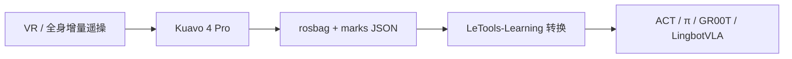

# LET-Base-Dataset

**LET-Base-Dataset**（HF [`LejuRobotics/LET-Base-Dataset`](https://huggingface.co/datasets/LejuRobotics/LET-Base-Dataset)）是乐聚 **全尺寸人形真机操作** 旗舰子集：在 **Kuavo 4 Pro**（数据卡亦提轮式变体）上采集多视角 RGB-D 与全身关节，用原子技能时间轴把「快递称重、线圈分拣、酒店递送、流水线」等工业/服务任务切成可训练片段。社区侧由 [OpenLET](./openlet.md) 在 AtomGit 同步叙事。

## 一句话定义

**带语义时间轴的 Kuavo 真机 rosbag 操作库：不是人体 MoCap，可直接服务模仿学习 / VLA 后训练，但许可为非商业 CC-BY-NC-SA。**

## 英文缩写速查

| 缩写 | 英文全称 | 简要说明 |
|------|----------|----------|
| LET | — | OpenLET / 乐聚真机数据集系列前缀；Base = 轮臂基础操作 |
| IL | Imitation Learning | 本集的主用途：转 LeRobot 后 BC / ACT / 扩散 |
| RGB-D | RGB + Depth | 头、左腕、右腕三路压缩彩图与深度 |
| EEF | End-Effector | 夹爪 `leju_claw` 或灵巧手；目录名常带 `-P4-dex_hand` / `-P4-leju_claw` |
| SN | Serial Number | 标注里的设备号，如 `P4-202` |

## 为什么重要

- **可执行机器人轨迹：** 相对 [Humanoid Everyday](./humanoid-everyday-dataset.md) 等「真机但不同本体」、或 HumanNet 类人视频，LET-Base 的动作已经在 **Kuavo 关节与夹爪空间**。
- **技能切分而不是整段黑盒：** `marks[].skillAtomic`（`pick` 等）+ 中英自然语言，适合技能级 IL 与语言对齐，而不是只做整 episode BC。
- **接到官方训练栈：** [LeTools](./letools.md) Learning 仓的 rosbag→LeRobot v3 就是为这类包设计的。

## 数据集速查

| 维度 | 内容 |
|------|------|
| **规模（数据卡）** | **>1000 小时**；**117** 原子技能；**31** 子任务场景；持续更新 |
| **规模（HF 2026-08-17）** | **25,824** 个 `.bag`；Labelled JSON **511**；downloads **63,482**；`usedStorage` ≈ **32 TiB**（含 LFS，非净体积） |
| **模态** | 三相机 RGB-D、14 臂关节指令、下肢 12 + 头 2 的 raw 关节/电流、IMU、夹爪或 6D×2 灵巧手 |
| **许可证** | **CC BY-NC-SA-4.0**；HF **未门控**；数据卡另提供 `wangsong@lejurobot.com` |
| **适配形态** | Kuavo 4 Pro / 轮式；跨 G1 等需重定向或再采集 |
| **重定向就绪度** | **不需要人→机器人重定向**；需要 **rosbag→LeRobot 关节/相机键映射** 与末端类型对齐 |

数据卡还描述 **hdf5/** 树（cameras/joints/parameters），但入库日该 HF 镜像 **没有** `.h5/.hdf5` 文件——按 **rosbag + 旁路 JSON** 规划下载。Viewer 曾因 schema 字段增减报 `CastError`，不能当加载器。

采集元数据示例：地点「长三角一体化示范区智能机器人训练中心」、二级场景「3C 工厂」、任务「快递扫码称重入库」。JSON 保留官方拼写 **`loaction`**。

## 工程实践

1. 按任务目录增量拉 bag（全量 3 万级文件，不适合一次性 `git clone` 当数据集）。
2. 用 [LeTools-Learning](./letools.md) `KuavoRosbag2Lerobot.yaml` 声明 `platform_type` 与 `eef_type`，与目录后缀 `dex_hand` / `leju_claw` 一致。
3. Labelled 子集先做技能级 sanity（`skillAtomic` 分布、时长直方图），再混 Unlabelled。
4. 赛题级小包见 [REAL-I](./icra-2026-real-i.md)，不要把 1000 episode/任务的挑战集当成 LET-Base 的抽样。

## 局限与风险

- **非商业 + SA：** 权重若在该数据上训练，再分发可能被 copyleft 传染；商用需另谈。
- **镜像漂移：** AtomGit / ModelScope / HF 文件集合不必相等；引用块里的 `LET_Base_Dataset` / `let_dataset` 是别名。
- **不是全身运控全集：** 精细触觉见 OpenLET **LET-Dex**，行走下蹲见 **LET-Body**。
- **标注笔误与 schema 不稳：** `loaction`、viewer 失败说明工程上要自写 parser。

## 关联页面

- [OpenLET](./openlet.md) — 数据集社区与三仓分工
- [LeTools](./letools.md) — 官方转换与训练
- [ICRA 2026 REAL-I](./icra-2026-real-i.md) — 同本体竞赛包
- [乐聚机器人](./leju-robotics.md) — 采集硬件
- [LeRobot](./lerobot.md) — 目标格式
- [Manipulation](../tasks/manipulation.md) / [Teleoperation](../tasks/teleoperation.md)

## 参考来源

- [let-base-dataset.md](../../sources/datasets/let-base-dataset.md) — HF 数据卡与文件计数
- [openlet-let-base-dataset.md](../../sources/repos/openlet-let-base-dataset.md) — AtomGit 社区旗舰仓
- [openlet-openatom.md](../../sources/sites/openlet-openatom.md) — OpenLET 首页

## 推荐继续阅读

- HF 数据卡：<https://huggingface.co/datasets/LejuRobotics/LET-Base-Dataset>
- OpenLET 社区：<https://openlet.openatom.tech/>
