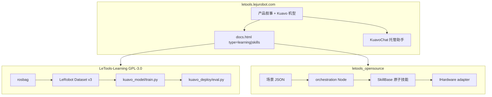
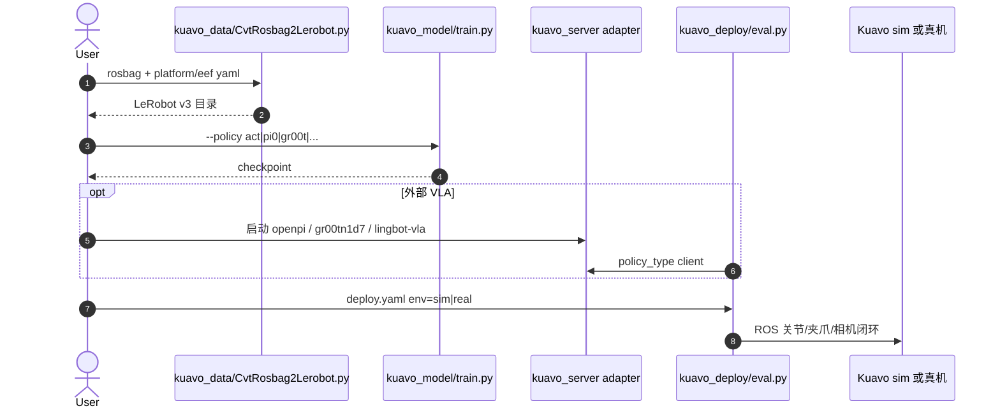

# LeTools

**LeTools**（<https://www.letools.lejurobot.com/>）是乐聚为 **Kuavo 全尺寸人形** 提供的 **采集–训练–部署软件层**：产品站把「All In One Pipeline」写成 Data → Deploy，工程上则拆成两个公开仓——**[LeTools-Learning](https://github.com/LejuRobotics/LeTools-Learning)**（模仿学习 / VLA）与 **[letools_opensource](https://github.com/LejuRobotics/letools_opensource)**（原子技能 + 行为树）。站点内嵌 **KuavoChat** 文档助手。

## 一句话定义

**Kuavo 专用的两条开源工具链：一条把 rosbag 喂进 LeRobot 策略并上仿真/真机；一条把硬件动作封成可编排 Skill，用 JSON 行为树跑任务。**

## 英文缩写速查

| 缩写 | 英文全称 | 简要说明 |
|------|----------|----------|
| IL | Imitation Learning | Learning 仓主路径：ACT / Diffusion 等从演示学策略 |
| VLA | Vision-Language-Action | Learning 仓接入 π 系、GR00T、LingbotVLA 等语言条件策略 |
| BT | Behaviour Tree | opensource 仓用 py_trees + JSON 编排 Skill |
| SDK | Software Development Kit | `kuavo_humanoid_sdk`；Skill 经 adapter 调用，不直连 topic |
| RTC | Real-Time Chunking | Learning README 2026-06-13 起支持的异步/实时推理选项 |
| EEF | End-Effector | 转换配置里的夹爪类型：leju_claw / rq2f85 / qiangnao |

## 为什么重要

- **补上乐聚软件层：** [乐聚机器人](./leju-robotics.md) 讲整机，[OpenLET](./openlet.md) 讲真机小时；LeTools 回答「数据怎么训、技能怎么在机上跑」。
- **厂商 LeRobot 改版对照：** 与 [unitree_lerobot](./unitree-lerobot.md) 同构——官方把 Hub 格式接到自家本体、末端与 ROS 部署；Kuavo 侧还多一条 **非学习的技能编排栈**。
- **VLA 不是口号：** Learning 仓把 π₀/π₀.₅、GR00T N1.5/N1.7、[LingBot-VLA](./lingbot-vla.md) / [2.0](./lingbot-vla-v2.md) 收进统一 `train.py` / `eval.py`，并给外部模型 `kuavo_server` client 路径。

## 核心原理：两栈不要混用



| 栈 | 回答的问题 | 不要用来 |
|----|------------|----------|
| **Learning** | 这条演示怎么变成 ACT/VLA checkpoint 并在 sim/真机评测？ | 写行为树、调头部 yaw、拼 JSON 任务 |
| **Skills / opensource** | 这个抓取/移动/扫码动作如何封装并被行为树 tick？ | 直接当 LeRobot 训练框架 |

官方文档同一 `docs.html`：`type=learning` 拉 `docs/menu.json`（安装、数转、训练、推理、自带策略）；`type=skills` 拉 `skills_docs/menu.json`（截至 2026-08-17 仅入门 + FAQ，深度在仓内 `skills/README.md`）。

## 原子技能层（opensource）

Skill 是「可复用的小动作」，夹在行为树与硬件之间：

```text
orchestration Node（解析 JSON、SUCCESS/FAILURE/RUNNING）
    → skills（参数 + 调 hardware + 结束判定）
      → adapters（标准接口 / *_sdk / TimedCmd）
        → kuavo_humanoid_sdk 或 ROS
```

**新代码放 `skills/atomic/refactored_sdk/`：** 统一 `SkillBase`、`@dataclass Params`、`getattr(self.hardware, ...)`，禁止在 `__init__.py` 聚合导入。旧目录 `manipulation/` `motion/` 与 `grasp_skill.py` 服务 `smoke_v1`。

三种控制路径并存：标准接口走 Skill/BT；`*_sdk` 走高频直调；TimedCmd 走 Ruckig/IK/离线轨迹。当前主力适配器是 **`leju_wheeled`**；`leju_bipedal` 仍是扩展位。

无硬件时先：

```bash
python3 apps/test_upper_init/run_behavior_tree_json.py \
  --scenario orchestration/scenarios/refactored_sdk_atomic_v1 \
  --dry-run --tick-once
```

这与 [行为树 × VLA 编排](../concepts/behavior-tree-vla-orchestration.md) **不是同一模式**：LeTools Skills 的 BT 调度的是 **硬件原子动作**；Cyclo 一类栈的 BT 调度的是 **VLA 生命周期（LOAD/RESUME/STOP）**。

## Learning 训练–部署

推荐环境：Ubuntu 20.04、Python 3.12、ROS Noetic、CUDA、`conda` 环境名 `letools`、`bash setup_env.sh`。

| 步骤 | 入口 |
|------|------|
| 1. 转换 | 编辑 `configs/data/KuavoRosbag2Lerobot.yaml` → `python kuavo_data/CvtRosbag2Lerobot.py` |
| 2. 训练 | `python kuavo_model/train.py --policy act`（或 `diffusion` / `pi0` / `pi05` / `gr00t` / `smolvla` / `xvla` / `wall_x` / `multi_task_dit` 等） |
| 3. 部署 | `configs/deploy/deploy.yaml` 设 `sim`/`real` → `python kuavo_deploy/eval.py` |
| 外部模型 | `kuavo_model/external_models/`：先起 server，再 `inference.policy_type: client` |

`--mode simple` 先读 `total/_total.yaml` 再被短 yaml 覆盖；多卡用 `--launcher accelerate`。末端与平台必须在转换/部署配置里对齐（4pro/5/5w × 夹爪类型），否则关节维与归一化会 silently 错位。



数据侧优先 [LET-Base-Dataset](./let-base-dataset.md) 与赛事包 [REAL-I](./icra-2026-real-i.md)；转换脚本吃 **rosbag**，不要假设 HF Dataset viewer 能直接出训练 tensor。

## 工程实践

| 项 | 做法 |
|----|------|
| 文档助手 | 站点 `KuavoChat`：DeepSeek v4-flash、Cloudflare Worker、SSE；日限额叙事约 20 次。**前端在 `js/chat.js`，后端未开源。** |
| SDK 安装 | opensource：`scripts/install_sdk.sh` 钉 `sdk_version.env`；失败常见于 gitcode 子模块超时 |
| RealSense 编译 | 不用相机可 `catkin config --skiplist` 视觉包 |
| 许可证 | Learning **GPL-3.0**（衍生训练脚本受 copyleft 约束）；opensource **GitHub 无 SPDX**，商用需问乐聚 |
| 对照栈 | 宇树：[unitree_lerobot](./unitree-lerobot.md)；ROBOTIS 容器化 BT+VLA：[Cyclo Intelligence](./cyclo-intelligence.md) |

## 局限与风险

- **误区：LeTools = 一个 GitHub 仓。** 训练与技能是两个仓、两套依赖（Py3.12+LeRobot 0.5.2 vs Py3.8+ROS Noetic catkin）。
- **误区：文档站挂了。** `docs.html` 是 SPA，无头工具不执行 `fetch(menu.json)` 会显示 “Error loading docs”。
- **误区：KuavoChat 等于可复现 agent。** Worker URL 与限流在前端写死，检索语料与工具权限不可审计。
- **本体锁定：** 出厂运动学/接口为 Kuavo；迁到 [Unitree G1](./unitree-g1.md) 需重做转换与 robot config。
- **opensource 许可含糊 + 双足适配未完成**；Learning 钉补丁后的 LeRobot，升级上游会破 `lerobot_patches/`。

## 关联页面

- [乐聚机器人](./leju-robotics.md) — 硬件与运营方
- [OpenLET](./openlet.md) — 真机数据社区；本栈是训练/技能落地
- [LET-Base-Dataset](./let-base-dataset.md) — 大规模 Kuavo 操作 rosbag
- [ICRA 2026 REAL-I](./icra-2026-real-i.md) — 赛事仿真包
- [LeRobot](./lerobot.md) — 数据集格式与策略库
- [unitree_lerobot](./unitree-lerobot.md) — 另一厂商官方 IL 胶水
- [LingBot-VLA](./lingbot-vla.md) / [2.0](./lingbot-vla-v2.md) — Learning 外部模型
- [Isaac GR00T](./isaac-gr00t.md) — GR00T 官方后训练对照
- [行为树 × VLA 编排](../concepts/behavior-tree-vla-orchestration.md) — BT 调度 VLA 而非原子 SDK
- [Imitation Learning](../methods/imitation-learning.md) · [VLA](../methods/vla.md) · [Manipulation](../tasks/manipulation.md)

## 参考来源

- [letools-lejurobot.md](../../sources/sites/letools-lejurobot.md) — 产品站与 KuavoChat
- [letools-docs.md](../../sources/sites/letools-docs.md) — 文档双栏与 menu.json
- [letools-learning.md](../../sources/repos/letools-learning.md) — Learning 仓
- [letools_opensource.md](../../sources/repos/letools_opensource.md) — Skills 仓与 `skills/README.md`

## 推荐继续阅读

- 产品与文档：<https://www.letools.lejurobot.com/>
- Learning 仓：<https://github.com/LejuRobotics/LeTools-Learning>
- Skills README：<https://github.com/LejuRobotics/letools_opensource/blob/main/skills/README.md>
