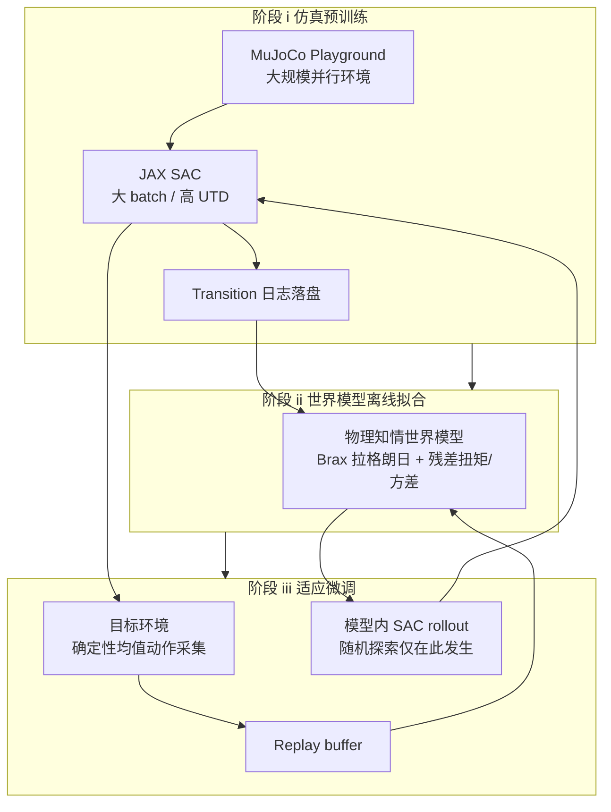

# LIFT（人形大规模预训练 + 高效微调）

**LIFT**（论文缩写：**L**arge-scale pretra**I**ning and efficient **F**ine**T**uning）是面向 **人形机器人 locomotion** 的一条 **强化学习 + 世界模型** 工程管线：先用 **GPU 大规模并行仿真** 把 **离策略 SAC** 训到可部署强度，再用 **物理结构先验 + 学习残差** 的动力学模型支撑 **微调阶段的安全探索布局**。

## 一句话定义

**仿真里用高吞吐 SAC 把策略「推满」，再用物理知情的可微世界模型承接适应——真机只跑确定性动作，随机探索留在模型里。**

## 为什么重要

- **对齐两条常见痛点的叙事：** On-policy（如 PPO）在 **万级并行** 下墙钟极快，但 **适应新环境** 时每步数据贵、随机探索对人形 **代价高**；纯 model-based 往往 **墙钟预训练慢** 或 **sim2real 证据链不完整**。LIFT 试图用 **算法 backbone 统一（SAC）+ 阶段解耦** 把两侧各取一段优势。
- **安全叙事具体化：** 微调时 **环境交互策略取均值（确定性）**，**SAC 随机 actor 只在世界模型 rollout 中** 驱动探索，降低「为了梯度乱抖关节」的真机风险面（仍以任务与重置逻辑为前提）。
- **可复现入口齐全：** [论文](https://arxiv.org/abs/2601.21363)、[项目页](https://lift-humanoid.github.io/)、[GitHub 仓库](https://github.com/bigai-ai/LIFT-humanoid) 形成 **方法—视频—代码** 闭环，便于和工业界 PPO 主栈对照实验。

## 核心结构（三阶段）

| 阶段 | 目标 | 要点（归纳） |
|------|------|----------------|
| **(i) 策略预训练** | 大规模仿真里学到 **可零样本迁移** 的 locomotion 策略 | **MuJoCo Playground** 上千并行环境；**JAX SAC**；**大 batch + 较高 UTD**；**非对称 actor–critic**（critic 用含特权信息的状态）；域随机化；报告 **单卡 RTX 4090 墙钟约一小时量级** 的训练叙事（任务与搜索预算以论文为准）。 |
| **(ii) 世界模型预训练** | 学到 **可 rollout** 且 **带接触/耗散残差** 的下一步动力学 | 预训练日志 **全量落盘**，策略收敛后 **离线** 训练；**Brax 可微刚体**（质量阵、科氏力、重力）+ **半隐式欧拉** + **PD 映射扭矩**；残差头预测 **等效外扰扭矩** 与 **预测方差**；特权状态含 **基座高度**（论文强调对人形稳定性关键）。 |
| **(iii) 联合微调** | 新环境 / 新任务上 **少样本** 改善 | 真机或目标仿真中 **确定性行为采集** → 更新 buffer → **世界模型与 SAC 策略交替优化**；**随机策略仅用于模型内想象轨迹**。 |

### 流程总览

## 常见误区或局限

- **误区：「SAC 不适合大规模并行仿真」。** LIFT 的论点是：在 **特定并行度、域随机化与调参（含 Optuna）** 前提下，SAC 可以 **稳定收敛** 并承担 **后续 model-based 微调** 的 **同一算法 backbone**；换任务与实现栈仍需重调，不宜外推为普遍结论。
- **误区：「零样本一定过 sim2real」。** 项目页给出反例叙事：**削弱能量约束的平地预训练** 可导致 **零样本实机失败**，再依赖 **分钟级** 微调恢复；说明 **奖励与地形分布** 仍是迁移主因，模型探索布局不能替代 **合理的预训练任务设计**。
- **局限：** 世界模型仍受 **残差容量与分布外误差** 约束；**Brax ↔ MuJoCo** 对齐、接触建模差异会占用大量工程精力（论文讨论状态映射与实现修正）。

## 关联页面

- [Locomotion（运动任务）](../tasks/locomotion.md) — 人形行走 **学习路线与世界模型** 总览
- [Reinforcement Learning](../methods/reinforcement-learning.md) — SAC / model-based 分类坐标
- [Model-Based RL](../methods/model-based-rl.md) — Dreamer、MBPO 等对照语境
- [Sim2Real](../concepts/sim2real.md) — 域随机化、sim2sim、实机微调的安全与数据效率讨论
- [RL 算法选型（Query）](../queries/rl-algorithm-selection.md) — 足式场景下 PPO / SAC / TD3 的工程经验锚点
- [mjlab_playground](./mjlab-playground.md) — 与 **MuJoCo Playground 任务端口** 相关的训练生态交叉引用

## 参考来源

- [LIFT 论文摘录（arXiv:2601.21363）](../../sources/papers/lift_humanoid_arxiv_2601_21363.md)
- [lift-humanoid.github.io 项目页归档](../../sources/sites/lift-humanoid-github-io.md)
- [bigai-ai/LIFT-humanoid 仓库归档](../../sources/repos/bigai-lift-humanoid.md)
- Huang et al., *Towards Bridging the Gap between Large-Scale Pretraining and Efficient Finetuning for Humanoid Control*, [arXiv:2601.21363](https://arxiv.org/abs/2601.21363)

## 推荐继续阅读

- [DreamerV3（世界模型通用化）](https://arxiv.org/abs/2301.04104) — 潜空间想象主线的对照基准
- [MuJoCo Playground](https://playground.mujoco.org/) — 预训练任务与交互环境官方入口
- [Brax](https://github.com/google/brax) — 论文中 **可微刚体 rollout** 依赖的后端之一
