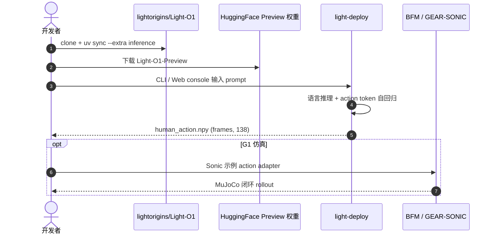

# Light-O1

**Light-O1**（*Scaling Whole-Body Intelligence with Human Action Pretraining*，亮源新创 **2026-09-21** [Tech Blog](https://www.lightorigins.com/en/blog/light-o1)，[代码](https://github.com/lightorigins/Light-O1)）是面向 **全身智能** 的具身基础模型：从 **互联网人类视频** 恢复结构化动作，在语言/视觉/动作交错序列上 **自回归预训练** transferable human action prior，再 **post-training** 适配目标机器人本体与任务。

> **落地状态（2026-09-21）：** Tech Blog + 真机/仿真演示已公开；**Light-O1-Preview**（文本→全身人类动作）代码与 HF 权重 **已开源**；完整 Light-O1 预训练与 loco-manipulation 部署权重 **未公开**；**无 arXiv**。

## 一句话定义

**用互联网人类动作预训练压缩「在什么情境下如何行动」，再跨本体适配到机器人，把语言推理、视觉理解与全身 loco-manipulation 连成闭环。**

## 英文缩写速查

| 缩写 | 英文全称 | 简要说明 |
|------|----------|----------|
| BFM | Behavior Foundation Model | 低层运动控制器；Light-O1 解码动作后接入 BFM 执行 |
| MPJPE | Mean Per-Joint Position Error | 开环评估全身姿态误差（mm） |
| SSAE | Semantic-Structural Alignment Evaluation | HY-Motion-Bench 上 VLM 判分的语义对齐指标 |
| RLHF | Reinforcement Learning from Human Feedback | 后训练阶段对齐人类意图与「先推理再动作」输出格式 |
| VLA | Vision-Language-Action | 视觉-语言-动作模型范式；Light-O1 覆盖语言+视觉+全身动作 |

## 为什么重要

- **预训练段落位：** [亮源新创（Light Origins）](./light-origins.md) **规模化预训练 → 规模化对齐 → 规模化部署** 三段范式中，Light-O1 是 **预训练段** 首个公开模型（对齐见 [LightNav-0](./paper-lightnav-0.md)，部署见 [Light REACT](./light-react.md)）。
- **数据范式切换：** 不 sole 依赖遥操作/UMI 专项采集，而是把 **互联网人类视频** 作为可扩展动作监督源。
- **Transfer Scaling Law：** 预训练 multimodal token 预算 D 扩大后，适配 Nymeria / HIW-500 / LightBot 等 **不同本体与视角** 的 held-out 预测损失与开环姿态误差呈 **幂律改善**——为「堆人类动作数据」提供量化依据。
- **开源 Preview：** [Light-O1-Preview](https://huggingface.co/LightOriginsHQ/Light-O1-Preview) + [Playground](https://huggingface.co/spaces/LightOriginsHQ/Light-O1-Preview-playground) 可体验 **指令→语言推理→全身动作** 完整链路。

## 核心信息

| 项 | 内容 |
|----|------|
| **机构** | 亮源新创（Light Origins） |
| **基座** | Qwen3.5-4B |
| **预训练规模** | D = 3.75B–120B multimodal tokens（最大 ≈ **10 万动作小时** 人类动作） |
| **动作表示** | 统一人类动作：根轨迹 + 身体姿态 + 手部状态；Preview 输出 `(frames, 138)` @ 20 FPS |
| **适配数据** | Nymeria（第一视角人类）、HIW-500（Unitree G1）、LightBot 自采 loco-manip |
| **开源** | **已开源** [lightorigins/Light-O1](https://github.com/lightorigins/Light-O1) 推理栈 + HF Preview 权重 |

### 流程总览

### Transfer Scaling Law（tech blog 口径）

- **X 轴：** 预训练 multimodal token 总量 D（语言 + 视觉 + 离散动作 token）。
- **Y 轴：** 各目标数据集 held-out **next-action-token loss** 与 **开环 MPJPE**（最优 post-training 配置）。
- **结论：** 随 D 增大，三档适配目标（egocentric 人类 / G1 / LightBot）误差均呈 **L(D) = L₀ + αD⁻η** 幂律下降；人类动作先验 **跨本体迁移** 可测量、可扩展。

## 评测

| 基准 | 结果 | 读法 |
|------|------|------|
| RoboCasa GR-1（24 厨房桌面任务） | macro success **79.3%** | 50 episodes/task；与 GR00T N1.7、π0.5、DIAL 等同数据训练对比（tech blog） |
| Motion Arena（30k prompts） | Elo **1472.8** vs HY-Motion-1.0 1078.3 | 人类 pairwise 评分；语义跟随/表达性/可接受性全类领先 |
| HY-Motion-Bench SSAE | **78.0** vs HY-Motion-1.0 74.7、Kimodo 61.4 | VLM 判分；Preview 模型口径 |

## 结论

**全身智能的可扩展路径是：互联网人类动作预训练 → 可测 cross-embodiment scaling → 目标本体少量 post-training → BFM 闭环执行。**

- 人类视频动作先验可 **幂律** 改善多本体适配后的预测误差，而非仅依赖机器人专项采集
- 统一 `(frames, 138)` 人类动作表示 + action tokenizer 保留末端执行器空间精度
- loco-manipulation 与表达性全身技能 **同一模型** 覆盖：任务由指令定义 vs 动作本身由指令定义
- RoboCasa GR-1 **79.3%** 与 Motion Arena Elo 领先表明预训练先验对操作与文本→动作均有效
- **Light-O1-Preview** 已开源可本地推理；完整预训练/loco-manip 权重仍待发布
- 真机 demo 为精选场景；sim2real 与长时闭环稳定性需独立验证

## 源码运行时序图

## 工程实践

| 步骤 | 要点 |
|------|------|
| **快速体验** | [HF Playground](https://huggingface.co/spaces/LightOriginsHQ/Light-O1-Preview-playground) 无需 GPU |
| **本地推理** | Linux + Python 3.11 + CUDA 13；`light-deploy --thinking` 输出推理 trace + 动作 |
| **接入机器人** | 解码统一人类动作 → 机构 BFM（LightBot）或 GEAR-SONIC action expert（G1 仿真示例） |
| **调试** | 先看 `--thinking` 推理文本是否对齐指令，再查开环动作可视化 |

## 局限与风险

- **开源边界：** 仓库仅 **Preview 动作生成**；完整 Light-O1 loco-manipulation 策略与预训练 checkpoint **未公开**，复现 tech blog 真机结果不可行。
- **算力与平台：** 本地推理需 NVIDIA GPU；macOS/Windows **不支持**。
- **Scaling Law 外推：** 幂律拟合基于已测 D 区间；更大数据/更大模型是否延续需后续实验。
- **BFM 依赖：** 真机执行质量受下游 BFM 与 action adapter 制约，非单模型端到端。

## 与其他工作对比

| 维度 | Light-O1 | π₀ / π0.5 类 VLA | 纯文本→动作（HY-Motion 等） | 专项遥操作预训练 |
|------|----------|------------------|---------------------------|----------------|
| 预训练数据 | **互联网人类视频** | 机器人演示为主 | 动作捕捉 / 合成 | 单本体专项采集 |
| 跨本体 | **Transfer Scaling Law** 量化 | 依训练本体分布 | 人类 kinematic，非机器人闭环 | 基本不迁移 |
| 输出 | 统一人类动作 + BFM 接口 | 连续/flow 动作 | 人类骨架动画 | 目标本体动作 |
| 开源（2026-09-21） | Preview **已开源** | 依项目 | 部分开源 | 依项目 |

## 关联页面

- [LightNav-0](./paper-lightnav-0.md) — 同机构规模化对齐段：VLM 通用导航
- [Light REACT](./light-react.md) — 同机构规模化部署段：全身韧性 ICL
- [Nymeria Dataset](./nymeria-dataset.md) / [Nymeria 论文](./paper-nymeria.md) — Transfer Scaling 人类 egocentric 适配轴
- [HIW-500](./hiw-500-dataset.md) — Unitree G1 野外遥操作 scaling 轴
- [Kaplan Scaling Laws](./paper-scaling-laws-neural-language-models.md) — 幂律拟合方法论原典
- [Loco-Manipulation](../tasks/loco-manipulation.md)
- [VLA](../methods/vla.md)
- [全身跟踪管线](../concepts/whole-body-tracking-pipeline.md)
- [Embodied Scaling Laws](../concepts/embodied-scaling-laws.md)

## Light-O1 Tech Blog 引用索引

[官方 Tech Blog](https://www.lightorigins.com/en/blog/light-o1) 参考文献 **[1]–[17]** 与本库 **独立详情节点** 一一对应（不重复造页）：

| # | 原文标题 | 详情节点 |
|---|----------|----------|
| [1] | π₀: A Vision-Language-Action Flow Model | [paper-pi0](./paper-pi0.md) |
| [2] | GEN-1: Scaling Embodied Foundation Models | [generalist-gen1-thousand-hands](./generalist-gen1-thousand-hands.md) |
| [3] | Physical Commonsense（Generalist 博文） | [physical-commonsense-generalist](./physical-commonsense-generalist.md) |
| [4] | Dyna-2: 1M-Hour Scaling Law for WAM | [dyna-2](./dyna-2.md) |
| [5] | An Observation on Generalization（Ilya Sutskever） | [talk-ilya-sutskever-observation-on-generalization](./talk-ilya-sutskever-observation-on-generalization.md) |
| [6] | GPT-4 Technical Report | [paper-as-2303-08774-gpt-4-technical-report](./paper-as-2303-08774-gpt-4-technical-report.md) |
| [7] | Attention Is All You Need | [paper-attention-is-all-you-need](./paper-attention-is-all-you-need.md) |
| [8] | Nymeria（arXiv:2406.09905） | [paper-nymeria](./paper-nymeria.md) · 数据产品 [nymeria-dataset](./nymeria-dataset.md) |
| [9] | HIW-500: Humanoids In-the-Wild | [hiw-500-dataset](./hiw-500-dataset.md) |
| [10] | Scaling Laws for Neural Language Models | [paper-scaling-laws-neural-language-models](./paper-scaling-laws-neural-language-models.md) |
| [11] | GR00T N1.7 | [isaac-gr00t](./isaac-gr00t.md) |
| [12] | π0.5: Open-World VLA | [paper-pi05-open-world-vla](./paper-pi05-open-world-vla.md) |
| [13] | OpenHLM | [paper-loco-manip-161-154-openhlm](./paper-loco-manip-161-154-openhlm.md) |
| [14] | DIAL | [paper-dial-latent-world-vla](./paper-dial-latent-world-vla.md) |
| [15] | HY-Motion 1.0 | [paper-hy-motion-1-0](./paper-hy-motion-1-0.md) |
| [16] | Kimodo | [kimodo](./kimodo.md) |
| [17] | InstructGPT（RLHF） | [paper-instructgpt-rlhf](./paper-instructgpt-rlhf.md) |

## 推荐继续阅读

- [Light-O1 Tech Blog](https://www.lightorigins.com/en/blog/light-o1)
- [Light-O1 GitHub README](https://github.com/lightorigins/Light-O1)
- [Light-O1-Preview Playground](https://huggingface.co/spaces/LightOriginsHQ/Light-O1-Preview-playground)

## 参考来源

- [亮源新创 Light-O1 微信发布归档](../../sources/blogs/wechat_lightorigins_light_o1_2026-09-21.md)
- [Light-O1 项目页](../../sources/sites/light-o1.md)
- [lightorigins/Light-O1](../../sources/repos/lightorigins-light-o1.md)
