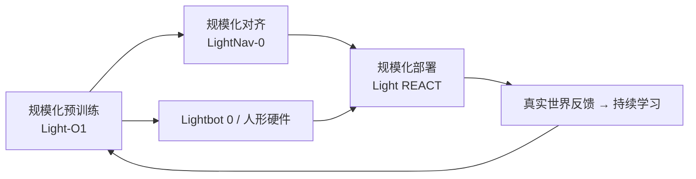

# 亮源新创（Light Origins）

**亮源新创（Light Origins）** 是面向 **Physical AI / 通用具身智能** 的人工智能公司（[About 页](https://www.lightorigins.com/en/about)，[中文](https://www.lightorigins.com/about)）：以 **Intelligence-first** 路线把基础模型能力从数字世界延伸到真实物理世界，覆盖基础模型、多模态感知、真实世界反馈、机器人系统与持续学习，并让 **模型、算力、数据、硬件与部署** 汇入同一学习闭环。

## 一句话定义

**以「规模化预训练 → 规模化对齐 → 规模化部署」三段范式组织 Physical AI 全栈研发，并围绕自研人形与开源子项目验证通用具身智能。**

## 英文缩写速查

| 缩写 | 英文全称 | 简要说明 |
|------|----------|----------|
| PAI | Physical AI | 在真实物理世界中可验证运行的 AI 系统 |
| AGI | Artificial General Intelligence | 公司使命语境下的 **Physical AGI** |
| RLHF | Reinforcement Learning from Human Feedback | 创始人 Roger Jiang 在 OpenAI 期间的奠基工作之一 |
| VLM | Vision-Language Model | LightNav-0 等对齐段成果所依托的预训练视觉-语言基座 |
| ICL | In-Context Learning | Light REACT 部署段将全身适应建模为具身 ICL |

## 为什么重要

- **三段范式锚点：** 官方使命明确 **Scalable pre-training / alignment / deployment**；站内 [Light-O1](./light-o1.md)、[LightNav-0](./paper-lightnav-0.md)、[Light REACT](./light-react.md) 分别对应预训练、对齐、部署段的公开成果，便于按阶段读技术路线。
- **OpenAI 系创始团队：** CEO **Roger Jiang** 曾参与 InstructGPT、ChatGPT、GPT-4 预训练/对齐/基础设施，并在 GPT-4 Technical Report **署名 8 次**——对大模型训练与对齐经验可迁移到具身基础模型。
- **国内具身开源触点：** GitHub 组织 [lightorigins](https://github.com/lightorigins) 已开源 **LightNav-0**、**Light-O1 Preview** 等；全景覆盖见 [国内具身开源 424 盘点](../queries/china-domestic-opensource-424-coverage.md)。
- **自研硬件叙事：** [Light-Loco-Parkour](./paper-light-loco-parkour.md) 等在 **Lightbot 0** 人形上验证全身跑酷；官网首页预告 **双足人形** 产品即将发布。

## 核心信息

| 字段 | 内容 |
|------|------|
| **机构** | 亮源新创（Light Origins） |
| **成立** | 2024（官网 Schema.org） |
| **总部/办公** | 北京 · 深圳 · 新加坡 |
| **官网** | <https://www.lightorigins.com/> |
| **GitHub** | <https://github.com/lightorigins> |
| **使命** | 在具身智能领域率先突破三段范式，实现 **Physical AGI** |
| **价值观** | 主人翁意识 · 坦诚高效 · 突破创新 · 追求极致 |
| **创始人** | Roger Jiang（CEO；UMD 物理学 Ph.D.；前 OpenAI） |

## 公开技术成果（截至 2026-09-21）

| 阶段 | 代表成果 | 站内页 | 开源（摘要） |
|------|----------|--------|--------------|
| 规模化预训练 | Light-O1 | [light-o1](./light-o1.md) | Preview 推理 + HF 权重 **已开源** |
| 规模化对齐 | LightNav-0 | [paper-lightnav-0](./paper-lightnav-0.md) | 代码 + HF 权重 **已开源** |
| 规模化部署 | Light REACT | [light-react](./light-react.md) | 截至入库日 **未开源** |
| 全身跑酷 | Light-Loco-Parkour | [paper-light-loco-parkour](./paper-light-loco-parkour.md) | **未开源** |

## 工程实践

1. **按三段读成果：** 预训练看 Light-O1 的 human action prior 与 Transfer Scaling Law；对齐看 LightNav-0 的 VLM 空间意图 token 化；部署看 Light REACT 的全身 ICL 韧性。
2. **开源边界：** 以 [GitHub 组织](https://github.com/lightorigins) 与各项目页为准；Light-O1 **完整训练 checkpoint** 与 Light REACT **代码/论文** 截至入库日均未公开。
3. **机构命名：** 中文官方名 **亮源新创**（非「光原点」）；英文品牌 **Light Origins**。

## 局限与风险

- **全栈未开源：** About 页与产品叙事覆盖完整闭环，但公开可复现主要为 **子项目级** 仓库，非端到端 monorepo。
- **硬件依赖：** 多项真机演示绑定 **Lightbot 0** 或自研人形，跨本体复现需核对观测/动作契约。
- **发布节奏快：** 2026 年内连续公开 O1 / REACT / Nav 等，工程文档与 arXiv 可能滞后于微信/Tech Blog。

## 与其他页面的关系

- **概念：** [Robot In-Context Learning](../concepts/robot-in-context-learning.md) — Light REACT 的部署段 ICL 读法
- **任务：** [Humanoid Locomotion](../tasks/humanoid-locomotion.md) — Light-Loco-Parkour 跑酷线
- **盘点：** [国内具身开源 424 覆盖](../queries/china-domestic-opensource-424-coverage.md) — 亮源新创条目

## 推荐继续阅读

- [Light Origins About（EN）](https://www.lightorigins.com/en/about)
- [Light Origins 关于我们（ZH）](https://www.lightorigins.com/about)
- [lightorigins GitHub 组织](https://github.com/lightorigins)

## 参考来源

- [Light Origins About 页归档](../../sources/sites/lightorigins-about.md)
- [Light-O1 项目页归档](../../sources/sites/light-o1.md)
- [LightNav-0 项目页归档](../../sources/sites/lightnav-0.md)
- [Light REACT 发布归档](../../sources/sites/light-react.md)
